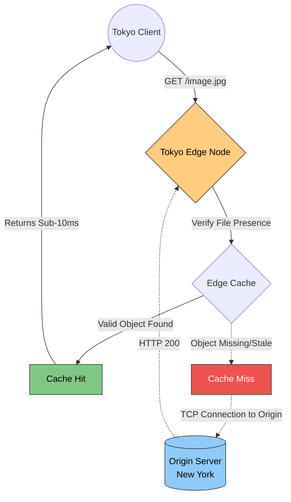

# 1. CDN Fundamentals & Economics

When architecting a global system, the hard limit on performance is latency inflicted by geographic distance. If a primary database and web server (the **Origin**) are physically located in New York, and a customer in Tokyo issues an HTTP request, that packet must travel across thousands of miles of submarine fiber-optic cables. 
Regardless of how horizontally scaled the Origin servers are, the Tokyo client will intrinsically suffer a `200ms - 300ms` round-trip delay simply due to physics.

A **Content Delivery Network (CDN)** mitigates this physical constraint by structurally caching and serving data at the network edge, drastically reducing the physical distance between the client and the payload.

---

## 1.1 Points of Presence (PoPs) & Edge Locations

A CDN is an aggressively distributed network of highly optimized proxy servers operating globally.

*   **Point of Presence (PoP):** A massive physical data center located in high-density internet exchange areas (e.g., Frankfurt, Tokyo, Sydney). A PoP acts as a major aggregation hub, peering directly with prominent Internet Service Providers (ISPs) to rapidly ingest regional traffic.
*   **Edge Location:** The hyper-specific, localized caching servers residing physically inside the PoPs or directly mapped into local ISP racks. They sit at the extreme "edge" of the network architecture.

**The Routing Mechanism:** When a user in Tokyo requests an asset, routing protocols like Anycast intercept the packet before it crosses the ocean. The traffic resolves to the localized Tokyo Edge Location, returning the payload in roughly `5ms` to `10ms`, effectively bypassing the transcontinental latency penalty.

---

## 1.2 The Request Lifecycle (Hit vs Miss)

When a client queries a file (`/logo.png`) through a CDN, the requested Edge Location executes a strict state machine flow evaluating its cache.

### The Cache Hit
The optimal execution path.
1. The client requests `/logo.png`.
2. The Edge Node rapidly scans its internal RAM/SSD block storage. It discovers a valid, non-expired copy of the requested asset.
3. The Edge Node serves the payload directly back to the client.
4. **Impact:** The Origin Server in New York registers zero CPU or network load. The request was entirely terminated at the network edge.

### The Cache Miss
The fallback resolution path.
1. The client requests `/profile-55.png`.
2. The Edge Node evaluates its storage and verifies it does *not* possess the requested object (or the object's Time-To-Live has expired).
3. The Edge Node establishes a secure TCP/TLS connection back to the **Origin Server** in New York.
4. The Origin Server computes the request, extracts the object, and transmits it to the Edge Node.
5. The Edge Node intercepts the response, asynchronously writes a clone of the payload into its local cache, and forwards the asset to the client.
6. **Impact:** Subsequent requests for `/profile-55.png` within that geographic region will instantly trigger a **Cache Hit**.

---

## 1.3 Push vs Pull CDN Architectures

Assets can be ingested into a CDN using two distinct architectural models, mapping directly to application requirements.

### The Pull CDN (Default for Web Applications)
The Edge Nodes remain empty by default. Assets are lazily "pulled" from the Origin exclusively when a client generates a Cache Miss.
*   **Advantages:** Requires minimal developer configuration. Storage is highly optimized because unrequested objects are never cached.
*   **Trade-offs:** The absolute first request in any given geographic region incurs a severe latency penalty due to the Cache Miss.
*   **Target Workload:** Dynamic web applications, standard APIs, Single Page Applications (Next.js/React).

### The Push CDN (Proactive Seeding)
Engineering pipelines proactively push (upload) assets directly into the localized CDN storage clusters *before* public requests are accepted.
*   **Advantages:** Global Cache Hits are guaranteed on day zero. No client ever experiences a Cache Miss latency penalty.
*   **Trade-offs:** Significantly higher storage costs, as objects are physically retained across the globe regardless of actual regional request volume.
*   **Target Workload:** Media streaming (distributing 4k movies ahead of release dates), operating system software patches, video game updates.

---

## 1.4 CDN Cost Economics & Provider Comparisons

CDN adoption requires a precise understanding of Cloud Billing engines, specifically the financial implications of network egress.

### The Egress Economy
Cloud computing architectures are heavily governed by **Bandwidth Egress Taxes**.
*   **Ingress (Inbound):** Data written *into* a cloud provider (like AWS) is typically free.
*   **Egress (Outbound):** Data transmitting *out* of the cloud provider to the public internet is heavily taxed (averaging $0.09 per Gigabyte).

If a cloud-hosted Origin Server directly handles 100 Terabytes of downloads, egress costs can rapidly exceed $9,000. 
By placing a CDN structurally in front of the Origin, the Origin only pays egress strictly for single **Cache Misses**. The CDN subsequently serves millions of localized requests using heavily discounted edge bandwidth, radically slashing infrastructure overhead.

### Major CDN Providers & Strategic Comparisons

Selecting a CDN provider dictates feature parity and overarching networking topology.

| Feature / Goal | Cloudflare | AWS CloudFront | Fastly | Akamai |
| :--- | :--- | :--- | :--- | :--- |
| **Primary Architectural Strength** | Unmatched Global Proxy & Security overlay. Heavy focus on blocking DDoS inherently. | Deep-rooted AWS ecosystem integration. Seamlessly maps natively to S3 and ALBs. | Bleeding-edge invalidation speeds. Real-time cache purging executed within 150 milliseconds globally. | Massive enterprise scale. Heavily decentralized across deep ISP interconnections. |
| **Egress Cost Mechanics** | Extremely aggressive pricing model; famously eliminates Bandwidth Alliance egress fees to drive adoption. | Wipes out Egress fees completely *if* the Origin is AWS S3 securely mapping to CloudFront. Otherwise standard. | Premium pricing tailored for intensive, highly volatile API structures and streaming limits. | Enterprise contract negotiation. Typically flat-fee based on petabyte commit levels. |
| **Edge Computing Framework** | Cloudflare Workers (V8 V8 Isolate engines for extremely fast micro-execution). | Lambda@Edge and CloudFront Functions. Integrates natively with IAM. | Compute@Edge (relies heavily on highly-optimized WebAssembly (Wasm)). | EdgeWorkers (JavaScript V8 engine focused on heavy enterprise logic). |
| **Ideal Workload** | Broad Application Security (WAF), mitigating Botnets, SaaS platforms. | Workloads already completely entrenched inside AWS Virtual Private Clouds. | Media-heavy applications, live sports broadcasting, highly dynamic platforms (Reddit, X). | Legacy enterprise structures, government platforms, massive traditional VOD networks. |

---

⬅️ **[Previous: N/A]** | 🏠 **[Back to TOC](README.md)** | **[Next: 2. Content Optimization & Delivery ➡️](02_Content_Optimization_and_Delivery.md)**
