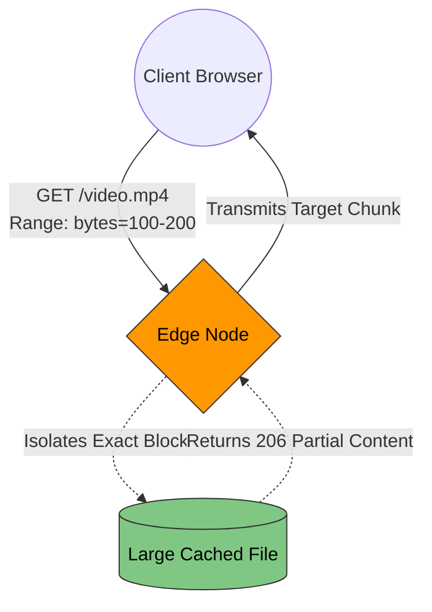

# 2. Content Optimization & Delivery

A CDN fundamentally operates not just as a static proxy, but as a highly active edge computing layer. It actively manipulates, compresses, and reroutes network packets in real-time to circumvent physical network latency and optimize localized payload delivery.

## 2.1 Static Asset Caching & Cache-Busting

**Static Assets** (compiled CSS, JavaScript bundles, vector images) rarely change and are canonical candidates for prolonged Edge Caching.

A persistent architectural challenge occurs when new deployments override existing static files. If an updated `styles.css` replaces the old file on the Origin, the Edge Node will retain its cached version until exactly when the Time-to-Live (TTL) expires. Clients will receive new HTML files alongside deprecated CSS files, severely breaking application rendering.

**The Architectural Fix: Cache-Busting (Fingerprinting)**
Modern build pipelines (e.g., Webpack, Next.js, Vite) execute mathematical hashing algorithms directly against the file's content. They dynamically rewrite output files to include the hash (e.g., `styles.3x9A2F.css`).
*   Upon any code modification, the hash physically changes, generating a completely unique filename (e.g., `styles.8bY4Q.css`).
*   The deployment points the application strictly to this new filename.
*   Because the CDN has absolutely no record of the new filename, it registers a secure **Cache Miss**, seamlessly requesting the updated file from the Origin. This completely negates the need for manual cache invalidation commands while ensuring zero stale-data leakage.

---

## 2.2 Edge Compression (Gzip vs Brotli)

Transferring raw textual payloads (HTML, CSS, JSON) excessively bounds network capacity. While Origin Servers can compress outbound traffic, forcing application servers to actively compress tens of thousands of concurrent responses results in debilitating CPU starvation.

**The Solution: Edge Compression Offloading**
Architects configure the CDN to absorb the compression overhead natively at the Edge.
1. The CDN requests the raw, uncompressed payload from the Origin, protecting Origin CPU cycles.
2. The high-capacity CDN Edge Node applies compression algorithms strictly in its own RAM.
3. The Edge Node serves and caches the optimized versions downstream to clients.

**Compression Standards:**
*   **Gzip:** The ubiquitous industry standard since the 1990s. Exceptionally fast execution and supported by all legacy architectures.
*   **Brotli (`br`):** A modern, dictionary-based compression algorithm heavily tailored for web text. Brotli mathematically shrinks payloads roughly **20% to 30% smaller** than Gzip formats. Production CDN configurations prioritize delivering Brotli formats to all compatible modern clients to drastically suppress bandwidth transmission times.

---

## 2.3 Dynamic Content Acceleration (DCA)

Highly volatile HTTP requests (e.g., `GET /api/financial-balance`, or `POST /auth/login`) are fundamentally uncacheable. Their packets must traverse from the client directly back to the Origin Server. 

Standard **BGP Routing** governing the public internet operates on shortest-AS-path metrics rather than latency awareness. A packet bridging London to New York may suffer unpredictable latency spikes traversing heavily congested ISP hubs.

**Dynamic Content Acceleration (DCA) Architecture:**
1.  Targeting an uncacheable API payload, the client connects securely to the nearest local Edge Node.
2.  The CDN registers a `Cache-Control: no-cache` bypass directive.
3.  Instead of routing the packet back over standard ISP networks, the CDN encrypts and injects the payload directly into its **Private Fiber Backbone** (dedicated enterprise submarine cables).
4.  The packet rides an uncongested, intensely monitored private tunnel straight to the Edge Node closest to the Origin.
5.  **Impact:** The CDN heavily reduces connection jitter, TLS handshake times, and round-trip delays, optimizing latency even for strictly dynamic API traffic natively.

---

## 2.4 Modern Video Streaming (HLS / DASH)

Streaming colossal payloads globally (e.g., 50GB 4K media) fundamentally breaks standard HTTP caching algorithms. Serving massive unbroken TCP streams guarantees volatile buffering if localized client networks fluctuate.

**The Streaming Protocol Architecture:**
Media is mechanically processed by Transcoding Origins into thousands of hyper-segmented **3-second Transport Stream (`.ts` / `.m4s`) chunks** rather than singular files.
*   `segment_001.ts` (0.0s - 3.0s)
*   `segment_002.ts` (3.0s - 6.0s)

### Scale and Edge Balancing
Because these individual media fragments are structured precisely as tiny, standard HTTP file objects, the CDN caches them efficiently using standard static asset protocols. 

**Adaptive Bitrate Streaming (ABR):**
Transcoder architectures generate media across disparate resolutions concurrently (1080p, 720p, 480p). Client-side players continuously evaluate their current network throughput. If localized cellular connectivity degrades, the client dynamically transitions from requesting `segment_088_1080p.ts` to `segment_089_480p.ts`. The CDN flawlessly returns the requested resolution, allowing continuous playback without triggering a buffer halt.

---

## 2.5 Byte-Range Requests (Seeking & Resumption)

When clients execute granular seek logic (e.g., jumping specifically to minute 45 of a streaming asset), transmitting the preceding 44 minutes wastes massive throughput and spikes latency.

Instead, the logic leverages the **HTTP `Range` Header**.

1.  The client mathematically maps the timestamp to accurate Byte offsets.
2.  The client bounds the HTTP Request with precision: `Range: bytes=750000000-800000000`.
3.  If the Edge Node caches the target video blob, it strictly parses its RAM to slice isolated byte offsets, returning them synchronously via HTTP Status **206 Partial Content**.
4.  If the Edge experiences a Cache Miss, it forwards that identical `Range` requirement faithfully back to the Origin, guaranteeing the backend avoids loading gigabytes of dead-weight file data into network interface cards.

---

⬅️ **[Previous: 1. Core Fundamentals & Economics](01_Core_Fundamentals_and_Economics.md)** | 🏠 **[Back to TOC](README.md)** | **[Next: 3. Advanced Caching Mechanics ➡️](03_Advanced_Caching_Mechanics.md)**
