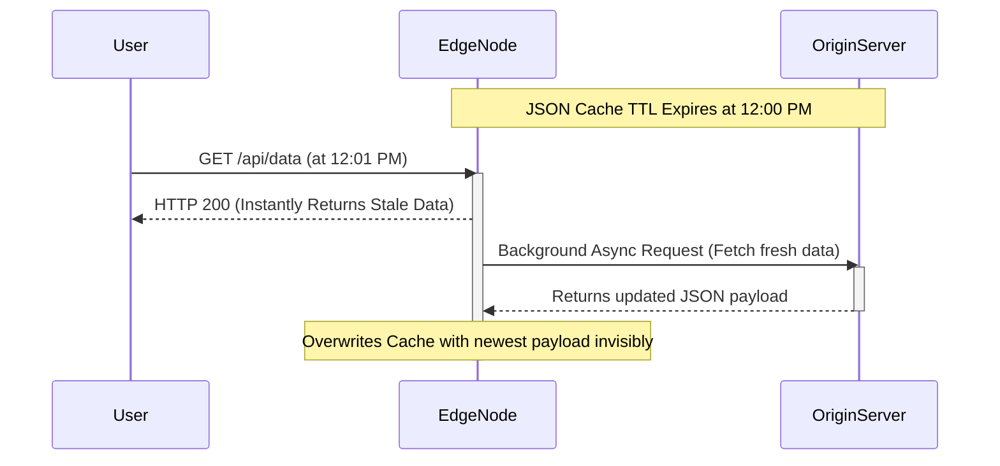

# 3. Advanced Caching Mechanics

A CDN is technically just a massive array of reverse proxies. While basic configurations simply cache files endlessly, enterprise systems require granular mathematical control over exactly *what* is cached, *how long* it remains there, and *how* the Edge intelligently masks underlying backend failures.

---

## 3.1 Origin Shielding & Tiered Caching

When a globally distributed application deploys a new asset (e.g., a massive 1GB video upload), the CDN originally has zero cached copies initialized globally.

If a popular video goes viral unexpectedly, 50 different Edge Locations (Tokyo, London, Sydney, New York) might all suffer a **Cache Miss** at the exact same millisecond. 
Because the Edge Locations do not implicitly communicate with each other, all 50 Edge Nodes will instantaneously open 50 parallel TCP connections back to the singular Origin server and request that 1GB video simultaneously. The Origin server is suddenly slammed with 50GB of outbound bandwidth demand and instantly crashes. 

**The Architectural Solution: Origin Shielding (Tiered Caching)**
Architects deploy a specialized intermediary CDN node designated strictly as the **Origin Shield**. 

1. **Hierarchy:** Global Edge nodes are logically grouped. They no longer retain permission to contact the Origin directly. Instead, they must point strictly to the Origin Shield.
2. **The Flow:** Sydney, Tokyo, and London all experience a Cache Miss simultaneously. They all query the Origin Shield. 
3. **The Synchronization (Request Coalescing):** The Origin Shield intercepts all 50 identical incoming requests. It places 49 of them into a rapid "hold" queue. It mathematically opens exactly **one** TCP connection to the Origin Server. 
4. **Resolution:** The Origin successfully processes just 1GB of data. The Origin Shield caches the result and structurally fans it out efficiently to the 50 waiting Edge Locations worldwide. The Origin is perfectly protected from global traffic spikes.

---

## 3.2 Cache Directives & Time-to-Live (TTL)

CDNs do not blindly guess how long an object should be cached. They rigorously obey explicitly declared HTTP **Cache-Control Headers** injected by the Origin Server.

The total duration a file securely resides in the CDN's RAM is defined as the **Time-To-Live (TTL)**.

### The Critical Cache-Control Directives
When the Origin serves an object, it attaches headers defining exact cache parameters:

*   **`Cache-Control: public, max-age=3600`**
    *   `public`: Mathematically declares that this data is safe for anyone (CDNs, local ISPs, local browsers) to aggressively cache. It contains zero private user-session data.
    *   `max-age=3600`: Commands the local client browser to heavily cache the asset locally for exactly 3,600 seconds (1 hour). 
*   **`s-maxage=86400` (Shared Max-Age)**
    *   This directive is engineered strictly for CDNs (Shared Caches). It allows architectures to decouple CDN caching from local browser caching.
    *   *Scenario:* `Cache-Control: max-age=60, s-maxage=86400`. The user's Google Chrome will hold the cache file for only 1 minute, but the broader CDN Edge node will hold the master copy safely for a full 24 hours. 
*   **`Cache-Control: private` or `no-store`**
    *   Violently forces the CDN to reject caching the packet entirely. Mandatory for API endpoints rendering sensitive Bank Transactions or HIPAA-compliant medical records.

---

## 3.3 Cache Keys & Query String Architecture

How does a CDN fundamentally know if an incoming request matches a file it already possesses? It generates a **Cache Key**.

By default, an Edge Node constructs a Cache Key strictly by combining the **Hostname** and the **Path**:
*   *Request:* `GET https://api.site.com/image.png`
*   *Generated Cache Key:* `api.site.com/image.png`

**The Query String Danger:**
If a user requests `https://api.site.com/image.png?user=Bob`, and another user requests `https://api.site.com/image.png?user=Alice`, should the CDN cache them as two entirely different files?
*   If the image is strictly identical for both users, creating unique cache keys based on variables destroys your Cache Hit Ratio (forcing millions of redundant Cache Misses).
*   **The Fix:** Modern CDNs must be explicitly configured to aggressively **Ignore Query Strings** when calculating Cache Keys for static assets. `image.png?user=Bob` cleanly resolves to the raw `image.png` Cache Key, resulting in a perfect Cache Hit globally.

---

## 3.4 Purging vs Cache Keys for Invalidation

When an asset is fundamentally corrupted, or critical information must change immediately before its TTL timer expires, architects must forcibly remove the payload from the Edge Nodes.

### Method A: CDN Purge (Hard Invalidation)
The engineering team triggers an API request distinctly to the CDN provider (e.g., Fastly/Cloudflare): `PURGE /css/main.css`.
*   The CDN physically broadcasts a digital kill-switch to all 5,000 Edge nodes worldwide, explicitly commanding them to erase that precise file object from RAM.
*   **Flaw:** Invalidation propagation delays. Some legacy CDNs can take up to 10 minutes to successfully replicate the purge command across the globe. During those 10 minutes, users in specific regions will continue downloading the corrupted file.

### Method B: Cache-Busting via Key Modification (Immediate)
As detailed in Chapter 2, deploying files using hashed filenames (`main.a1b2.css`) completely sidesteps the need to ever invoke a Purge API. The application intrinsically requests a structurally unique filename, fundamentally guaranteeing a flawless Cache Miss without waiting for global purge propagation.

---

## 3.5 The Ultimate Safety Net: Stale-While-Revalidate

The absolute pinnacle of CDN resiliency is masking underlying Origin failures so the end user never visualizes downtime.

Assume your Origin Database violently crashes for exactly 5 minutes. Simultaneously, the `TTL` timer on a critical cached API JSON object physically expires at the Edge.

1.  Normally, the Edge drops the cached JSON (because it expired), requests the data from the Origin, immediately hits a `502 Bad Gateway` error, and disastrously forwards an HTTP 500 error page to the user.
2.  If the Origin explicitly utilized the **`stale-while-revalidate`** HTTP directive, the CDN triggers a profoundly different architecture.

**The Stale-While-Revalidate Protocol:**
*   Header: `Cache-Control: max-age=600, stale-while-revalidate=86400`
*   When the 10-minute `max-age` expires, the user requests the data.
*   The Edge Node recognizes the data is expired (stale). However, because `stale-while-revalidate` is present, it **immediately returns the stale/expired data directly to the user.** The user immediately experiences a sub-millisecond response, oblivious to the expiration.
*   *Simultaneously in the background*, the Edge Node opens a shadow, asynchronous background connection to the Origin Server to carefully revalidate and fetch the newest JSON payload.
*   If the Origin is completely crashed, the CDN quietly ignores the TCP failure and simply continues serving the "stale" data flawlessly until the database recovers or the massive 24-hour underlying `stale-while-revalidate` timer officially terminates. 

---

⬅️ **[Previous: 2. Content Optimization & Delivery](02_Content_Optimization_and_Delivery.md)** | 🏠 **[Back to TOC](README.md)** | **[Next: 4. Edge Routing & Security ➡️](04_Edge_Routing_and_Security.md)**
