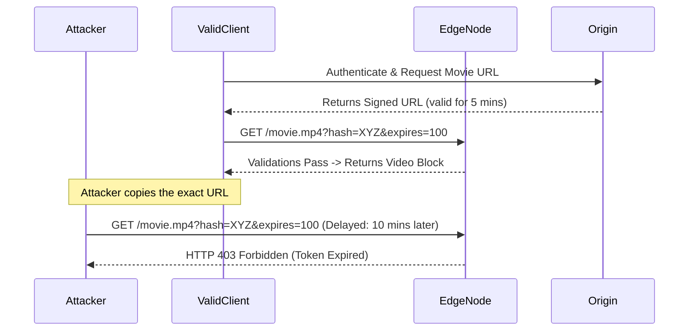

# 4. Edge Routing & Security

The moment internet traffic reaches the boundaries of a Content Delivery Network, it enters a highly militarized zone. A CDN operates not merely as a localized cache, but as the absolute physical security barrier shielding origin infrastructure from malicious packet flooding and cryptographic degradation.

---

## 4.1 Physical Routing (Anycast BGP vs DNS Geo-Routing)

How does a user in Sydney logically connect specifically to the Sydney Edge Node instead of the London Edge Node? CDNs rely on two distinct and highly aggressive routing protocols.

### Unicast DNS Geo-Routing (The Legacy Model)
In a traditional Unicast model, every Edge Node mathematically possesses a completely unique IP address.
1. Sydney Node: `100.1.1.1`
2. London Node: `100.2.2.2`

When the client executes a DNS lookup for `video.site.com`, a Global Server Load Balancer (GSLB) attempts to determine the user's geographic location. The DNS server forcibly resolves the query uniquely, handing the Sydney IP strictly back to the Australian user.
*   **Architectural Flaws:** DNS propagation arrays are fundamentally unreliable. If the Sydney Node violently crashes, DNS TTLs often force users to blindly connect to a dead IP address for several minutes before the routing algorithm successfully recalculates failover routing.

### Anycast BGP Routing (The Modern Backbone)
Major CDNs (like Cloudflare) completely abandon variable IP assignments using **Anycast**.
In Anycast, every single Edge Node on Earth forcibly broadcasts the exact same global IP address: `1.1.1.1`.

When a client transmits an HTTP packet destined for `1.1.1.1`, the underlying physical Internet Service Provider (ISP) routers scan their Border Gateway Protocol (BGP) routing tables. The ISP mathematically assesses the AS_PATH and rigidly forwards the packet straight to whichever Edge Node is physically closest via network topology.
*   **Architectural Dominance:** If the Sydney data center burns to the ground, it stops broadcasting its BGP availability. The ambient ISP routers immediately realize Sydney is gone, automatically calculate the next nearest physical PoP (e.g., Singapore), and instantly route packets there. No DNS delays; failover occurs at the raw physical infrastructure level.

---

## 4.2 TLS & SSL Termination at the Edge

Cryptographic handshakes (TLS) require extreme CPU execution. Forcing an Origin Server to decrypt 50,000 incoming HTTPS connections concurrently forces debilitating CPU exhaustion, creating a massive choke point.

By mapping TLS Certificates directly to the CDN Edge, the architecture invokes **Edge Termination**.

1.  **The Handshake:** The Australian client connects to the Sydney Edge Node. The Edge Node assumes the cryptographic burden, completing the heavily intensive asymmetric math locally within 10 milliseconds.
2.  **The Tunnel:** Once verified, the Edge Node communicates with the backend Origin via persistent, extremely optimized `Keep-Alive` TCP connections, saving the Origin from performing independent handshakes on isolated client streams.
3.  **Modern Enhancements:** Advanced CDNs natively utilize TLS 1.3 features like **0-RTT (Zero Round Trip Time)**. If a client connects to the Edge Node for a second time, the node bypasses all cryptographic delays securely, resolving HTTP packets completely instantly.

---

## 4.3 Perimeter Protection: WAF & DDoS Sinkholing

Leaving an Origin Load Balancer openly accessible to the internet practically guarantees a catastrophic security breach or starvation-based DDoS attack.

By positioning a **Web Application Firewall (WAF)** directly within the Edge Node, all Layer-7 application payloads are forensically inspected literally before they are allowed into the regional network caching environment.

### Threat Mapping
*   **SQL Injection & XSS:** If a packet contains `OR 1=1; DROP TABLE`, the Edge WAF invokes regex pattern matching and aggressively terminates the TCP socket. The Origin Server is kept totally oblivious to the attack attempt.
*   **Botnet Extortion (Layer 7 HTTP Floods):** If a bot array generates 1 million malicious requests per second targeting a login portal, the CDN dynamically imposes mathematically aggressive **Edge Rate Limiting**. It traps malicious IPs into browser challenges (CAPTCHAs) localized purely at the network edge, protecting upstream pipelines.

### The Anycast DDoS Sinkhole
In a colossal Volumetric TCP Flood (e.g., 2 Terabits per second of raw ping traffic), the very nature of Anycast BGP structurally neutralizes the threat.
*   If a Russian Botnet attacks `1.1.1.1`, all malicious packets are logically localized precisely to the nearest Edge PoP in Moscow. The Moscow Edge Node absorbs and drops the attack.
*   **The Paradigm Shift:** The global attack is mathematically partitioned into distinct geographic sinks. The London PoP genuinely never sees a single malicious packet and operates 100% cleanly for European clients. 

---

## 4.4 Authorization: Token Verification & Signed URLs

If a CDN effectively distributes massive media payloads effortlessly, what explicitly stops a malicious user from simply copying your 4k video streaming URL and embedding it natively into a pirate streaming website? 

A standard Cache relies strictly on the URL Path representing the key. If an asset is public on the Edge, it is entirely unguarded globally.

**The Solution: Signed URLs and Tokenization**
Senior engineers mathematically force Edge Nodes to rapidly execute asymmetric cryptographic validation prior to serving media.

1.  The client actively authenticates via their application (e.g., logging into Netflix).
2.  The Origin backend dynamically provisions an explicit cryptographic token appending strict permission parameters:
    *   *Allowed Client IP Address*
    *   *Expiration Timestamp (Valid for 5 minutes)*
    *   *Cryptographic Signature (HMAC)*
3.  The Origin constructs the uniquely protected URL: `https://cdn.site.com/movie.mp4?expires=1612&signature=8fA92`
4.  The client transmits the URL directly to the Edge Node.
5.  **The Interception:** The Edge Node executes validation logic (often via edge compute integrations like Cloudflare Workers). It verifies the signature mathematically matches the parameters. If valid, the Edge instantly resolves the cached movie segment. If the URL has expired, the CDN instantly returns a `403 Forbidden` error without ever interacting with the Origin server.

---

⬅️ **[Previous: 3. Advanced Caching Mechanics](03_Advanced_Caching_Mechanics.md)** | 🏠 **[Back to TOC](README.md)** | **[Next: 5. Advanced Edge Architectures ➡️](05_Advanced_Edge_Architectures.md)**
