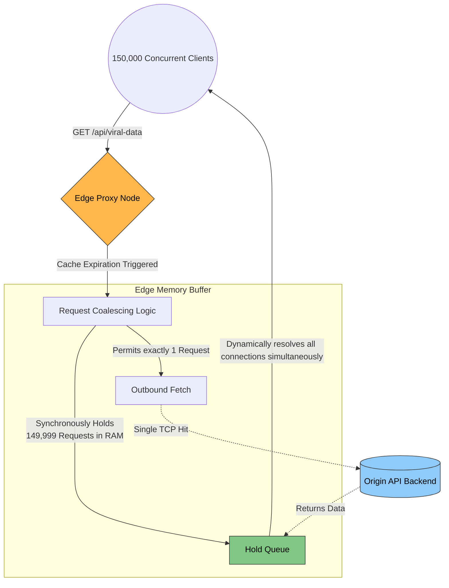

# 5. Advanced Edge Architectures

The final evolution of a Content Delivery Network strips away the concept of "caching" entirely and converts the physical Edge Node into an active, massively distributed execution environment. 

---

## 5.1 Serverless Edge Computing

Historically, an Edge Node was rigidly programmed to merely parse HTTP headers and route packets. Modifying that logic required rewriting C/C++ proxy binaries and deploying them globally. 

Modern architectures utilize **Serverless Edge Computing** (e.g., Cloudflare Workers, AWS Lambda@Edge, Fastly Compute).

### The Execution Engine
Rather than spinning up heavy Docker containers securely on the Edge, modern providers leverage extraordinarily lightweight execution environments like **V8 Isolates** or **WebAssembly (Wasm)**.
*   **V8 Isolates:** Stripped-down execution contexts directly within the V8 JavaScript engine. They execute custom JavaScript payloads globally within **0 milliseconds** of a cold start. They consume drastically less RAM than standard Node.js environments.

### Architectural Use Cases
Engineers deploy code that physically runs *inside* the Tokyo ISP router rather than strictly on the New York backend.
*   **A/B Testing:** The Edge Node executes a microscopic script natively. It reads the incoming request, mathematically generates a random distribution variable, and forcibly redirects 50% of the traffic to the `v2.0` origin server without the client ever recognizing the intervention.
*   **Edge Data Injection:** The Edge Node natively executes an API call to latency-free Edge Key-Value stores (like Cloudflare Workers KV). It parses an incoming HTML template, aggressively injects locally relevant localized data directly into the DOM structure natively on the Edge, and delivers dynamic, fully formed HTML instantly.

---

## 5.2 Multi-CDN Resiliency & Traffic Switching

Trusting a single enterprise entity with 100% of global internet traffic introduces an existential Single Point of Failure (SPOF). When `us-east-1` effectively collapsed due to routing cascading failures, thousands of companies went entirely dark instantaneously.

Senior Architects aggressively construct **Multi-CDN Architectures**.

### The Traffic Distribution Matrix
Instead of pointing the authoritative DNS directly to CloudFront, the DNS resolves uniquely to an intelligent Global Traffic Manager (GTM).

1.  **The Fleet:** The company formally registers Cloudflare, Fastly, and Akamai simultaneously.
2.  **Telemetry Data:** The GTM continuously monitors localized telemetry directly from physical client devices. It records that Fastly possesses a 45ms latency in Berlin, while Akamai exhibits a 15ms latency due to unique local peering agreements.
3.  **Real-Time Sub-Routing:** The GTM actively manipulates DNS resolution weights. It dynamically steers exactly 85% of German traffic to Akamai natively, while heavily routing South American TCP connections towards Cloudflare's localized backbone.
4.  **Instantaneous Failover:** If Fastly inevitably experiences an unexpected BGP routing leak and goes completely dark, the GTM instantly severs its DNS mapping, routing 100% of global traffic efficiently between the remaining two operational CDNs without executing any manual infrastructure reconfiguration.

---

## 5.3 CDN Observability & Edge Logging

When an application collapses purely at the CDN layer, traditional centralized backend Application Performance Monitoring (APM) dashboards are rendered completely useless, because the dropped Packets fundamentally never reach the Origin telemetry hooks.

### Edge Log Streaming (Logpush)
Architects cannot manually SSH into 5,000 respective proxy servers globally. 
The CDN constructs an automated, high-throughput log pipeline pushing raw HTTP access records, cache statuses (HIT/MISS/STALE), TLS cipher suites, and Ray IDs directly into centralized massive Data Lakes (e.g., Datadog, Snowflake, AWS S3).

**The Ray ID Traceability:**
Every incoming internet HTTP packet is forcibly injected uniquely with a trace ID (e.g., `Cf-Ray: 7x9a8b`) directly at the Edge. This identical header strictly propagates entirely backward through the core microservices infrastructure, ensuring Distributed Tracing chains mathematically encompass the entire lifecycle from Tokyo ISP to New York SQL database.

---

## 5.4 The Catastrophe: Managing The Cache Stampede

A catastrophic architectural fault occurs precisely at the microscopic intersection of volatile viral traffic and simultaneous cache expiration.

**The Mechanical Failure:**
*   A major streaming event occurs globally (100 million active users).
*   The Edge strictly caches the crucial API JSON response carrying dynamic data: `TTL = 10 Seconds`.
*   At `00:00:10`, the TTL inherently expires. The data is wiped.
*   Between `00:00:10` and `00:00:11`, exactly 150,000 new requests hit the Edge.
*   Because the cache is structurally empty, the Edge processes exactly 150,000 simultaneous Cache Misses. It instantaneously opens 150,000 physical TCP limits toward the Origin, severely overpowering database limits and triggering a cascading blackout.

**The Architectural Prevention: Request Coalescing (Cache Locking)**
Advanced Reverse Proxies natively impose absolute strict memory locking protocols.
1. When the 150,000 concurrent requests trigger a Miss, the proxy strictly allows exactly **ONE** request technically to propagate to the backend.
2. The remaining 149,999 requests are mathematically bound in a synchronized hold queue natively within the proxy's active RAM.
3. Upon receiving the backend payload, the proxy asynchronously resolves the cached data uniformly across all waiting sockets concurrently, effectively reducing 150,000 catastrophic database hits into precisely one safe API resolution.

---

## 5.5 Final Masterclass Case Studies

### 1. Netflix - The Custom Hardware Override (Open Connect)
When serving approximately 15% of the entire planet's broadband bandwidth simultaneously, standard physical architecture collapses. Paying massive Enterprise CDNs (like AWS or Fastly) for streaming egress fees would literally bankrupt Netflix mathematically.

Netflix engineers bypassed traditional corporate networking entirely by engineering their own bespoke CDN: **Open Connect**.
*   Netflix physically builds custom 100-Terabyte caching hardware appliances explicitly specialized purely for static video chunks.
*   Instead of renting massive data centers, Netflix legally negotiates and ships these physical red boxes totally free of charge directly into local ISP server racks (AT&T, Verizon, BT).
*   *The Result:* When you stream Netflix, the video packets rarely ever touch the open global internet. The video organically originates directly from a box physically located inside your regional ISP hub down the street, fundamentally eliminating international transit congestion.

### 2. Twitch & Fastly - The Sub-Second Invalidation Challenge
Twitch broadcasters must have near-instantaneous latency interactions with their live chat ecosystems, rendering standard 10-second HLS streaming buffers unviable. Furthermore, when a broadcast ends or stream data changes, standard legacy CDNs require up to 5 minutes to globally purge outdated data.

Twitch partners intensely with providers like Fastly explicitly because Fastly pioneered **Instant Invalidation architectures**. Through profound network mesh designs and Varnish routing magic, Fastly formally asserts it can mathematically erase a distinct cached object across every single global Edge location on earth in approximately **150 milliseconds**, securing the extreme real-time state integrity mandated by live sports architectures.

---

⬅️ **[Previous: 4. Edge Routing & Security](04_Edge_Routing_and_Security.md)** | 🏠 **[Back to TOC](README.md)** | **[Next: 6. Important Findings & Summary ➡️](06_Important_Findings_and_Summary.md)**
