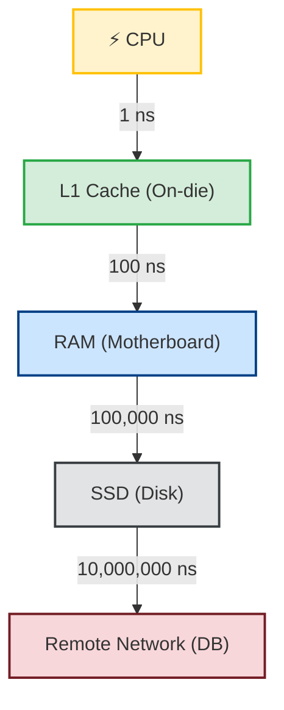

# 1. The "Why" & The Fundamentals

### 1.1 What Caching Actually Is

Caching, at its core, is just this: if you did some expensive work once, and you're probably going to need that same result again soon, keep a copy of it somewhere faster so you don't have to redo the work.

That's the whole idea. Everything else is implementation detail.

**Mental model:** think of a chef in a kitchen. The fridge (your database) has everything, but walking over, opening it, and pulling out chopped onions takes a few seconds every single time. So instead, the chef keeps a small prep bowl on the counter — already-chopped onions, ready to grab. If a recipe needs onions three times in two minutes, the chef reaches for the bowl instead of making three trips to the fridge. That prep bowl is the cache.

More formally: a cache is a smaller, faster, usually more expensive storage layer that holds a subset of your data, positioned physically or logically closer to whatever's asking for it.

One thing worth being precise about, because people get this wrong: **a cache is not storage.** If the prep bowl gets knocked over, the onions still exist — they're in the fridge. A cache is disposable by design. It holds copies, never the original. If you lose it, the system should just shrug and go fetch from the source again. The moment your app can't function without the cache, you've built a database, not a cache — and probably a fragile one.

---

### 1.2 The Problem It's Actually Solving

Caching exists because of one unavoidable fact of computing: **the latency gap** between "fast" and "slow" storage is enormous — like, hard to intuitively grasp enormous.

Here's a rough way to feel it, scaling everything up to human timescales:

- L1 cache access ≈ 1 second — it's right there
- RAM access ≈ a few seconds — like waiting for an elevator
- SSD read ≈ about a minute — you could grab a coffee
- A database call over the network ≈ several minutes — a short walk outside and back

Now put that in server terms. A single DB query might take 5ms — nothing, right? But if your endpoint handles 1,000 requests a second, and each one fires off that same 5ms query, you're burning 5 full seconds of pure waiting, every second, just on I/O. Your CPU — the thing you're actually paying for — sits there idle, twiddling its thumbs while bytes crawl across a network.

Why is the gap so big? Because disk and network I/O involve physically moving things — electrons across a wire, a platter spinning, a packet hopping through switches. Compare that to a CPU reading from RAM, which is closer to "electrons moving across a few millimeters of silicon." Different universe of physics. Caching's whole job is to shrink that distance — pull the result of the slow trip and park it right next to the CPU, so next time it's a direct memory lookup instead of a full round trip through the OS network stack.

---

### 1.3 What You're Actually Buying With a Cache

Nobody adds a cache for the intellectual satisfaction of it. There are three concrete payoffs, and usually you're chasing all three at once:

**1. Lower latency, better UX.**
A response going from 150ms (hits the DB) to 2ms (hits the cache) is the difference between "instant" and "noticeable" to a user. For anything synchronous and user-facing, this is usually the headline reason to cache.

**2. Less load on your database.**
Databases are expensive to scale and painful to scale vertically past a certain point. Every read that hits the cache is a read your DB never has to know about — freeing up connections, CPU, and disk I/O for the writes and cold reads that actually need it. In practice, a well-placed cache commonly knocks 70–95% off your primary DB's read load. That's not a small number.

**3. Lower cost.**
This is the boring-but-real reason finance cares. If your cache is absorbing 90% of reads, you need a much smaller (cheaper) DB replica — or you can put off sharding for another six months. Caching is basically converting an expensive, hard-to-scale resource (DB IOPS) into a cheap, easy-to-scale one (app memory).

**One thing to unlearn:** caching is *not* about keeping data fresh — it's the opposite trade. You're deliberately accepting slightly stale data in exchange for speed. If a piece of data genuinely needs to be correct to the millisecond on every single read, that's a sign you shouldn't be caching it, not a cue to cache it "carefully." The whole point of caching is trading a little bit of correctness for a lot of speed — and being honest with yourself about which of your data can actually afford that trade.

---

🏠 [Back to TOC](README.md) | [Next: 2. Theoretical Underpinnings ➡️](02_Theoretical_Underpinnings.md)