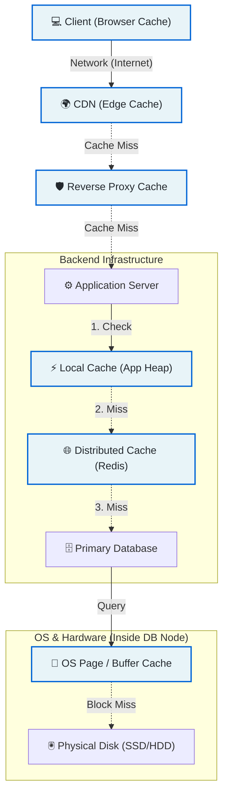

# 3. The Memory Hierarchy & Caching Layers (Where we cache)

The entire computing stack is basically a series of caching layers, each one trading speed for size and cost. The further we move from the CPU, the slower and cheaper the storage gets. The entire point of a modern OS is to manage this hierarchy so that the CPU rarely has to wait for the slowest layer.

### The Caching Request Journey

### 3.1 Hardware Layers (CPU Registers → L1/L2/L3 → RAM → Disk)
This is the foundation. Every other software cache we build is just mimicking this physical design.

- **CPU Registers:** The absolute fastest. They store the exact operands the CPU is working on right now. 
  - *Access time:* ~0.3 ns
  - *Size:* A few hundred bytes
- **L1/L2/L3 Cache (SRAM):** Built directly onto the CPU die (or very close). They hold copies of frequently accessed RAM data. The hardware automatically moves data from RAM into L3, then L2, then L1 based on spatial and temporal locality—without any programmer intervention.
  - **L1:** ~1 ns, ~32KB per core
  - **L2:** ~4 ns, ~256KB per core
  - **L3:** ~12 ns, ~8-32MB shared across cores
- **RAM (DRAM):** Main memory. 
  - *Access time:* ~100 ns
  - *Size:* 16GB–1TB
  - *(Compared to L1, RAM is 100x slower).*
- **Persistent Storage (SSD / HDD):** The source of truth for files and databases.
  - **NVMe SSD:** ~10,000 ns (10 µs)
  - **SATA SSD:** ~100,000 ns (100 µs)
  - **HDD:** ~10,000,000 ns (10 ms) *(A full 100,000x slower than RAM).*

> **🧠 The Critical Insight:**
> The OS and the CPU hardware are already doing aggressive caching for us (L1/L2/L3 and the Page Cache). When an application reads a file from disk, the OS doesn't necessarily go to the physical disk every time; it often serves it from the OS Page Cache. We should never try to manually manage CPU caches—that's the hardware's job. As backend engineers, our job starts at the application-level cache.

---

### 3.2 OS-Level Caching (Page Cache / Buffer Cache)
Before the application even gets a chance to cache anything, the operating system is already caching disk I/O behind the scenes.

- **What it is:** A portion of the system's free RAM that the OS uses to store recently accessed disk blocks (pages). When we call `read()` on a file, the OS first checks the Page Cache. If the block is there, it copies it directly to the application's memory without touching the disk.
- **Why it matters:** This is why repeatedly reading the same configuration file or a static asset is fast, even if we don't implement any caching in our code. It's also why database engines like PostgreSQL use `fsync` and `O_DIRECT` flags—they sometimes bypass the Page Cache to avoid double-caching and to ensure they have control over when data actually hits the physical disk.

> **Mental Model:** Think of the Page Cache as a free, automatic "neighborhood cache" for all file operations. It operates on physical disk blocks, not on application's logical keys (like `user:123`). It caches the raw bytes of the database file. If we query `user:123` from a database, the DB engine might read page 42 from the `.ibd` file; the OS caches page 42. If we query `user:456` and it happens to live on that same page, it's a cache hit at the OS level, even though the application-level cache missed.

---

### 3.3 Application-Level Caches (In-memory vs. Distributed)
This is where we, as engineers, have full control. We are storing logical results—the deserialized JSON of a user profile, the rendered HTML of a dashboard, the result of a complex aggregation query.

- **In-memory (Local):** The cache lives inside the application's heap (e.g., a Java `ConcurrentHashMap`, a Python dictionary, or a library like Caffeine/Guava). Access is a simple pointer dereference—sub-microsecond.
- **Distributed (Remote):** The cache lives on a separate set of servers (e.g., Redis, Memcached). The application makes a network call (TCP/Unix socket) to fetch the data. Access is ~0.5–2ms (network round-trip within a datacenter).

>*The key distinction: Application-level caches operate on domain objects, not physical blocks. We decide what key to use and what value to store. The trade-off here is control vs. complexity.*

---

### 3.4 Infrastructure Caches (CDN, DNS, Reverse Proxy / API Gateway)
These operate outside the application code entirely. They are networking-level caches that sit between the user and the backend.

- **CDN (Content Delivery Network):** Caches static assets (images, CSS, JS, video) at edge nodes geographically closer to the user. Operates on the URL as the key. A hit means the request never reaches the origin servers. Massive latency benefits (hundreds of ms).
- **DNS Caching:** Every OS, browser, and recursive resolver caches DNS records (domain → IP). This prevents the overhead of a full DNS lookup chain for every single request.
- **Reverse Proxy / API Gateway (e.g., Varnish, Nginx, CloudFront):** These cache full HTTP responses (`GET` requests) at the gateway level, before the request even hits the application container. Great for public, read-only APIs or product catalog pages.

**Hierarchy Placement:** They are the outermost layer. They have the highest latency (because they traverse the internet), but they have the largest capacity (they can cache terabytes of data across millions of users). They also reduce load on the application more effectively than any internal cache because they stop the request at the door.

---

⬅️ **[Previous: 2. Theoretical Underpinnings](02_Theoretical_Underpinnings.md)** | 🏠 **[Back to TOC](README.md)** | **[Next: 4. Fundamental Topologies ➡️](04_Fundamental_Topologies.md)**
