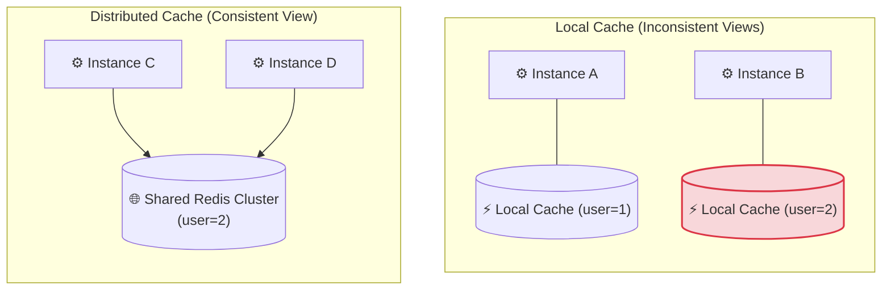
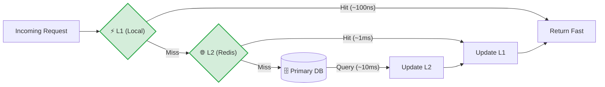

# 4. Fundamental Cache Topologies (Local vs. Distributed)

Now we zoom in on the two ways to implement application-level caches. This is a foundational architectural decision that affects consistency, performance, and operational complexity.

### 4.1 Local / In-Process Caches
- **What it is:** The cache is a data structure (usually a HashMap + an eviction policy) that lives inside the memory heap of the application process. Every instance of the service has its own completely independent cache.
- **Examples:** Caffeine (Java), Guava Cache (Java), `lru_cache` (Python), `groupcache` (Go).
- **Performance:** Blazing fast. Read path: `application → local heap → return`. No serialization, no network, no system calls (just a pointer dereference). Latency: ~100–300 ns.
- **Capacity:** Limited by the JVM/process heap. If there is a 4GB heap, we can only allocate maybe 1GB to caching without causing GC pressure.

> **🚨 The Critical Nuance:**
> Because each instance has its own copy, the caches are highly inconsistent across instances. If Instance A caches `user:123` and then a `PUT /users/123` request lands on Instance B, Instance B can invalidate its own local cache, but Instance A will continue serving the stale version until its TTL expires. There is no built-in mechanism to inform other instances.

---

### 4.2 Distributed Caches (e.g., Redis, Memcached)
- **What it is:** A separate cluster of servers dedicated solely to storing key-value pairs in memory. All application instances talk to the same cluster over the network.
- **Examples:** Redis, Memcached, Hazelcast, Apache Ignite.
- **Performance:** Slower than local. Read path: `application → serialize key → TCP network call → server lookup → network response → deserialize value`. Latency: ~0.5ms – 2ms.
- **Capacity:** Massive. We can add nodes to the cluster and scale to hundreds of gigabytes or terabytes of RAM shared across all services.

> **🚨 The Critical Nuance:**
> This gives us cross-instance consistency. If Instance A invalidates `user:123` in Redis, Instance B will immediately see that invalidation (or miss) on the next read, because they share the same centralized store. However, we introduce a network dependency—if Redis is slow or down, the application must handle that gracefully.

### Architecture Comparison: Local vs. Distributed

---

### 4.3 The Trade-off (Speed vs. Consistency vs. Capacity)
This is the heart of the decision. There is no "best" topology; there is only the right one for the workload.

| Dimension | Local / In-Process | Distributed / Centralized |
| :--- | :--- | :--- |
| **Speed (Latency)** | **Extreme.** ~100ns. No network overhead. | **Medium.** ~1ms. Network and serialization dominate. |
| **Consistency** | **Weak.** Each instance has its own view. Stale data is almost guaranteed. | **Strong (relative).** All instances see the shared source of truth. Invalidation is immediate. |
| **Capacity** | **Small.** Limited by process heap per instance. | **Massive.** Independent cluster can scale out massively. |
| **Cost** | **Free (mostly).** Uses existing application memory. | **Expensive.** Requires dedicated servers & operational overhead. |
| **Failure Domain** | **Tied to application.** Instance restart clears cache, doesn't affect others. | **Independent.** If cluster crashes, all apps lose cache (possible Thundering Herd). |
| **Complexity** | **Trivial.** Just a library import. | **High.** Manage connections, retries, failovers, partitions. |

#### 💡 The Decision Mental Model:

- **Use Local when:** The data is expensive to compute but small, changes infrequently, and slight inconsistency across instances is acceptable (e.g., global config map updated daily, static reference data). Or when you *cannot* afford the extra 1ms of network latency (e.g. HFT, real-time video).
- **Use Distributed when:** The cache needs to be large, shared across services (e.g., Auth tokens, product catalog across microservices), or strong invalidation is critical to avoid showing stale data to users after updates.

#### 🏆 The Production Pattern: The Two-Level Cache
Check L1 (Local) first. If it misses, check L2 (Distributed). If that misses, go to the DB.
*This provides the speed of local for absolute hot keys, the consistency of distributed for other keys, and the DB as the final fallback.*

---

⬅️ **[Previous: 3. Memory Hierarchy & Caching Layers](03_Memory_Hierarchy_And_Layers.md)** | 🏠 **[Back to TOC](README.md)** | **[Next: 5. Core Caching Strategies ➡️](05_Cache_Updating_Strategies.md)**
