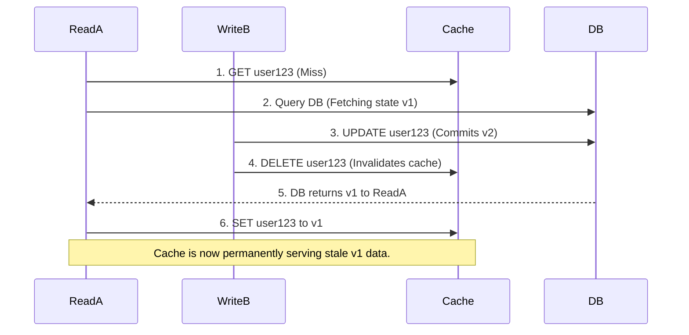
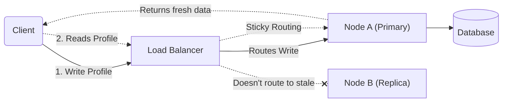

# 8. Cache Consistency & The Leaky Cache

### 8.1 Weak / Eventual Consistency (Accepting Stale Reads)

**The Mental Model:**
We are running a news ticker. When a reporter breaks a story, it takes 30 seconds to propagate to every TV screen in the world. During those 30 seconds, some viewers see the old headline, and some see the new one. Eventually, everyone sees the new one. We explicitly accept this delay because we prioritize availability and speed over absolute perfection.

**What it actually means for our cache:**
We allow our application to serve cached data that is older than the current database state. We make no strong guarantees about when the cache will be updated, only that eventually it will (usually via TTL expiration or a best-effort async invalidation event).

**Why we use it:**
It is the default state of 99% of web caches. It gives us maximum read throughput and resilience. If our event bus (Kafka) goes down, the cache still serves the old data. The system remains available; it just sacrifices freshness.

**Real-World Tech Example:**
- **YouTube View Count:** When we refresh a video, the view count might be 1.2M. Ten seconds later, it might show 1.2M again, even though 1,000 new views happened. The database knows the truth, but the cache (which updates every 30 seconds) doesn't. This is perfectly acceptable.
- **News Feed Ranking:** The order of posts in our Instagram feed is stale by a few seconds. We don't care; we care more about latency (sub-100ms) than absolute real-time ordering.
- **E-commerce Inventory (Non-critical):** "Only 3 left in stock!" It might be slightly inaccurate, but if a user actually buys the last one, the write path will handle the conflict. The read cache is allowed to be weak.

**The Trade-offs:**
- **Pros:** Maximum availability. Maximum read throughput. We are immune to network partitions affecting cache reads.
- **Cons:** We serve incorrect data. If a user changes their profile picture and refreshes, they might see the old picture for 5 seconds. The UX is "eventually consistent."

> **CRITICAL NUANCE:**
> Eventual consistency is not an excuse for broken logic. If we are using this model, we must ensure that our business logic does not rely on the cache being up-to-date. For example, we should never check a cached `user.balance` to determine if they can purchase an item. The cache is for display only in this model.

---

### 8.2 Strong Consistency

**The Mental Model:**
We are running an ATM. When we withdraw money, we need the balance to reflect the new state immediately for the next transaction. There is no "eventual" window. The system guarantees that every read returns the most recent successful write.

**What it actually means for our cache:**
We are moving away from Cache-Aside (lazy) to Read-Through + Write-Through (Synchronous). On a write, we do not just update the database; we update the cache inside the same transaction (or using a distributed lock) and only return success once both are committed. On a read, we always read from the cache, knowing that the cache is the authoritative source because all writes pass through it.

**How we achieve it mechanically:**
- **Synchronous Dual-Write:** We write to the database, then immediately write to Redis within the same application transaction. If Redis fails, we roll back the DB transaction.
- **Distributed Locks (Read/Write locks):** We use tools like Redlock or ZooKeeper to ensure that only one process can modify a key at a time, preventing any dirty reads during the update window.

**Real-World Tech Example:**
- **Financial Ledgers / Bank Balances:** When a user transfers $100, we use a Write-Through pattern. The cache is invalidated/updated synchronously. A subsequent read hits the cache and sees the exact, correct balance.
- **Inventory Reserve (High-end goods):** For luxury watches, we cannot oversell. We use strong consistency locks. Read-Through ensures that when the user checks out, the cache accurately reflects the reserved stock.
- **User Email/Password Updates:** We synchronously invalidate the cache. The moment the user submits the form, the cache key is deleted, and the next request fetches the fresh DB state.

**The Trade-offs:**
- **Pros:** Absolute data correctness for the user. No "WTF" moments where they see stale data.
- **Cons:** Reduced Availability and Higher Latency. If Redis is slow or unreachable, the entire write operation fails. Our system is now coupled to the health of Redis. Write latency increases by the network round-trip to Redis (typically +1–2ms), which is significant for high-throughput services.

> **CRITICAL CONCEPT:**
> Strong consistency is expensive at scale. We generally limit it to a tiny subset of our data (the "critical path"). We do not apply Strong Consistency to our entire product catalog; we apply it only to the specific keys that financial transactions depend on.

---

### 8.3 The "Leaky Cache" Problem – When the DB and Cache get out of sync

Even with the best intentions (Write-Through, Event-Based invalidation), the cache is a "leaky abstraction." It inevitably fails to reflect the database state. The system is like a roof with holes—we patch it, but the rain still gets in.

Here are the four primary ways the DB and cache get out of sync, and how we handle them.

#### Root Cause A: The Concurrent "Lost Update" Race (The Classic Trap)
This is the most insidious invalidation bug.

*The cache now contains old data, even though the DB has new data. The cache has "leaked" stale data past the invalidation.*

**What we do about it:**
We use **Versioning / Compare-and-Swap (CAS)**. We store a timestamp or version number alongside the value. Read A fetches version `v1`. Write B updates the DB and sets the cache version to `v2`. Read A tries to set `v1`—we reject it because `v1 < v2`. Alternatively, we accept that this race exists and rely on a short TTL (e.g., 5 seconds) to eventually fix the leaked state.

#### Root Cause B: The Failed Transaction Rollback
This happens with Write-Through.
1. We write to Redis (successfully).
2. We attempt to write to the DB—it fails (constraint violation, deadlock, connection timeout).
3. Our application logic rolls back the DB transaction, but we forget to roll back the Redis write, or we fail to execute the rollback because of a network error.

*The cache now holds a value that never existed in the source of truth.*

**What we do about it:**
We adopt the rule: **Never update the cache before the DB transaction commits.** We do the DB first. Only after `db.commit()` succeeds do we either delete or update the cache. If the DB fails, we never touch the cache. This is why "Delete on Write" (Cache-Aside) is safer than "Set on Write"—deleting after a successful commit minimizes the window for this specific leakage.

#### Root Cause C: Out-of-Order Events (The Message Bus Debacle)
We use Kafka to send invalidation events to all services.
1. Event E1 is generated at time T1 (invalidates `key:123`).
2. Event E2 is generated at time T2 (invalidates `key:123` again).
3. Due to network retries, E2 arrives at the cache node before E1.
4. The cache processes E2 (ignores it, or sets a stale timestamp) and then processes E1 (sets an older state). The cache is now broken.

**What we do about it:**
We enforce **Idempotency and Versioned Events**. The invalidation event carries a version or timestamp with it. The cache only processes an invalidation if the event's timestamp is *newer* than the last invalidation it processed for that key. We ignore old events.

#### Root Cause D: Network Partitions / Splits
The cache cluster (Redis) and the database are on different physical machines. A network switch fails for 30 seconds. During that time, a write occurs to the DB, but the invalidation `DELETE` never reaches Redis. When the network recovers, Redis is serving stale data.

**What we do about it:**
This is where we rely on the **TTL (Time-to-Live)** as our ultimate fallback. We set a strict upper bound on staleness (e.g., 60 seconds). Even if the network partition completely breaks our invalidation pipeline, the cache evicts the key at the 60-second mark and forces a fresh read from the DB. The TTL is our "circuit breaker" against indefinite leakage.

---

### 8.4 The Missing Piece: Consistency Models in Practice

We need to add three more concepts here because they directly map to the user experience and the SLAs we sign off on.

#### 8.4.1 Read-Your-Writes Consistency (Session Consistency)
**The Problem:** We update our profile picture. We refresh the page. We see the old picture because the read request hit a stale cache replica.
**The Fix:** We implement **Sticky Sessions** (or "Pin to Cache Node"). Once a user performs a write, we route all subsequent reads *for that user* to the specific cache replica that just received the invalidation. We guarantee that a user always sees their own writes immediately, even if other users don't.

#### 8.4.2 Monotonic Reads (No Time-Travel)
**The Problem:** We refresh a dashboard. It shows Balance: $100. We refresh again 1 second later. It shows Balance: $50 (newer). We refresh a third time. It shows Balance: $100 (older). The data went backward in time. This shatters user trust.
**The Fix:** We enforce monotonic reads. Once a client sees a specific version of the data (e.g., `v100`), they are never allowed to see a lower version (`v50`) for that key. The cache layer tracks the highest version seen by that client and rejects old cache responses.

#### 8.4.3 Bounded Staleness (The Practical Middle Ground)
**The Problem:** Between "Eventual" (unbounded staleness) and "Strong" (zero staleness) lies Bounded Staleness. We make a strict SLA: *"The cache will never be more than 1 minute stale."*
**The Fix:** We achieve this purely through aggressive TTLs. If we set a TTL of 60 seconds, we are guaranteeing bounded staleness of 60 seconds. We don't need complex distributed locks; we just accept the 60-second window and design the business logic around it.

---

## The Real-World Engineering Choice (Our Rule of Thumb)

When we design a production system, we map consistency levels to our endpoints:

| Data Type | Consistency Guarantee | Technical Implementation | Why |
| :--- | :--- | :--- | :--- |
| **"Add to Cart" / Inventory** | Strong Consistency | Read-Through + Write-Through with a distributed lock. | Overselling is a legal/financial risk. We pause the world briefly to reserve the item. |
| **User Profile Details** | Read-Your-Writes (Session) | Write deletes the cache. User pinned to primary node for 5m. TTL: 60s fallback. | The user must see their own update immediately. We don't care if others see the old version. |
| **Product Catalog** | Bounded Staleness (1m TTL) | Cache-Aside with a 60-second TTL. No event-driven invalidation needed. | Expensive to invalidate thousands of catalog keys. Serving 60s old prices is acceptable to save the DB. |
| **Analytics / Aggregates** | Weak / Eventual (Unbounded) | Write-Behind with a 5-minute flush. | The "total sales" widget can be 5 minutes behind. The CEO won't refresh obsessively. |

> **THE FINAL MENTAL MODEL:**
> We must think of consistency as a spectrum of risk. Strong consistency minimizes risk (data correctness) but maximizes operational risk (Redis failures cause downtime). Weak consistency minimizes operational risk but maximizes data correctness risk.
> 
> Our job as backend engineers is to calibrate this spectrum precisely. We use Strong Consistency for the critical path (money, inventory), and we use Eventual/Bounded for everything else. The "Leaky Cache" is a constant we manage with TTLs and versioned writes, not a bug we try to eliminate entirely.

---

⬅️ **[Previous: 7. Cache Invalidation](07_Cache_Invalidation.md)** | 🏠 **[Back to TOC](README.md)** | **[Next: 9. Distributed Caching Deep-Dive ➡️](09_Distributed_Caching_Deep_Dive.md)**
