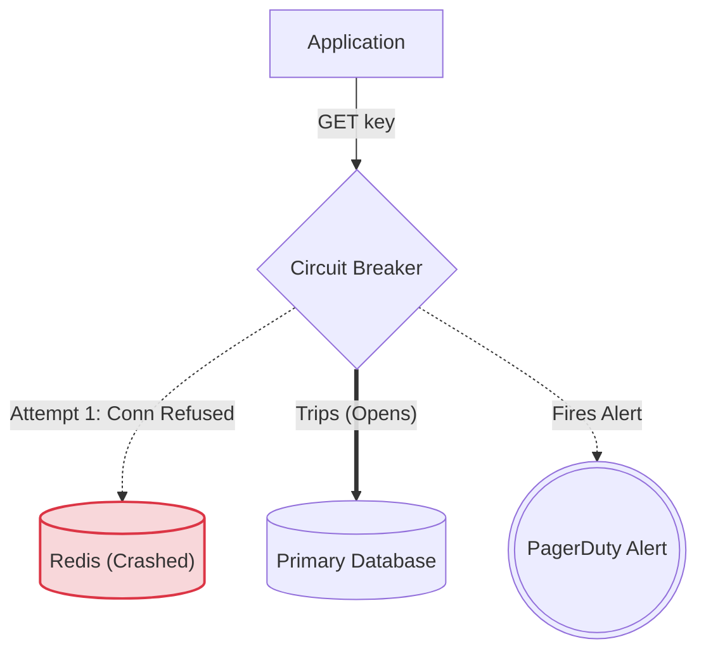
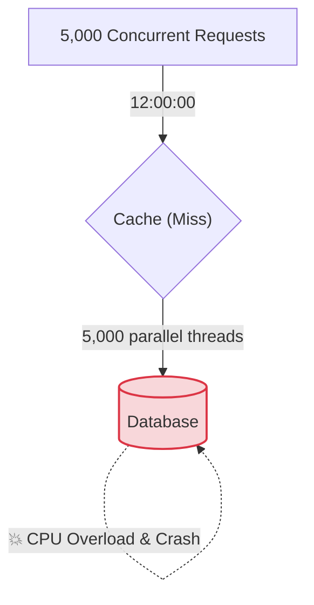
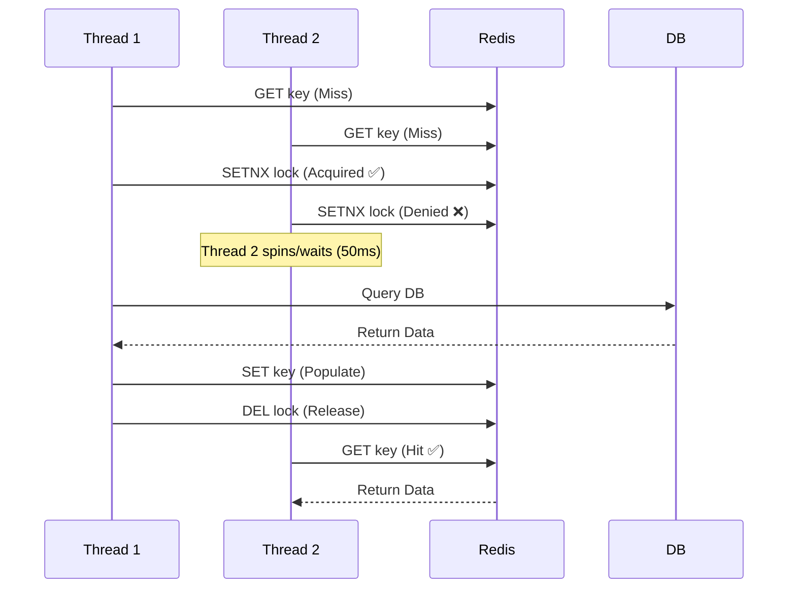

# 10. Production Failure Modes

We must treat our cache as a "nice-to-have" service. If Redis goes down, our system must not go down with it. Let's understand the failure modes and how we build resilience.

---

### 10.1 Cache Failures

#### 10.1.1 Node Crash / OOM Killer
Redis hits its `maxmemory` limit. The Linux OS decides the process is using too much memory and fires the OOM (Out-of-Memory) killer, terminating Redis abruptly.
- **Our response:** We use Circuit Breakers. The application detects the connection failure (e.g., `ConnectionRefused`), and fails open: it goes directly to the primary database without caching. We log the error aggressively and page the on-call engineer. We must ensure our DB can handle the sudden spike in traffic during the outage.

#### 10.1.2 Network Partitions / Timeouts
A network switch glitches. Redis is still running, but packets are dropping. GET requests hang for 5 seconds before timing out, holding up our application threads.
- **Our response:** We set aggressive timeouts (e.g., 200ms for GET, 100ms for SET). We use a policy like fail-fast: if the timeout expires, we immediately cancel the operation and read from the DB. We never let the cache delay our critical path beyond the timeout.

#### 10.1.3 Cluster Split-Brain
Redis Sentinel or Cluster manages primary election. A network partition splits the cluster into two sides. Both sides believe they have a primary and accept writes. After the partition heals, Redis merges the two primaries, but we have conflicting writes (data loss).
- **Our response:** Redis Sentinel uses a quorum system. We configure the cluster so that a primary promotion requires a majority vote (e.g., `quorum = (N/2) + 1`). We ensure that only one side has the majority, preventing split-brain. Additionally, we prefer using Redis Cluster (which has a stricter consensus mechanism) over Sentinel for critical systems.

#### 10.1.4 Connection Pool Exhaustion
Our application services create a pool of TCP connections to Redis (e.g., `maxTotal = 50` per instance). We suddenly get a traffic spike, 100 threads request a connection, but only 50 are available. Threads start blocking, waiting for a connection, and eventually, the entire service hangs.
- **Our response:** We set a `maxWaitMillis` on the pool. If a connection is unavailable within 100ms, we throw an exception and skip the cache. We also carefully size our pools—not too big (which wastes resources) and not too small (which causes contention). We generally calculate: `poolSize = (Expected Threads * 2) / Number of Redis Nodes` to balance load.

---

### 10.2 "Cascade" Failure Scenarios

These are the most dangerous because they don't just take down the cache; they take down the database.

#### 10.2.1 Cache Stampede / Thundering Herd
Our TTL on `product:456` expires at exactly 12:00:00. At 12:00:00, 5,000 concurrent users all refresh their shopping carts simultaneously. All 5,000 see a cache miss. All 5,000 execute the expensive database query to rebuild the cart. The database CPU spikes to 100%, queries start timing out, and the database crashes.

#### 10.2.2 Dogpile Effect
This is the same problem, but specifically named for the scenario where the cache key expires, and everyone hits the backend simultaneously because there is no coordination.

---

### 10.3 Mitigation Strategies

Here is how we defend against Cache Stampedes and Dogpiling in production:

#### A. Mutex Locks (The Exclusive Recompute)
We use Redis's `SETNX` (Set if Not Exists) to acquire a lock for a specific key. Only one thread (the first one that missed) acquires the lock and goes to the database. All other threads wait (or spin) for a very short period (e.g., 50ms) and then retry the cache. The winning thread writes the fresh data to the cache, and the waiting threads read the fresh data.

- **Risk:** We must implement a strict TTL timeout on the lock itself to prevent a hung thread from blocking all recomputes forever.

#### B. Probabilistic Early Expiry (Jitter)
Instead of setting a fixed TTL of 60 seconds, we set a TTL of `60 + random(0, 30)` seconds. This spreads the expiration times across a 30-second window, preventing all 5,000 requests from expiring at the exact same microsecond.
- **Advanced Technique:** We can use a technique where we start recomputing the value before the TTL expires. If a key has a TTL of 60s, at 55s, we probabilistically decide (e.g., 10% chance) to refresh the cache. This ensures the cache is always hot.

#### C. Re-computation Offloading (Background Refresh)
When a miss occurs, we don't make the blocking thread fetch the data. Instead, we return a stale (old) value immediately and fire off an asynchronous job to refresh the cache in the background.
- **How we do it:** Redis supports a special flag—if the key is expired, we still return the old value but mark it for background refresh. The user gets a response instantly (low latency), and the background worker updates it for the next user.

---

⬅️ **[Previous: 9. Distributed Caching](09_Distributed_Caching_Deep_Dive.md)** | 🏠 **[Back to TOC](README.md)** | **[Next: 11. Migration Strategies ➡️](11_Migration_Strategies.md)**
