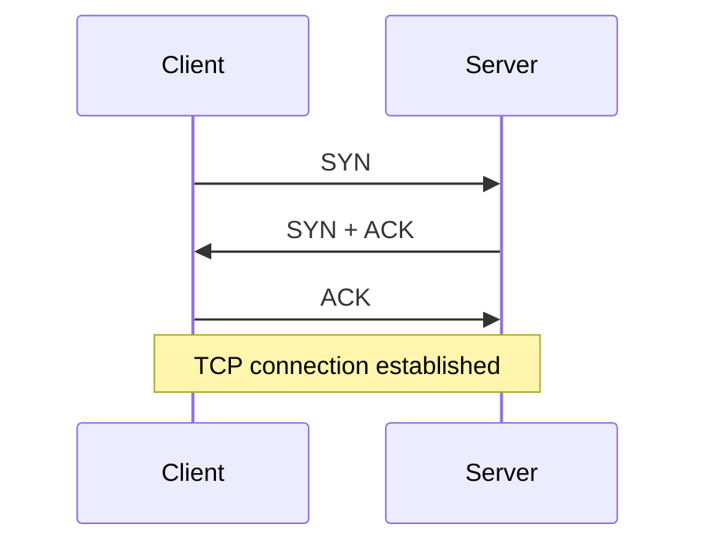
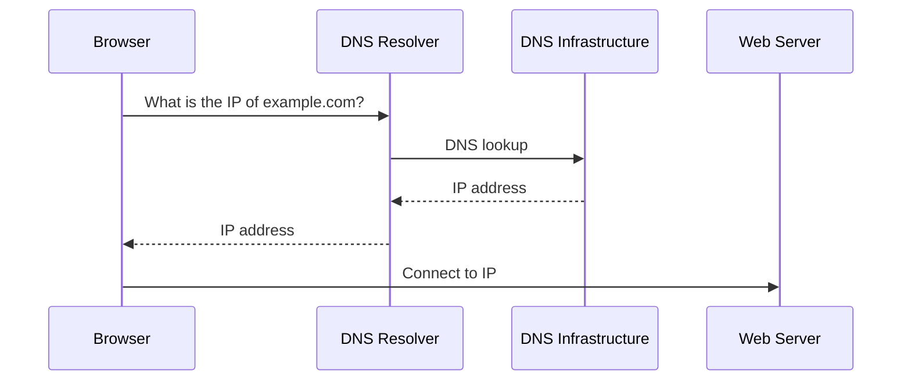
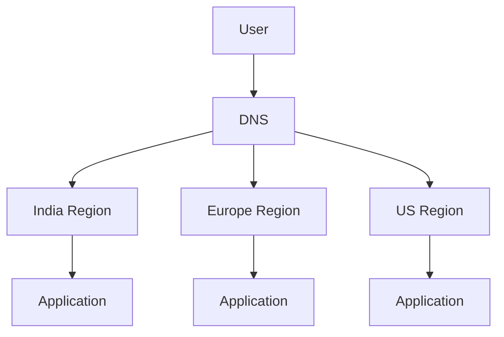
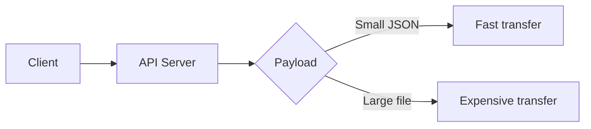
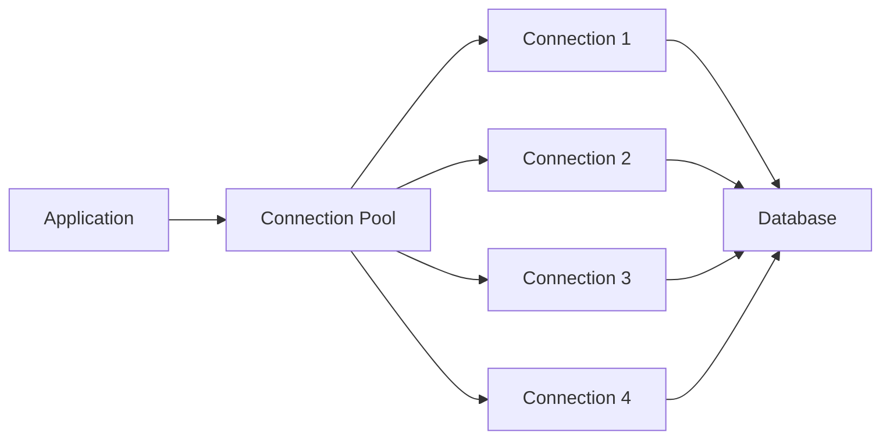
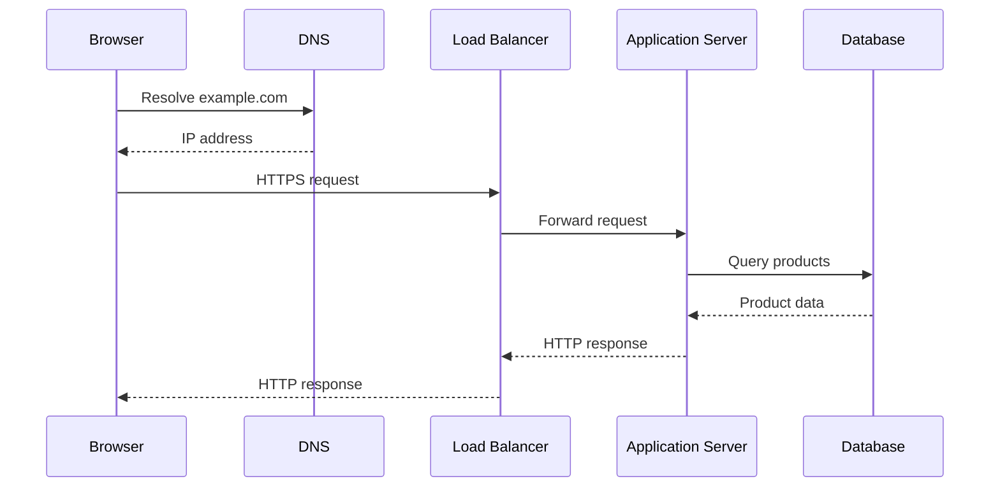

# 1. The Physics of the Network (Latency & Protocols)

Before designing distributed systems, we need to understand one fundamental constraint:

> **Computers are not infinitely close to each other, and data does not move instantly.**

A request from a user to a server may travel through multiple networks, routers, and physical links before reaching its destination.

Every hop introduces some amount of **latency**.

This matters because System Design is largely about answering questions such as:

* Why is this request slow?
* Should this operation happen synchronously?
* Should we cache this data?
* Should we move computation closer to users?
* Do we need a CDN?
* Should we reuse connections?
* Do we need asynchronous processing?

To answer these questions, we first need to understand the physics and protocols underneath the application.

---

# 1.1 Latency Numbers Every Engineer Should Know

## What is Latency?

**Latency** is the amount of time it takes for an operation to complete.

For networking:

```text
Client                              Server
  │                                   │
  │──────────── Request ─────────────>│
  │                                   │
  │<─────────── Response ─────────────│
```

The time between sending the request and receiving the response is affected by several things:

```text
Total Latency
      │
      ├── Propagation
      ├── Transmission
      ├── Processing
      ├── Queuing
      └── Protocol overhead
```

### A useful mental model

At a high level:

```text
Fast
│
├── CPU / Cache
├── RAM
├── SSD
├── Network within same machine / datacenter
├── Network across regions
└── Network across continents
Slow
```

The exact numbers vary dramatically depending on hardware, network conditions, and workload, so the goal is **not memorizing one magical number**.

The important lesson is understanding the **orders of magnitude**.

| Operation               | Rough order of magnitude |
| ----------------------- | -----------------------: |
| CPU register access     |          ~sub-nanosecond |
| CPU cache               |             ~nanoseconds |
| RAM access              |         ~tens to ~100 ns |
| SSD access              |  ~tens to hundreds of μs |
| Same-datacenter network |      ~sub-ms to a few ms |
| Cross-region network    |  ~tens to hundreds of ms |
| Cross-continent network |  ~tens to hundreds of ms |

The exact value is less important than this:

> **A network request is enormously more expensive than accessing data already sitting in CPU cache or RAM.**

This is one reason caching exists.

---

## Why Does Distance Matter?

Data physically has to travel.

Suppose your application server is in India and your database is in the US:


Even if the database query itself takes only a few milliseconds, the network round trip can dominate the total request time.

Therefore:

> **System Design is not only about computational complexity. Physical distance matters.**

This is one reason large systems deploy services, caches, databases, and CDNs across multiple geographic regions.

---

# 1.2 Network Distance & Propagation Delay

There is a physical limit to how quickly information can travel.

Signals travel through physical media such as:

* Fiber optic cables
* Copper cables
* Wireless links
* Undersea cables

Even though light travels extremely fast, it is not instantaneous.

For example:

```text
Mumbai
   │
   │
   │  ~ thousands of kilometers
   │
   ▼
London
```

A request cannot travel from Mumbai to London and back in zero time.

This gives us an important principle:

> **You cannot optimize away the speed of light.**

You can optimize software, databases, serialization, queries, and protocols—but physical distance still exists.

---

## Why CDNs Exist

Suppose a user in India requests an image stored on a server in the US.

Without a CDN:


With a CDN:


If the content is already cached at the nearby edge, the request doesn't need to travel all the way to the origin.

This reduces latency.

---

# 1.3 TCP vs UDP

Applications need a way to communicate across networks.

Two fundamental transport-layer protocols are:

* **TCP**
* **UDP**

They make different trade-offs.

---

## TCP

TCP (**Transmission Control Protocol**) provides a reliable, ordered byte stream.

It handles things such as:

* Reliable delivery
* Ordering
* Retransmission
* Flow control
* Congestion control

Conceptually:

```text
Sender                          Receiver

Packet 1 ────────────────────────>
Packet 2 ────────────────────────>
Packet 3 ────────────────────────>

Receiver:
"I received 1, 2 and 3."
```

If something goes wrong, TCP can retransmit data.

---

## TCP Three-Way Handshake

Before normal TCP communication begins, the connection is established using a handshake.



### What are these messages?

**SYN**

> "I want to establish a connection."

**SYN + ACK**

> "I received your request, and I'm ready."

**ACK**

> "I received your response."

Now application data can flow.

---

## Why Does This Matter for System Design?

Because establishing connections has a cost.

Imagine an application making a new TCP connection for every database query:

```text
Request
   ↓
Create connection
   ↓
Handshake
   ↓
Send query
   ↓
Receive response
   ↓
Close connection
```

That can become unnecessarily expensive.

Instead, systems often reuse connections.

```text
Connection Pool
┌──────────────────────┐
│ Connection 1         │
│ Connection 2         │
│ Connection 3         │
│ Connection 4         │
└──────────────────────┘
          ↑
      Application
```

We'll explore this more when discussing backend architecture and databases.

---

# 1.4 UDP

UDP (**User Datagram Protocol**) is much simpler.

It does not provide TCP's guarantees around:

* Delivery
* Ordering
* Retransmission

Conceptually:

```text
Sender                     Receiver

Packet 1 ───────────────────>
Packet 2 ─────────X
Packet 3 ───────────────────>

              Packet 2 lost
```

UDP doesn't automatically retransmit the missing packet.

This makes it useful when **low latency is more important than guaranteed delivery**.

Examples include:

* Real-time gaming
* Voice communication
* Video communication
* DNS
* Some streaming protocols

---

## TCP vs UDP

| Feature             | TCP                  | UDP                    |
| ------------------- | -------------------- | ---------------------- |
| Connection-oriented | Yes                  | No                     |
| Reliable delivery   | Yes                  | No                     |
| Ordered delivery    | Yes                  | No                     |
| Retransmission      | Yes                  | No                     |
| Flow control        | Yes                  | No                     |
| Congestion control  | Yes                  | No                     |
| Overhead            | Higher               | Lower                  |
| Typical use         | Web, databases, APIs | DNS, real-time traffic |

The key lesson isn't:

> "TCP is good and UDP is bad."

Instead:

> **TCP and UDP make different trade-offs.**

---

# 1.5 HTTP & HTTPS

Most backend systems communicate using **HTTP**.

HTTP sits above the transport layer.

A simplified stack looks like:

```text
┌──────────────────────┐
│ Application          │
│ HTTP                 │
├──────────────────────┤
│ Transport            │
│ TCP                  │
├──────────────────────┤
│ Internet             │
│ IP                   │
├──────────────────────┤
│ Physical Network     │
└──────────────────────┘
```

When a browser requests:

```text
https://example.com/users
```

the application is essentially saying:

> "I want to communicate with the server using HTTP."

---

## HTTP Request

A simplified request looks like:

```http
GET /users HTTP/1.1
Host: example.com
Accept: application/json
```

The server responds:

```http
HTTP/1.1 200 OK
Content-Type: application/json

[
  {
    "id": 1,
    "name": "Alice"
  }
]
```

---

# 1.6 HTTPS

HTTPS is essentially:

> **HTTP + TLS encryption**

Without HTTPS, data can potentially be observed or modified while travelling across an untrusted network.

With HTTPS:

```text
Client
   │
   │ Encrypted HTTP
   ▼
Internet
   │
   ▼
Server
```

TLS provides important properties such as:

* Encryption
* Server authentication
* Integrity

We don't need to learn cryptography deeply for basic System Design.

The important architectural understanding is:

> **HTTPS protects application communication while it travels over the network.**

---

# 1.7 DNS Resolution

Humans prefer names:

```text
google.com
```

Computers ultimately communicate using IP addresses:

```text
142.250.x.x
```

DNS (**Domain Name System**) provides the mapping.



---

## Why Doesn't the Browser Ask DNS Every Time?

Because DNS responses can be cached.

```text
Browser Cache
      ↓
OS Cache
      ↓
DNS Resolver Cache
      ↓
Authoritative DNS Server
```

If the answer is already cached, the lookup can be much faster.

DNS records have a **TTL (Time To Live)** that determines how long the response may be cached.

---

# 1.8 DNS and Global Load Balancing

DNS can also participate in directing users toward different infrastructure.

Imagine a globally distributed system:



A DNS-based routing system can use information such as:

* Geographic location
* Region availability
* Traffic policies
* Health status

to direct users toward an appropriate endpoint.

Important distinction:

> **DNS resolves names to destinations. It is not itself the application load balancer.**

DNS and load balancing can work together.

---

# 1.9 Bandwidth vs Throughput

These two terms are often confused.

## Bandwidth

Bandwidth represents the maximum capacity of a network connection.

Think:

> **How wide is the pipe?**

For example:

```text
Network Link
══════════════════════════════>
          1 Gbps
```

---

## Throughput

Throughput is how much data is actually being transferred per unit of time.

Think:

> **How much water is actually flowing through the pipe?**

A network might have:

```text
Bandwidth:   1 Gbps
Actual throughput: 600 Mbps
```

because of:

* Congestion
* Protocol overhead
* Server limitations
* Packet loss
* Network conditions

---

# 1.10 Why Payload Size Matters

Suppose an API returns:

```text
10 KB
```

That's very different from:

```text
100 MB
```

The larger response takes more time to transfer and consumes more network resources.

This becomes extremely important when dealing with:

* Images
* Videos
* Large JSON responses
* File uploads
* File downloads

For example:



This is one reason large systems often move large files away from application servers and into **object storage** such as S3.

---

# 1.11 Connection Reuse

Creating a network connection repeatedly can introduce unnecessary overhead.

Instead of:

```text
Request 1 → New Connection → Request → Close

Request 2 → New Connection → Request → Close

Request 3 → New Connection → Request → Close
```

systems can reuse connections:

```text
             Persistent Connection
                  │
        ┌─────────┼─────────┐
        ↓         ↓         ↓
     Request   Request   Request
```

This is particularly important for:

* HTTP clients
* Database connections
* Internal service communication

Connection pooling is a common technique:



Instead of repeatedly paying the cost of creating connections, the application can reuse existing ones.

---

# 1.12 The Complete Journey of a Request

Now let's combine everything.

Suppose you type:

```text
https://example.com/products
```

into your browser.

A simplified journey looks like this:



But underneath that simple diagram, several things happened:

```text
1. DNS resolution
        ↓
2. Establish/reuse network connection
        ↓
3. TCP communication
        ↓
4. TLS encryption for HTTPS
        ↓
5. HTTP request
        ↓
6. Load balancer receives request
        ↓
7. Application server processes request
        ↓
8. Database query
        ↓
9. Response travels back
        ↓
10. Browser renders result
```

Every step can introduce latency.

---

# 1.13 Why This Matters in System Design

Suppose an API takes:

```text
Database query       = 10 ms
Network round trip   = 80 ms
Application logic    = 5 ms
```

The application code is not necessarily the bottleneck.

The network may dominate the request.

Now imagine your architecture does this:

```text
Client
  ↓
Service A
  ↓
Service B
  ↓
Service C
  ↓
Database
```

Each network boundary can introduce additional latency and failure opportunities.

This leads to an important System Design principle:

> **Distributed systems trade scalability and isolation for network complexity.**

Adding another service is not free.

You potentially introduce:

* Another network hop
* Another timeout
* Another failure point
* Another retry
* Another connection
* Another serialization/deserialization step

Therefore:

> **Don't distribute a system just because microservices are popular.**

Distribute it when the architectural benefits justify the additional complexity.

---

# Key Takeaways

### 1. Latency is fundamental

Data takes time to move.

```text
Distance + Network + Processing = Latency
```

---

### 2. Network calls are expensive compared with memory access

This is one of the fundamental reasons we use:

* Caches
* Connection pooling
* Data locality
* CDNs
* Replication

---

### 3. TCP and UDP make different trade-offs

```text
TCP → reliability + ordering
UDP → simplicity + lower overhead
```

Neither is universally better.

---

### 4. DNS translates names into destinations

```text
example.com → IP address
```

DNS can also participate in global traffic routing.

---

### 5. HTTP is the application-level protocol

And HTTPS adds TLS protection:

```text
HTTPS = HTTP + TLS
```

---

### 6. Bandwidth ≠ latency

A network can have enormous bandwidth but still have significant latency.

```text
Bandwidth → How much data can move
Latency   → How long it takes
```

---

### 7. Payload size matters

Sending 10 KB and sending 10 GB are fundamentally different problems.

This becomes especially important for file storage and content delivery.

---

### 8. Connection establishment has a cost

Reusing connections can significantly reduce unnecessary overhead.

---

### 9. Every network boundary matters

In distributed systems:

```text
Service A
    ↓ network
Service B
    ↓ network
Service C
    ↓ network
Database
```

Each hop introduces latency and another potential failure point.

---

# The Mental Model

When you see an architecture like:

```text
User
  ↓
Load Balancer
  ↓
Application
  ↓
Cache
  ↓
Database
```

don't see five boxes.

Think:

```text
Where does data travel?
        ↓
How far does it travel?
        ↓
How many network hops?
        ↓
How much data?
        ↓
How many connections?
        ↓
What happens if the network fails?
        ↓
Can we avoid the trip entirely?
```

That mindset is the beginning of System Design.

⬅️ **[Previous: 1. What is System Design?](01_What_Is_System_Design.md)** | 🏠 **[Back to TOC](README.md)**
