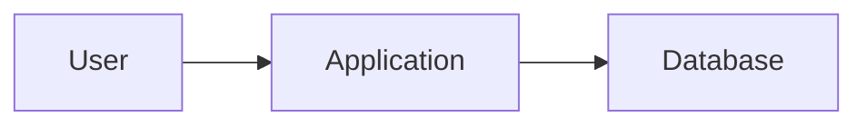
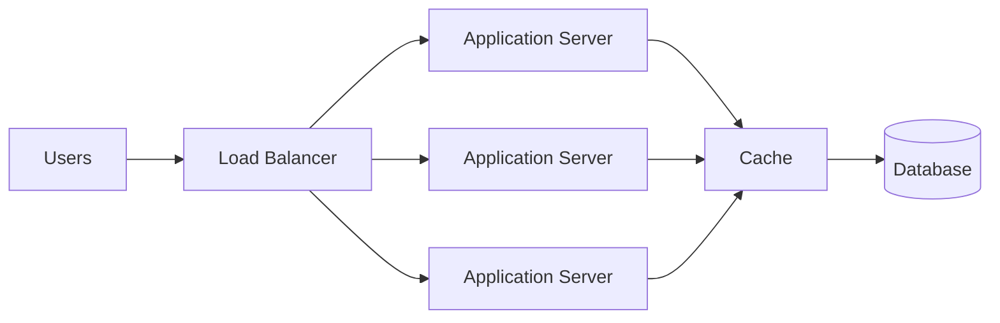
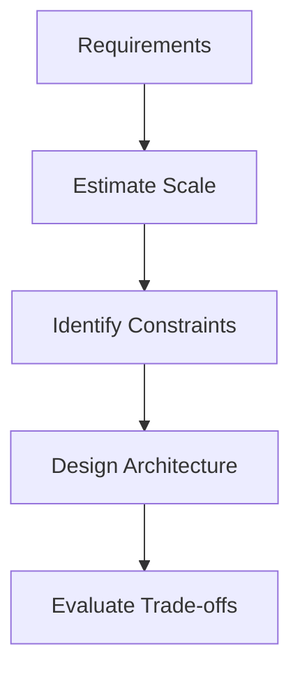
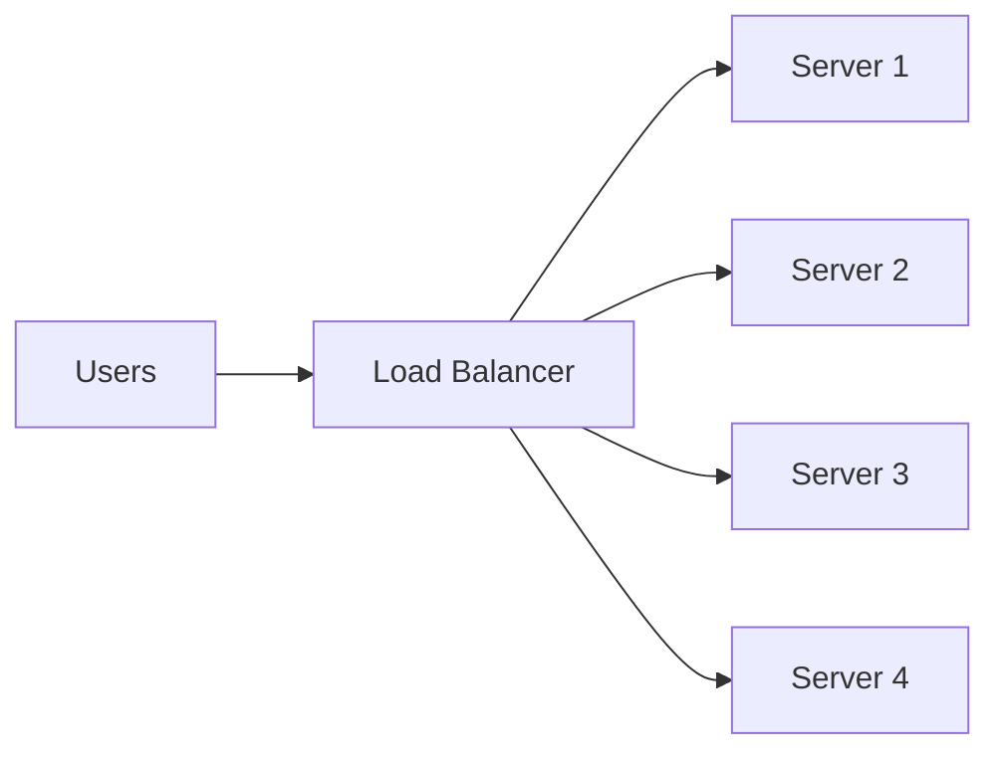
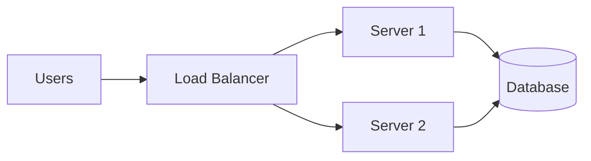
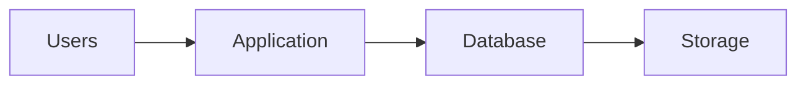
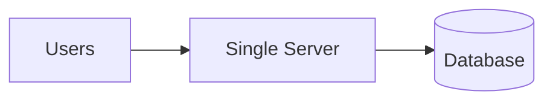
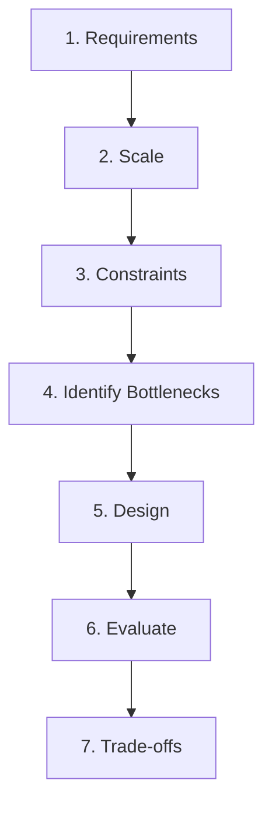
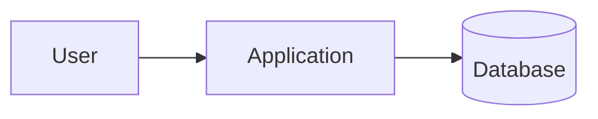
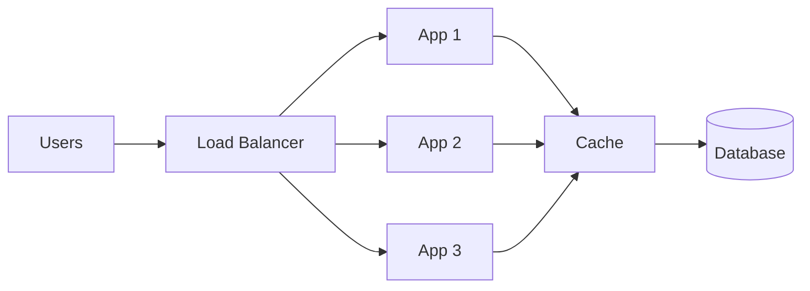

# 1. Introduction to System Design

Before learning how to design large-scale systems, we first need to understand **what System Design actually means**.

System Design is not about drawing boxes and arrows.

It is about taking a set of requirements and making engineering decisions about:

* How different components communicate
* Where data is stored
* How requests flow through the system
* How the system handles increasing traffic
* What happens when something fails
* How fast the system needs to respond
* What compromises we are willing to make

A good System Designer doesn't ask:

> **"What technology should I use?"**

They first ask:

> **"What problem am I trying to solve?"**

---

# 1.1 What is System Design?

At its simplest:

> **System Design is the process of deciding how the different parts of a software system will work together to satisfy its requirements.**

Consider a simple application:



This may be perfectly fine for a small application.

But imagine the application suddenly has:

```text
10 users
      ↓
1,000 users
      ↓
100,000 users
      ↓
10,000,000 users
```

The original architecture may no longer be sufficient.

We might eventually need:



System Design is about understanding:

> **When do we need these components, why do we need them, and what problems do they solve?**

---

## System Design is a Decision-Making Process

A system design usually involves decisions such as:

```text
Requirements
     ↓
Traffic & Scale
     ↓
Architecture
     ↓
Data Storage
     ↓
Communication
     ↓
Scaling
     ↓
Failure Handling
     ↓
Trade-offs
```

There is rarely one universally correct architecture.

The correct architecture depends on the **requirements and constraints**.

---

# 1.2 Functional vs Non-Functional Requirements

Before designing anything, we need to understand what the system is expected to do.

This is where requirements come in.

---

## Functional Requirements

Functional requirements describe:

> **What should the system do?**

For a URL shortener:

* User can submit a long URL
* System generates a short URL
* Visiting the short URL redirects to the original URL

For a food-delivery system:

* Users can browse restaurants
* Users can place orders
* Restaurants can accept orders
* Users can track order status

These describe **behavior**.

```text
Functional Requirement
        ↓
"What does the system need to do?"
```

---

## Non-Functional Requirements

Non-functional requirements describe:

> **How well should the system perform that functionality?**

Examples:

* Response time should be below 200 ms
* System should handle 100,000 requests/sec
* System should remain available during server failures
* Data should not be lost
* System should support millions of users

```text
Non-Functional Requirement
        ↓
"How well should the system do it?"
```

---

## Example

Suppose we are building a messaging application.

### Functional

```text
User A → sends message → User B
```

### Non-functional

```text
Message should arrive quickly
System should handle millions of messages
System should remain available if a server fails
Messages should not be accidentally duplicated
```

Both are necessary.

A system that provides every feature but takes 30 seconds to respond may technically work—but it may still be a terrible system.

---

# 1.3 Requirements Before Architecture

One of the biggest beginner mistakes is starting with architecture immediately.

For example:

> "Let's use Redis, Kafka, PostgreSQL, Kubernetes and microservices."

But we haven't even established what the system needs to do.

Instead:



The architecture should come **after** understanding the problem.

---

# 1.4 Scale Estimation

You cannot design a system without having some idea of its scale.

We don't always need exact numbers.

We need **reasonable estimates**.

Suppose we are designing a service with:

```text
10 million users
```

That number alone isn't enough.

We might ask:

* How many are active?
* How many requests does each user make?
* What is the peak traffic?
* How much data do we store?
* How large are the requests?
* How much data is generated per day?

---

## Requests Per Second

A common metric is **Requests Per Second (RPS)** or **Queries Per Second (QPS)**.

Suppose:

```text
1,000,000 requests/day
```

A rough average:

```text
1,000,000
───────── ≈ 11.6 requests/sec
86,400
```

But the average isn't necessarily what matters.

Traffic may look like:

```text
Requests
   │
   │             ████
   │          █████████
   │       █████████████
   │  ███████████████████
   └────────────────────────→ Time
```

The system must often be designed around **peak traffic**, not merely the daily average.

---

## Why Estimation Matters

Imagine:

```text
100 requests/sec
```

versus:

```text
1,000,000 requests/sec
```

You probably wouldn't design both systems in the same way.

Scale influences decisions around:

* Number of servers
* Database architecture
* Caching
* Storage
* Network capacity
* Asynchronous processing
* Replication
* Partitioning

We will learn detailed estimation techniques later.

For now, remember:

> **Requirements tell us what the system does. Scale tells us how big the problem is.**

---

# 1.5 Core System Design Metrics

Once we know what the system needs to do, we need ways to evaluate it.

The most important concepts are:

* Latency
* Throughput
* Scalability
* Availability
* Reliability

---

## Latency

> **How long does one operation take?**

For example:

```text
Request → Server → Response

200 ms
```

A lower latency generally means a faster response.

Latency is especially important for:

* Search
* Payments
* APIs
* Chat
* Real-time systems

We will explore the physical and networking causes of latency in the next section.

---

## Throughput

> **How much work can the system perform per unit of time?**

For example:

```text
10,000 requests/sec
```

or:

```text
50,000 messages/sec
```

Latency and throughput are different.

A system might have:

```text
Low latency
but
Low throughput
```

or:

```text
High throughput
but
High latency
```

A good design depends on what the application actually needs.

---

# 1.6 Scalability

Scalability means:

> **The ability of a system to handle increasing workload by adding resources or changing the architecture.**

Suppose one server handles:

```text
1,000 requests/sec
```

and traffic increases to:

```text
10,000 requests/sec
```

We need to handle the additional workload.

---

## Vertical Scaling

Make the machine bigger.

```text
Before:

┌─────────────┐
│  Server     │
│  4 CPU      │
│  16 GB RAM  │
└─────────────┘

After:

┌─────────────────┐
│     Server      │
│    32 CPU       │
│    128 GB RAM   │
└─────────────────┘
```

This is **vertical scaling**.

---

## Horizontal Scaling

Add more machines.



Instead of one increasingly powerful machine, we use multiple machines.

This is **horizontal scaling**.

Horizontal scaling becomes particularly important when building large distributed systems.

---

# 1.7 Availability

Availability asks:

> **Is the system accessible when users need it?**

Suppose a service promises:

```text
99.9% availability
```

That means the service is intended to be operational for approximately 99.9% of the time.

Higher availability means less acceptable downtime.

```text
99%
99.9%
99.99%
99.999%
```

Each additional "9" becomes increasingly difficult and expensive to achieve.

---

## Why Redundancy Matters

Imagine:

```text
User
 ↓
Single Server
 ↓
Database
```

If the server fails:

```text
User
 ↓
💥 Server Down
```

The entire service may become unavailable.

Instead:



If Server 1 fails:

```text
             ┌── Server 1 💥
Users → LB ──┤
             └── Server 2 ✅
```

Server 2 can continue serving traffic.

This concept is called **redundancy**.

---

# 1.8 Reliability

Availability and reliability are related but not identical.

> **Availability asks: "Is the system up?"**

> **Reliability asks: "Does the system continue to perform its intended function correctly?"**

For example, imagine a payment service.

The server responds:

```text
HTTP 200 OK
```

but the payment was charged twice.

The service was technically **available**, but it was not behaving **reliably**.

Reliability includes concerns such as:

* Correctness
* Failure handling
* Data integrity
* Consistent behavior
* Recovery from failures

---

## Availability vs Reliability

| Concept      | Question                                         |
| ------------ | ------------------------------------------------ |
| Availability | Can I access the system?                         |
| Reliability  | Does the system work correctly and consistently? |

A system can be available but unreliable.

---

# 1.9 Bottlenecks

A **bottleneck** is a component that limits the performance or capacity of the overall system.

Imagine:



Suppose the application can process:

```text
100,000 requests/sec
```

but the database can only handle:

```text
5,000 queries/sec
```

The database becomes the bottleneck.

```text
Application
100,000 RPS
      ↓
Database
  5,000 RPS
      ↓
    LIMIT
```

A major part of System Design is identifying these bottlenecks and deciding how to address them.

---

# 1.10 Single Point of Failure

A **Single Point of Failure (SPOF)** is a component whose failure can bring down the entire system.

For example:



If that server fails:

```text
Users
  ↓
💥
```

We can reduce this risk through redundancy:


But redundancy itself introduces additional complexity and cost.

This leads directly to one of the most important concepts in System Design:

> **Trade-offs.**

---

# 1.11 Trade-offs

There is almost never a perfect architecture.

Every architectural decision gives us something and takes something away.

For example:

### More caching

```text
Pros:
✓ Lower database load
✓ Lower latency

Cons:
✗ Cache invalidation complexity
✗ Stale data
✗ Additional infrastructure
```

### More replicas

```text
Pros:
✓ Better availability
✓ More read capacity

Cons:
✗ More infrastructure
✗ Replication complexity
✗ Potential consistency issues
```

### More services

```text
Pros:
✓ Independent scaling
✓ Better separation of responsibilities

Cons:
✗ More network communication
✗ More failure points
✗ More operational complexity
```

Therefore:

> **A more complicated architecture isn't automatically a better architecture.**

---

# 1.12 The Golden Rule of System Design

When approaching any system-design problem, think in this order:



Ask:

### 1. What does the system need to do?

**Functional requirements**

### 2. How big is the system?

**Scale**

### 3. What does "good" mean?

**Latency, throughput, availability, reliability**

### 4. What could become a bottleneck?

**CPU, database, network, storage, etc.**

### 5. What happens when something fails?

**Fault tolerance and redundancy**

### 6. What are we giving up?

**Trade-offs**

---

# 1.13 A Simple Example

Suppose we're designing a URL shortener.

The beginner approach might be:



Then we ask questions.

### Requirement

```text
Create short URL
Redirect short URL → original URL
```

### Scale

```text
Millions of URLs
Thousands of requests/sec
```

### Performance

```text
Redirects should be fast
```

### Availability

```text
Users should still be able to redirect
if one application server fails
```

Now our architecture might evolve:



Notice what happened.

We didn't begin by saying:

> "Let's use Redis."

We arrived at caching because:

```text
High read traffic
      ↓
Database becomes bottleneck
      ↓
Frequently accessed URLs
      ↓
Cache becomes useful
```

**This is the mindset System Design is trying to teach.**

---

# Key Takeaways

### System Design is not about memorizing architectures.

It is about making informed engineering decisions.

### Requirements come first.

```text
What does it do?
      ↓
How well?
      ↓
At what scale?
      ↓
Under what constraints?
```

### The core metrics to understand are:

* **Latency** → How long does an operation take?
* **Throughput** → How much work can we handle?
* **Scalability** → Can we handle growth?
* **Availability** → Is the system accessible?
* **Reliability** → Does it work correctly and consistently?

### Always look for:

* Bottlenecks
* Single points of failure
* Scaling limitations
* Failure scenarios
* Trade-offs

And most importantly:

> **Start with the simplest architecture that satisfies the requirements, then introduce complexity only when the problem demands it.**

---

## What Comes Next?

Now that we understand **what we are trying to optimize and why architecture exists**, we can look underneath the system and understand the physical constraints that every distributed system faces.

➡️ **Next: [2. Client-Server Fundamentals](02_Client_Server_Fundamentals.md)**

⬅️ **[Back to TOC](README.md)**
