# 2. Client–Server Model

Before we start designing APIs, load balancers, databases, caches, and distributed systems, we need to understand one of the most fundamental ideas behind modern software:

> **A client requests something. A server provides it.**

Almost every web application we use can be understood through this basic model.

When you open a website, use a mobile application, or send a request to an API, some form of **client–server communication** is happening.

---

# 2.1 What is a Client?

A **client** is a program or device that requests a service or resource from another system.

Examples:

* Web browser
* Mobile application
* Desktop application
* Another backend service
* Command-line tool

For example:

```text
Browser
Mobile App
Backend Service
     │
     │  Request
     ▼
   Server
```

The important idea is:

> **The client is usually the requester.**

For example, when you open:

```text
https://example.com/users
```

your browser acts as the client.

---

# 2.2 What is a Server?

A **server** is a program or machine that listens for requests and provides some service or resource.

Examples:

* Web server
* Application server
* Database server
* File server
* Authentication server

A server doesn't necessarily mean a huge physical machine.

A server can simply be a **program running on a computer that waits for and handles requests**.

For example:

```text
Client
  │
  │ "Give me the users"
  ▼
Server
  │
  │ Queries database
  ▼
Database
  │
  │ User data
  ▼
Server
  │
  │ Response
  ▼
Client
```

---

# 2.3 The Basic Client–Server Model

The simplest model looks like this:

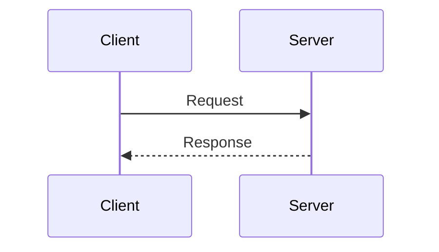

The client sends a **request**.

The server processes that request and sends back a **response**.

For example:

```text
Client:
"Give me user 42"

        ↓

Server:
"Here is user 42"
```

That's the fundamental interaction.

---

# 2.4 A Real-World Example

Suppose you open Instagram and visit a profile.

Your mobile application might send a request similar to:

```http
GET /users/42
```

The server receives it.

It might then:

```text
Receive request
      ↓
Authenticate user
      ↓
Check permissions
      ↓
Fetch user data
      ↓
Build response
      ↓
Send response
```

The client receives the result and displays the profile.

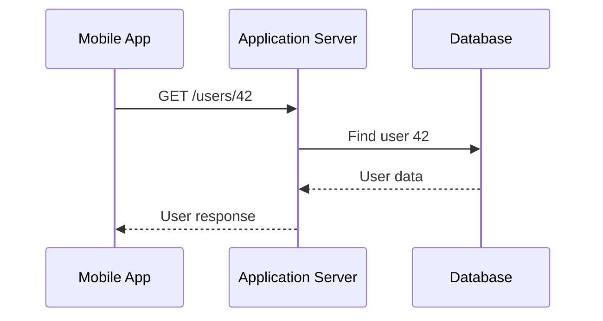

Notice something important:

> **The client usually does not directly access the database.**

The server acts as the intermediary.

---

# 2.5 Why Do We Need a Server?

A natural question is:

> Why doesn't the client simply store everything and do everything itself?

Because we often need a **central authority for shared data and operations**.

Imagine a banking application.

If your mobile phone alone controlled your account balance:

```text
Mobile App
    ↓
"My balance = ₹50,000"
```

you could simply modify the application and claim:

```text
"My balance = ₹5,000,000"
```

Instead, the authoritative data lives on the server.

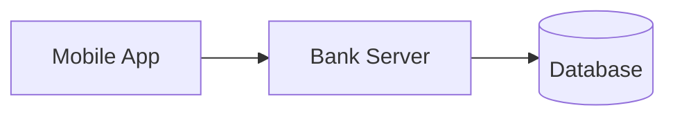

The server controls:

* Authentication
* Authorization
* Business rules
* Data
* Transactions

The client is primarily responsible for interacting with the user and communicating with the server.

---

# 2.6 Request–Response Cycle

A typical interaction looks like:

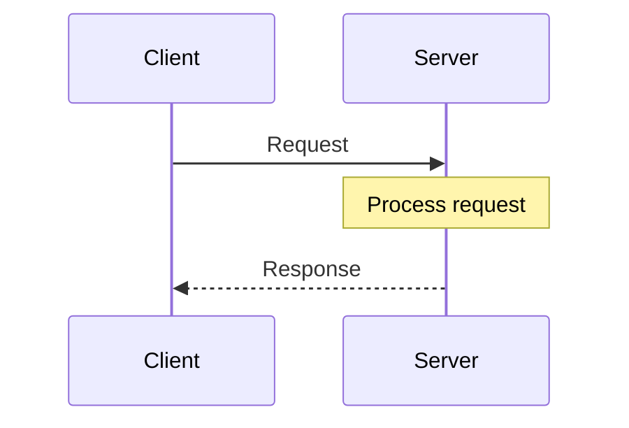

A request can contain:

* Method
* URL
* Headers
* Parameters
* Body

For example:

```http
POST /orders
Content-Type: application/json

{
  "productId": 123,
  "quantity": 2
}
```

The server processes it and may return:

```http
HTTP/1.1 201 Created
Content-Type: application/json

{
  "orderId": 987
}
```

We will study HTTP and APIs in more detail separately.

For now, remember:

> **Client and server communicate by exchanging messages.**

---

## HTTP Methods & Idempotency

When a client sends a request, it uses an **HTTP Method** (or "verb") to indicate the exact desired action.

* `GET`: Retrieve data. (e.g., fetch a user profile).
* `POST`: Create new data. (e.g., submit a new tweet).
* `PUT`: Completely replace existing data or create it if it doesn't exist.
* `PATCH`: Partially update existing data. (e.g., updating just the user's email address, leaving the rest of the profile alone).
* `DELETE`: Remove data.

### The Concept of Idempotency

This is one of the most critical concepts in distributed systems.

> **Idempotency means that making the very same request multiple times produces the exact same backend state as making it just once.**

Imagine a network glitch occurs. The client sends a request, but the connection drops before the server can reply. The client isn't sure if the server received it, so it initiates an automatic **Retry**.

Understanding idempotency dictates whether a retry is safe:

* **`GET` is Idempotent:** Fetching a user profile 10 times doesn't change or break anything on the server.
* **`PUT` is Idempotent:** Setting a user's age to `25` ten times just repeatedly sets the age at `25`.
* **`DELETE` is Idempotent:** Deleting a file 10 times simply means the file is guaranteed to be deleted.
* **`POST` is NOT Idempotent:** If you blindly retry an order payment POST request during a network timeout, the user might get charged twice for two uniquely created orders.

Understanding which API operations are safe to retry is essential for building fault-tolerant systems.

---

## HTTP Status Codes

When the server sends a response, it includes a **status code** that instantly tells the client what happened.

These codes are standardized universally across the web.

### 2xx — Success
The request was successfully received and accepted.
* `200 OK`: Standard success response.
* `201 Created`: Success, and a new resource was created (e.g., creating a new order).
* `204 No Content`: Success, but there is no data to return.

### 3xx — Redirection
The client must take additional action to complete the request.
* `301 Moved Permanently`: The URL has changed permanently.
* `302 Found / Redirect`: The resource is temporarily somewhere else.

### 4xx — Client Error
The request contains bad syntax or cannot be fulfilled. **(The client made a mistake)**.
* `400 Bad Request`: The server cannot process the request (e.g., missing parameters, invalid JSON).
* `401 Unauthorized`: Authentication is required and has failed or not been provided (e.g., missing API key).
* `403 Forbidden`: The client is authenticated, but does *not* have permission to access the resource.
* `404 Not Found`: The requested resource could not be found.
* `429 Too Many Requests`: The client has sent too many requests in a given amount of time (Rate Limiting).

### 5xx — Server Error
The server failed to fulfill an apparently valid request. **(The server crashed or failed)**.
* `500 Internal Server Error`: A generic error message (e.g., a bug in the application logic caused a crash).
* `502 Bad Gateway`: A server acting as a gateway (like a Load Balancer) received an invalid response from an upstream application server.
* `503 Service Unavailable`: The server is currently overloaded or down for maintenance.
* `504 Gateway Timeout`: The server did not get a response in time from the upstream server.

System architecture relies heavily on status codes to trigger retries, circuit breakers, and load balancer health checks.

---

# 2.7 The Server Does Not Have to Be One Machine

This is extremely important for System Design.

When we say:

```text
Client → Server
```

"Server" doesn't necessarily mean one physical computer.

It could actually look like:

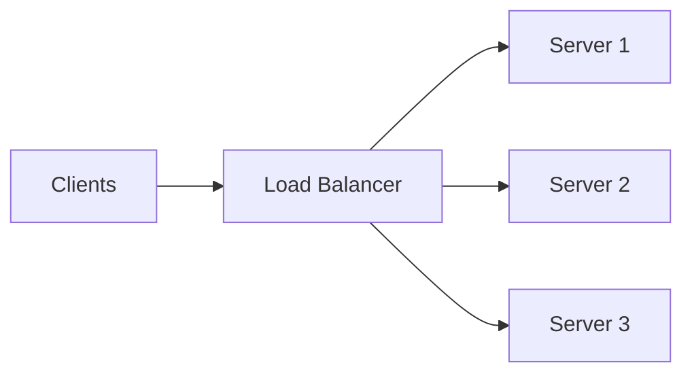

From the client's perspective, it may still look like:

```text
Client → Server
```

But internally, multiple servers are working together.

This is one of the first steps toward understanding **scaling and distributed systems**.

---

# 2.8 One Client, One Server

The simplest architecture:

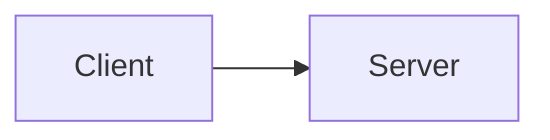

This is easy to understand.

But it has a problem.

If many users connect simultaneously:

```text
100 users
      ↓
1 server
```

the server may become overloaded.

And if the server crashes:

```text
100 users
      ↓
💥 Server
```

everyone is affected.

---

# 2.9 Multiple Clients, One Server

A more realistic scenario:

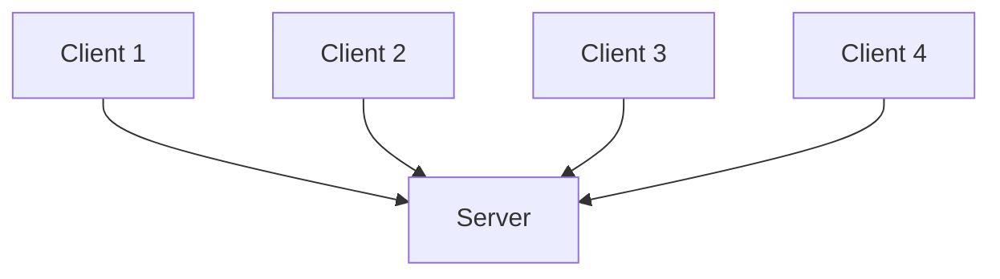

Now the server is handling requests from many clients.

The important question becomes:

> **How many requests can this server handle?**

This introduces the concept of **capacity**.

If the server can process:

```text
10,000 requests/sec
```

but users generate:

```text
50,000 requests/sec
```

we have a capacity problem.

This eventually leads us to **horizontal scaling**.

---

# 2.10 Horizontal Scaling

Instead of making one server handle everything, we can add more servers.

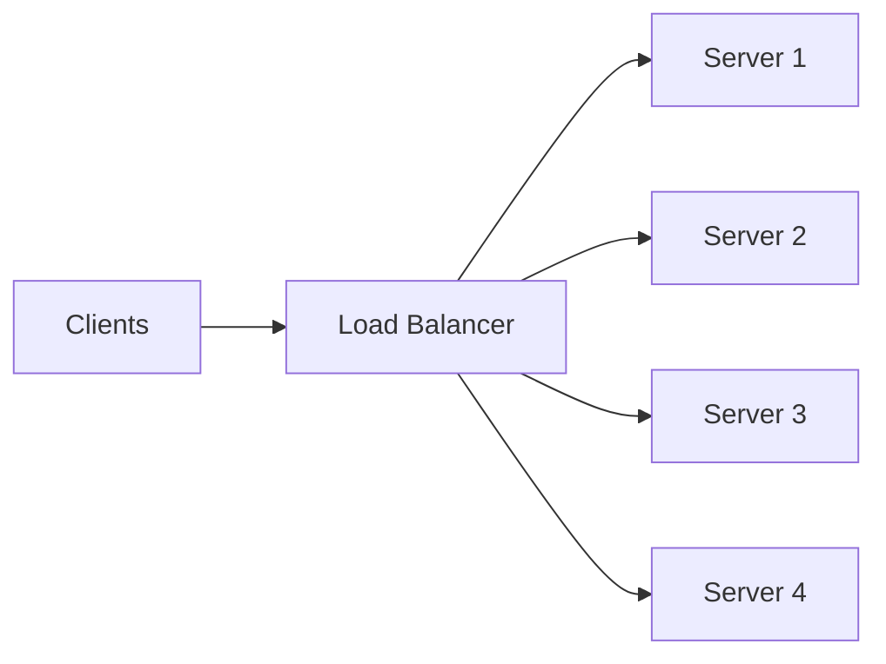

Now traffic can be distributed across multiple servers.

For example:

```text
40,000 requests/sec
        ↓
   Load Balancer
    ↙  ↓  ↓  ↘
10k  10k 10k 10k
```

This gives us more capacity.

We will study load balancing and scaling separately.

---

# 2.11 Stateless vs Stateful Servers

This is an important concept when scaling client–server systems.

## Stateless Server

A stateless server does not rely on information stored in its own memory from a previous request.

For example:

```text
Request 1 → Server 1
Request 2 → Server 2
Request 3 → Server 3
```

Each server can independently process the request.

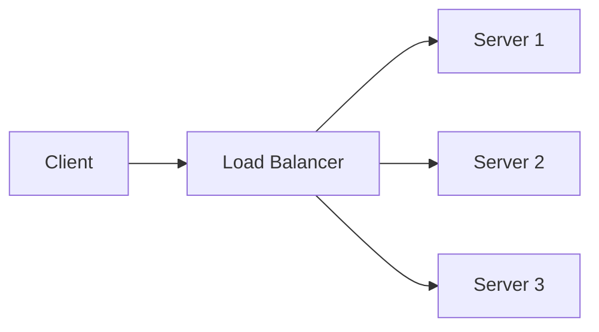

This makes horizontal scaling easier.

---

## Stateful Server

A stateful server keeps important session information locally.

For example:

```text
Client
  ↓
Server 1

Server 1 remembers:
"Client has an active session"
```

If the next request goes to Server 2:

```text
Client
  ↓
Server 2

Server 2:
"I don't know this session."
```

This can make scaling more complicated.

State can instead be moved to a shared system:

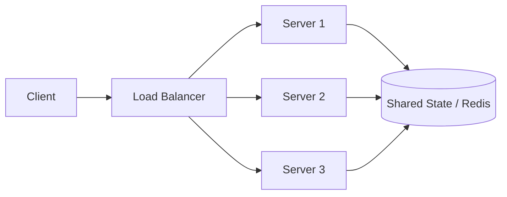

Now any application server can access the required state.

This is one reason distributed systems often try to keep application servers **stateless**.

---

# 2.12 Client–Server Does Not Mean Only Browser → Backend

The model is much broader.

### Browser → Web Server

```text
Browser → Web Server
```

### Mobile App → API Server

```text
Mobile App → API
```

### Backend → Database

```text
Application Server → Database Server
```

### Service → Service

```text
Service A → Service B
```

In fact, a server can itself act as a client.

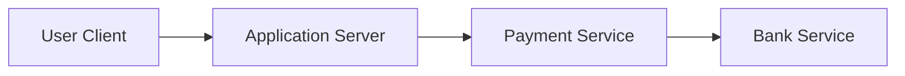

Here:

* The user's application is a client to our server.
* Our application server becomes a client to the payment service.
* The payment service becomes a client to the bank.

So **client and server describe a role in a particular communication**, not necessarily a permanent identity.

---

# 2.13 Client–Server vs Peer-to-Peer

Not every network follows the traditional client–server model.

In a **Peer-to-Peer (P2P)** architecture, machines can communicate more directly with each other.

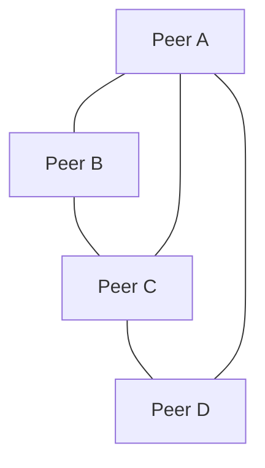

Each peer can potentially act as both:

```text
Client
   ↕
Server
```

depending on the interaction.

Examples include certain file-sharing and decentralized systems.

For most web applications, however, the client–server model is the fundamental starting point.

---

# 2.14 The Three-Tier Architecture

A common evolution of the basic client–server model is:

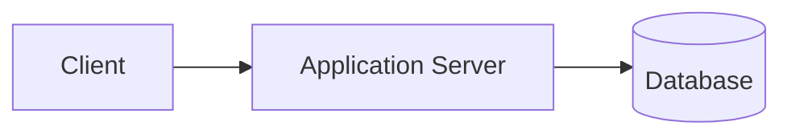

These layers have different responsibilities.

### Client

Responsible primarily for:

* User interface
* User interaction
* Sending requests
* Displaying responses

### Application Server

Responsible primarily for:

* Business logic
* Authentication
* Validation
* Processing requests
* Communicating with other services

### Database

Responsible primarily for:

* Persistent data
* Querying
* Updating data
* Transactions

This separation allows each layer to evolve independently.

---

# 2.15 Why Separation Matters

Imagine putting everything into one program:

```text
┌─────────────────────────┐
│ UI                      │
│ Business Logic          │
│ Authentication          │
│ Database                │
│ File Storage            │
└─────────────────────────┘
```

As the system grows, this becomes difficult to maintain and scale.

Instead:

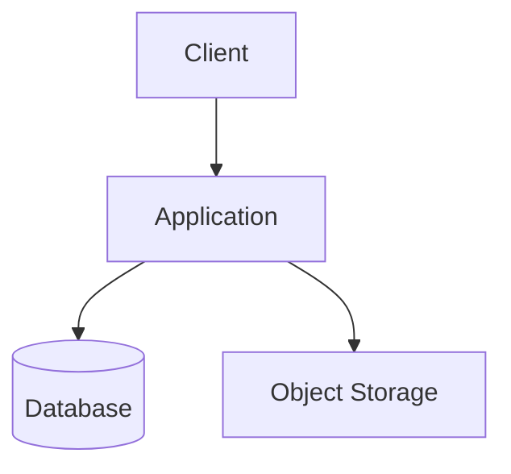

Now different components can have different scaling requirements.

For example:

```text
Application → needs more CPU
Database    → needs more storage / IOPS
Object      → needs large storage capacity
```

This separation becomes increasingly important as systems grow.

---

# 2.16 A Critical Mental Model: The Network Is Between Them

One beginner mistake is imagining:

```text
Client ───────── Server
```

as if they are directly connected.

In reality:

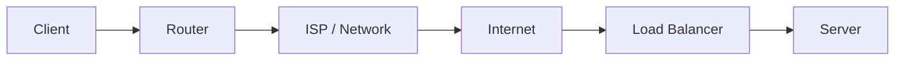

There is a network between the client and server.

That means communication can experience:

* Latency
* Packet loss
* Timeouts
* Connection failures
* Congestion

This is why the **Network & Latency** section is so important.

---

# 2.17 Client–Server and System Design

The basic model:

```text
Client
   ↓
Server
```

is the starting point.

System Design asks:

> **What happens when this simple model becomes large?**

For example:

### More users

```text
Client
  ↓
Server
```

becomes:

```text
Clients
   ↓
Load Balancer
   ↓
Multiple Servers
```

### More database traffic

```text
Servers
   ↓
Database
```

may become:

```text
Servers
   ↓
Cache
   ↓
Database
```

### More database reads

```text
Application
    ↓
Primary Database
    ↓
Read Replicas
```

### Long-running work

```text
Application
    ↓
Queue
    ↓
Worker
```

The architecture evolves because **the problem evolves**.

That is the essence of System Design.

---

# 2.18 The Big Picture

A modern application may eventually look like:

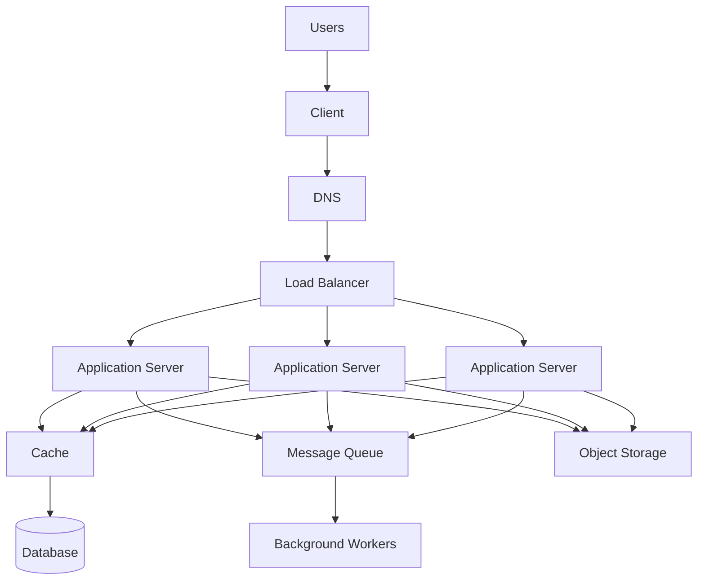

This may look complicated.

But remember where we started:

```text
Client
   ↓
Server
```

Everything else was introduced because the system encountered a **specific problem**.

That's the most important mental model to carry forward.

---

# Key Takeaways

### 1. Client

A program that requests a service or resource.

### 2. Server

A program that provides a service or resource.

### 3. Communication

The basic interaction is:

```text
Request
   ↓
Client ─────────→ Server
Client ←───────── Server
   ↑
Response
```

### 4. A server doesn't have to be one machine

A logical server can be backed by many physical/virtual servers.

### 5. Client and server are roles

A server can itself act as a client when communicating with another system.

```text
Client → Server A → Server B
```

### 6. Statelessness makes scaling easier

If application servers don't depend on local state, requests can be distributed across multiple servers more easily.

### 7. Networks introduce cost and failure

The client and server are separated by a network, which introduces:

* Latency
* Failure
* Timeouts
* Bandwidth constraints

### 8. Architecture evolves from problems

Start simple:

```text
Client → Server → Database
```

Then add complexity **only when requirements demand it**.

---

# The Mental Model

Whenever you see a system, first ask:

```text
Who is requesting something?
        ↓
Who is providing it?
        ↓
What data is being exchanged?
        ↓
How are they communicating?
        ↓
Where is the state?
        ↓
What happens when there are
100× more clients?
        ↓
What happens when the server fails?
```

If you can answer these questions, you already have the foundation for understanding much more complex architectures.

> **Almost every distributed system is, at its core, a collection of components communicating with each other.**

Client–Server is where that mental model begins.

---

⬅️ **[Previous: 1. What is System Design?](01_What_Is_System_Design.md)** | 🏠 **[Back to TOC](README.md)** | **[Next: 3. Network & Latency ➡️](03_Network_And_Latency.md)**
