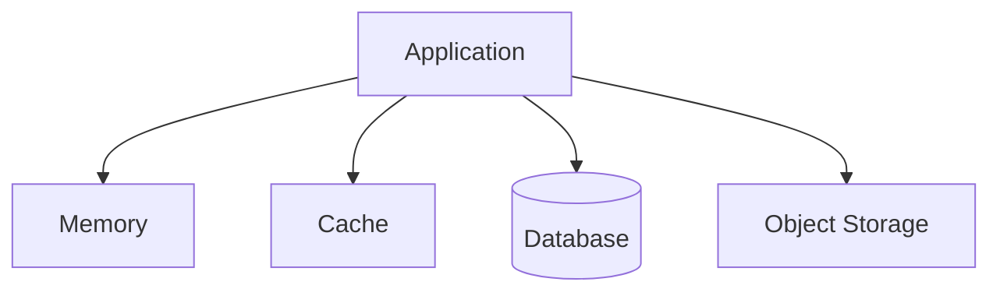
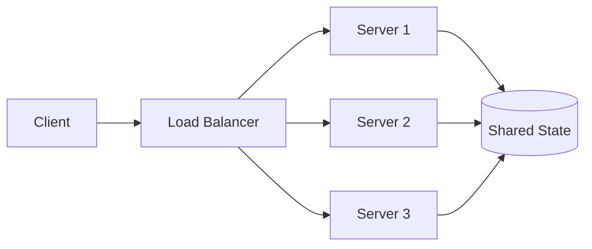
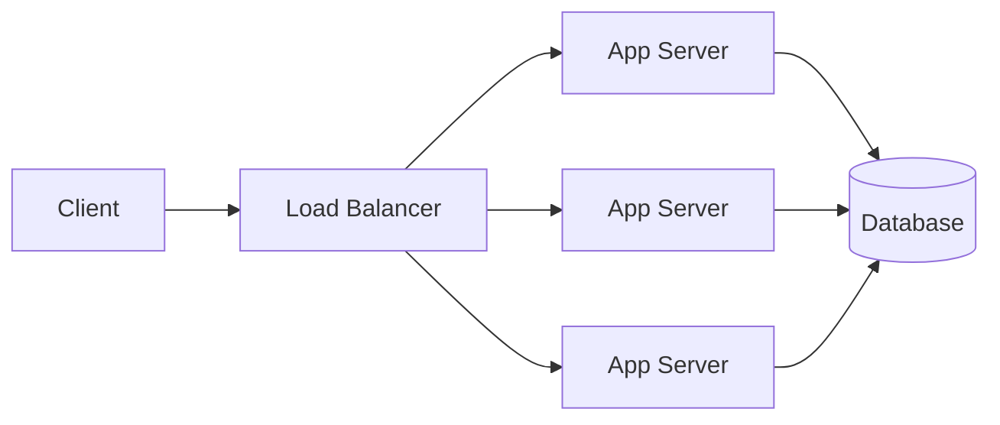
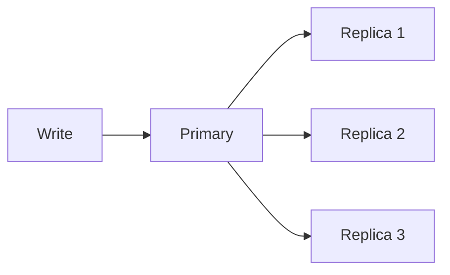
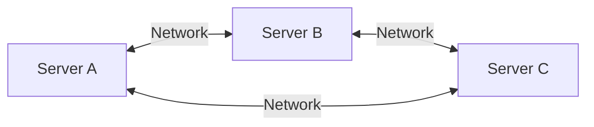
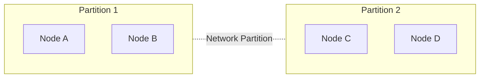
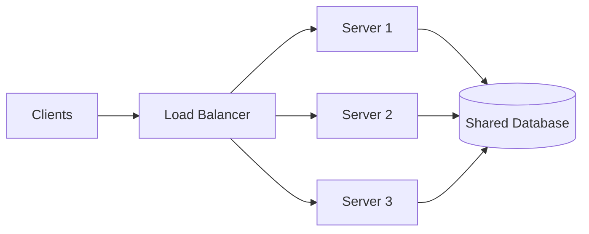
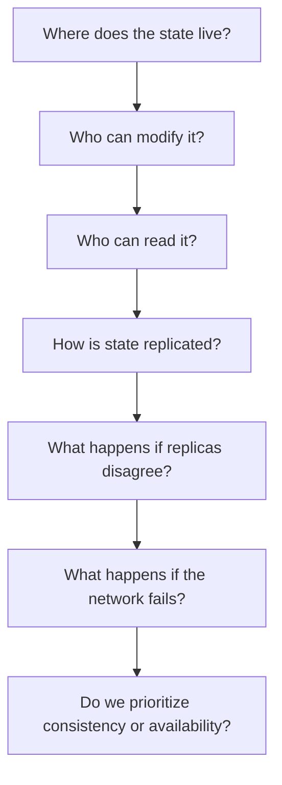

# 4. State & CAP Theorem

One of the most important questions in System Design is:

> **Where does the state of our system live?**

A system becomes significantly more complicated when multiple machines need to share and update the same information.

This chapter builds the foundation for understanding:

- State
- Stateless vs Stateful systems
- Distributed state
- Consistency
- Availability
- Network partitions
- CAP Theorem
- Why distributed systems have unavoidable trade-offs

---

# 4.1 What is State?

**State** is information that a system needs to remember.

For example, consider a shopping cart:

```text
User: Alice

Cart:
- Laptop × 1
- Mouse × 2
```

The cart contents are **state**.

Similarly:

```text
Logged-in user
Current account balance
Order status
Unread notifications
Shopping cart
Uploaded files
```

are all examples of state.

A simple way to think about it:

> **State is the information that represents what the system currently knows or remembers.**

---

# 4.2 Where Can State Live?

State can exist in many places.

For example:



But these have very different characteristics.

### Application Memory

```text
Server
└── RAM
    └── User session
```

Fast, but generally temporary and local to that server.

### Cache

```text
Application
     ↓
   Redis
```

Fast shared state, but usually treated as recoverable rather than the ultimate source of truth.

### Database

```text
Application
     ↓
 Database
```

Usually used for durable application state.

### Object Storage

```text
Application
     ↓
Object Storage
     ↓
Images / Videos / Files
```

Used for large objects rather than typical transactional application state.

---

# 4.3 Stateful vs Stateless

This distinction becomes extremely important when scaling.

## Stateful Application

A stateful application keeps important information in its own local memory.

For example:

```text
User → Server 1

Server 1 remembers:
"User is logged in"
```

Now the next request goes somewhere else:

```text
User → Server 2

Server 2:
"I don't know this user."
```

We have a problem.

---

# 4.4 Stateless Application

A stateless application does not depend on locally stored information from previous requests.

For example:



Any server can handle the next request because the required state exists outside the individual application server.

This makes horizontal scaling much easier.

---

# 4.5 Why Statelessness Helps Scaling

Suppose we have one server:

```text id="xv4y87"
Users
  ↓
Server
```

As traffic increases:

```text id="j2xk7b"
Users
  ↓
Load Balancer
  ↓
┌────────┬────────┬────────┐
│ Server │ Server │ Server │
│   1    │   2    │   3    │
└────────┴────────┴────────┘
```

If the servers are stateless, requests can be distributed freely.

```text id="f2u0x4"
Request 1 → Server 1
Request 2 → Server 3
Request 3 → Server 2
Request 4 → Server 1
```

The client doesn't need to care which server receives the request.

This is one reason modern backend architectures generally try to keep **application servers stateless**.

---

# 4.6 Where Does the State Go?

If application servers don't keep important state locally, the state needs to live somewhere else.

A common architecture is:



The application servers become relatively stateless.

The database becomes the shared source of state.

This solves one problem but introduces another:

> **Now multiple servers can access and modify the same state.**

And that is where **consistency** becomes important.

---

# 4.7 What is Consistency?

Consistency is about whether different parts of a distributed system see the same data.

Consider a bank account:

```text
Balance = ₹10,000
```

Suppose the user withdraws:

```text
₹2,000
```

The correct new balance is:

```text
₹8,000
```

But imagine two servers temporarily see different values:

```text
Server 1 → ₹8,000
Server 2 → ₹10,000
```

Now the system has a consistency problem.

---

# 4.8 Strong Consistency

With strong consistency, after a successful write, subsequent reads are expected to see the latest value according to the system's consistency guarantees.

Conceptually:

```text
Write:
Balance = ₹8,000
       ↓
Successful
       ↓
Read
       ↓
₹8,000
```

This is useful when stale data would be dangerous.

Examples may include:

- Financial balances
- Inventory counts
- Critical transactional data

Strong consistency often requires additional coordination, which can affect latency and availability.

---

# 4.9 Eventual Consistency

With eventual consistency, different replicas may temporarily have different values, but they are expected to converge if updates stop.

Imagine:



Immediately after a write:

```text
Primary  → ₹8,000
Replica1 → ₹8,000
Replica2 → ₹10,000
Replica3 → ₹10,000
```

After replication catches up:

```text
Primary  → ₹8,000
Replica1 → ₹8,000
Replica2 → ₹8,000
Replica3 → ₹8,000
```

The replicas eventually converge.

---

# 4.10 Why Would We Accept Stale Data?

Because sometimes **availability and performance are more important than immediately seeing the newest value**.

For example, consider a social-media like counter:

```text
Post:
1,245 likes
```

If one user temporarily sees:

```text
1,244 likes
```

that may be acceptable.

But for:

```text
Bank account:
₹10,000
```

temporarily showing an incorrect balance is much more serious.

Therefore:

> **Consistency requirements depend on the problem.**

There is no universal answer that "strong consistency is always better."

---

# 4.11 Distributed Systems

Now let's introduce the environment where CAP becomes relevant.

A **distributed system** is a system whose components run on multiple machines and communicate over a network.

For example:



Why do we use multiple machines?

- More capacity
- Higher availability
- Geographic distribution
- Fault isolation
- Independent scaling

But now we have a fundamental problem:

> **The network between machines can fail.**

---

# 4.12 Network Partition

Imagine two servers:

```text id="9j4vdr"
Server A ←──── Network ────→ Server B
```

Everything works.

Now the network connection breaks:

```text id="qub42j"
Server A ←──── ❌ ────→ Server B
```

Both servers are still running.

The machines haven't necessarily crashed.

They simply **cannot communicate with each other**.

This is a **network partition**.

---

# 4.13 Why Is a Network Partition So Important?

Imagine both servers contain a copy of:

```text
Balance = ₹10,000
```

A user connected to Server A withdraws ₹2,000.

Server A now has:

```text
₹8,000
```

But Server B cannot communicate with Server A.

A second user connected to Server B asks:

> "What's the balance?"

Server B still believes:

```text
₹10,000
```

Now the system has to make a decision.

Should Server B:

### Option A — Return the old value

```text
₹10,000
```

The system remains available, but the data may be stale.

### Option B — Refuse the request

```text
"Unable to determine current balance."
```

The system sacrifices availability to preserve consistency.

This is the core problem behind CAP.

---

# 4.14 CAP Theorem

CAP is commonly expressed as:

> In the presence of a network partition, a distributed system cannot simultaneously guarantee both strong consistency and availability.

CAP stands for:

- **C — Consistency**
- **A — Availability**
- **P — Partition Tolerance**

But there is an important nuance:

> **The practical CAP trade-off appears when a network partition occurs.**

---

# 4.15 C — Consistency

In CAP discussions, consistency means:

> Every successful read receives the most recent write or an error.

Imagine:

```text
Write:
x = 10
```

After that succeeds:

```text
Read → 10
```

rather than returning an older value.

---

# 4.16 A — Availability

Availability means:

> Every request to a non-failed node receives a response.

The response doesn't necessarily have to contain the newest data under CAP's definition.

For example:

```text
Client → Server B

Server B:
"Here's what I currently know."
```

The system continues responding.

---

# 4.17 P — Partition Tolerance

Partition tolerance means:

> The system continues operating despite network communication failures between parts of the system.

For example:



The network has been split into two groups.

A distributed system must have a strategy for this situation.

---

# 4.18 The CAP Trade-off

During a partition:

```text id="x2o4fp"
             Network Partition
                    ↓
             ┌──────┴──────┐
             ↓             ↓
       Consistency      Availability
             ↑             ↑
          Choose what to prioritize
```

### CP System

Prioritize:

```text
Consistency + Partition Tolerance
```

The system may reject or delay some requests during a partition rather than return potentially inconsistent data.

Conceptually:

```text
Partition occurs
      ↓
Can't guarantee latest data
      ↓
Reject / wait
```

### AP System

Prioritize:

```text
Availability + Partition Tolerance
```

The system continues responding even if some responses may temporarily contain stale data.

```text
Partition occurs
      ↓
Continue serving requests
      ↓
Data eventually converges
```

---

# 4.19 What About CA?

You may see:

```text
CA = Consistency + Availability
```

The important catch is that a genuinely distributed system cannot simply assume partitions won't happen.

If there is no partition:

```text
C + A
```

can appear achievable.

But once the network can partition:

```text
P
```

becomes a reality.

Therefore, for distributed systems, the practical question becomes:

```text
During a partition:

Consistency?
       OR
Availability?
```

---

# 4.20 CAP Is Not "Pick Two"

A common oversimplification is:

> "CAP says you can only pick two of the three."

That explanation is useful as a first introduction, but technically incomplete.

The deeper idea is:

> **When a partition happens, you cannot simultaneously provide both the specified strong consistency and availability guarantees.**

Partition tolerance is not simply an optional feature in a real distributed network.

Networks fail.

Therefore the important design decision is usually:

```text
If communication breaks,
what should our system sacrifice?
```

---

# 4.21 Real-World Example

Consider an e-commerce system.

Suppose there is:

```text
1 item left in stock
```

Two users attempt to purchase it simultaneously.

If the system allows both requests to succeed because different nodes temporarily believe:

```text
Stock = 1
```

we can oversell the item.

For inventory, stronger consistency may be important.

Now consider a product recommendation count:

```text
"1,234 people viewed this product"
```

If different users temporarily see:

```text
1,233
1,234
1,235
```

that may be completely acceptable.

The correct architecture depends on **business requirements**.

---

# 4.22 Consistency Is Not Binary

Real distributed systems often provide more nuanced consistency models than simply:

```text
Strong
vs
Eventual
```

There are models such as:

- Read-after-write consistency
- Monotonic reads
- Causal consistency
- Session consistency

We don't need to memorize these yet.

The important principle is:

> **Consistency is a spectrum of guarantees, and the system should provide the level the application actually needs.**

---

# 4.23 State and System Design

Now connect everything together.

Start with:

```text id="m7x1e2"
Client
  ↓
Server
```

Then we scale:

```text id="5s7qz9"
Clients
   ↓
Load Balancer
   ↓
Server 1
Server 2
Server 3
```

Now the servers need shared state:



Now we have:

```text
Multiple servers
       ↓
Shared state
       ↓
Replication
       ↓
Network communication
       ↓
Potential network partitions
       ↓
Consistency decisions
```

And this is where distributed-system design begins to become fundamentally different from designing a simple single-server application.

---

# 4.24 The Mental Model

When designing a distributed system, ask:



This is much more useful than simply memorizing:

```text
CAP = C + A + P
```

---

# Key Takeaways

### State

> Information the system needs to remember.

### Statelessness

> Application servers avoid depending on locally stored state, making horizontal scaling easier.

### Shared State

> State can be moved into systems such as databases or caches so multiple servers can access it.

### Consistency

> Defines what different parts of a distributed system are allowed to observe.

### Strong Consistency

```text
Write succeeds
     ↓
Latest value is immediately visible
```

### Eventual Consistency

```text
Write
 ↓
Replicas may temporarily differ
 ↓
Replicas converge
```

### Network Partition

```text
Node A ←── ❌ ──→ Node B
```

The nodes cannot communicate.

### CAP

During a network partition, a distributed system cannot simultaneously guarantee both:

```text
Strong Consistency
        +
Availability
```

Therefore, system design requires deciding:

> **What behavior is acceptable when the system is partially disconnected?**

---

# The Most Important Lesson

Don't think of CAP as an interview formula.

Think about the actual failure:

```text
              Network fails
                   ↓
        ┌──────────┴──────────┐
        ↓                     ↓
     Node A                 Node B
   knows X=10             knows X=5
        │                     │
        └──── Can't communicate ────┘
```

Now ask:

> **If a user asks both nodes for X, what should the system do?**

If you return the value from both:

```text
Availability ✓
Consistency ✗
```

If you refuse to answer until the nodes can agree:

```text
Consistency ✓
Availability ✗
```

That decision—**and the business requirement behind it**—is the heart of CAP.

---

⬅️ **[Previous: 3. Network & Latency](03_Network_And_Latency.md)** | 🏠 **[Back to TOC](README.md)**
