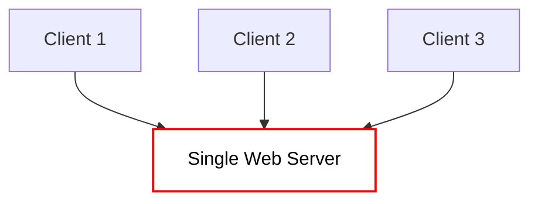
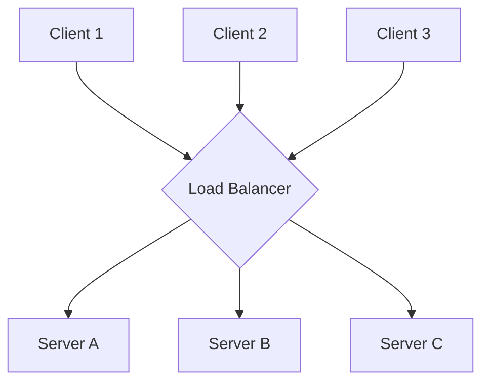

# 1. Load Balancing Fundamentals

## What is Load Balancing?

Imagine a popular coffee shop with only one barista. If 100 people walk in at the same time, the line goes entirely out the door, people get angry, and some simply leave. If you hire three more baristas and put a manager at the front door to point each new customer to the shortest line, the shop can seamlessly handle the massive crowd. 

In distributed systems, **Load Balancing** is exactly that manager. It is the process of randomly or logically distributing incoming network traffic efficiently across a group of backend servers (often mathematically referred to as a server farm or server pool). 

A Load Balancer sits safely in front of your servers and acts as the "traffic cop," routing client requests across all servers capable of successfully fulfilling those requests in a manner that maximizes speed and global capacity utilization.

## Why Load Balancing?

Without a load balancer, your application architecture is extremely fragile. You are organically forcing every single user on the internet to talk to one exact machine.

1. **High Availability:** If your single server's hard drive randomly fails, your entire business is offline. Load balancers prevent this by instantly redirecting traffic strictly to healthy servers if one violently crashes.
2. **Scalability:** You cannot infinitely upgrade the RAM and CPU of a single machine. Load balancing mathematically allows you to add an infinite number of cheap horizontal machines to handle immense, unpredictable traffic spikes.
3. **Performance:** By cleanly distributing the work, no single server becomes a chokepoint. Client response times remain blistering fast because servers aren't suffocating under massive CPU queues.

## Single Server vs Multiple Servers

### The Single Server (No Load Balancer)

In this model, if the `Single Web Server` crashes or simply reboots, every single active user instantly gets a `502 Bad Gateway` or `Connection Refused`. The system possesses a highly dangerous **Single Point of Failure (SPOF)**.

### Multiple Servers (With Load Balancer)

Here, the Load Balancer flawlessly absorbs the incoming connections globally. If `Server A` violently crashes, the LB instantly detects the failure (via Health Checks), stops sending traffic to it entirely, and gracefully routes `Client 1, 2, and 3` perfectly between `Server B` and `Server C`. No user notices the crash.

## Vertical vs Horizontal Scaling

Whenever a system rapidly runs out of organic resources (CPU, Memory, Network Bandwidth), engineers must scale.

**Vertical Scaling (Scaling Up):** 
Buying a bigger, vastly more expensive machine. You shut down your cheap 16GB RAM backend server and replace it entirely with a massive 256GB RAM server. 
- *Pros:* Extremely easy. Absolutely zero code changes required.
- *Cons:* Hard physical limits (you mathematically cannot buy a 1,000,000 GB RAM machine), very expensive, and it requires hard downtime to upgrade. You still heavily retain a Single Point of Failure.

**Horizontal Scaling (Scaling Out):**
Keeping your incredibly cheap 16GB RAM server, but organically buying 9 more exactly like it. 
- *Pros:* Practically infinite scalability. Absolutely no downtime context. Extreme Fault Tolerance.
- *Cons:* High architectural software complexity. **You are literally forced to introduce a Load Balancer** to make these 10 distinct physical machines look like 1 unified logical machine to the public internet.

## Load Balancer as a Traffic Distribution Layer

A Load Balancer operates strictly and entirely as a **middleman overlay**. 

To the public internet across the globe, the Load Balancer *is* the application. The end-user client types `www.example.com` into their browser, and the DNS resolves strictly to the IP address of the Load Balancer (not the Web Server). 

The client securely establishes a TCP and TLS connection directly with the Load Balancer itself. The Load Balancer then turns around, opens a *second* distinct TCP connection to an internal backend server, cleanly forwards the HTTP request, waits for the inner HTTP response, and rapidly pipes it back to the client. The client is blissfully unaware that `Server B` actually executed the logic.

## Load Balancer vs Reverse Proxy

People often use these networking terms interchangeably, but they serve deeply different architectural goals.

| Feature | Load Balancer | Reverse Proxy |
| :--- | :--- | :--- |
| **Primary Goal** | Flawlessly distribute massive traffic across **many** servers. | Sit securely in front of one or more servers to aggressively provide layered security, caching, or abstraction. |
| **Use Case** | Scaling traffic globally. | SSL Termination, Hiding internal IPs, Serving static assets natively (Images). |
| **Overlap** | Modern LBs (like HAProxy, NGINX, AWS ALB) natively act as both simultaneously. | Modern Reverse Proxies organically have basic round-robin load-balancing features heavily built-in. |

## Load Balancer vs API Gateway

An API Gateway is a vastly more structurally complex, heavily application-aware entity.

*   **Load Balancer:** "I literally received a TCP packet on port 443. I will blindly forward it to Server B simply because Server B has the lowest CPU usage."
*   **API Gateway:** "I formally received an HTTP GET request specifically for `/api/v1/users`. Let me aggressively check if the JWT token securely in the header is visibly valid. It is. Let me check if this user has aggressively exceeded their strict Rate Limit. They haven't. Now, I will smartly route them to the User Microservice cluster."

API Gateways handle **Cross-Cutting Concerns** (Auth, Billing, Rate Limiting, API Versioning). Load Balancers focus purely on **Moving Network Bits efficiently, safely, and rapidly.**

## Load Balancer vs Service Discovery

In modern Microservices architectures (like Kubernetes clusters), distinct server IP addresses change constantly as containers aggressively scale up and down dynamically.

*   **Service Discovery:** A heavily dynamic internal phonebook. It keeps native track of exactly which IPs are currently alive and actively serving the `Checkout Service` right at this second.
*   **Load Balancer:** The mechanical operator. It looks into the Service Discovery phonebook, mathematically picks exactly one of the listed IPs using a defined algorithm (like Round Robin), and logically routes the traffic there.

Often (especially tightly in Kubernetes), they are heavily bundled together natively so the Load Balancer dynamically adjusts its underlying routing tables in real-time as Service Discovery seamlessly registers and deregisters container instances.

---

---

