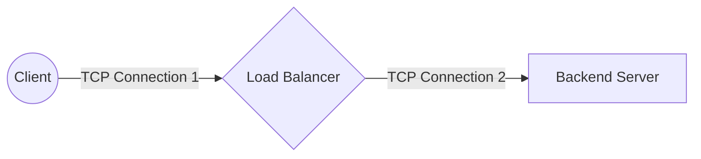
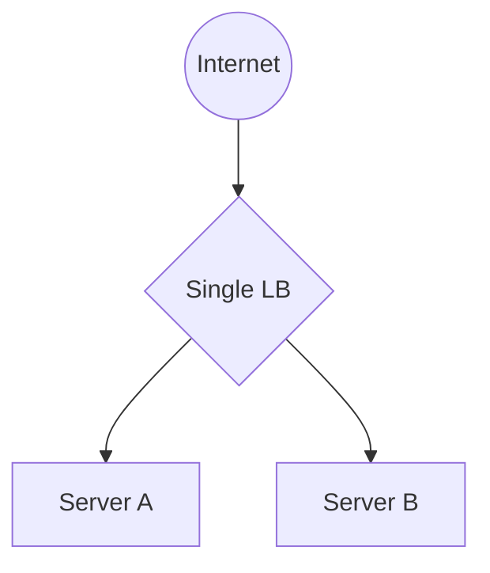
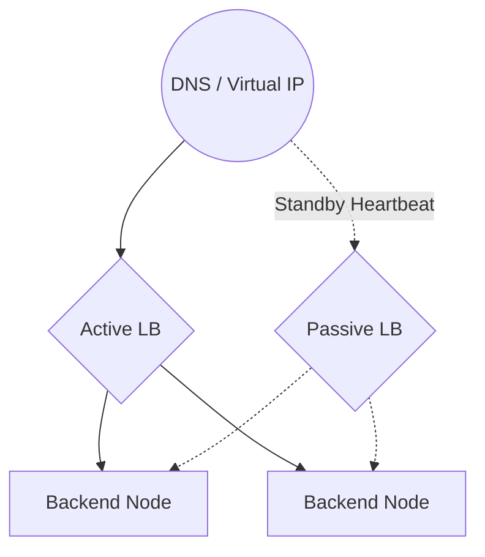
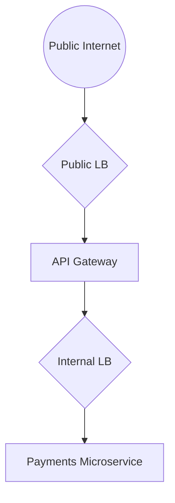
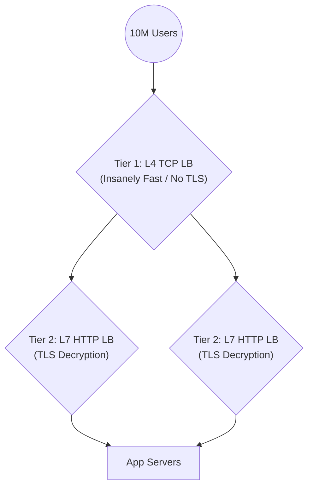

# 2. Load Balancer Architecture

## Client → Load Balancer → Servers

At its most fundamental operational level, a Load Balancer completely severs the direct physical connection between the end-user and the actual web server executing the logic. 

The Load Balancer essentially acts as a highly disciplined security and routing proxy:
1. The **Client** establishes a secure connection explicitly with the Load Balancer (often terminating TLS/SSL securely right at this outer edge).
2. The **Load Balancer** strictly inspects the traffic (if L7) or the raw packet headers (if L4) and mathematically decides which backend server should perfectly receive the work.
3. The **Load Balancer** opens an entirely new, deeply internal TCP connection to the specifically chosen **Backend Server**.
4. The HTTP response flows physically backward through the exact same mechanical chain.

## Single LB Architecture

The most common entry-level architecture for fresh startups is the **Single Load Balancer** sitting proudly in front of an Auto-Scaling Group (ASG) of web servers.

### The Problem: Single Point of Failure (SPOF)
While this heavily protects your business if `Server A` violently crashes, **what happens if the Load Balancer itself runs out of memory and crashes?** 
If the Single LB actively fails, your entire massive backend fleet immediately goes completely dark because no traffic can legally enter your Virtual Private Cloud (VPC). The Load Balancer has ironically become the catastrophic Single Point of Failure for the entire organization.

## Multiple LB Architecture

To decisively solve the Single LB failure trap, enterprise architectures strictly deploy **Multiple Load Balancers** running concurrently, almost always organically grouped in High Availability (HA) Pairs.

This is typically coordinated seamlessly at the DNS layer or via physical networking protocols utilizing a **Floating IP (Virtual IP)**.

If the primary Active Load Balancer unexpectedly burns down, the underlying network violently shifts the globally facing Virtual IP directly to the Passive Load Balancer within exact milliseconds. The user remarkably experiences absolutely zero downtime.

## Public vs Internal Load Balancer

As software architecture mathematically matures, you rarely just deploy one solitary layer of load balancers. You heavily isolate them by robust trust zones.

*   **Public (External) Load Balancers:** These explicitly face the brutal open internet. They violently possess highly public IP addresses. Their exact job is to aggressively absorb raw consumer traffic, seamlessly terminate complex HTTPS encryption, aggressively block DDoS attacks, and securely route clean requests deep inside the private boundary.
*   **Internal (Private) Load Balancers:** These actively face strictly inward. They possess purely private isolating IP addresses (e.g., `10.0.x.x`). They are fiercely used specifically to route traffic *between* internal microservices tightly within your locked VPC without ever exposing that internal communication to the public internet.

## Regional vs Global Load Balancer

Where is your raw traffic coming from, and where does it mathematically need to go physically?

### Regional Load Balancer
This load balancer physically lives heavily bolted inside one specific geographic data center (e.g., AWS `us-east-1` in Virginia). If a user connects perfectly from Tokyo, their HTTP packet must rapidly cross the entire physical Pacific Ocean via underwater fiberglass cables, heavily hit the Virginia Load Balancer, and formally return. This structurally causes immense geographic physical latency.

### Global Load Balancer (GSLB)
A Global Load Balancer is technically not really a single server; it is a distributed intelligent routing fabric (often deeply tied mathematically to Anycast IP structures or intelligent DNS). 
When the user in Tokyo types `www.example.com`, the **Global Load Balancer** magically detects their exact geographic location instantly and seamlessly routes their initial connection directly to the closest physically active **Regional** Load Balancer securely sitting inside a Tokyo data center.

## Multi-Tiered Load Balancing (L4 to L7)

*(Added Note: This is an incredibly crucial architectural staple heavily used inside massive hyperscale tech giants that beginners natively overlook).*

When aggressively operating at extreme heavy hyperscale (like Twitter, Cloudflare, or Netflix), a single Load Balancer hardware tier mathematically cannot strictly process the sheer mathematical volume of millions of persistent connections cleanly. They organically introduce **Multi-Tiered Load Balancing**.

1. **Tier 1 (L4 Network LBs):** Blistering fast, aggressively "dumb" mechanical routers. They purely inspect raw IP addresses and Ports. They strictly do not decrypt heavy HTTPS payloads. They just furiously spray UDP/TCP packets dynamically to Tier 2.
2. **Tier 2 (L7 Application LBs):** Slower, extremely heavy, highly intelligent architectural proxies (like NGINX). They heavily decrypt the HTTPS traffic structurally, deeply inspect the rich HTTP headers, evaluate the exact URL paths, strictly enforce rate limits, and perfectly route to the necessary backend microservice.

## Dedicated vs Managed Load Balancers

Engineering leadership aggressively faces a critical build-vs-buy decision for their routing architecture:

| Feature | Self-Managed (Dedicated) LB | Cloud-Managed LB (AWS ALB / GCP) |
| :--- | :--- | :--- |
| **Control** | Mathematically Infinite. You meticulously tune the exact Linux TCP Socket Kernels and raw NGINX/HAProxy configurations. | Highly Restricted. You are fundamentally constrained mechanically by the cloud provider's standardized web dashboard UI. |
| **Maintenance** | Very High Penalty. You must aggressively patch the OS manually, upgrade software libraries, and physically orchestrate your own HA failover logic. | Zero. The native cloud provider organically handles perfectly all OS patching, zero-day mitigation, and failover silently underneath you. |
| **Cost Profile** | Heavily Cheaper for sheer raw bandwidth since you only actively pay for the static compute power of standard EC2 instances. | High Premium Tax. You strictly pay a heavily leveraged managed service fee intimately based on complex Data Processing (GBs) volume. |

---

---

