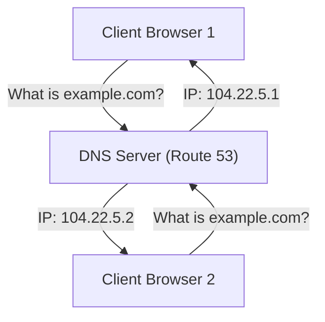
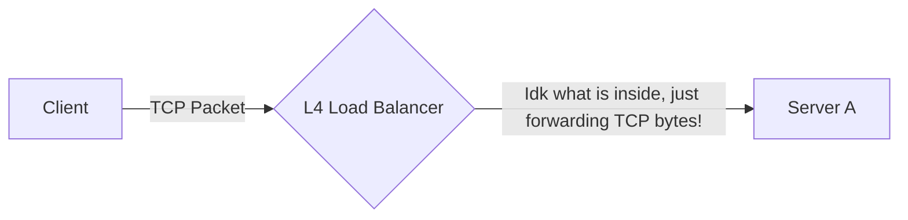
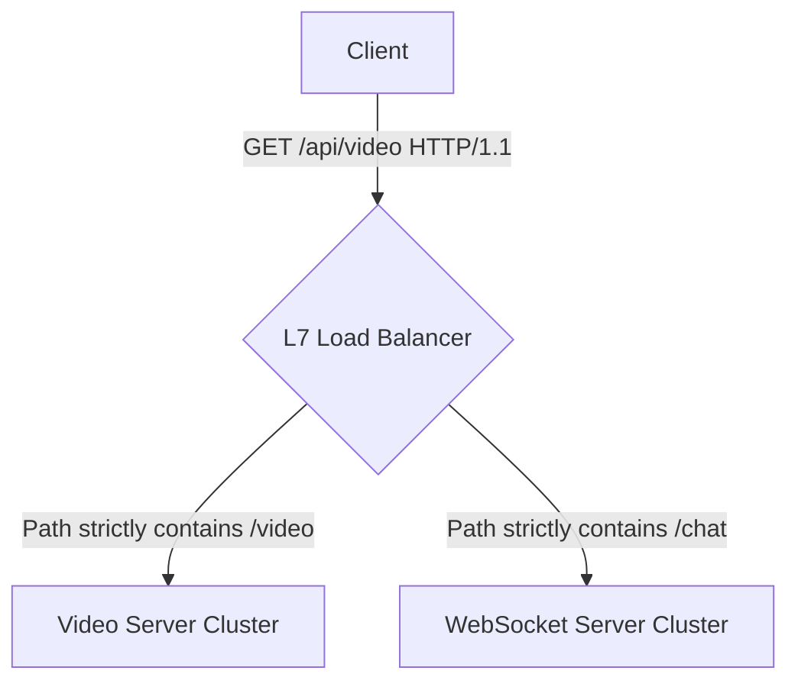

# 3. Types of Load Balancing

When an engineer says "I just put a Load Balancer in front of it," they are wildly oversimplifying the architecture. Load balancers exist at profoundly distinct layers of the networking stack and can be physical deployed in vastly different ways.

## DNS-Level Load Balancing

**The Analogy:**
Imagine you are looking for a reliable "Plumbing Company" in the classic yellow-pages phonebook. Instead of printing just one single phone number, the phonebook lists three different phone numbers (North Branch, South Branch, East Branch). When 100 people look up the plumbing company, some randomly call the North branch, some call the South branch, and some call the East branch. 

**The Tech:**
The internet's phonebook is called **DNS** (Domain Name System). When a user types `google.com`, their browser asks the DNS Server for Google's IP address. 
In DNS Load Balancing, the DNS server doesn't just hand back *one* IP address. It hands back a rotating list of IP addresses. This randomly splits the traffic across the globe before the user's browser even attempts to make a connection.

* **Pros:** Exceptionally cheap. You don't need to spin up any heavy servers; the DNS provider does all the load balancing automatically for pennies.
* **Cons:** Browsers and ISPs aggressively "cache" (remember) IP addresses. If IP `104.22.5.1` crashes and burns, you can quickly delete it from the phonebook. But users who already memorized that number will violently keep trying to call the dead server for the next 24 hours.

## L3 (Network Layer) Load Balancing

**The Analogy:**
Imagine you are mailing a physical letter to "123 Main Street". You do not politely tell the postal worker exactly which highways to drive on. You just hand them the final address. The global postal network automatically figures out the absolute shortest physical route to get the letter there based on current road closures.

**The Tech:**
Layer 3 (Network Layer) is entirely based on **IP Addresses**. 
L3 Load Balancing heavily utilizes a global technology called **Anycast routing**. 

Imagine you place one massive server in Tokyo, one in New York, and one in London. You magically configure all three servers to proudly broadcast the *exact same* single public IP address. 

When a user in Paris sends an HTTP request to that IP address, the core internet backbone routers (the postal workers) naturally deliver it to London because it is geographically the shortest path. You are load balancing millions of users across the globe simply by manipulating internet routing geography!

## L4 (Transport Layer) Load Balancing

L4 operates structurally exactly at the **Transport Layer** (TCP / UDP). 
An L4 Load Balancer has absolutely zero concept structurally of what HTTP, URLs, or Cookies conceptually mean. It purely securely looks at:
1. Source IP and Port (e.g., `192.168.1.50:45000`)
2. Destination IP and Port (e.g., `8.8.8.8:443`)

* **Pros:** Blistering operational speed. It aggressively uses almost zero CPU memory because it never furiously decrypts the computationally heavy TLS (HTTPS) payload. 
* **Cons:** Tremendously "Dumb" routing. Because it structurally cannot parse or natively read the inner HTTP headers, it is mechanically impossible to strategically route requests dynamically based on the exact URL path or specific user cookies internally. 

## L7 (Application Layer) Load Balancing

L7 definitively operates at the absolute top of the generic OSI model: the **Application Layer** (HTTP/HTTPS, WebSockets, gRPC).
An L7 Load Balancer is highly operationally intelligent. It entirely accepts the native TCP connection, perfectly decrypts the heavy TLS certificate natively, deeply inspects the raw HTTP headers, perfectly parses the exact URL path, and then heavily strategically makes a bespoke routing decision mechanically.

* **Pros:** Immensely complex and intelligent dynamic routing. You can boldly route `/api/video` exclusively to massive GPU-backed transcoding servers, and cleanly route `/api/chat` securely to heavily customized Node.js WebSocket servers autonomously.
* **Cons:** Exceptionally high CPU processing overhead strictly because mathematically successfully terminating HTTPS and flawlessly parsing rich HTTP payload strings deeply is incredibly resource-intensive at extreme internet scale.

### The Ultimate Interview Matrix: L4 vs L7 

*(Added Note: This represents the single most critical LB constraint question in high-level architectural system design interviews.)*

| Technical Trait | L4 Load Balancing (e.g., AWS NLB) | L7 Load Balancing (e.g., AWS ALB / NGINX) |
| :--- | :--- | :--- |
| **OSI Layer** | Layer 4 (TCP / UDP) | Layer 7 (HTTP / HTTPS / gRPC) |
| **Data Decryption?** | No. Secure End-to-End Encrypted dynamically natively to the backend. | Yes. Actively decrypts and visibly reads payload content natively. |
| **Routing Intelligence** | Structurally Dumb (IP/Port logic only) | Conceptually Genius (Path, Header, Cookie, Method logic) |
| **Overall Performance** | Processes Millions of generic TCP requests per second heavily with a tiny CPU profile. | Visibly slower structurally, actively CPU bottlenecked linearly based on TLS math. |

## Server-Side vs Client-Side Load Balancing

Who literally holds the exact mechanical math algorithm (Round Robin) securely to logically decide which server natively gets the physical request?

### Server-Side Load Balancing (The Classic Standard)
This is explicitly what 99% of generic developers mathematically know. You physically spin up a generic middleman proxy (like NGINX). The client blindly asks NGINX, and NGINX does the heavy math to intelligently pick the backend server.
* **Pros:** End clients are structurally agnostic and easily decoupled.
* **Cons:** The middleman NGINX box becomes a potential bottleneck intrinsically and adds exactly 1 extra fundamental network hop of pure latency strictly to every transaction.

### Client-Side Load Balancing (Microservices Standard)
In massive modern internal Microservice architectures (like heavy gRPC internal webs inside Uber or Netflix), there is intentionally **zero internal middleman routing server**. The emitting Client library directly downloads the live Service Registry phonebook, mathematically runs the Round-Robin math logic locally autonomously on its own CPU thread, and safely connects strictly *directly* to the physical target internal backend securely.
* **Pros:** Absolutely Zero mechanical middleman operational bottleneck. Sub-millisecond direct pure latency flawlessly.
* **Cons:** Internal Clients natively are intensely heavily complex and strictly operationally language-dependent securely.

## Hardware vs Software Load Balancers

Engineers structurally heavily fight over physical form factors:

*   **Physical Hardware LBs (F5 BIG-IP, Citrix NetScaler):** Massive, physically terrifying, fiercely expensive generic proprietary physical metal boxes explicitly manually bolted intimately into a data center networking rack. They uniquely rigorously have custom physical ASIC silicon chips designed globally mathematically to strictly process raw generic TCP packets powerfully at structurally insane speeds. Safely used heavily natively by massive physical core banks.
*   **Modern Software LBs (NGINX, HAProxy, Envoy Proxy):** Standard code applications cleanly installed dynamically wildly securely on standard commodity Linux web servers explicitly. They are infinitely cheaper mechanically, vastly easier to orchestrate gracefully, and dominate modern internet tech globally.

## Cloud Load Balancers

If you use AWS natively, GCP, or Azure organically, you rarely mathematically install raw NGINX manually yourself to physically act as a global front-door LB. You instantly click a button and provision a **Cloud Load Balancer** (AWS ALB, GCP HTTP(S) LB).

These are fundamentally just dynamically managed clusters of underlying Software LBs expertly monitored and abstracted by the Cloud service provider so you don't have to manage OS patches or manual hardware failover logic.

---

---

