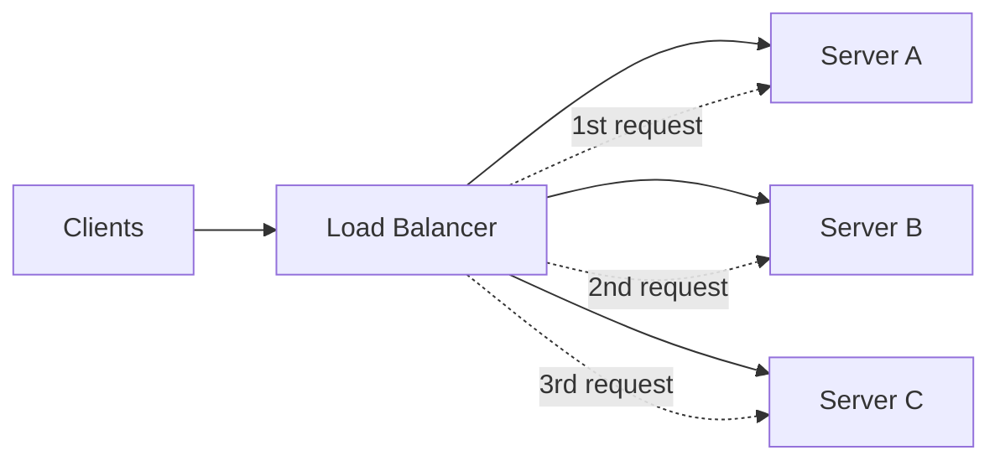
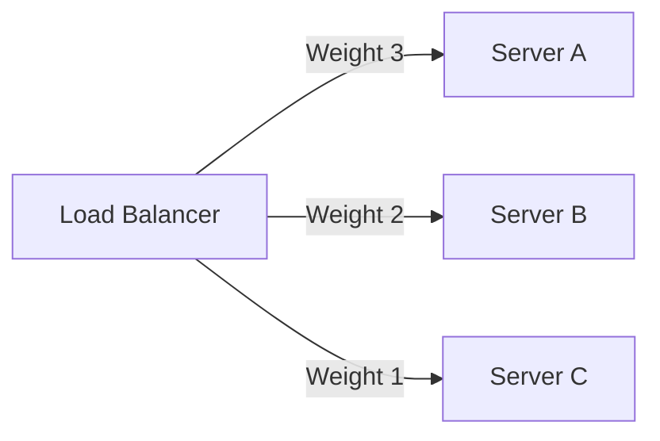
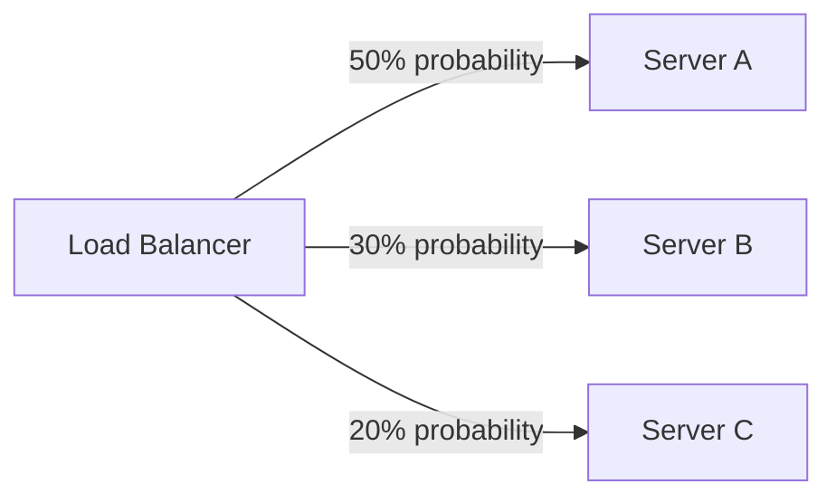
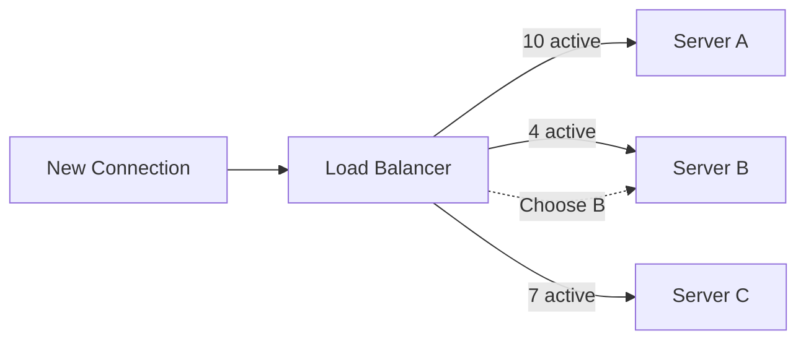
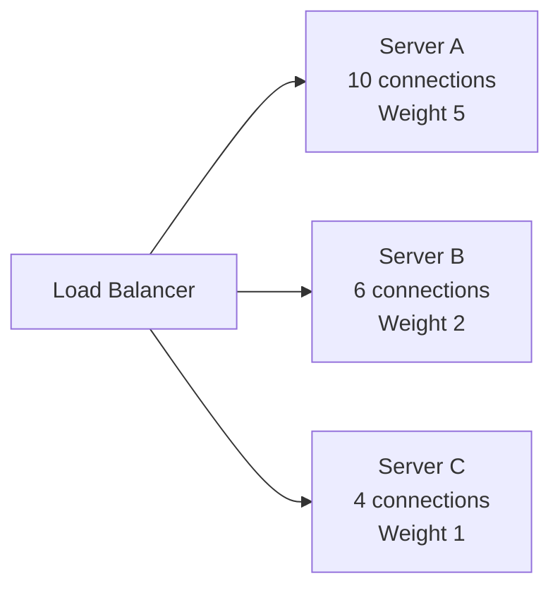
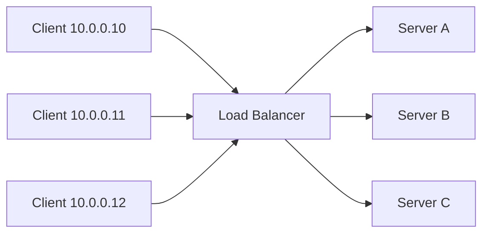
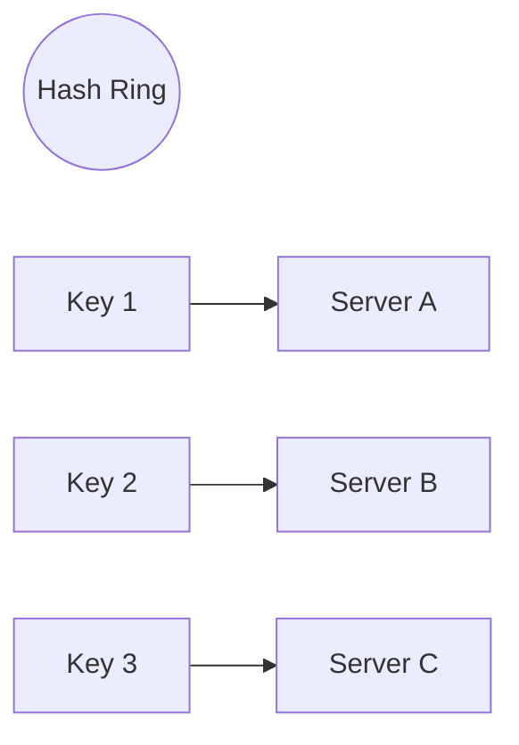
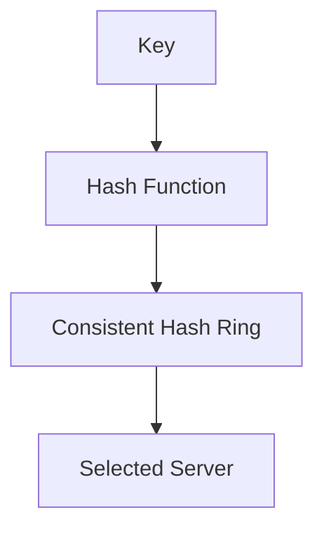
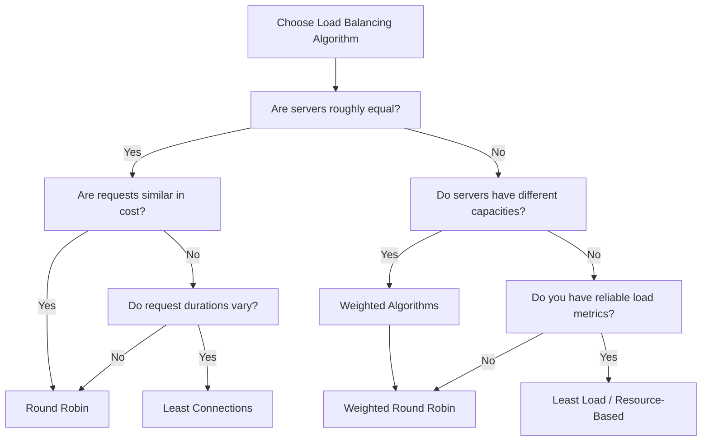

# Load Balancing Algorithms

A **Load Balancing Algorithm** is the strategy used by a Load Balancer to decide:

> **"Which backend server should receive this request or connection?"**

Suppose we have three backend servers:

```text
                    Load Balancer
                   /      |      \
                  /       |       \
             Server A  Server B  Server C
```

When requests arrive, the Load Balancer needs some rule to distribute them.

Different algorithms make different decisions based on things such as:

* Request order
* Server capacity
* Number of active connections
* Response time
* CPU / memory usage
* Client IP
* Request URL
* A hash value

There is **no universally best algorithm**.

The right choice depends on:

* Whether servers have equal capacity
* Whether requests have similar processing costs
* Whether connections are long-lived
* Whether session affinity is required
* Whether the system is stateful
* Whether server health/load information is available

---

# 1. Round Robin

## What is it?

**Round Robin** distributes requests sequentially across the available servers.

For example, with three servers:

```text
Server A
Server B
Server C
```

Requests are distributed like:

```text
Request 1 → A
Request 2 → B
Request 3 → C
Request 4 → A
Request 5 → B
Request 6 → C
Request 7 → A
...
```

The Load Balancer simply cycles through the servers.

### Diagram



---

## Example

Suppose 9 requests arrive:

| Request | Server |
| ------- | ------ |
| R1      | A      |
| R2      | B      |
| R3      | C      |
| R4      | A      |
| R5      | B      |
| R6      | C      |
| R7      | A      |
| R8      | B      |
| R9      | C      |

Each server receives exactly 3 requests.

---

## Advantages

* Very simple
* Easy to implement
* Low decision-making overhead
* Works well when servers have similar capacity
* Works reasonably well when requests have similar processing cost

---

## Problems

Round Robin only knows the **order**.

It doesn't necessarily know:

* Which server is already busy
* Which server is faster
* Which server has more CPU
* Which request is expensive
* Which server has more active connections

For example:

```text
Server A → 16 CPU cores
Server B → 4 CPU cores
Server C → 4 CPU cores
```

Round Robin still gives:

```text
A → 1 request
B → 1 request
C → 1 request
```

This may not be an ideal distribution.

---

## When to use?

Good when:

* Servers are similarly configured
* Requests have relatively similar processing costs
* You want something simple
* You don't need sophisticated routing

---

# 2. Weighted Round Robin

## What is it?

**Weighted Round Robin** is Round Robin where each server receives a weight representing its relative capacity.

For example:

```text
Server A → Weight 3
Server B → Weight 2
Server C → Weight 1
```

The approximate distribution becomes:

```text
A → 50%
B → 33%
C → 17%
```

The stronger server receives more traffic.

---

## Example

Suppose:

```text
A = 3
B = 2
C = 1
```

A possible sequence is:

```text
A
A
A
B
B
C
A
A
A
B
B
C
...
```

### Diagram



---

## Why use weights?

Suppose:

```text
Server A → 16 cores
Server B → 8 cores
Server C → 4 cores
```

You could assign:

```text
A → 4
B → 2
C → 1
```

This allows traffic to roughly follow the available capacity.

---

## Advantages

* Simple
* Low overhead
* Better than basic Round Robin when servers have different capacities
* Predictable traffic distribution

---

## Problems

Weights are usually **configured values**, not necessarily real-time measurements.

Suppose Server A becomes overloaded:

```text
A → 95% CPU
B → 30% CPU
C → 20% CPU
```

Weighted Round Robin may continue sending traffic according to the configured weights.

It doesn't inherently react to current server load.

---

## When to use?

Useful when:

* Servers have different capacities
* Capacity differences are relatively stable
* Predictable traffic distribution is desirable

---

# 3. Random

## What is it?

The Load Balancer randomly chooses one of the available servers.

For:

```text
A
B
C
```

a sequence might be:

```text
R1 → B
R2 → A
R3 → C
R4 → C
R5 → A
R6 → B
...
```

There is no fixed sequence.

---

## Important Point

Random does **not** mean perfectly equal distribution.

For example, 6 requests could randomly produce:

```text
A → 1
B → 4
C → 1
```

With a sufficiently large number of requests, the distribution generally approaches the configured probabilities.

---

## Advantages

* Extremely simple
* Very low overhead
* No need to track connection counts or server load
* Can work well with large traffic volumes

---

## Problems

Short-term distribution can be uneven.

```text
100 requests

A → 45
B → 30
C → 25
```

It is also unaware of:

* Current server load
* Response time
* Active connections
* Server capacity

---

## When to use?

Useful when:

* Servers are similar
* Simplicity matters
* Small distribution variations aren't important

---

# 4. Weighted Random

## What is it?

Weighted Random combines:

> Random selection + server weights.

Suppose:

```text
A → 50%
B → 30%
C → 20%
```

Each request is randomly assigned according to those probabilities.

Possible result:

```text
A
A
B
C
A
B
A
C
A
...
```

But unlike Weighted Round Robin, there isn't a predictable repeating pattern.

---

## Example



---

## Advantages

* Simple
* Supports different server capacities
* Doesn't require strict sequential scheduling
* Low decision-making overhead

---

## Problems

Traffic isn't guaranteed to be evenly distributed over a small number of requests.

For example:

```text
10 requests

A → 7
B → 1
C → 2
```

This can happen even when the configured probabilities are:

```text
A → 50%
B → 30%
C → 20%
```

Over a very large number of requests, the distribution should generally move toward the configured probabilities.

---

# 5. Least Connections

## What is it?

The Load Balancer sends a new request/connection to the server currently handling the **fewest active connections**.

Example:

```text
Server A → 10 connections
Server B → 4 connections
Server C → 7 connections
```

The next connection goes to:

```text
Server B
```

because it currently has the fewest active connections.

---

## Diagram



---

## Why is this useful?

Consider long-running requests.

```text
Server A
├── Request 1
├── Request 2
├── Request 3
├── Request 4
└── Request 5

Server B
└── Request 6

Server C
└── Request 7
```

Round Robin might send the next request to A simply because it is A's turn.

Least Connections sees:

```text
A → 5
B → 1
C → 1
```

and prefers B or C.

---

## Best suited for

* Long-lived connections
* WebSockets
* Streaming
* Requests with varying duration
* Systems where connection duration varies significantly

---

## Important Limitation

A connection count does **not necessarily represent server load**.

Example:

```text
Server A → 10 connections
Each request → very cheap

Server B → 5 connections
Each request → extremely expensive
```

Least Connections chooses B because:

```text
5 < 10
```

even though B may actually be much busier.

---

# 6. Weighted Least Connections

## What is it?

Weighted Least Connections combines:

* Number of active connections
* Server capacity

Instead of simply asking:

> "Which server has the fewest connections?"

it considers the server's weight/capacity as well.

Conceptually:

```text
Effective Load ≈ Active Connections / Weight
```

Example:

```text
Server A:
Connections = 10
Weight = 5

Server B:
Connections = 6
Weight = 2
```

Approximate ratios:

```text
A → 10 / 5 = 2
B → 6 / 2 = 3
```

A may therefore be preferred because it has more capacity relative to its connection count.

---

## Diagram



---

## Advantages

* Considers connection count
* Accounts for different server capacities
* Better than plain Least Connections for heterogeneous servers

---

## Limitations

Still primarily considers **connections**, not the actual CPU/memory work performed by those connections.

---

# 7. Least Response Time

## What is it?

The Load Balancer prefers the server that can currently respond **faster**.

For example:

```text
Server A → 80 ms
Server B → 30 ms
Server C → 120 ms
```

The Load Balancer prefers:

```text
Server B
```

---

## Why response time matters

A server may have only a few connections but still be slow.

For example:

```text
A → 3 connections → 50 ms
B → 2 connections → 800 ms
C → 6 connections → 40 ms
```

Least Connections chooses B.

Least Response Time may prefer C or A.

---

## What does the LB need?

It needs some form of performance information, such as:

* Recent response times
* Average response time
* Latency measurements
* Active connections

Different implementations may calculate the metric differently.

---

## Advantages

* Reacts to actual observed performance
* Useful when request processing time varies
* Can avoid consistently slow servers

---

## Problems

### 1. Measurement overhead

The LB must track performance.

### 2. Feedback delay

A server may become overloaded now, while the LB still has older measurements.

### 3. Feedback loops

Routing more traffic to a currently fast server can eventually make it slower.

Then traffic moves elsewhere.

This can create oscillation if the algorithm is poorly designed.

---

## When to use?

Useful when:

* Latency matters
* Servers have different performance
* Request processing times vary
* Real-time performance information is available

---

# 8. Least Load

## What is it?

Least Load chooses the server that currently has the **lowest measured load**.

The exact definition of "load" depends on the system.

It could involve:

* CPU
* Memory
* Active connections
* Queue depth
* Requests
* Disk I/O
* Network usage

For example:

```text
Server A → 80% load
Server B → 35% load
Server C → 60% load
```

The next request goes to:

```text
Server B
```

---

## Important Difference

### Least Connections

Looks primarily at:

```text
Number of connections
```

### Least Response Time

Looks primarily at:

```text
Observed latency
```

### Least Load

Looks at:

```text
Current resource/system load
```

---

## Example

```text
              Server A    Server B    Server C
CPU             80%         35%         60%
Memory          60%         40%         50%
Connections      20           5          10
```

Least Connections:

```text
B
```

Least Load:

```text
B
```

But consider:

```text
A → 10 connections → 20% CPU
B → 5 connections  → 90% CPU
```

Least Connections chooses B.

Least Load chooses A.

---

## Challenges

The Load Balancer needs access to reasonably fresh load information.

That can require:

* Metrics collection
* Agent communication
* Monitoring infrastructure
* Additional network traffic
* More complex decision-making

---

# 9. Resource-Based Routing

## What is it?

Resource-Based Routing takes Least Load further by making routing decisions based on **specific resource metrics or application-level capacity**.

Instead of simply asking:

> "Which server has the lowest load?"

the system can ask:

> "Which server currently has enough resources to handle this workload?"

---

## Resources can include

* CPU
* Memory
* GPU
* Disk I/O
* Network bandwidth
* Queue depth
* Available workers
* Database connections
* Application-specific capacity

---

## Example

Imagine an image-processing service:

```text
Server A → 90% CPU
Server B → 40% CPU
Server C → 55% CPU
```

A new CPU-heavy request arrives.

The LB can prefer:

```text
Server B
```

---

## More advanced example

Suppose we have:

```text
Server A → GPU available
Server B → No GPU
Server C → GPU available
```

For an AI inference request:

```text
Request → Requires GPU
```

the router should send it to:

```text
A or C
```

This is more than generic load balancing.

It is **capacity/resource-aware routing**.

---

## Advantages

* Can make highly informed decisions
* Useful for heterogeneous workloads
* Useful when different servers have different capabilities
* Useful for specialized infrastructure

---

## Problems

* More complex
* Requires accurate metrics
* Metrics can become stale
* More coordination between infrastructure and applications
* Higher decision-making overhead

---

# 10. IP Hash

## What is it?

IP Hash uses the client's IP address to determine the backend server.

Conceptually:

```text
hash(client_ip) → server
```

Example:

```text
Client A
IP = 10.0.0.10

hash(10.0.0.10) → Server B
```

Future requests from that IP tend to go to Server B.

---

## Diagram



Conceptually:

```text
hash(10.0.0.10) → B
hash(10.0.0.11) → A
hash(10.0.0.12) → C
```

---

## Why use IP Hash?

It can provide a form of **session affinity**.

If the same client IP repeatedly connects, it tends to reach the same backend.

This can be useful when backend servers maintain local state.

---

## Major Problem

Many users can share the same public IP.

For example:

```text
                 NAT
                  |
       +----------+----------+
       |          |          |
     User A     User B     User C
       |          |          |
       +----------+----------+
                  |
             Public IP
```

The Load Balancer may see the same public IP for many users.

This can cause uneven distribution.

---

## Another Problem

A user's IP can change.

For example:

```text
Mobile Network
Wi-Fi
VPN
```

The same user may appear from different IP addresses.

---

## When to use?

Useful when:

* Some form of client affinity is desired
* IP distribution is reasonably balanced
* The limitations of IP-based affinity are acceptable

---

# 11. URL Hash

## What is it?

URL Hash calculates a hash from the requested URL.

Conceptually:

```text
hash(URL) → Server
```

For example:

```text
/products/123 → Server A
/products/456 → Server C
/products/789 → Server B
```

The same URL tends to map to the same server.

---

## Why can this be useful?

It can improve **cache locality**.

Suppose each server has its own local cache:

```text
Server A → Cache A
Server B → Cache B
Server C → Cache C
```

If `/products/123` always goes to Server A:

```text
/products/123
       ↓
   Server A
       ↓
    Cache A
```

Server A can keep that resource warm in its local cache.

---

## Problem

Traffic can become uneven.

Imagine:

```text
/products/popular
```

is requested millions of times.

If its hash maps to Server A:

```text
Server A → extremely high traffic
Server B → low traffic
Server C → low traffic
```

This creates a **hotspot**.

---

## Another Problem

Changing the server pool can change mappings.

For example:

```text
Before:
URL X → Server B

Add Server D

After:
URL X → Server C
```

This can cause cache misses and traffic redistribution.

Consistent hashing can help with this problem.

---

# 12. Consistent Hashing

## What is it?

Consistent Hashing is a hashing technique designed to distribute keys across nodes while minimizing the amount of data/keys that need to move when nodes are added or removed.

It is commonly useful for:

* Distributed caches
* Sharding
* Stateful routing
* Distributed systems
* Request affinity

---

## Normal Hashing Problem

Suppose we use:

```text
hash(key) % number_of_servers
```

With 3 servers:

```text
hash(key) % 3
```

Now add a fourth server:

```text
hash(key) % 4
```

A large number of keys may map to different servers.

That means:

```text
Cache A → many entries moved
Cache B → many entries moved
Cache C → many entries moved
```

This can cause a huge cache miss spike.

---

# Consistent Hash Ring

Instead of directly using:

```text
hash(key) % N
```

we map both:

* Servers
* Keys

onto a hash ring.



Conceptually:

```text
                 Server A
                    ●
             /             \
          Key 1            Key 2
            ●                ●
          Server C         Server B
             ●                ●
```

A key is assigned to the next server encountered according to the hashing scheme.

---

## Adding a Server

Suppose we have:

```text
A
B
C
```

and add:

```text
D
```

With consistent hashing, **only a portion of keys need to move**.

```text
Before:

A ───── B ───── C


After:

A ── D ── B ───── C
```

Instead of remapping almost everything, only the relevant section of the ring changes.

---

# Virtual Nodes

A problem with having only one position per server is uneven distribution.

For example:

```text
A -------- B ---- C
```

Server A might own a much larger portion of the ring.

To improve distribution, each physical server can have multiple **virtual nodes**.

```text
Server A:
A1
A2
A3
A4

Server B:
B1
B2
B3
B4

Server C:
C1
C2
C3
C4
```

These virtual nodes are distributed around the ring.

This generally produces a more balanced distribution.

---

## Consistent Hashing Example

Suppose:

```text
Servers:
A
B
C
```

Keys:

```text
User:101
User:102
User:103
User:104
```

The hash function maps them around the ring:



The important idea is:

> **The same key consistently maps to the same server until the server topology changes.**

---

## Advantages

* Stable key-to-server mapping
* Minimizes redistribution
* Excellent for distributed caches
* Useful for sharding
* Useful for stateful systems
* Works well when servers are dynamically added/removed

---

## Problems

* More complex than normal hashing
* Requires careful hash-ring design
* Can still suffer from hotspots
* Virtual nodes increase configuration/metadata complexity

---

# Comparing the Algorithms

| Algorithm                  | Looks At                    | Main Benefit                         | Main Problem                      |
| -------------------------- | --------------------------- | ------------------------------------ | --------------------------------- |
| Round Robin                | Request order               | Simple                               | Doesn't know server load          |
| Weighted Round Robin       | Request order + weight      | Handles different capacities         | Usually static                    |
| Random                     | Random choice               | Very simple                          | Uneven short-term distribution    |
| Weighted Random            | Random + weight             | Capacity-aware probability           | Still probabilistic               |
| Least Connections          | Active connections          | Good for varying connection duration | Connection count ≠ actual load    |
| Weighted Least Connections | Connections + weight        | Handles different capacities         | Still connection-oriented         |
| Least Response Time        | Latency                     | Avoids slow servers                  | Requires measurements             |
| Least Load                 | System load                 | Reacts to current load               | Requires fresh metrics            |
| Resource-Based Routing     | Specific resources/capacity | Handles specialized workloads        | More complex                      |
| IP Hash                    | Client IP                   | Session affinity                     | NAT/IP changes can cause problems |
| URL Hash                   | URL                         | Cache locality                       | Hot URLs can create hotspots      |
| Consistent Hashing         | Hash ring                   | Minimal redistribution               | More complex                      |

---

# How to Choose an Algorithm

A useful way to think about the decision is:



For specialized requirements:

```text
Need client affinity?
        ↓
IP Hash / Cookie-based affinity

Need cache locality?
        ↓
URL Hash / Consistent Hashing

Need minimal redistribution when nodes change?
        ↓
Consistent Hashing

Need latency-aware routing?
        ↓
Least Response Time

Need resource-aware routing?
        ↓
Least Load / Resource-Based Routing
```

---

# Important Trade-offs

There are several fundamental trade-offs behind these algorithms.

## Simplicity vs Intelligence

```text
Round Robin
    ↓
Very simple
    ↓
Less information
```

versus:

```text
Resource-Based Routing
    ↓
More information
    ↓
Better decisions
    ↓
More complexity
```

More sophisticated routing isn't automatically better.

---

## Static vs Dynamic Decisions

### Static

```text
Round Robin
Weighted Round Robin
```

Decisions don't require continuous server measurements.

### Dynamic

```text
Least Connections
Least Response Time
Least Load
Resource-Based Routing
```

These use current or recently observed system state.

Dynamic algorithms can react to changing conditions but require more information and can suffer from stale metrics.

---

# One Important Concept: Perfect Distribution Does Not Mean Good Distribution

Consider:

```text
Server A → 33%
Server B → 33%
Server C → 34%
```

It looks perfectly balanced.

But suppose:

```text
A → powerful
B → powerful
C → overloaded
```

Equal traffic doesn't necessarily mean equal **work**.

The real goal of load balancing is not always:

> "Give every server the same number of requests."

It is:

> **Distribute work so that the system uses its available capacity efficiently while maintaining the required performance and reliability.**

---

# Algorithm Selection Summary

| Situation                                     | Possible Choice               |
| --------------------------------------------- | ----------------------------- |
| Equal servers + similar requests              | Round Robin                   |
| Different server capacities                   | Weighted Round Robin          |
| Simple probabilistic distribution             | Random                        |
| Random + different capacities                 | Weighted Random               |
| Long-lived connections                        | Least Connections             |
| Long-lived connections + different capacities | Weighted Least Connections    |
| Latency is important                          | Least Response Time           |
| CPU/system utilization matters                | Least Load                    |
| Different hardware/resources                  | Resource-Based Routing        |
| Need IP affinity                              | IP Hash                       |
| Need URL/cache locality                       | URL Hash                      |
| Need stable mapping while nodes change        | Consistent Hashing            |
| Distributed cache                             | Consistent Hashing            |
| Stateful routing                              | Consistent Hashing / Affinity |

---

# Key Takeaways

1. **Round Robin** distributes sequentially.
2. **Weighted Round Robin** distributes according to configured capacity.
3. **Random** randomly selects a server.
4. **Weighted Random** randomly selects according to weights.
5. **Least Connections** prefers the server with fewer active connections.
6. **Weighted Least Connections** considers both connections and server capacity.
7. **Least Response Time** prefers servers responding faster.
8. **Least Load** considers current system load.
9. **Resource-Based Routing** considers specific available resources/capabilities.
10. **IP Hash** provides deterministic routing based on client IP.
11. **URL Hash** provides deterministic routing based on requested URL.
12. **Consistent Hashing** keeps key-to-server mappings relatively stable when servers change.
13. No algorithm is universally best.
14. **Traffic distribution and workload distribution are not necessarily the same thing.**
15. More sophisticated algorithms generally require more information, coordination, and operational complexity.

---

⬅️ **[Previous: 3. Types of Load Balancing](03_Types_of_Load_Balancing.md)** | 🏠 **[Back to TOC](README.md)** | **[Next: 5. Health Checks ➡️](05_Health_Checks.md)**
