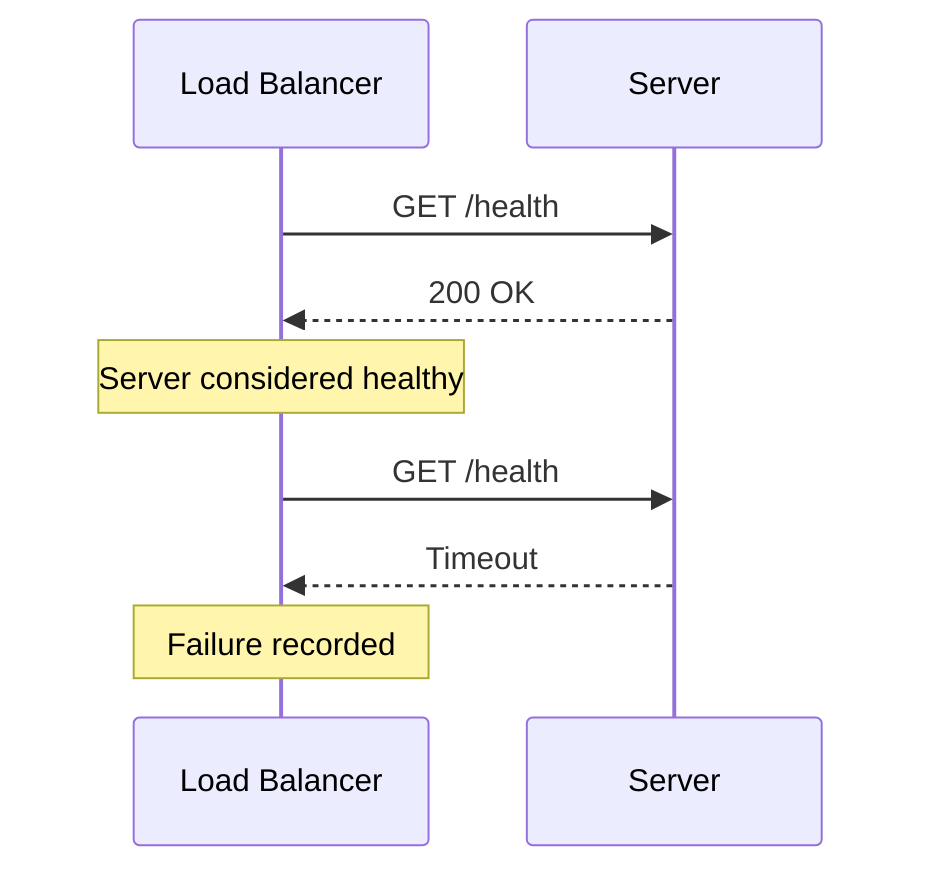
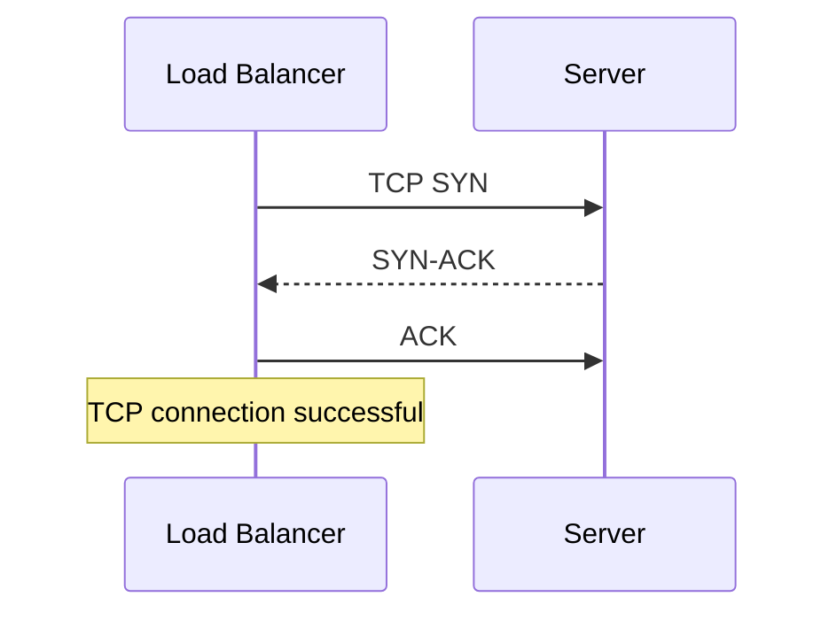
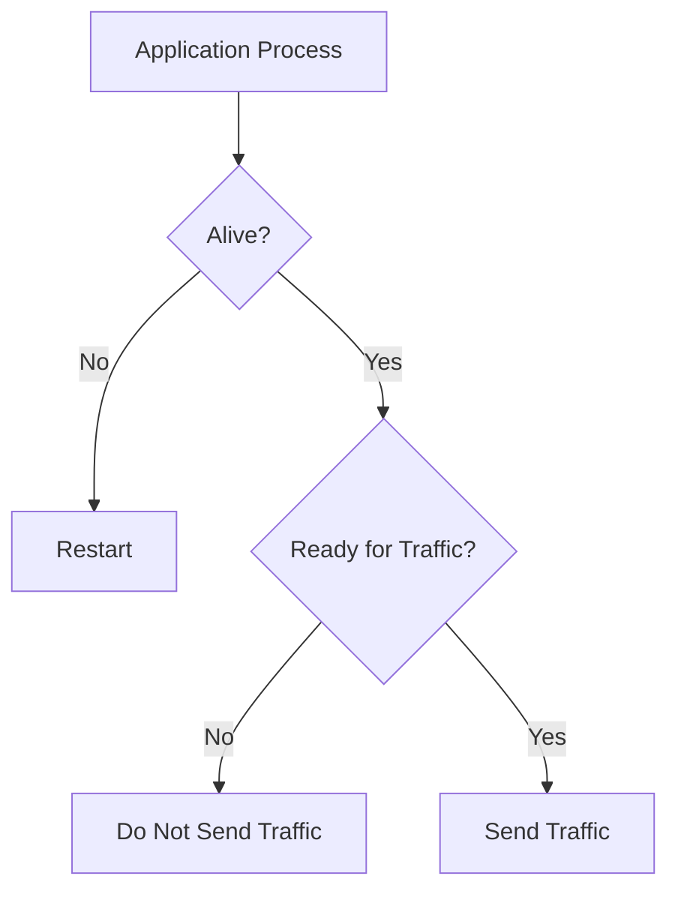
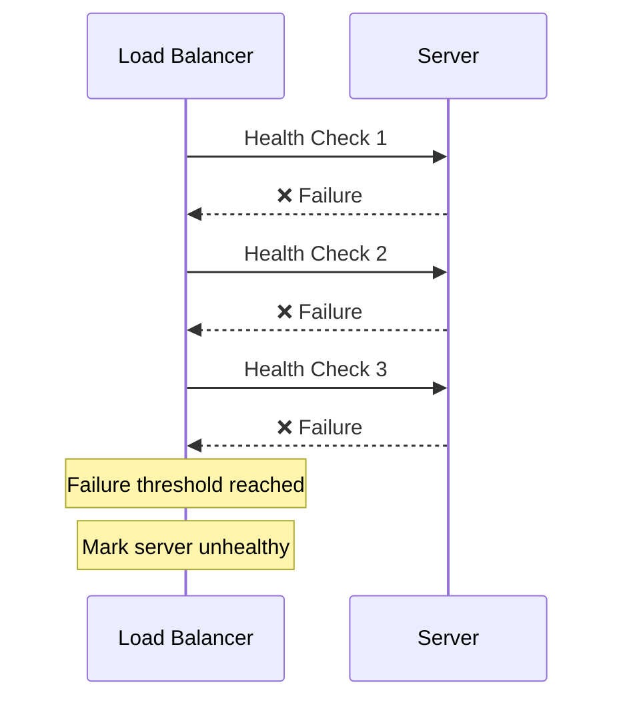
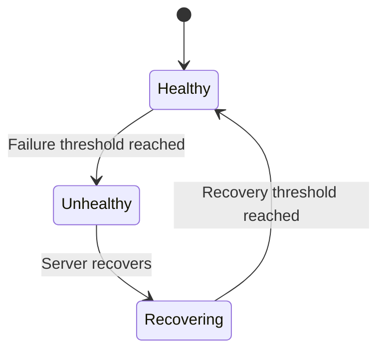
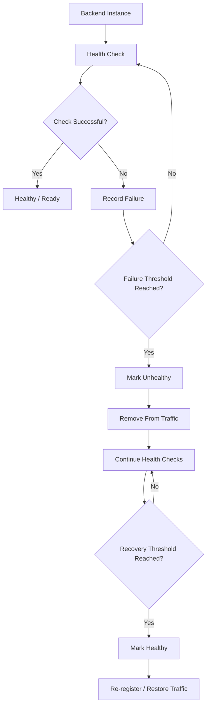

# Health Checks

A **Health Check** is a mechanism used to determine whether a backend server or service is capable of handling traffic.

In a load-balanced system, the Load Balancer should not blindly send requests to every registered server.

For example:

```text
                 Load Balancer
                /      |      \
               /       |       \
          Server A  Server B  Server C
             ✅        ❌        ✅
```

If Server B is broken, the Load Balancer should detect this and stop sending traffic to it.

The basic idea is:

```text
Is the server alive?
        ↓
Can it accept traffic?
        ↓
If yes → send traffic
If no  → stop traffic
```

Health checks are therefore an important part of **availability and fault tolerance**.

---

# 1. Purpose of Health Checks

The primary purpose of a health check is:

> **To determine whether an instance should receive traffic.**

Without health checks:

```text
Client
  ↓
Load Balancer
  ↓
Server A ❌
```

The Load Balancer may continue sending requests to Server A.

This produces unnecessary failures.

With health checks:

```text
Client
  ↓
Load Balancer
  ↓
Health Check
  ↓
Server A ❌
  ↓
Remove from traffic
```

---

## What can a Health Check detect?

Depending on its design, it can detect:

* Server is completely down
* Network connection cannot be established
* Application process has crashed
* Application is not responding
* Application is responding too slowly
* Application is overloaded
* Required dependency is unavailable
* Server is still starting
* Server is shutting down
* Server is not ready to accept traffic

---

## Health Checks and Load Balancing

Consider:

```text
                    Load Balancer
                   /      |      \
                  /       |       \
               A ✅      B ❌      C ✅
```

The Load Balancer maintains some view of backend health:

```text
A → Healthy
B → Unhealthy
C → Healthy
```

Therefore:

```text
Request
   ↓
Load Balancer
   ↓
A or C
```

Server B is temporarily excluded.

---

## Health ≠ "Server is Running"

This is an important distinction.

A process can be running while the application is unusable.

```text
Process → Running ✅
Application → Database unavailable ❌
```

Therefore:

> **"Alive" and "Ready to receive traffic" are different concepts.**

This is why **Liveness** and **Readiness** checks are important.

---

# 2. Active Health Checks

An **Active Health Check** is when the Load Balancer or monitoring system actively sends a request to the backend to test its health.

For example:

```text
Load Balancer
      |
      | GET /health
      ↓
Backend Server
      |
      | 200 OK
      ↓
Load Balancer
```

The Load Balancer periodically asks:

> "Are you healthy?"

---

## Example

Suppose the health-check interval is 10 seconds.

```text
t = 0s   → Check Server A
t = 10s  → Check Server A
t = 20s  → Check Server A
t = 30s  → Check Server A
```

Possible result:

```text
200 OK → Healthy
500    → Unhealthy
Timeout → Unhealthy
```

---

## Diagram



---

## Advantages

* Simple
* Predictable
* Detects failures even when there is no user traffic
* Can test a specific endpoint
* Can be configured with different protocols

---

## Problems

Health checks themselves generate traffic.

If you have:

```text
1000 servers
```

and check each every second:

```text
1000 health-check requests/sec
```

So health checks must be designed efficiently.

---

# 3. Passive Health Checks

A **Passive Health Check** does not send a separate health-check request.

Instead, the Load Balancer observes **normal traffic**.

For example:

```text
Client
  ↓
Load Balancer
  ↓
Server A
  ↓
500 Internal Server Error
```

The Load Balancer can record that failure.

If Server A repeatedly fails:

```text
Server A
   ↓
Failure
   ↓
Failure
   ↓
Failure
   ↓
Mark unhealthy
```

---

## Active vs Passive

### Active

```text
LB → Health Check → Server
```

### Passive

```text
Client → LB → Server
             ↓
         Observe result
```

---

## Advantages

* No separate health-check traffic
* Uses real application traffic
* Can detect actual request failures

---

## Problems

A passive check may not detect a problem until users actually send traffic.

For example:

```text
Server A is broken
```

but:

```text
No user requests
```

Then the LB may not discover the problem immediately.

Therefore, passive health checking is often complementary to active health checking rather than a complete replacement.

---

# 4. TCP Health Checks

A **TCP health check** tests whether the Load Balancer can establish a TCP connection to the server.

For example:

```text
Load Balancer
      |
      | TCP connection
      ↓
Server:443
```

If the TCP connection succeeds:

```text
TCP connection → Success
```

the server passes the TCP-level check.

---

## What does it actually test?

It can tell us that:

* The server is reachable
* The network path works
* Something is listening on that port
* A TCP connection can be established

---

## What doesn't it tell us?

It does **not necessarily tell us that the application is healthy**.

Imagine:

```text
TCP Port 443 → Open ✅

Application
     ↓
Database connection broken ❌
```

TCP health check may still pass.

---

## Example



---

## When useful?

TCP health checks are useful when:

* The service isn't HTTP
* You only need connectivity validation
* The protocol is TCP-based
* A simple low-level check is sufficient

Examples:

* Database services
* TCP-based applications
* Some internal services

---

# 5. HTTP Health Checks

An **HTTP Health Check** sends an HTTP request to a specific endpoint.

For example:

```text
GET /health
```

The server might return:

```text
HTTP/1.1 200 OK
```

The Load Balancer considers the check successful.

---

## Example

```text
Load Balancer
      |
      | GET /health
      ↓
Backend
      |
      | 200 OK
      ↓
Healthy
```

---

## Typical Endpoints

Common patterns include:

```text
/health
/healthz
/live
/ready
/status
```

The exact endpoint name is not important.

The important part is what the endpoint checks.

---

## Simple Health Endpoint

A simple endpoint might return:

```json
{
  "status": "ok"
}
```

But don't assume that returning `"ok"` automatically means the entire system is healthy.

For example:

```text
API Server → Running
Database   → Down
Redis      → Down
```

The correct health behavior depends on what the service considers necessary for accepting traffic.

---

## Advantages

HTTP health checks can test more than network connectivity.

They can verify:

* HTTP server is running
* Application is responding
* Routing works
* Application state
* Selected dependencies

---

# 6. Liveness Checks

A **Liveness Check** answers:

> **"Is this application process alive?"**

It is primarily about detecting a process that is stuck, dead, or otherwise no longer functioning.

Example:

```text
Application
     ↓
Liveness Check
     ↓
Alive?
```

If the answer is no:

```text
Process unhealthy
        ↓
Restart process/container
```

---

## Important Concept

Liveness usually should be relatively simple.

For example:

```text
GET /live
```

might simply confirm:

```text
Application process is functioning
```

It generally shouldn't depend on every external dependency.

Why?

Imagine:

```text
Application → Alive
Database → Temporarily unavailable
```

If liveness depends on the database:

```text
Database failure
      ↓
Liveness failure
      ↓
Restart application
      ↓
Application starts
      ↓
Database still unavailable
      ↓
Restart again
      ↓
...
```

This can create an unnecessary restart loop.

---

# 7. Readiness Checks

A **Readiness Check** answers:

> **"Can this instance safely receive traffic right now?"**

This is different from liveness.

An application can be:

```text
Alive ✅
Ready ❌
```

For example:

```text
Application started
        ↓
Loading configuration
        ↓
Connecting to dependencies
        ↓
Warming cache
        ↓
Not ready yet
```

Once everything required is ready:

```text
Ready ✅
```

---

## Example



---

# Liveness vs Readiness

This distinction is extremely important.

| Check     | Main Question             | Typical Action       |
| --------- | ------------------------- | -------------------- |
| Liveness  | Is the application alive? | Restart if unhealthy |
| Readiness | Can it receive traffic?   | Remove from traffic  |

Example:

```text
Application A

Liveness  → ✅
Readiness → ❌
```

This means:

> Keep the application running, but don't send user requests to it.

This is extremely useful during:

* Startup
* Deployment
* Shutdown
* Temporary dependency problems
* Warm-up periods

---

# 8. Health Check Interval

The **Health Check Interval** determines how frequently a health check is performed.

For example:

```text
Interval = 10 seconds
```

means approximately:

```text
0s   → Check
10s  → Check
20s  → Check
30s  → Check
```

---

## Why does it matter?

There is a trade-off.

### Short interval

```text
1 second
```

Advantages:

* Detect failures quickly

Disadvantages:

* More health-check traffic
* More overhead
* More sensitivity to temporary network problems

### Long interval

```text
30 seconds
```

Advantages:

* Less overhead
* Fewer checks

Disadvantages:

* Failure may take longer to detect

---

## Failure Detection Time

Suppose:

```text
Health interval = 10 seconds
Failure threshold = 3
```

A server may need roughly:

```text
10 × 3 = 30 seconds
```

of failed checks before being marked unhealthy.

The exact timing depends on implementation and when the failure occurs relative to the check schedule.

---

# 9. Timeout

A **Health Check Timeout** determines how long the system waits for a health-check response.

Example:

```text
Timeout = 2 seconds
```

The Load Balancer sends:

```text
GET /health
```

If the server doesn't respond within the configured timeout:

```text
Timeout
   ↓
Health check failed
```

---

## Why timeout matters

Without a timeout:

```text
Health Check
     ↓
Server never responds
     ↓
LB waits forever
```

That would make health checking ineffective.

---

## Timeout vs Interval

These are different.

### Timeout

> How long do I wait for **this check**?

### Interval

> How long do I wait before **starting another check**?

---

# 10. Failure Threshold

The **Failure Threshold** determines how many consecutive failed checks are required before a server is considered unhealthy.

Suppose:

```text
Failure threshold = 3
```

Then:

```text
Check 1 → ❌
Check 2 → ❌
Check 3 → ❌
```

Now:

```text
Server → Unhealthy
```

---

## Why not remove the server after one failure?

Because temporary failures happen.

For example:

```text
Network delay
Temporary CPU spike
Short GC pause
Transient packet loss
```

One failed health check doesn't necessarily mean the server is broken.

A threshold reduces false positives.

---

## Example



---

# 11. Recovery Threshold

The **Recovery Threshold** determines how many successful health checks are required before an unhealthy server is considered healthy again.

Suppose:

```text
Recovery threshold = 2
```

Server is currently unhealthy:

```text
Server → ❌
```

Then:

```text
Check 1 → ✅
Check 2 → ✅
```

Now:

```text
Server → Healthy
```

and traffic can be restored.

---

## Why not restore after one successful check?

Because the server may be unstable.

For example:

```text
❌
❌
❌
✅
❌
```

If one success immediately re-enabled traffic, users could repeatedly bounce between success and failure.

A recovery threshold provides stability.

---

# 12. Unhealthy Instance Removal

Once a server fails enough health checks, the Load Balancer can remove it from the **active traffic pool**.

Example:

```text
Before:

             Load Balancer
             /     |     \
            A      B      C
            ✅     ❌     ✅
```

After:

```text
             Load Balancer
              /          \
             A            C
             ✅           ✅
```

Server B may still exist, but the Load Balancer stops routing normal traffic to it.

---

## Important Distinction

"Removed from the load balancer" does **not necessarily mean**:

> "The server has been physically shut down."

It usually means:

> **"Don't send normal traffic to this instance."**

The instance may still be running and attempting to recover.

---

# 13. Instance Re-registration

When an unhealthy server becomes healthy again, it can be returned to the traffic pool.

Conceptually:

```text
Server B
   ↓
Unhealthy
   ↓
Removed from traffic
   ↓
Recovers
   ↓
Health checks pass
   ↓
Re-register
   ↓
Traffic restored
```

---

## Example



---

## Why gradual recovery can matter

Imagine a server has just recovered after being overloaded.

If the Load Balancer immediately sends 100% of its normal traffic:

```text
Server recovers
      ↓
Huge traffic spike
      ↓
Server overloaded again
      ↓
Fails again
```

Some systems therefore use techniques such as:

* Gradual traffic restoration
* Slow start
* Warm-up periods
* Connection draining during shutdown

The goal is to avoid repeatedly flapping between healthy and unhealthy states.

---

# Health Check Lifecycle

Putting everything together:



---

# Health Check Configuration

A simplified configuration might look conceptually like:

```text
Health Check:

Protocol:          HTTP
Path:              /ready
Interval:          10s
Timeout:           2s
Failure Threshold: 3
Recovery Threshold: 2
```

This means:

```text
Every 10 seconds:
    send GET /ready

Wait up to 2 seconds.

If it fails 3 consecutive times:
    mark unhealthy

If an unhealthy server passes 2 consecutive checks:
    mark healthy again
```

---

# Health Check State Machine

A backend instance can be thought of as moving through states:

```text
                 ┌─────────────┐
                 │   Healthy   │
                 └──────┬──────┘
                        │
                 Failures ≥ threshold
                        ↓
                 ┌─────────────┐
                 │  Unhealthy  │
                 └──────┬──────┘
                        │
                 Recovery checks
                        ↓
                 ┌─────────────┐
                 │ Recovering  │
                 └──────┬──────┘
                        │
                Success ≥ threshold
                        ↓
                 ┌─────────────┐
                 │   Healthy   │
                 └─────────────┘
```

The exact states and transitions vary by implementation, but this is the useful mental model.

---

# Active vs Passive Health Checks

| Feature                              | Active          | Passive    |
| ------------------------------------ | --------------- | ---------- |
| Separate check request               | Yes             | No         |
| Uses real traffic                    | Not necessarily | Yes        |
| Detects failure without user traffic | Yes             | No         |
| Extra traffic                        | Yes             | Minimal    |
| Can test specific endpoint           | Yes             | Indirectly |
| Easy to reason about                 | Yes             | Relatively |
| Useful for proactive detection       | Yes             | Limited    |

In real systems, these approaches can complement each other.

---

# TCP vs HTTP Health Checks

| Feature                     | TCP     | HTTP        |
| --------------------------- | ------- | ----------- |
| Tests network connectivity  | Yes     | Yes         |
| Tests TCP port              | Yes     | Yes         |
| Tests application response  | Limited | Yes         |
| Can inspect status code     | No      | Yes         |
| Can check application logic | No      | Potentially |
| Works for non-HTTP services | Yes     | No          |

A TCP check can tell you:

> "Something is accepting TCP connections."

An HTTP check can tell you:

> "The HTTP application is responding according to this health endpoint."

---

# Liveness vs Readiness

This distinction is one of the most important concepts in this chapter.

```text
              Application
                  |
          ┌───────┴────────┐
          ↓                ↓
      Liveness          Readiness
          ↓                ↓
   "Am I alive?"     "Can I serve?"
          ↓                ↓
       Restart         Receive traffic
```

Example:

```text
Database temporarily unavailable

Liveness  → ✅
Readiness → ❌
```

The application stays alive but is temporarily removed from traffic.

---

# Common Mistakes

## 1. Making health checks too expensive

Bad:

```text
GET /health

→ Complex database query
→ Redis query
→ External API request
→ Multiple services
→ Heavy computation
```

Every health check can then create unnecessary load.

---

## 2. Making liveness depend on everything

If liveness depends on every dependency:

```text
Database failure
      ↓
Liveness fails
      ↓
Restart application
```

This may turn a dependency failure into an application restart storm.

---

## 3. Using only TCP health checks

TCP may succeed even when:

```text
Application logic is broken
Database is unavailable
Important dependency is unavailable
```

So TCP is not always sufficient.

---

## 4. Using only one failed check

A single network packet loss shouldn't necessarily remove a healthy server.

This is why failure thresholds exist.

---

## 5. Recovery too quickly

A server that passes one check may still be unstable.

Recovery thresholds and gradual traffic restoration can help.

---

## 6. Health checks that lie

A health endpoint returning:

```text
200 OK
```

doesn't automatically mean:

> "The entire service can successfully process every request."

The health-check design must match what "healthy" actually means for that service.

---

# Health Checks and Graceful Shutdown

Health checks are especially important during deployments.

Suppose Server A is being replaced:

```text
Server A
   ↓
Stop accepting new traffic
   ↓
Readiness = false
   ↓
Load Balancer stops routing new requests
   ↓
Existing requests finish
   ↓
Server shuts down
```

This connects:

```text
Readiness
    +
Connection Draining
    +
Graceful Shutdown
```

and helps prevent dropped requests during deployments.

---

# Health Checks and Autoscaling

Health checks also interact with autoscaling.

For example:

```text
             Load Balancer
                  |
        ┌─────────┼─────────┐
        ↓         ↓         ↓
       A         B         C
       ✅        ❌         ✅
                  ↓
             Unhealthy
                  ↓
            Autoscaling /
            orchestration
```

A failed health check can cause an orchestrator or autoscaling system to replace an instance.

But remember:

> **Load Balancer health and instance replacement are related but are not necessarily the same operation.**

The LB may simply stop routing traffic while another system decides whether the instance should be restarted or replaced.

---

# Important Trade-offs

## Faster Failure Detection

Short interval + low threshold:

```text
Fast detection
      ↓
Less time sending traffic to broken server
```

But:

```text
More sensitive to temporary failures
      ↓
Potential false positives
```

---

## Slower Failure Detection

Longer interval + higher threshold:

```text
More stable
      ↓
Fewer false positives
```

But:

```text
Broken server may receive traffic for longer
```

---

## The Core Trade-off

```text
Fast Detection
      ↕
False Positive Risk
```

Health-check configuration is therefore a balance between:

* Detection speed
* Stability
* Health-check overhead
* False positives
* Recovery speed

---

# Example: Complete Backend Setup

Imagine:

```text
                  Internet
                     |
                     ↓
              Load Balancer
              /     |     \
             A      B      C
```

Configuration:

```text
Protocol: HTTP
Endpoint: /ready
Interval: 10s
Timeout: 2s
Failure Threshold: 3
Recovery Threshold: 2
```

### Normal state

```text
A → ✅
B → ✅
C → ✅
```

Traffic:

```text
A ← requests
B ← requests
C ← requests
```

### Server B becomes unhealthy

```text
Check 1 → ❌
Check 2 → ❌
Check 3 → ❌
```

Then:

```text
A → ✅
B → ❌
C → ✅
```

Traffic:

```text
A ← requests
C ← requests

B ← no new traffic
```

### Server B recovers

```text
Check 1 → ✅
Check 2 → ✅
```

Then:

```text
A → ✅
B → ✅
C → ✅
```

B is returned to the traffic pool.

---

# Key Takeaways

1. **Health checks determine whether a backend should receive traffic.**
2. **Active checks proactively test a backend.**
3. **Passive checks observe real traffic and its failures.**
4. **TCP checks primarily test connectivity.**
5. **HTTP checks can test application-level behavior.**
6. **Liveness asks: "Is the application alive?"**
7. **Readiness asks: "Can the application receive traffic?"**
8. **Interval controls how frequently checks occur.**
9. **Timeout controls how long a check is allowed to wait.**
10. **Failure threshold prevents one temporary failure from immediately removing a server.**
11. **Recovery threshold prevents an unstable server from immediately receiving traffic again.**
12. An unhealthy instance is normally **removed from the traffic pool**, not necessarily shut down.
13. A recovered instance can be **re-registered** after sufficient successful checks.
14. Health checks must themselves be lightweight and reliable.
15. **Health ≠ merely "process is running."**
16. Health checks work closely with **load balancing, autoscaling, graceful shutdown, connection draining, and high availability**.
17. The central trade-off is:

> **Detect failures quickly without reacting too aggressively to temporary failures.**
