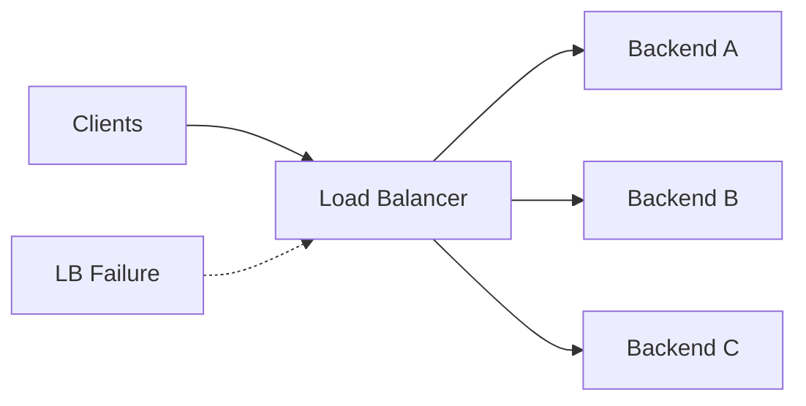
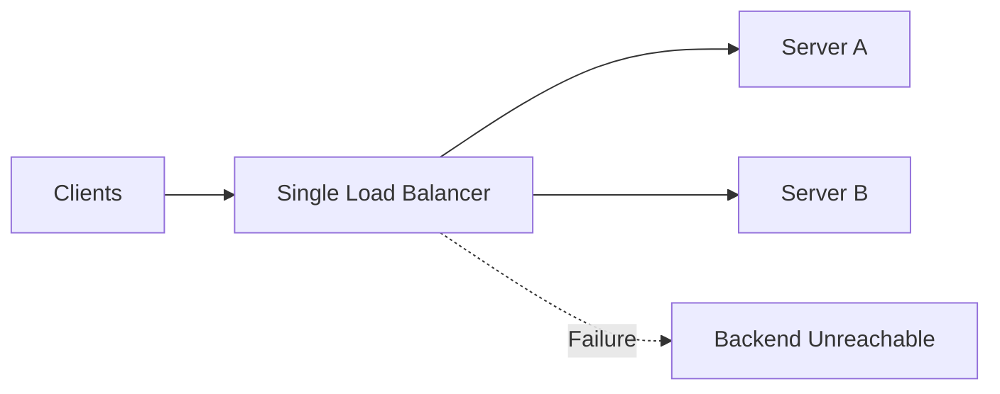
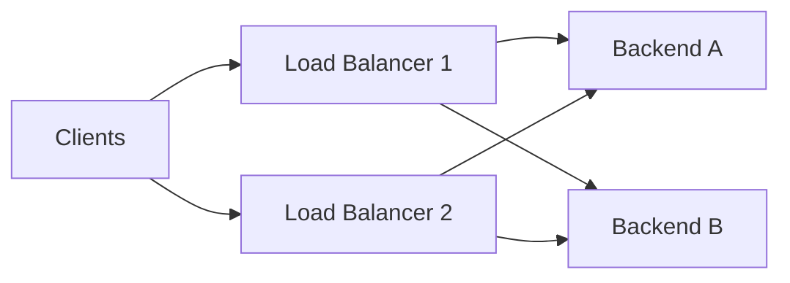
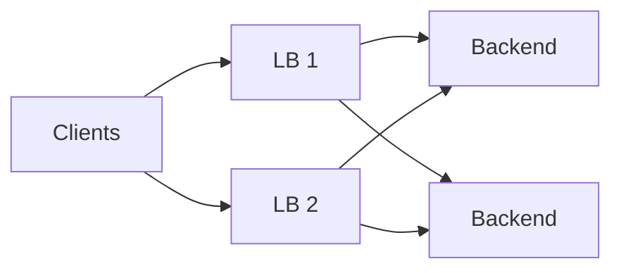
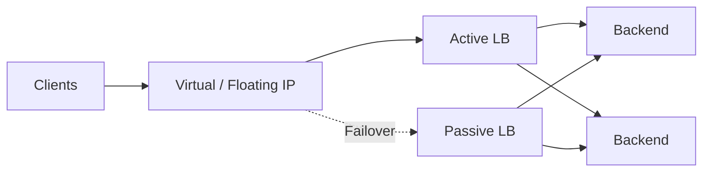
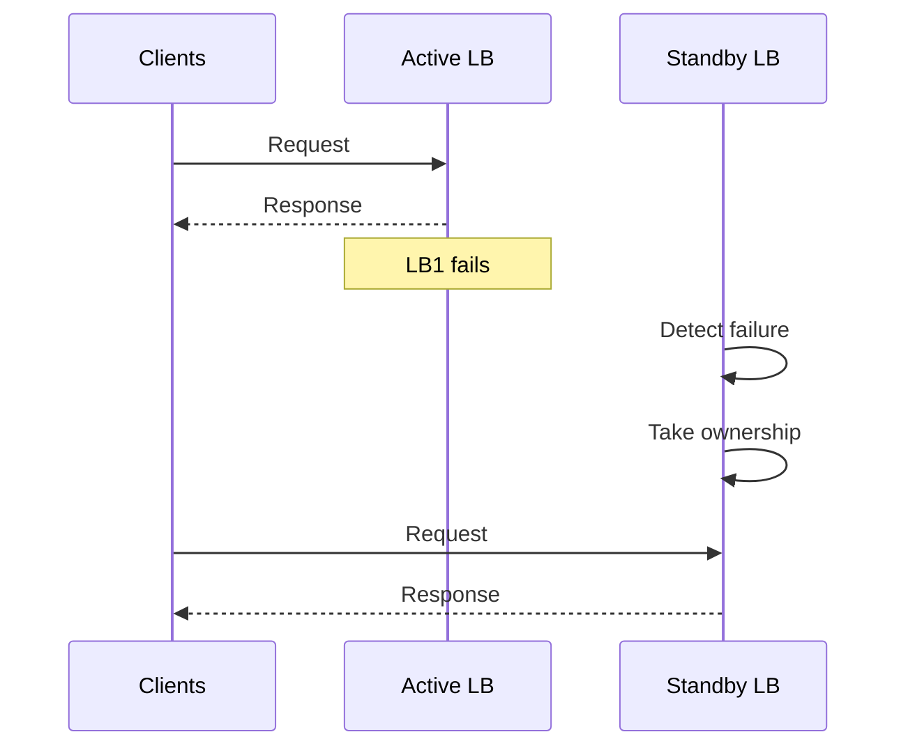
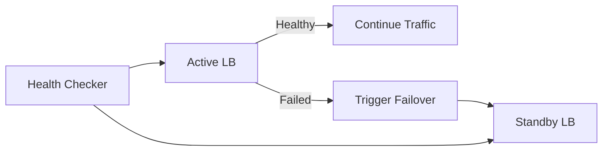
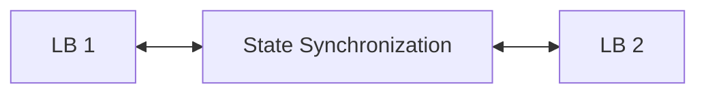
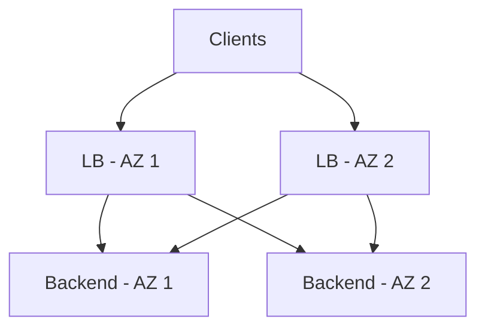
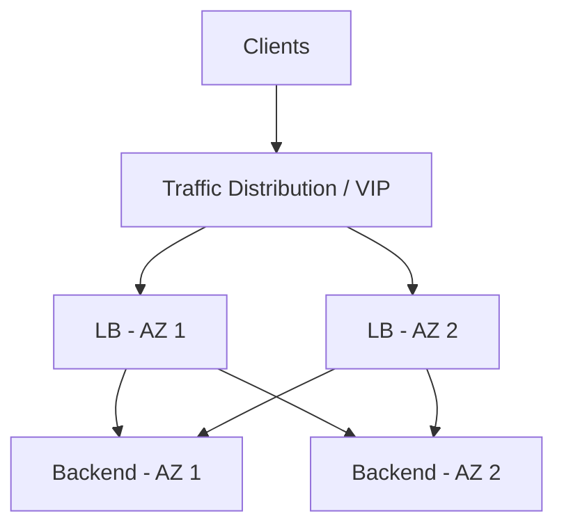

# Load Balancer Redundancy & High Availability

A load balancer sits between clients and backend servers. If there is only one load balancer and it fails, the backend servers may still be healthy, but clients cannot reach them.

Therefore, in production systems, load balancers are usually deployed with **redundancy and failover**.



---

## Single Point of Failure

A **Single Point of Failure (SPOF)** is a component whose failure can make the entire system unavailable.

A single load balancer can become an SPOF:



Even though multiple backend servers exist, the load balancer is still a single failure point.

**Goal:**

> Removing one load balancer should not make the service unavailable.

---

## LB Redundancy

**LB redundancy** means deploying multiple load balancers so that one can continue handling traffic if another fails.



The two common architectures are:

- **Active-Active**
- **Active-Passive**

Redundancy removes the load balancer as a single point of failure.

---

## Active-Active Load Balancers

In **Active-Active**, multiple load balancers actively serve traffic at the same time.



Traffic can be distributed between both load balancers.

### Advantages

- Both LBs are utilized.
- Better capacity.
- No idle standby LB.
- Failure of one LB can be handled by the other.

### Challenge

The system needs a way to distribute traffic between the load balancers, such as:

- DNS
- Anycast
- Another network-level mechanism
- Cloud-managed infrastructure

---

## Active-Passive Load Balancers

In **Active-Passive**, one load balancer handles traffic while another waits as a standby.



If the active LB fails, the passive LB takes over.

### Advantages

- Simpler traffic model.
- Easier state management in some systems.
- Clear failover path.

### Disadvantage

The standby LB normally does not handle production traffic, so some capacity remains unused.

---

## LB Failover

**Failover** is the process of moving traffic from a failed load balancer to a healthy one.

Typical flow:



Failover depends on:

1. Detecting that the active LB failed.
2. Selecting a healthy LB.
3. Moving traffic to it.
4. Ensuring the new LB is ready to serve traffic.

**Failover time** is important because users may experience errors during the transition.

---

## Virtual/Floating IP

A **Virtual IP (VIP)** is an IP address that represents the load-balancing service rather than a specific physical/virtual machine.

For example:

```text
VIP: 10.0.0.100

        ↓

   Active LB
```

If the active LB fails:

```text
VIP: 10.0.0.100

        ↓

   New Active LB
```

The important point is that **clients continue connecting to the same IP**.

The IP ownership moves between the load balancers.

This is especially useful in active-passive architectures.

---

## Health Checking Load Balancers

Redundant LBs need a mechanism to determine whether another LB is healthy.

This is different from **backend health checks**.

```text
LB Health Check
      │
      ▼
Is LB1 alive and able to serve traffic?
```

The system may check:

- Process/service availability
- Network connectivity
- Control endpoint
- Ability to forward traffic
- Overall LB health

If the active LB becomes unhealthy, failover can be triggered.



Health checking should avoid declaring a healthy LB failed because of a temporary network issue.

---

## State Synchronization

Some load balancers maintain state such as:

- Connection information
- Session information
- NAT mappings
- Configuration
- Routing state

If two LBs need this information, they may synchronize state.



State synchronization can make failover smoother because the new LB already knows relevant state.

However, not every system needs to synchronize all state.

A **stateless load balancer** is easier to fail over because there is less state to transfer.

> The less critical state the LB owns, the simpler redundancy usually becomes.

---

## Multi-AZ Load Balancing

A highly available system should avoid placing all load balancers in the same **Availability Zone (AZ)**.

For example:



If an entire AZ becomes unavailable, the load balancer in another AZ can continue serving traffic.

This protects against **zone-level failures**, not just individual machine failures.

---

## LB High Availability

**High Availability (HA)** means designing the load-balancing layer so that failure of an individual component does not cause service-wide downtime.

A typical HA architecture may look like:



High availability usually combines:

- Multiple load balancers
- Active-active or active-passive architecture
- Health checking
- Failover
- Multi-AZ deployment
- Appropriate state handling

### Important Trade-off

More redundancy improves availability but also increases:

- Infrastructure cost
- Configuration complexity
- Operational complexity
- State-management requirements

The goal is not simply to add more load balancers, but to **remove meaningful failure points without creating unnecessary complexity**.

## Key Takeaways

- A single LB can become a **Single Point of Failure**.
- **Redundant LBs** prevent one LB failure from taking down the service.
- **Active-Active** → multiple LBs serve traffic simultaneously.
- **Active-Passive** → one serves traffic while another waits for failover.
- **Failover** moves traffic from a failed LB to a healthy one.
- A **Virtual/Floating IP** can allow the service IP to move between LBs.
- **Health checks** detect LB failures.
- **State synchronization** can make failover easier when LBs maintain important state.
- **Multi-AZ deployment** protects against entire availability-zone failures.
- HA is a combination of **redundancy + failure detection + failover + appropriate architecture**.

---


