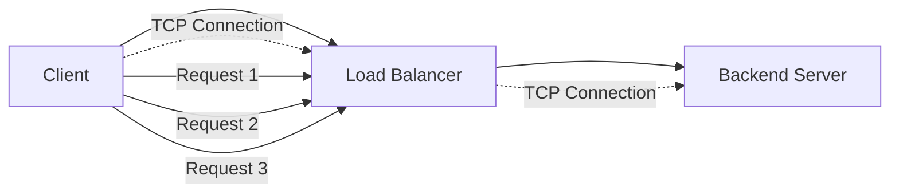
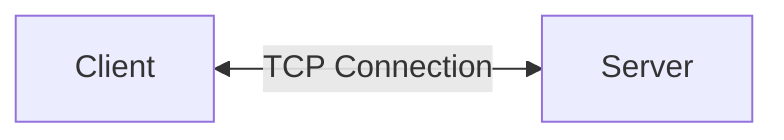
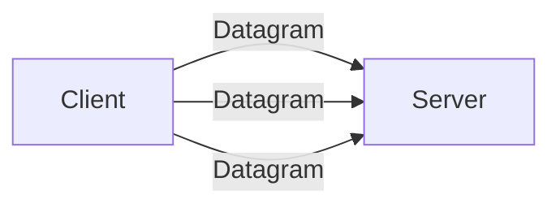
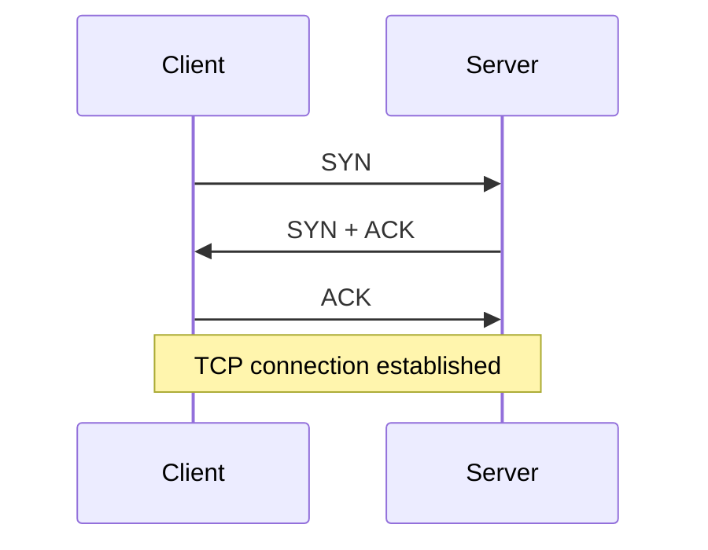
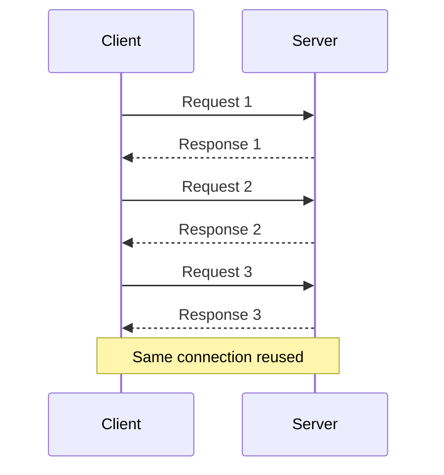
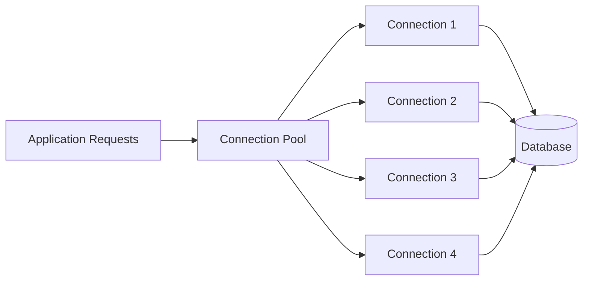
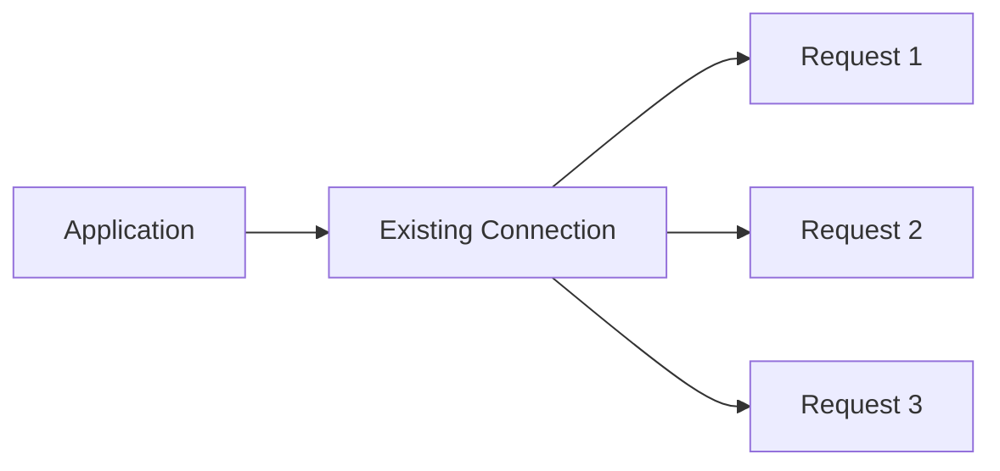
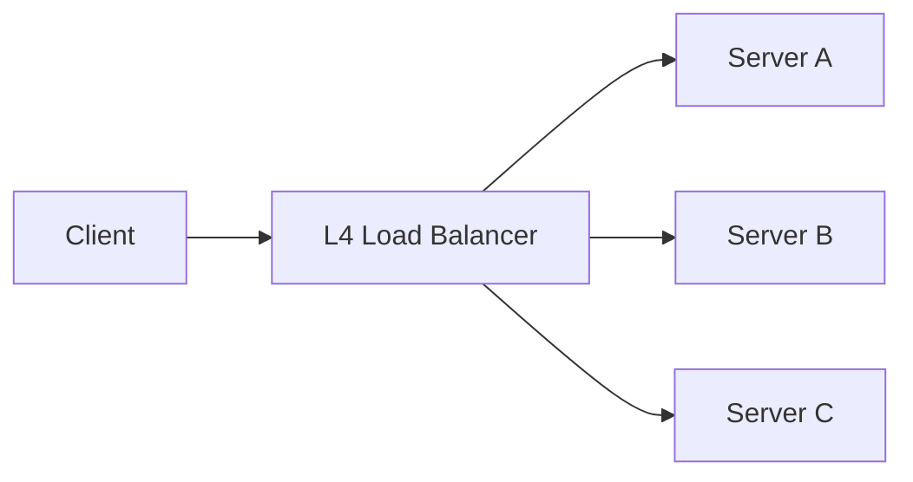
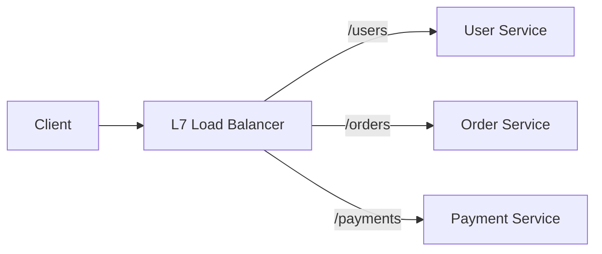

# Connections & Traffic Flow

A backend system does not simply receive "requests." At the network level, requests travel through **connections** between clients, load balancers, and servers.

Understanding the difference between a **connection** and a **request** is important for designing scalable backend systems.



---

## TCP Connections

**TCP (Transmission Control Protocol)** provides a reliable, ordered, connection-oriented communication channel.

Before application data is exchanged, a TCP connection is established between two endpoints.



TCP provides:

- Reliable delivery
- Ordered data
- Retransmission of lost packets
- Flow control
- Congestion control
- Connection state

Most traditional HTTP traffic uses TCP.

### Important Backend Point

A TCP connection is not the same thing as an HTTP request.

One TCP connection can carry multiple HTTP requests.

---

## UDP Connections

**UDP (User Datagram Protocol)** is connectionless at the transport layer.

There is no TCP-style connection establishment or guarantee of delivery.



UDP provides:

- Low protocol overhead
- No connection establishment
- No guaranteed delivery
- No guaranteed ordering
- No retransmission by UDP itself

UDP is commonly used where low latency is important, such as:

- DNS
- Real-time media
- Gaming
- Certain streaming/network protocols

Modern HTTP/3 uses **QUIC**, which runs over UDP while providing reliable, encrypted transport behavior at the QUIC layer.

---

## TCP Connection Lifecycle

A TCP connection generally follows:

```text
CLOSED
   │
   │ Connection establishment
   ▼
ESTABLISHED
   │
   │ Data transfer
   ▼
FIN / Close
   │
   ▼
CLOSED
```

More precisely, TCP uses a state machine with states such as:

- `LISTEN`
- `SYN-SENT`
- `SYN-RECEIVED`
- `ESTABLISHED`
- `FIN-WAIT`
- `CLOSE-WAIT`
- `TIME-WAIT`
- `CLOSED`

For backend engineering, the most important states are:

```text
Connection established
        ↓
Data transfer
        ↓
Connection closing
        ↓
Connection closed
```

---

## Connection Establishment

TCP uses the **three-way handshake** to establish a connection.



### Why does this matter?

Establishing a connection has a cost:

- Network round trips
- CPU work
- Memory/state on both sides
- TLS handshake may add additional work

Therefore, repeatedly creating connections can be expensive.

This is one reason persistent connections and connection pooling are important.

---

## Persistent Connections

A **persistent connection** stays open and is reused for multiple requests instead of being closed after every request.

Without persistence:

```text
Request 1 → Open → Request → Close
Request 2 → Open → Request → Close
Request 3 → Open → Request → Close
```

With persistence:

```text
Open Connection
      │
      ├── Request 1
      ├── Request 2
      ├── Request 3
      └── Request 4
```

Persistent connections reduce:

- Connection establishment overhead
- TCP handshake overhead
- TLS handshake overhead
- CPU usage
- Latency

They also reduce connection churn.

---

## HTTP Keep-Alive

**HTTP Keep-Alive** allows multiple HTTP requests/responses to use the same underlying connection.

For example:



This is especially useful when a client makes many requests to the same server.

### HTTP/1.1

Persistent connections are the normal behavior unless explicitly closed.

### HTTP/2

Multiple requests can be **multiplexed** over one TCP connection.

```text
One TCP connection
 ├── Request A
 ├── Request B
 ├── Request C
 └── Request D
```

### HTTP/3

HTTP/3 uses QUIC over UDP and also supports multiplexed streams.

---

## Connection Pooling

A **connection pool** maintains multiple reusable connections instead of creating a new connection for every request.



Connection pools are commonly used for:

- Database connections
- HTTP client connections
- Internal service-to-service communication

Instead of:

```text
Request → Create connection → Use → Close
```

we can have:

```text
Request → Get connection from pool → Use → Return to pool
```

### Benefits

- Lower connection-creation overhead
- Lower latency
- Better resource utilization
- Limits the number of concurrent connections

### Important

A pool should have a sensible maximum size.

Too many connections can overload the database or downstream service.

---

## Connection Limits

Every server has finite resources.

Too many connections can consume:

- Memory
- File descriptors
- CPU
- Socket resources
- Database connections
- Network capacity

For example:

```text
Server
 ├── max 10,000 TCP connections
 ├── max 500 DB connections
 └── max 1,000 concurrent requests
```

If the connection limit is reached, new connections may be:

- Rejected
- Queued
- Delayed
- Timed out

### System Design Point

Connection limits act as a form of **resource protection**.

They prevent one component from consuming unlimited resources.

---

## Idle Connections

An **idle connection** is an established connection that currently has no active request/data transfer.

```text
Connection
     │
     ├── Request
     ├── Response
     │
     └── Idle
```

Idle connections are useful because they can be reused without creating a new connection.

However, keeping too many idle connections consumes resources.

Therefore systems often configure:

- Maximum idle connections
- Idle timeout
- Maximum connection lifetime

---

## Connection Reuse

Connection reuse means using an existing connection instead of establishing a new one.



Without reuse:

```text
Request → TCP handshake → TLS → Request → Close
Request → TCP handshake → TLS → Request → Close
```

With reuse:

```text
TCP handshake → TLS
       │
       ├── Request
       ├── Request
       └── Request
```

Connection reuse is one of the simplest ways to reduce unnecessary network overhead.

---

## Request vs Connection

This distinction is extremely important.

### Connection

A **connection** is a communication channel between two endpoints.

```text
Client ───────── TCP Connection ───────── Server
```

### Request

A **request** is an application-level operation sent over that connection.

```text
Connection
 ├── HTTP Request 1
 ├── HTTP Request 2
 └── HTTP Request 3
```

Therefore:

> **One connection can carry many requests.**

The exact relationship depends on the protocol.

For example:

| Protocol | Relationship                                    |
| -------- | ----------------------------------------------- |
| HTTP/1.0 | Often one request per connection                |
| HTTP/1.1 | Multiple requests can reuse connection          |
| HTTP/2   | Multiple concurrent streams over one connection |
| HTTP/3   | Multiple streams over QUIC                      |

---

## L4 Connection-Level Routing

**Layer 4 (L4)** load balancing operates at the transport layer.

It primarily works with information such as:

- Source IP
- Destination IP
- Source port
- Destination port
- TCP/UDP protocol



The L4 load balancer generally does not need to understand the HTTP request itself.

For example, it does not need to inspect:

```text
GET /users/123
Host: example.com
```

### Connection-level behavior

A TCP connection can be assigned to a backend:

```text
Client
   │
   │ TCP Connection
   ▼
L4 LB
   │
   ▼
Backend A

All traffic for that connection
continues to Backend A.
```

### Advantages

- Fast
- Lower processing overhead
- Protocol-independent for TCP/UDP traffic
- Useful for long-lived connections

### Limitation

The LB has limited application-level information.

It cannot normally route based on:

- URL path
- HTTP headers
- Cookies
- HTTP method
- Application content

---

## L7 Request-Level Routing

**Layer 7 (L7)** load balancing operates at the application layer.

For HTTP traffic, the load balancer can understand:

- Host
- URL/path
- HTTP method
- Headers
- Cookies
- Query parameters



For example:

```text
GET /users/123
        ↓
User Service

GET /orders/456
        ↓
Order Service
```

### Connection vs Request

This creates an important difference:

```text
Client
   │
   │ One TCP connection
   ▼
L7 Load Balancer
   │
   ├── Request 1 → Server A
   ├── Request 2 → Server B
   └── Request 3 → Server A
```

The L7 LB can make routing decisions for individual requests.

### Advantages

- Application-aware routing
- Path-based routing
- Host-based routing
- Header/cookie-based routing
- Canary and weighted routing
- TLS termination

### Trade-off

L7 processing requires more work because the load balancer must understand the application protocol.

---

## L4 vs L7

| Feature                    | L4              | L7                        |
| -------------------------- | --------------- | ------------------------- |
| Layer                      | Transport       | Application               |
| Common protocols           | TCP, UDP        | HTTP/HTTPS                |
| Routing unit               | Connection/flow | Request                   |
| URL routing                | No              | Yes                       |
| Header routing             | No              | Yes                       |
| Cookie routing             | No              | Yes                       |
| Processing overhead        | Lower           | Higher                    |
| Application awareness      | Low             | High                      |
| Long-lived TCP connections | Excellent       | Depends on implementation |

### Simple Mental Model

```text
L4:
"Which server should handle this connection?"

L7:
"Which server should handle this request?"
```

Neither is universally better.

The choice depends on whether the system needs **transport-level performance and simplicity** or **application-aware routing**.

## Key Takeaways

- A **connection** is a communication channel; a **request** is an operation sent through it.
- TCP provides reliable, ordered, connection-oriented communication.
- UDP is connectionless and has lower transport overhead.
- TCP connection establishment has a cost.
- **Persistent connections** avoid repeatedly establishing connections.
- **HTTP Keep-Alive** allows connection reuse.
- **Connection pooling** maintains reusable connections, especially for databases and HTTP clients.
- Connection limits protect systems from resource exhaustion.
- Idle connections consume resources even when they are not actively processing requests.
- **L4** generally makes connection/flow-level routing decisions.
- **L7** can make request-level, application-aware routing decisions.
- One important scalability principle is:

> **Do not confuse the number of requests with the number of connections.**

---


