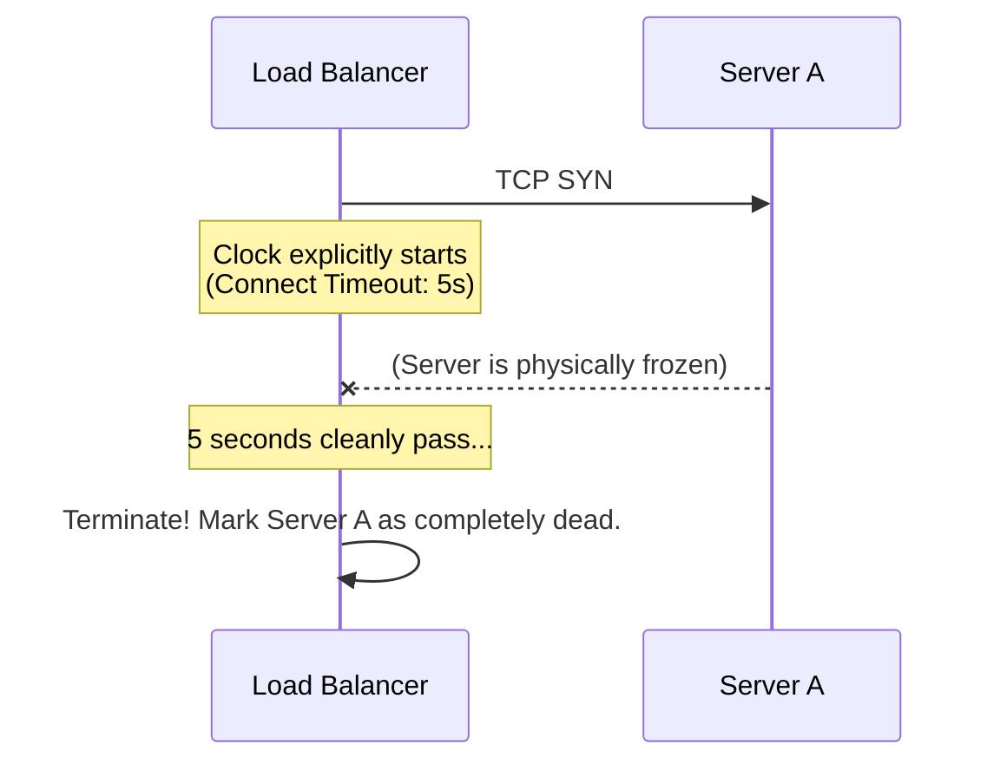
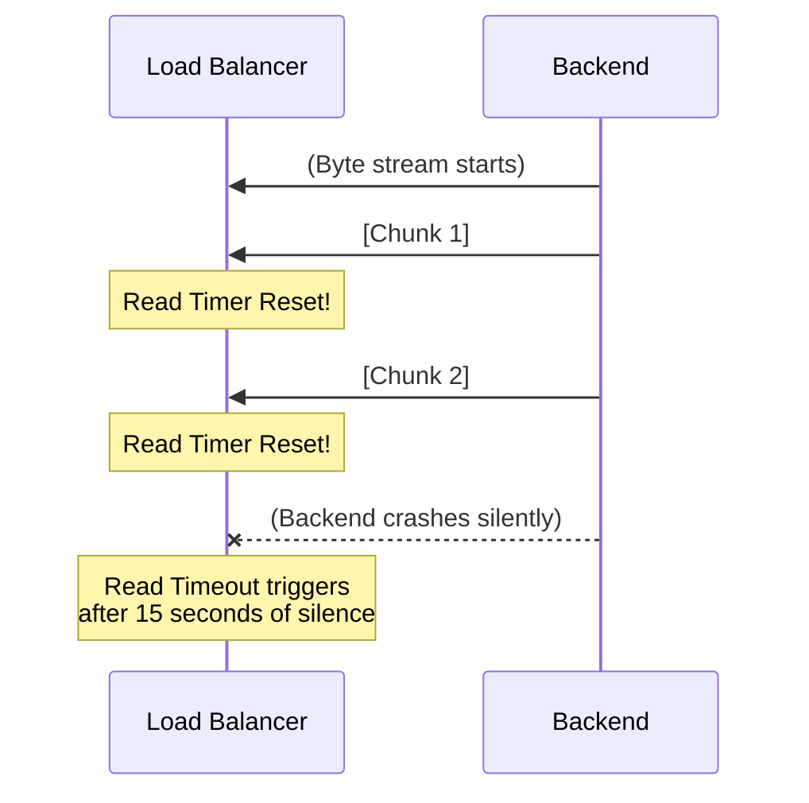

# Timeouts

Timeouts are the unsung heroes of distributed system stability. Without them, a single exceptionally slow backend server can physically cause your load balancer to infinitely hold open thousands of connections, quickly exhausting its file descriptors and violently taking your entire operation offline.

## 8.1 Connection Timeout

A **Connection Timeout** dictates the absolute maximum duration a Load Balancer will mathematically allow an entire TCP connection to theoretical remain open from start to physically finishing, regardless of what is happening actively inside it. It defines the total life-course of the TCP socket.

If a generic client successfully opens a clean connection and smoothly streams a file perfectly for 59 minutes, but the Connection Timeout is strictly set rigidly to 60 minutes, the Load Balancer will mercilessly structurally sever the TCP socket exactly at the 60-minute mark, even cleanly mid-transfer.

> **Why it is critically used:** It ruthlessly prevents memory leaks structurally on the Load Balancer, ensuring mechanically rogue connections or violently broken TCP FIN packets never natively result in permanently open "zombie" physical sockets internally.

## 8.2 Connect Timeout

A **Connect Timeout** specifically cleanly applies uniquely to the initial physical TCP Handshake (`SYN` -> `SYN-ACK` -> `ACK`). 

When a physical Load Balancer receives a client request, it actively must organically open a *new* backend proxy connection natively to a clean server (e.g., Server A). 
The Connect Timeout structurally asks: **"How long mathematically should the Load Balancer physically wait for Server A to accurately respond to the initial TCP `SYN` packet?"**

* **Standard Configuration Value:** Incredibly conceptually short. Usually strictly `1` to `5` seconds securely. 
* **If it physically triggers:** The specific LB immediately gives up aggressively on Server A, marks it cleanly as fundamentally unreachable deeply, and tries quickly mechanically sending the request flawlessly to Server B natively instead.

## 8.3 Request Timeout

A **Request Timeout** defines the total time the Load Balancer will politely wait for the backend server to process the HTTP request and return the complete HTTP response.

Unlike Connect Timeout (which just cares about the TCP handshake), the Request Timeout starts exclusively after the request has been fully sent to the backend.

If the backend server gets permanently stuck in an infinite `while(true)` loop or a Database Deadlock, the Request Timeout fires.

* **Standard Value:** Heavily depends on the API. `30` seconds is typical for web traffic. `300` seconds might be needed for heavy video compression endpoints.
* **If it triggers:** The Load Balancer physically cuts the connection and returns an **HTTP 504 Gateway Timeout** directly to the end client.

## 8.4 Read Timeout

A **Read Timeout** structurally dictates how long the Load Balancer will wait *between individual bytes* being sent back by the backend server.

Suppose your backend is dynamically streaming a massive 10GB log file back to the Load Balancer. It isn't sending it all at once; it sends it in tiny chunks.
The Read Timeout timer continuously resets to zero every time a new data chunk safely arrives.

If the backend sends Chunk 1, but then completely drops dead and stops sending bytes, the Read Timeout fires after `X` seconds of pure networking silence.

* **Standard Value:** Typically `30` to `60` seconds.
* **If it triggers:** The LB defensively rips down the connection, knowing the backend has gone "silent on the wire."

## 8.5 Write Timeout

A **Write Timeout** strictly limits how long the Load Balancer will wait while attempting to physically write data to a socket (either sending data back to the client or forwarding a payload to the backend).

If a malicious client connects to your server but artificially restricts their inbound TCP window size to 1 byte per second, a normal 1MB response would organically take weeks to transmit, dangerously holding an active thread open on your Load Balancer.

* **Standard Value:** Typically `30` to `60` seconds.
* **If it triggers:** The LB identifies the socket is heavily congested or artificially throttled and immediately drops the connection.

## 8.6 Idle Timeout

An **Idle Timeout** manages generic "Keep-Alive" (persistent) connections.

Modern HTTP/1.1 uses persistent connections. Instead of opening a brand new TCP handshake for every single image on a website, the browser leaves the TCP connection smoothly open and sends multiple requests through it. 
However, if the user leaves the website, the connection is sitting there "Idle". 
The Idle Timeout forcefully closes the connection if absolutely zero bytes travel in either direction for `X` seconds.

* **Standard Value:** `60` seconds (AWS ALB default) up to `300` seconds.
* **Architecture Trap:** Your Load Balancer's Idle Timeout **must** be strictly lower than your backend server's Idle Timeout. If the backend silently closes it first, the LB might mistakenly try sending a new request down a dead pipe, resulting in a `502 Bad Gateway`.

## 8.7 Backend Timeout vs Client Timeout

It is crucial to understand that a Load Balancer natively manages two completely disconnected TCP sockets.

1. **Client -> LB (Client-side Timeout)**
2. **LB -> Server (Backend-side Timeout)**

If a client's mobile network explicitly drops, the **Client Read/Write Timeout** confidently fires. The LB terminates the client socket, but optionally leaves the Backend socket open to gracefully finish database writes to internally prevent data corruption.

## 8.8 Timeout Propagation

In massive distributed microservice chains (e.g., `Client -> Gateway -> Service A -> Service B`), rigid static timeouts natively fail logically.

If `Gateway` has a strict 5-second timeout, but `Service A` takes 4 seconds, `Service B` doesn't magically have 5 seconds left. It only has 1 second left. 

**Timeout Propagation** (often organically implemented via proxy headers like `x-envoy-upstream-rq-timeout-ms` or `grpc-timeout`) dynamically mathematically passes the *remaining* time down the architectural chain so `Service B` knows exactly how long it has to organically finish before the absolute edge Load Balancer inevitably gives up.

## 8.9 Timeout Configuration (Best Practices)

When manually intimately configuring timeouts safely on your Load Balancer (NGINX, HAProxy, AWS ALB), follow this structural architectural hierarchy strictly:

1. **Keep Connect Timeouts tiny:** Fast failover is paramount. (< `5s`).
2. **Set Idle Timeouts carefully:** LB Idle Timeout strictly `<` Backend Server Idle Timeout.
3. **Be generous with Request Timeouts for WebSockets:** Standard HTTP mathematically needs `30s`, but WebSockets naturally might need `3600s`.
4. **Beware Retry Amplification:** If your timeout is natively incredibly short, aggressive architectural retries can organically accidentally trigger a devastating DDoS attack cleanly on your own infrastructure.

---

⬅️ **[Previous: 7. Connections & Traffic Flow](07_Connections_Traffic_Flow.md)** | 🏠 **[Back to TOC](README.md)** | **[Next: 9. Session Management ➡️](09_Session_Management.md)**
