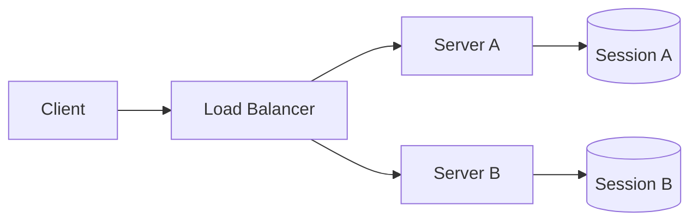
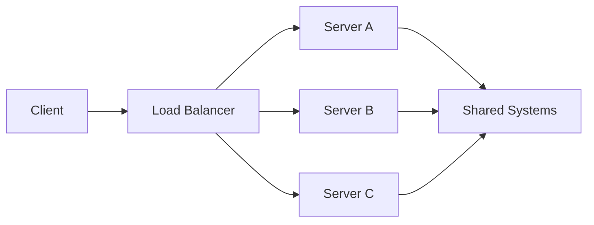
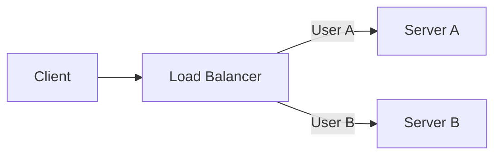
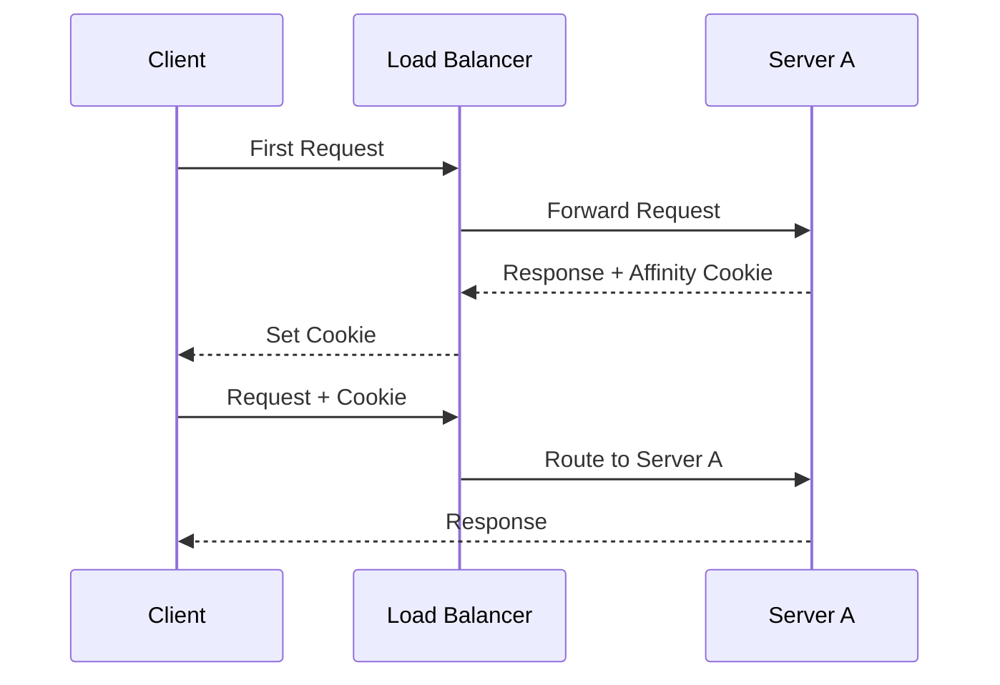
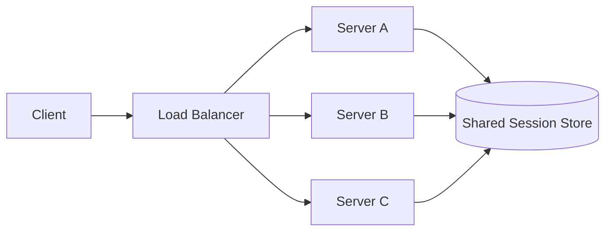
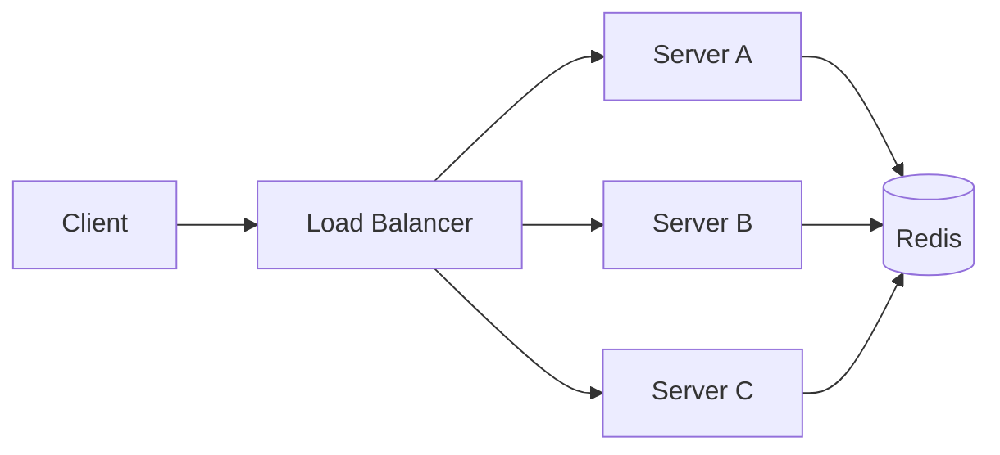
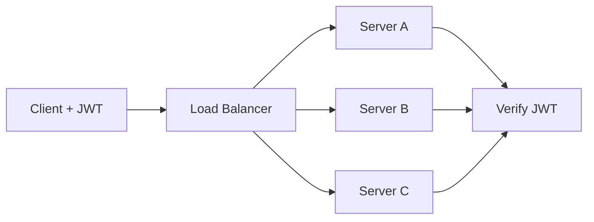
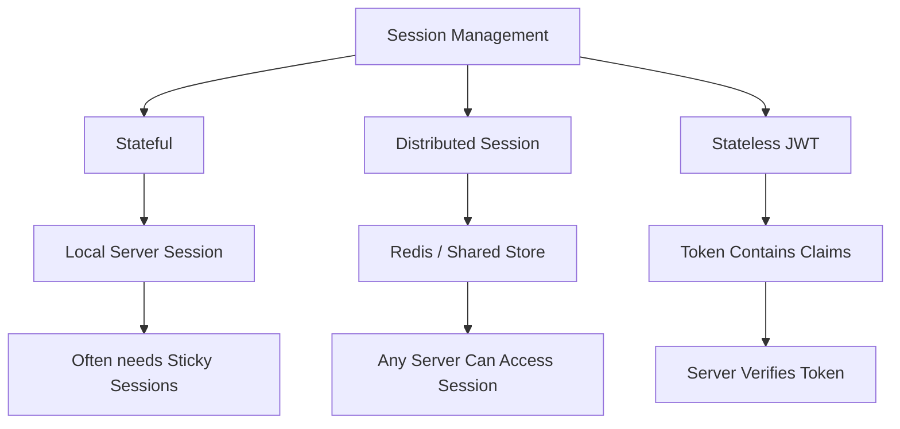

# Session Management

Session management is about maintaining information about a user's interaction with a backend across multiple requests.

For example, after logging in, the server needs to know:

```text
Request 1 → Login
Request 2 → Who is this user?
Request 3 → What permissions does this user have?
Request 4 → Is this session still valid?
```

The main architectural question is:

> **Where is the session state stored?**

It can live inside the server, in a shared store such as Redis, or be represented by a token such as a JWT.

---

## Stateful Servers

A **stateful server** stores session information locally in its own memory or storage.



For example:

```text
Server A:
session_123 → User 42
```

If the next request goes to Server B:

```text
Request → Server B
             ↓
       Session not found
```

The server does not have the session information stored on Server A.

### Problem

Stateful servers become harder to scale horizontally because requests may need to reach the server holding the session.

This often leads to **session affinity/sticky sessions**.

---

## Stateless Servers

A **stateless server** does not depend on local memory to maintain user session state.

Each request contains enough information for the server to authenticate or identify the user.



Any server can process the request.

```text
Request 1 → Server A
Request 2 → Server C
Request 3 → Server B
```

This makes horizontal scaling easier.

### Important

Stateless does **not** mean the system has no state.

State may still exist in:

- Database
- Redis
- Object storage
- Other shared services

It means the individual application server does not depend on its own local session state.

---

## Session Affinity

**Session affinity** means repeatedly routing a client's requests to the same backend server.



If User A is assigned to Server A:

```text
User A
  ↓
Server A
  ↓
Server A
  ↓
Server A
```

This allows Server A to keep the user's session locally.

Session affinity is commonly implemented using **sticky sessions**.

---

## Sticky Sessions

A **sticky session** is a load-balancing mechanism that tries to keep a client connected to the same backend server.

```text
User
  │
  ▼
Load Balancer
  │
  ├── First request → Server A
  ├── Next request  → Server A
  └── Next request  → Server A
```

This can make stateful applications work across multiple servers without immediately introducing a distributed session store.

However, it creates trade-offs discussed below.

---

## Cookie-Based Affinity

The load balancer can use a cookie to remember which backend should receive a client.

For example:

```text
Set-Cookie:
LB_SERVER=server-a
```

Later:

```text
Cookie:
LB_SERVER=server-a
```

The load balancer can then route the request to Server A.



Cookie-based affinity is generally more explicit than relying on the client's IP address.

---

## IP-Based Affinity

The load balancer can hash the client's IP address and use the result to select a backend.

```text
Client IP
   ↓
Hash
   ↓
Backend Server
```

For example:

```text
10.0.0.25
    ↓
Hash
    ↓
Server B
```

Future requests from the same IP may be routed to Server B.

### Problems

Many users can appear behind the same public IP because of:

- NAT
- Corporate networks
- Mobile networks
- Proxies

A user's IP can also change.

Therefore, IP-based affinity does not necessarily identify a unique user.

---

## Problems with Sticky Sessions

Sticky sessions solve one problem but introduce several trade-offs.

### 1. Uneven Load

Suppose:

```text
Server A → 1,000 users
Server B → 200 users
Server C → 150 users
```

Traffic may become unbalanced because users are tied to specific servers.

### 2. Poor Failover

If Server A fails:

```text
User → Server A ❌
```

The user's local session may disappear.

The load balancer can send the user to another server, but that server may not have the session.

### 3. Scaling Complexity

When new servers are added, existing users may remain concentrated on older servers.

### 4. Reduced Flexibility

The load balancer cannot freely distribute requests based on current server load.

### 5. Long-Lived Connections

Sticky routing can become especially important for long-lived connections such as WebSockets, where an established connection remains associated with a particular backend.

### Main Trade-off

```text
Sticky Sessions
      ↓
Simpler local sessions
      +
Less flexible traffic distribution
      +
Harder failover
```

---

## Distributed Sessions

A **distributed session** stores session state in a shared system accessible by multiple backend servers.



Now any server can retrieve the session.

```text
Request → Server A → Session Store
Request → Server C → Session Store
Request → Server B → Session Store
```

This removes the need for sticky sessions in many architectures.

### Benefits

- Better horizontal scaling
- Better load distribution
- Easier server failover
- Any backend can process the request

### Trade-off

The session store itself becomes an important shared dependency and must be highly available.

---

## Redis-Based Sessions

**Redis** is commonly used as a distributed session store because it provides fast in-memory access.



Example:

```text
Session ID:
sess_abc123

Redis:
sess_abc123 → {
    userId: 42,
    role: "admin",
    expiresAt: ...
}
```

The client usually receives only the session identifier:

```text
Cookie:
session_id=sess_abc123
```

The server uses that ID to retrieve the session from Redis.

### Benefits

- Fast access
- Shared between application servers
- Centralized session invalidation
- Supports expiration/TTL
- Works well with horizontally scaled applications

### Important

Redis becomes part of the request path:

```text
Request
   ↓
Application
   ↓
Redis
   ↓
Session
```

Therefore Redis availability, latency, memory limits, replication, and failover matter.

---

## JWT-Based Stateless Authentication

A **JWT (JSON Web Token)** can carry authentication information inside the token itself.

Instead of storing the session data on the server:

```text
Client
  │
  │ JWT
  ▼
Server
  │
  └── Verify token
```

A JWT may contain claims such as:

```json
{
  "sub": "user_42",
  "role": "admin",
  "exp": 1780000000
}
```

The server verifies the token's signature and validity.

Any application server with the necessary verification information can process the request.



### Benefits

- No server-local session required
- Easy horizontal scaling
- No session-store lookup for basic verification
- Works well across multiple services

### Trade-offs

JWTs introduce different challenges:

- Revoking tokens can be harder
- Large tokens increase request size
- Token expiry must be designed carefully
- Sensitive data should not be placed in a JWT merely because it is encoded
- Signing keys must be securely managed

### Important Distinction

**JWT authentication is not the same as distributed sessions.**

With Redis sessions:

```text
Client → Session ID → Redis → Session Data
```

With JWT:

```text
Client → JWT → Verify Signature → Identity/Claims
```

The JWT itself carries the claims, while a session ID points to server-side state.

---

## Session Management: Main Architectures



| Approach    | Session State | Sticky Sessions     | Scaling        | Main Trade-off              |
| ----------- | ------------- | ------------------- | -------------- | --------------------------- |
| Stateful    | Local server  | Often needed        | More difficult | Simple local state          |
| Distributed | Shared store  | Usually unnecessary | Good           | Shared-store dependency     |
| JWT         | Client token  | Not required        | Good           | Revocation/token management |

## Key Takeaways

- **Stateful server** → session lives on a specific server.
- **Stateless server** → server does not depend on local session state.
- **Session affinity/sticky sessions** keep users attached to a particular backend.
- **Cookie-based affinity** uses a cookie to identify the backend.
- **IP-based affinity** uses client IP information but can be unreliable due to NAT/proxies.
- Sticky sessions can create **uneven load and failover problems**.
- **Distributed sessions** move session state into a shared store.
- **Redis** is commonly used for fast distributed session storage.
- **JWT authentication** avoids server-side session storage for the authentication state.
- The important system-design question is:

> **Do we want the user's session state tied to one server, shared between servers, or represented by a token?**
