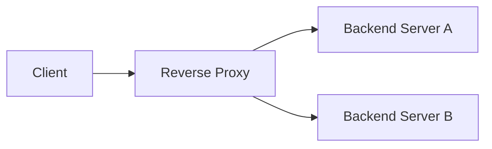
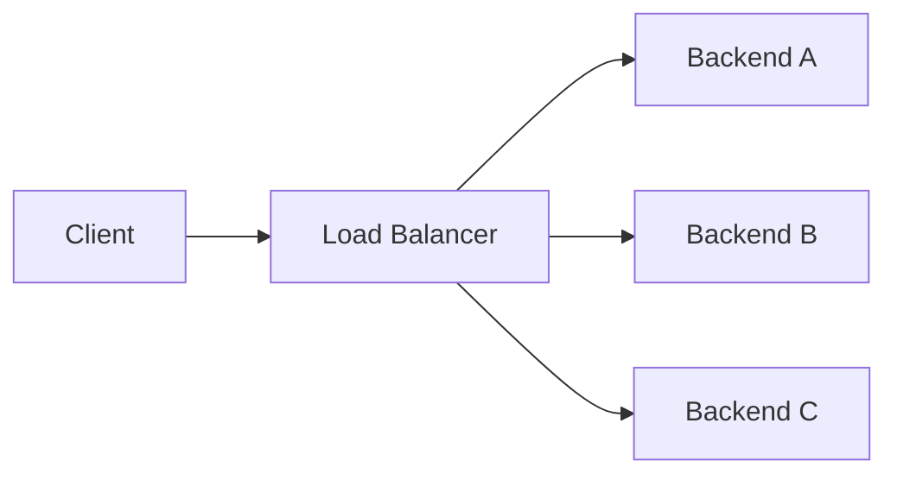
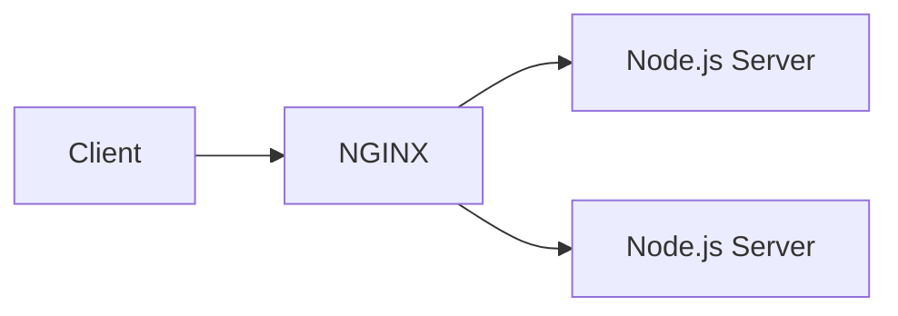
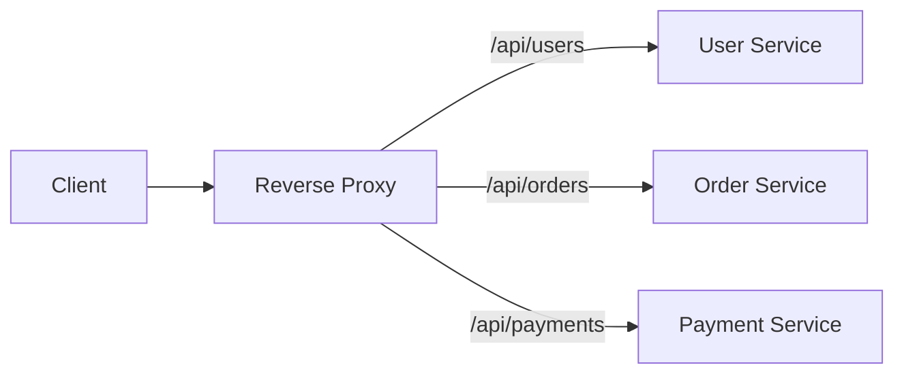
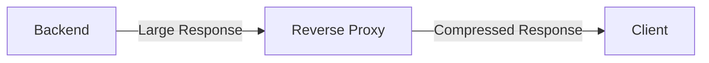
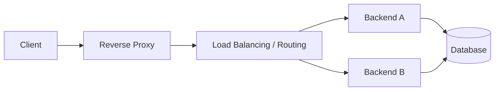

# Reverse Proxy

A **reverse proxy** is a server that sits between clients and backend servers.

Instead of clients communicating directly with the backend, they communicate with the reverse proxy, which then forwards the request to the appropriate backend.



The client generally does not need to know which backend server actually handled the request.

Common reverse proxies include:

* NGINX
* HAProxy
* Envoy
* Apache HTTP Server

---

## What is a Reverse Proxy?

A reverse proxy acts as an **intermediary for backend servers**.

For example:

```text
Client
   │
   │ GET /users
   ▼
Reverse Proxy
   │
   ▼
Backend Server
   │
   ▼
Response
```

The reverse proxy can perform additional work before forwarding the request, such as:

* Routing
* TLS termination
* Load balancing
* Caching
* Compression
* Header manipulation
* Access control

### Why use one?

Without a reverse proxy:

```text
Client ───────────→ Backend
```

With a reverse proxy:

```text
Client ──→ Reverse Proxy ──→ Backend
```

This creates a controlled entry point into the backend infrastructure.

The backend servers can remain private while the reverse proxy is publicly accessible.

---

## Reverse Proxy vs Load Balancer

These concepts overlap, but they are not identical.

### Reverse Proxy

A reverse proxy primarily acts as an **intermediary between clients and backend services**.

It can provide:

* Request routing
* TLS termination
* Caching
* Compression
* Header manipulation
* Access control

### Load Balancer

A load balancer's primary responsibility is **distributing traffic across multiple backend instances**.



### Important

A reverse proxy **can also be a load balancer**.

For example:

```text
NGINX
 ├── Reverse Proxy
 └── Load Balancer
```

Therefore:

> **Load balancing is one possible function of a reverse proxy.**

| Feature                  | Reverse Proxy | Load Balancer |
| ------------------------ | ------------- | ------------- |
| Sits in front of backend | Yes           | Yes           |
| Hides backend servers    | Yes           | Yes           |
| Request routing          | Yes           | Often         |
| Load distribution        | Can do        | Core purpose  |
| TLS termination          | Common        | Common        |
| Caching                  | Common        | Sometimes     |
| Compression              | Common        | Sometimes     |

---

## NGINX as Reverse Proxy

**NGINX** is commonly used as a reverse proxy in backend architectures.

A typical setup:



The client communicates with NGINX, not directly with the Node.js application.

NGINX can handle:

* HTTPS
* Routing
* Load balancing
* Static files
* Compression
* Caching
* Connection handling

This allows the application server to focus mainly on application logic.

### Example Architecture

```text
Internet
   │
   ▼
NGINX
   │
   ├── /api/users  → Backend
   ├── /api/orders → Backend
   └── /static     → Static Files
```

---

## Request Routing

A reverse proxy can inspect the incoming request and decide where it should go.

For example, based on the URL path:



Example:

```text
/api/users
      ↓
User Service

/api/orders
      ↓
Order Service

/api/payments
      ↓
Payment Service
```

Routing can also be based on:

* Hostname
* Path
* HTTP method
* Headers
* Cookies
* Query parameters

### Host-Based Routing

```text
api.example.com
      ↓
API Server

admin.example.com
      ↓
Admin Server
```

This is especially useful in systems containing multiple services or applications.

---

## TLS Termination

A reverse proxy can handle the HTTPS/TLS connection from the client.


The reverse proxy decrypts the incoming TLS traffic.

This is called **TLS termination**.

Instead of every backend server managing certificates and TLS connections independently:

```text
Client
   │ HTTPS
   ▼
Reverse Proxy
   │
   │ HTTP/HTTPS
   ▼
Backend
```

The proxy can centrally manage:

* TLS certificates
* HTTPS
* TLS versions
* Cipher configuration
* Certificate renewal

### Important

TLS termination does **not** necessarily mean the connection from proxy to backend must be HTTP.

It can also be:

```text
Client
  │ HTTPS
  ▼
Proxy
  │ HTTPS
  ▼
Backend
```

This is useful when encryption is required throughout the internal network.

---

## Compression

A reverse proxy can compress responses before sending them to the client.



For example:

```text
Backend
   │
   │ 1 MB response
   ▼
Reverse Proxy
   │
   │ gzip / Brotli
   ▼
Client
   │
   ▼
300 KB
```

Compression can reduce:

* Network bandwidth
* Response size
* Transfer time

However, compression also consumes CPU.

Therefore, it is a trade-off between:

```text
CPU usage
   ↕
Network bandwidth
```

Compression is particularly useful for text-based responses such as:

* HTML
* CSS
* JavaScript
* JSON
* XML

---

## Caching

A reverse proxy can cache responses so repeated requests do not always reach the backend.


### Cache Hit

```text
Client
  ↓
Reverse Proxy
  ↓
Cache
  ↓
Response
```

Backend is not contacted.

### Cache Miss

```text
Client
  ↓
Reverse Proxy
  ↓
Backend
  ↓
Reverse Proxy
  ↓
Client
```

Caching can reduce:

* Backend requests
* Database load
* Response latency
* Network traffic

### Important

Not every response should be cached.

Caching must consider:

* Cache-Control headers
* TTL
* User-specific data
* Authentication
* Invalidation
* Stale data

For example, caching a public product catalog may be reasonable, while blindly caching a user's private account response can be incorrect and dangerous.

---

## Header Manipulation

A reverse proxy can add, remove, or modify HTTP headers.

For example:

```text
Client
   │
   │ Request
   ▼
Reverse Proxy
   │
   │ Adds headers
   ▼
Backend
```

It may add information such as:

```text
X-Request-ID
X-Forwarded-For
X-Forwarded-Proto
```

It can also:

* Remove unwanted headers
* Add security headers
* Modify routing-related headers
* Control caching headers

### Why is this useful?

The backend may need information about the original request even though the request first passed through the proxy.

---

## Forwarded Headers

When a reverse proxy forwards a request, the backend may otherwise see the proxy as the client.

For example:

```text
Client IP: 203.0.113.10

Client
   │
   ▼
Reverse Proxy
   │
   ▼
Backend
```

The backend may see:

```text
Source IP = Reverse Proxy
```

The proxy can forward the original client information using headers such as:

```text
X-Forwarded-For
X-Forwarded-Proto
X-Forwarded-Host
```

For example:

```text
X-Forwarded-For: 203.0.113.10
X-Forwarded-Proto: https
X-Forwarded-Host: api.example.com
```

### X-Forwarded-For

Used to communicate the original client IP.

```text
Client
   │ 203.0.113.10
   ▼
Proxy
   │
   │ X-Forwarded-For: 203.0.113.10
   ▼
Backend
```

### X-Forwarded-Proto

Indicates the original protocol:

```text
X-Forwarded-Proto: https
```

This is useful when:

```text
Client → HTTPS → Proxy → HTTP → Backend
```

The backend can still know that the original request was HTTPS.

### Important Security Consideration

Forwarded headers should only be trusted when they come from **trusted proxies**.

A client should not be allowed to arbitrarily claim:

```text
X-Forwarded-For: 1.2.3.4
```

and have the backend blindly trust it as the real client IP.

The proxy/network configuration should determine which forwarded headers are trusted.

---

## Reverse Proxy in a Backend Architecture

A reverse proxy often sits near the edge of the application architecture:



In smaller systems, one component can perform several roles:

```text
NGINX
 ├── Reverse Proxy
 ├── TLS Termination
 ├── Load Balancing
 ├── Compression
 └── Caching
```

In larger architectures, these responsibilities may be separated across different layers:

```text
Client
  ↓
CDN / WAF
  ↓
Load Balancer
  ↓
Reverse Proxy / Ingress
  ↓
Application Services
```

## Key Takeaways

* A **reverse proxy** sits between clients and backend servers.
* It provides a controlled entry point to backend infrastructure.
* A reverse proxy can perform **routing, TLS termination, caching, compression, and header manipulation**.
* A reverse proxy **can also perform load balancing**, but reverse proxy and load balancer are not exactly the same concept.
* **NGINX** is a common reverse proxy.
* **TLS termination** moves TLS handling to the proxy layer.
* **Caching** can reduce backend and database load.
* **Compression** reduces network traffic at the cost of CPU.
* **Forwarded headers** preserve information about the original client/request.
* Forwarded headers must be handled carefully because clients can spoof headers if the proxy configuration is not trusted correctly.

### Simple Mental Model

```text
Reverse Proxy:
"Receive the client's request, apply infrastructure-level processing,
and decide how the request should reach the backend."
```
