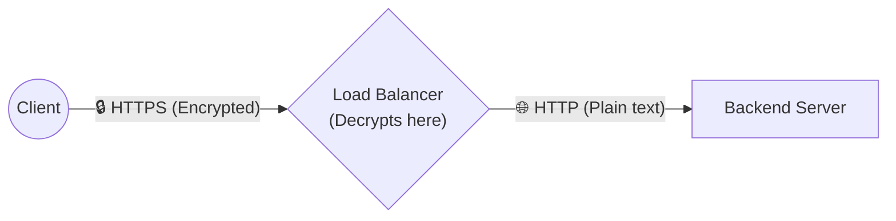
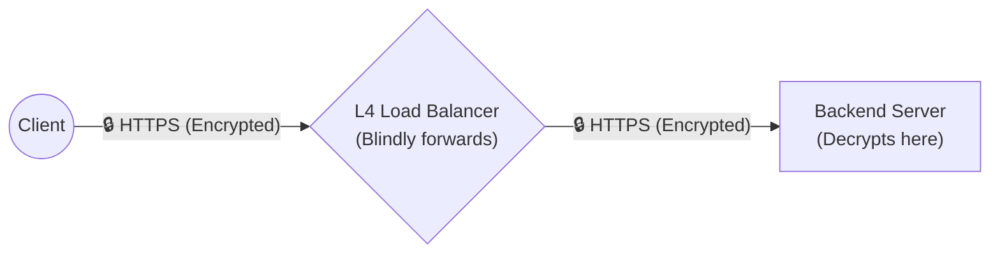
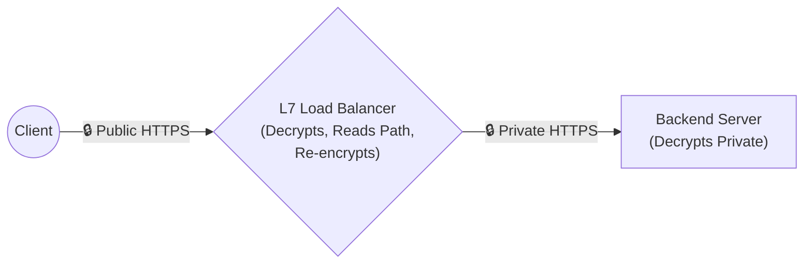

# 11. TLS & SSL at Load Balancer

Encrypting traffic over the public internet using **TLS (Transport Layer Security)**—formerly known as SSL—is mandatory for modern architecture. However, mathematically decrypting TLS involves incredibly heavy CPU usage because it relies on complex cryptographic handshakes. 

Load Balancers handle TLS logically in three main architectural patterns.

## 1. TLS Termination (Offloading)

In **TLS Termination**, the Load Balancer acts as the absolute endpoint for the public encrypted internet. 
It accepts the incoming encrypted packet, forcefully decrypts it using its stored SSL certificates, and then forwards the request as generic, **unencrypted plain-text** (HTTP) across your internal network to the backend servers.

* **Pros:** 
  * The backend servers never have to waste expensive CPU cycles doing cryptography math. They just serve raw API data.
  * You only have to install your SSL Certificate in one single place (The Load Balancer), making certificate renewal incredibly easy.
* **Cons:** 
  * Internal VPC traffic is completely unencrypted. If a hacker breaches your internal network, they can violently read all traffic (passwords, credit cards) in plain text.

## 2. TLS Passthrough (E2EE)

In **TLS Passthrough**, the Load Balancer explicitly refuses to read or decrypt the packet. 
It operates strictly as a "dumb" L4 network router. It grabs the encrypted TCP blob strictly off the wire and immediately throws it straight at the backend Server. The backend server holds the SSL Certificate and structurally does the heavy decryption math itself.

* **Pros:** 
  * **End-to-End Encryption (E2EE):** The Load Balancer physically cannot see the payload. Highly crucial for extremely regulated banking or HIPAA-compliant healthcare applications.
  * Near-zero CPU overhead on the Load Balancer.
* **Cons:** 
  * **Zero L7 Routing Intelligence:** Because the LB cannot decrypt the payload, it cannot read the HTTP Path. You cannot dynamically route `/api/video` differently than `/api/chat`.
  * You must brutally install and correctly renew SSL Certificates on every single individual backend machine.

## 3. TLS Re-encryption (Bridging)

**TLS Re-encryption** perfectly combines the intelligence of Termination with the robust security of Passthrough.
The Load Balancer successfully decrypts the inbound connection from the public internet (so it can deeply read the URL path and make smart routing decisions). Then, right before forwarding it to the backend, it organically encrypts it *again* using a completely separate internal SSL certificate.

* **Pros:** 
  * Maximum internal security (Data is encrypted inside the VPC natively).
  * Retains full L7 Application-layer routing logic correctly.
* **Cons:** 
  * Exceptionally high CPU usage heavily applied (Traffic is mathematically dynamically encrypted twice and formally decrypted twice generically natively).

## Comprehensive Comparison

| Strategy | LB Decrypts? | Backend Decrypts? | Security Inside VPC | L7 Routing? | Used For |
| :--- | :--- | :--- | :--- | :--- | :--- |
| **TLS Termination** | ✅ Yes | ❌ No | ❌ Unencrypted (HTTP) | ✅ Yes | 95% of standard web apps. |
| **TLS Passthrough** | ❌ No | ✅ Yes | ✅ Encrypted (HTTPS) | ❌ No | Highly secure Financial/Medical apps. |
| **TLS Re-encryption** | ✅ Yes | ✅ Yes (Internal) | ✅ Encrypted (HTTPS) | ✅ Yes | Zero-Trust environments. |

## Certificate Management

When deploying Load Balancers (especially with TLS Termination), you must manage the lifecycle of your SSL Certificates.

* **Automated Renewal:** Using tools like Let's Encrypt (ACME protocol) allows Load Balancers (like Traefik or Caddy) to automatically renew certs every 90 days with zero human intervention.
* **Wildcard Certificates:** A single cert that covers `*.example.com`, allowing the LB to securely route traffic to `api.example.com` and `app.example.com` simultaneously.
* **Centralized Store:** Cloud providers (AWS ACM) centrally manage the certificates and bind them directly to the Load Balancers, drastically reducing security misconfigurations.

## HTTPS → HTTP (The Standard)

This is the most common architectural pattern (TLS Termination).
1. The client establishes a heavily encrypted **HTTPS** connection with the Load Balancer over Port 443.
2. The LB terminates the SSL.
3. The LB establishes a fast, unencrypted **HTTP** connection with the Backend Server over Port 80.

## HTTPS → HTTPS (End-to-End)

This maps to TLS Re-encryption or TLS Passthrough.
1. The client connects via **HTTPS** (Port 443).
2. The Load Balancer connects to the backend *also* via **HTTPS** (Port 443).
This ensures that even if an attacker physically breaches your AWS VPC, they cannot sniff passwords traversing between your Load Balancer and your Backend server.

## mTLS (Mutual TLS)

Standard TLS only validates the **Server's** identity. The client asks: *"Are you really google.com?"* The server proves it with a certificate.

**Mutual TLS (mTLS)** is a Zero-Trust architecture feature where the **Client and Server must both prove their identities to each other.**
The Load Balancer demands a cryptographic certificate from the Client before it even allows the TCP connection to fully establish. 

* **Use Case:** Highly secure internal Microservices. `Service A` connects to `Service B`. The Load Balancer in front of `Service B` uses mTLS to cryptographically verify that it is actually `Service A` making the request, instantly dropping unauthorized traffic.

---

---

