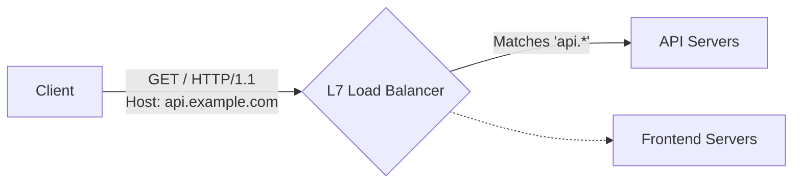
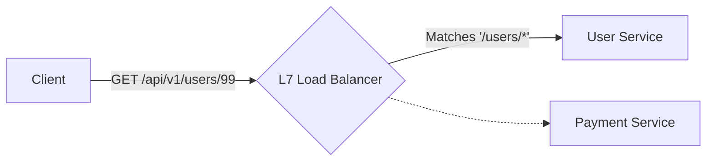
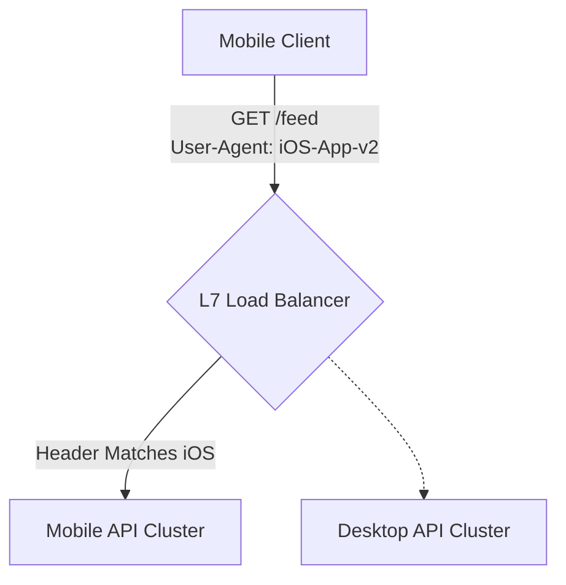
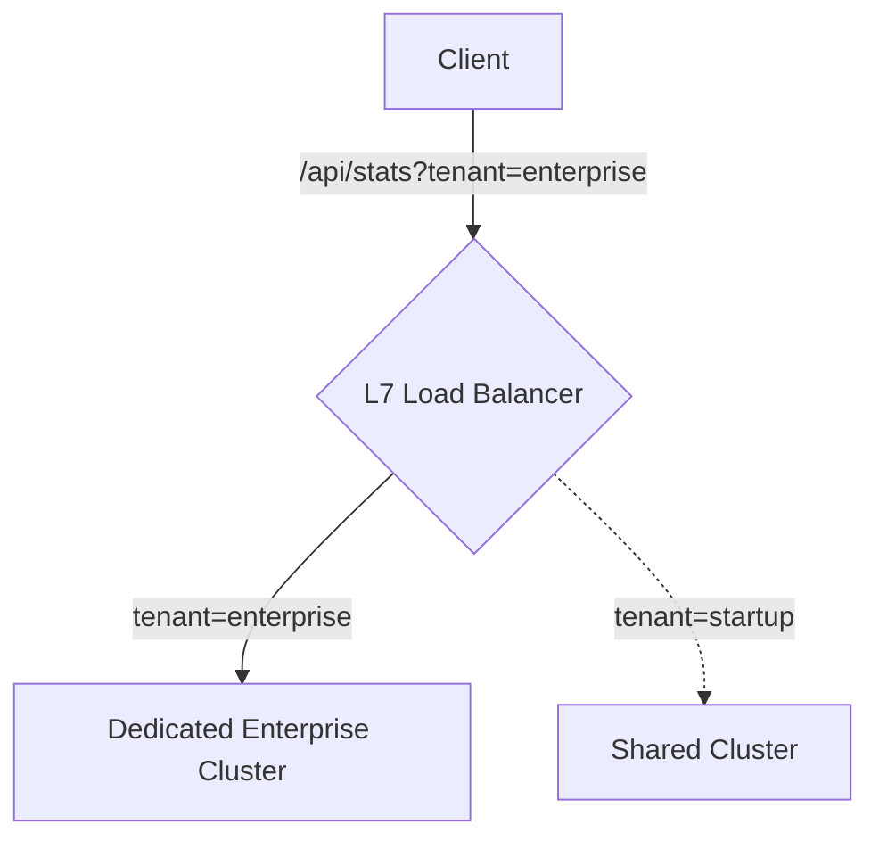

# 12. Load Balancer Routing

An L7 (Application Layer) Load Balancer is not just about distributing traffic evenly. Because it inherently decrypts and reads HTTP requests, it is extremely intelligent. It can look deep inside the network packet and physically route the request to entirely different backend server clusters strictly based on the *content* of the request.

Here are the most common L7 Routing Strategies heavily used in Microservice architectures.

## 12.1 Host-Based Routing

**Host-Based Routing** (also known as Virtual Hosting) looks strictly at the `Host` header mechanically inside the HTTP request. 

This essentially allows you to securely host completely different domain names on the exact same structural Load Balancer IP address efficiently.

* **If** `Host: api.example.com` ➔ Route cleanly to **API Cluster**
* **If** `Host: web.example.com` ➔ Route cleanly to **Frontend Cluster**
* **If** `Host: admin.example.com` ➔ Route cleanly to **Internal Admin Cluster**

## 12.2 Path-Based Routing

**Path-Based Routing** deeply inspects the raw URI (Uniform Resource Identifier) path in the inbound HTTP request.

If you are heavily breaking up a massive monolithic application into clean microservices, this is structurally how you ensure specific URL endpoints hit exactly the correct service.

* **If** Path strictly starts with `/api/v1/users/*` ➔ Route safely to **User Microservice**
* **If** Path strictly starts with `/api/v1/payments/*` ➔ Route safely to **Payment Microservice**
* **If** Path strictly starts with `/images/*` ➔ Route safely to **Static Asset Server**

## 12.3 Header-Based Routing

HTTP requests natively contain metadata structurally bundled as Headers. **Header-Based Routing** explicitly reads these custom key-value pairs purely to route traffic intelligently.

This is massively popular natively for internal API versioning or device-specific routing smartly.

* **If** Header `User-Agent` natively contains `Mobile` ➔ Route explicitly to **Mobile Backend**
* **If** Header `X-API-Version` exactly equals `v2-beta` ➔ Route explicitly to **Beta Testing Cluster**
* **If** Header `Accept-Language` exactly equals `es-ES` ➔ Route explicitly to **Spanish Localization Server**

## 12.4 Cookie-Based Routing

Cookies are technically just specialized HTTP Headers, but they represent persistent user state. **Cookie-Based Routing** securely reads the cookie from the browser and securely pins that specific user to a designated backend cluster.

* **If** Cookie `plan=premium` ➔ Route safely to **High-Performance Premium Servers** (better CPUs).
* **If** Cookie `session_id=123AB` ➔ Route strictly to **Server A** (because Server A fundamentally holds the local memory for that session. See: Sticky Sessions).
* **If** Cookie `ab_test_group=B` ➔ Route intelligently to the **Experimental UI Backend**.

> **Architectural Note:** Because this inherently requires securely decrypting the SSL payload to rigorously read the Cookie string, it is absolutely scientifically impossible on a purely UDP/TCP L4 Load Balancer. You explicitly must use an L7 Load Balancer.

## 12.5 Query-Based Routing

**Query-Based Routing** reads the URL Query string (the parameters after the `?` in a URL) and dynamically makes routing decisions. 

**Vast Scenario: Multi-Tenant SaaS Architecture**
Imagine you are building a B2B SaaS analytics platform. Huge corporate clients (like Netflix or Uber) naturally generate 1000x more database queries than small startup clients. If you blindly throw all companies onto the same database servers, Netflix's massive queries will severely choke the startup's queries (a classic "Noisy Neighbor" problem).

To effortlessly solve this, your Load Balancer can structurally read the query parameter: `?tenant_id=XYZ`.
* **If** `?tenant_id=enterprise_client` ➔ Securely route them directly to a deeply isolated **Dedicated Enterprise Data Cluster**.
* **If** `?tenant_id=startup_joe` ➔ Safely route them to the **Shared Tier Resource Pool**.

## 12.6 Weighted Routing

**Weighted Routing** does not strictly rely on the HTTP headers or URL contents logically. Instead, you mathematically assign percentage "Weights" arbitrarily to different backend server pools, and the Load Balancer purely enforces that distribution natively through probability.

**Scenario: Gradual Feature Rollouts**
You have rigorously built a brand new, highly optimized Video Transcoding service (Cluster B). Your old architecture (Cluster A) flawlessly handles 100% of production traffic. You are terrified that if you instantaneously flip the switch, a hidden memory leak in Cluster B will violently crash your entire business globally.

You forcefully implement Weighted Routing precisely at the Load Balancer:
* **Cluster A (Old Stable Code):** Set weight to `90%`.
* **Cluster B (New Beta Code):** Set weight to `10%`.

For every 10 users logically requesting a video, 9 are routed to the old servers natively, and precisely 1 is routed experimentally to the new server securely. You safely monitor the CPU logs on Cluster B strictly for a week before safely cranking it aggressively to `100%`.

## 12.7 Traffic Splitting (Canary Deployments)

This heavily overlaps with Weighted Routing, but **Traffic Splitting (Canary)** is explicitly used dynamically within rapid CI/CD automated deployment pipelines. 

**Scenario: The "Canary in the Coal Mine" automated deployment.**
Instead of manually tweaking network weights in the AWS console, your GitHub deployment pipeline automatically tells the Kubernetes Ingress Load Balancer: "Route exactly 2% of live production traffic directly to the new Version 2 Pods."
If the Load Balancer detects that `500 Internal Server Errors` violently spike on that isolated 2% of traffic, the Load Balancer magically aborts the canary split and gracefully routes 100% of traffic safely back to the stable older version within milliseconds.

* **A/B Testing:** Traffic splitting is also mechanically used by Marketing Teams flexibly. They cleanly configure the Load Balancer to logically route 50% of users gracefully to `UI-Design-A` and 50% to `UI-Design-B` to measure which codebase intrinsically generates more user conversions.

## 12.8 Version-Based Routing

**Version-Based Routing** is the absolute fundamental bedrock natively of maintaining public REST APIs over many years. 

**Scenario: Mobile Application Lifecycle**
When you publish an iOS application, you fundamentally cannot force users to cleanly update their phones. If you aggressively introduce a massive breaking change mechanically to your backend database schema (Version 2.0), all users running the old explicitly outdated app (Version 1.0) will instantly crash.

You expertly program your L7 Load Balancer natively to read the URL or the `Accept` header.
* **If** `GET /api/v1/users` ➔ Route flawlessly to **Legacy Cluster V1 (Deprecated but Active)**
* **If** `GET /api/v2/users` ➔ Route perfectly to **Modern Cluster V2 (Active)**

This elegantly allows massive engineering teams to aggressively deploy entirely new architectures dynamically while safely isolating legacy technical debt gracefully on old clusters until usage reliably drops to zero.

---

⬅️ **[Previous: 11. TLS & SSL at Load Balancer](11_TLS_SSL_at_Load_Balancer.md)** | 🏠 **[Back to TOC](README.md)** | **[Next: 13. Failure Handling ➡️](13_Failure_Handling.md)**
