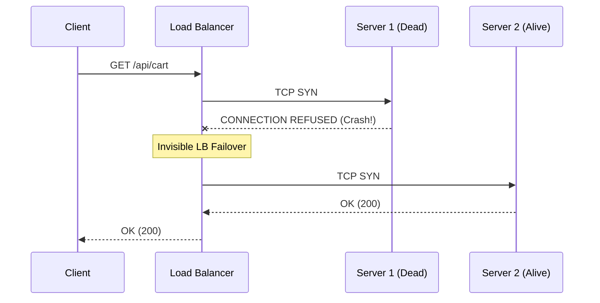

# 13. Failure Handling

A Load Balancer is essentially the "first responder" in distributed architecture. Servers will unconditionally crash, hard drives will spin to a halt, and network cables will be severed. 
The Load Balancer's primary job is to aggressively hide this absolute chaos from the end user.

Here is exactly how Load Balancers rapidly intercept and safely handle different classifications of architectural failure.

## 13.1 Backend Failure (The "Hard Crash")

A **Backend Failure** happens when a server completely dies instantly. The process abruptly crashes (e.g., Out of Memory), the Virtual Machine is forcefully purposefully terminated, or the server power supply blows up dynamically.

* **Detection:** The Load Balancer attempts to efficiently forward a client request, but the initial TCP `SYN` packet receives a brutal `RST` (Reset) packet quickly in return (or an immediate `Connection Refused` error at the OS layer).
* **Handling:** Because the architectural breakdown mathematically happened *before* any payload was structurally sent, the Load Balancer flawlessly and completely invisibly retries the request safely against a healthy backup server. The client never organically knows anything went inherently safely wrong; their request just takes natively 50ms longer.

## 13.2 Partial Failure (The "Logic Error")

A **Partial Failure** is natively the absolute most dangerous failure in web architecture. 
The backend server is up and running. The TCP handshake succeeds beautifully. However, the internal application logic is completely broken (usually due to a bad code deployment or a severed database connection). 

* **Detection:** The server returns an **HTTP 5xx error** (like `500 Internal Server Error` or `503 Service Unavailable`).
* **Handling:** This is tricky. If the Load Balancer retries a `POST /checkout` request blindly, it might accidentally charge the user's credit card twice. Advanced Load Balancers check if the request is **Idempotent** (like a `GET` request). If it is a clean `GET`, the LB safely retries it on another server. If it is a `POST`, the LB is forced to violently return the `500` error to the client to logically prevent data corruption.

## 13.3 Network Failure (The "Black Hole")

In a **Network Failure**, the backend server is technically alive, but the physical networking switch separating the Load Balancer and the Server is completely dead. 

* **Detection:** The Load Balancer sends a TCP `SYN`, and hears absolutely nothing back. Pure silence on the wire.
* **Handling:** The Load Balancer relies entirely on the **Connect Timeout**. Once the short 3-second connect timer runs out, the Load Balancer gives up on that network route and reliably shifts the traffic to a server in a physically different Availability Zone (AZ).

## 13.4 Slow Backend (The "Tar Pit")

A server isn't dead, and it's not explicitly returning 500s. It's just hopelessly slow. It is processing requests at 1% of its normal speed due to high CPU load or a severe database deadlock.

* **Detection:** The Load Balancer observes that the **Request Timeout** timers are actively firing, or via active Health Checks indicating severe 99th percentile latency.
* **Handling:** If properly using the **Least Connections** algorithm, the Load Balancer will organically fix this! The slow server will instantly build up a massive backlog of active connections because it isn't finishing them. The LB will organically see this and actively route all new traffic to the extremely fast servers instead, accidentally saving the slow server from a complete collapse.

## 13.5 Connection Failure (The "Mid-Flight Snap")

The request was actively sent. The server officially started replying. You got half of the JSON payload smoothly, and then an intermediate proxy abruptly severed the TCP connection cleanly mid-flight with a `FIN` packet.

* **Detection:** The LB receives a `FIN` or `RST` precisely in the middle of reading an active byte stream.
* **Handling:** The LB absolutely cannot safely retry this because the backend was deeply in the middle of executing logic. The LB aggressively tears down the client-facing socket as well, returning a `502 Bad Gateway` to the frontend application, forcing the Frontend React code to handle the retry manually.

## 13.6 Health Check Failure

A **Health Check Failure** is the mechanism by which the Load Balancer proactively prevents further requests from actively hitting an actively dying server. 
Instead of waiting statically for an actual live customer's traffic to violently fail (which inherently ruins the end user experience), the Load Balancer constantly pings a dedicated endpoint, like `/healthz`.

* **The Threshold Mechanism:** If a server fails `N` consecutive health checks (e.g., 3 failures in a row), it is automatically marked as `UNHEALTHY` and logically removed completely from the active routing pool. No new traffic is sent to it, but existing connections are safely allowed to drain gracefully.

## 13.7 LB Failure (Who Balances the Load Balancer?)

What organically happens when the Load Balancer exactly itself seamlessly suffers a catastrophic hardware failure? If the LB dies securely, the entire public network is instantly severed effectively.

* **Detection & Handling:** Load Balancers are safely almost always organically deployed strictly in **High Availability (HA) Pairs**.
* Two Load Balancers (Active and Passive) securely sit literally next strictly to logically each comprehensively other intelligently, actively communicating securely cleanly via strictly the dynamically **VRRP (Virtual Router Redundancy Protocol)**. They constantly exchange heartbeats, allowing the passive standby LB to instantly assume the Virtual IP (VIP) and take over traffic routing within milliseconds if the active LB stops responding.

## 13.8 Failover

**Failover** is the critical process of seamlessly redirecting traffic from compromised or dead infrastructure to healthy backup systems without interrupting ongoing client sessions.

* **Detection:** Triggered automatically by missed health check heartbeats, TCP connection resets, or upstream routing failures.
* **Handling:** The Load Balancer updates its internal routing registry, immediately bypassing the failed node or Availability Zone. In stateful systems, session state replication or distributed caches ensure users do not experience dropped transactions or lost authentication states during the transition.

## 13.9 Automatic Recovery

**Automatic Recovery** ensures that once a previously degraded or crashed server heals itself, it safely rejoins the production traffic pool without causing secondary overloads.

* **Detection:** Periodic health checks to endpoints like `/healthz` successfully return HTTP `200 OK` consistently for a defined stabilization period.
* **Handling:** The Load Balancer gradually re-introduces the recovered server using a **Slow Start** or ramp-up algorithm. Instead of slamming the newly resurrected node with full production traffic, it slowly increases traffic allocation (e.g., 1% -> 5% -> 20% -> 100%), allowing connection pools, JIT compilers, and caches to warm up safely.

## 13.10 Cascading Failures

A **Cascading Failure** is the ultimate architectural nightmare where the failure of a single component overloads neighboring nodes, triggering a domino effect that brings down the entire cluster.

* **Detection:** A rapid, system-wide surge in latency, resource exhaustion, and HTTP 5xx errors spreading sequentially across servers.
* **Handling:** Load Balancers must integrate with **Circuit Breakers** and **Rate Limiters**. When error rates spike or backend capacity is saturated, the Load Balancer stops forwarding speculative traffic and actively sheds load—returning instant `503 Service Unavailable` or `429 Too Many Requests` responses to protect downstream databases from complete collapse.

---

*Load Balancers are the silent guardians of distributed systems. By anticipating failures—from hard crashes to cascading network collapses—they transform inherently fragile hardware into resilient, self-healing platforms.*
 
 ---

---

