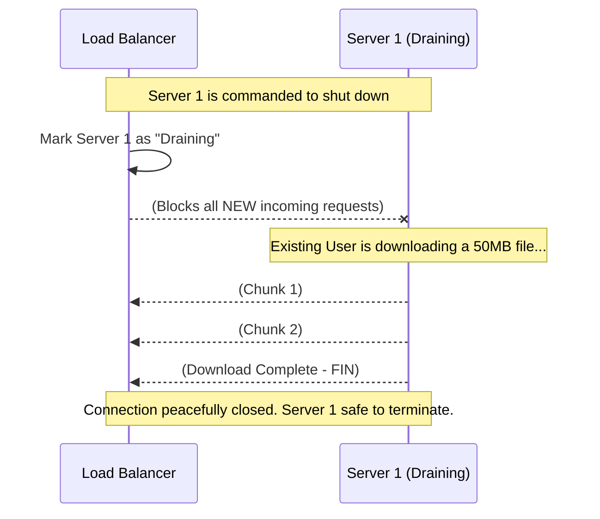

# 14. Connection Draining & Graceful Shutdown

Handling unexpected server crashes is critical, but what happens during an intentional shutdown? When you need to deploy new code or run routine maintenance, you cannot just pull the plug on a server. If you do, any user actively downloading a file or processing a payment will have their connection abruptly severed.

This is where **Connection Draining** and **Graceful Shutdowns** come in.

## 14.1 Connection Draining

**Connection Draining** is a Load Balancer feature that allows a backend server to safely finish its in-flight requests before it is taken offline.

When a server is flagged for removal, the Load Balancer instantly stops sending any *new* requests to it. However, it intentionally keeps the existing TCP sockets open for a configured timeout window (the "Draining Period"), ensuring that live downloads or heavy database transactions complete securely.

## 14.2 Deregistration

**Deregistration** is the formal process of removing a backend server from the Load Balancer's active routing target group.

* **AWS ALB Specifics:** In AWS, this is governed by the `Deregistration Delay`. By default, this is set to **300 seconds (5 minutes)**. 
* **The Timeout Trap:** If the server has a long-running WebSocket connection that hits the 300-second hard limit, the Load Balancer will ruthlessly sever the connection at that exact second, prioritizing the infrastructure teardown over the persistent connection.

## 14.3 Graceful Shutdown

While Connection Draining happens at the *Load Balancer* layer, **Graceful Shutdown** happens natively at the *Application* layer (inside your Node.js, Go, or Python code).

When a server is told to turn off (e.g., Kubernetes sends a `SIGTERM` signal), the application code explicitly intercepts this kill signal.
1. The server code immediately stops accepting new TCP connections.
2. It finishes writing to its database.
3. It closes its active active client connections nicely.
4. Finally, it cleanly exits with `process.exit(0)`.

Without application-level graceful shutdowns, the server instantly kills its own processes mid-operation, rendering the Load Balancer's connection draining completely useless.

## 14.4 Existing vs New Connections

The entire load-balancing shutdown architecture strictly hinges on how two types of traffic are handled the millisecond a server is marked for deregistration:

* **New Connections (TCP SYN):** Actively blocked and immediately routed dynamically to healthy peer servers.
* **Existing Connections (Established Sockets):** Protected. The LB allows two-way streaming bytes to continue precisely until either the client sends a `FIN` packet, or the hard architectural draining timeout (e.g. 5 minutes) triggers.

## 14.5 Deployment During Active Traffic

How exactly do hyperscale companies deploy brand new code exactly at 12:00 PM on Black Friday without a single user noticing? They intimately rely on Connection Draining paired with strategic deployment configurations.

## 14.6 Rolling Deployment

In a **Rolling Deployment**, servers are updated sequentially, replacing old code with new code gradually.

1. **Step 1:** The Load Balancer puts **Server 1** into Connection Draining mode.
2. **Step 2:** Server 1 safely finishes its active requests cleanly and gracefully shuts down.
3. **Step 3:** Server 1 is upgraded with Version 2.0.
4. **Step 4:** Server 1 successfully passes initial Health Checks and rejoins the Load Balancer target pool.
5. **Step 5:** The LB dynamically moves to flawlessly drain and update **Server 2**.

## 14.7 Blue-Green Deployment

A **Blue-Green Deployment** is massively safer for critical banking or medical applications. You maintain two identical server clusters at all times: Blue (Active) and Green (Idle).

1. The Load Balancer currently routes 100% of traffic to the **Blue Cluster**.
2. You calmly deploy Version 2.0 to the completely disconnected **Green Cluster**.
3. You run extensive QA tests privately on the Green cluster.
4. When ready, you flip a switch on the Load Balancer to instantly route 100% of NEW traffic to the **Green Cluster**.
5. The Blue Cluster enters **Connection Draining**, safely finishing all active user checkouts over the next 5 minutes.
6. Once Blue is entirely drained, it becomes the new Idle environment.

---

⬅️ **[Previous: 13. Failure Handling](13_Failure_Handling.md)** | 🏠 **[Back to TOC](README.md)** | **[Next: 15. Load Balancing & Autoscaling ➡️](15_Load_Balancing_Autoscaling.md)**
