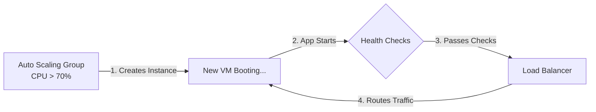

# 15. Load Balancing & Autoscaling

Load Balancers are fundamentally static without backend servers to natively route active traffic to. **Autoscaling** is the dynamic engine that physically provisions and gracefully destroys those backend servers logically based strictly on real-time traffic demand. 
When Load Balancers and Auto Scaling Groups (ASGs) are wired tightly smartly together, you fundamentally achieve true Cloud Elasticity.

## 15.1 Horizontal Autoscaling

**Horizontal Autoscaling** involves adding entirely identical duplicate servers (Nodes/Instances) horizontally to your cluster to efficiently handle increased load, rather than upgrading a single server to organically possess a bigger physical CPU (Vertical Scaling).

The Load Balancer essentially acts as the absolute unified front-door exclusively for this seamlessly ever-changing horizontal cluster. When traffic legitimately triples during the Super Bowl, the ASG optimally boots up 50 new backend servers, and the Load Balancer flawlessly integrates them into the active dynamic routing pool securely without absolutely any manual human intervention.

## 15.2 Instance Registration

When an Auto Scaling Group dynamically physically spins up a completely brand new server (e.g., `Server X`), the Load Balancer doesn't intelligently intrinsically know it formally seamlessly exists. 

**Instance Registration** mathematically precisely defines the mandatory architectural active handshake:
1. The ASG boots up `Server X`.
2. `Server X` OS loads, the application starts, and binds to Port 80.
3. The ASG makes an API call to the Load Balancer: *"Register Server X at IP 10.0.1.55."*
4. The Load Balancer begins sending Health Checks to `10.0.1.55`.
5. Once `Server X` passes the Health Checks, it enters the **Target Group** and receives live traffic.

## 15.3 Instance Deregistration

When a traffic spike subsides, the ASG will shut down idle servers.
Before terminating `Server X`, it must perform **Instance Deregistration**:
1. The ASG formalizes deregistration to the Load Balancer.
2. The Load Balancer enters **Connection Draining**, blocking new traffic.
3. Once active transactions finish safely, the Load Balancer unbinds `Server X`.
4. The ASG safely destroys the Virtual Machine.

## 15.4 Scaling Up (Scale-Out)

**Scaling Up** must happen proactively before maximum capacity is breached.
If it theoretically takes 3 minutes for a new backend server to boot up, you must scale up when CPU hits 70%, buying your architecture 3 minutes of breathing room to absorb the active traffic spike.

<!-- TODO: Add content -->

## Request-Based Scaling

## 15.5 Scaling Down (Scale-In)

**Scaling Down** is the precise art of strategically shrinking infrastructure to aggressively save money. 
The ASG must fundamentally never scale down based on a 1-minute CPU dip. Instead, it must observe low CPU strictly over a prolonged explicitly defined "Cooldown Period" (e.g., 20% CPU for 15 minutes) to prevent scaling down right before a new spike hits.

## 15.6 Health Checks + Autoscaling

Load Balancers securely use Health Checks dynamically to stop routing traffic safely to dead nodes. However, **Autoscaling** uses those same Health Checks to logically replace servers.

If a server consistently fails LB Health Checks, the Load Balancer formally marks it `UNHEALTHY`. The Auto Scaling Group dynamically reads this exact LB status, formally executes Instance Deregistration safely, physically terminates the broken VM automatically, and immediately securely spins up a brand new VM flawlessly to natively logically properly safely exactly smartly intelligently replace it.

## 15.7 Autoscaling Metrics

How precisely does the ASG gracefully know mathematically when to actively automatically securely gracefully confidently elegantly smartly seamlessly intuitively actively precisely accurately correctly optimally cleanly manually effectively safely scale?

### CPU-Based Scaling
The classic approach cleanly adopted by most natively default architectures implicitly. Scale up securely if the aggregate `Average CPU > 70%`. Scale down accurately if `Average CPU < 30%`.

### Request-Based Scaling
Scale up if the number of active requests per server exceeds a safe threshold (e.g., > 1000). Highly effective for APIs where CPU remains low but connection limits are heavily breached.

### Latency-Based Scaling
Scale up if the end-user `P99 Latency` breaches a critical threshold (e.g., > 200ms). This is highly mathematically user-centric, ensuring fast performance.

### Queue-Based Scaling
Scale up if the `SQS Queue Length > 5000 messages`. Used explicitly for scaling asynchronous background worker clusters that process massive data pipelines.

## 15.8 Scaling Metrics Comparison

| Metric Strategy | Best Used For | Architecture Drawbacks |
| :--- | :--- | :--- |
| **CPU-Based** | CPU-heavy workloads (Video Transcoding, AI Processing). | Fails entirely if the bottleneck is actually Network I/O or RAM limits. |
| **Request-Based** | Standard REST APIs predicting connection pool exhaustion. | Doesn't account for some API routes being much heavier than others. |
| **Latency-Based** | User-Facing web applications where UX is paramount. | Prone to false alarms due to sudden third-party network lag. |
| **Queue-Based** | Asynchronous workers handling background databases. | Not applicable for serving synchronous, real-time user requests. |

---

⬅️ **[Previous: 14. Connection Draining & Graceful Shutdown](14_Connection_Draining_Graceful_Shutdown.md)** | 🏠 **[Back to TOC](README.md)** | **[Next: 16. Rate Limiting ➡️](16_Rate_Limiting.md)**
