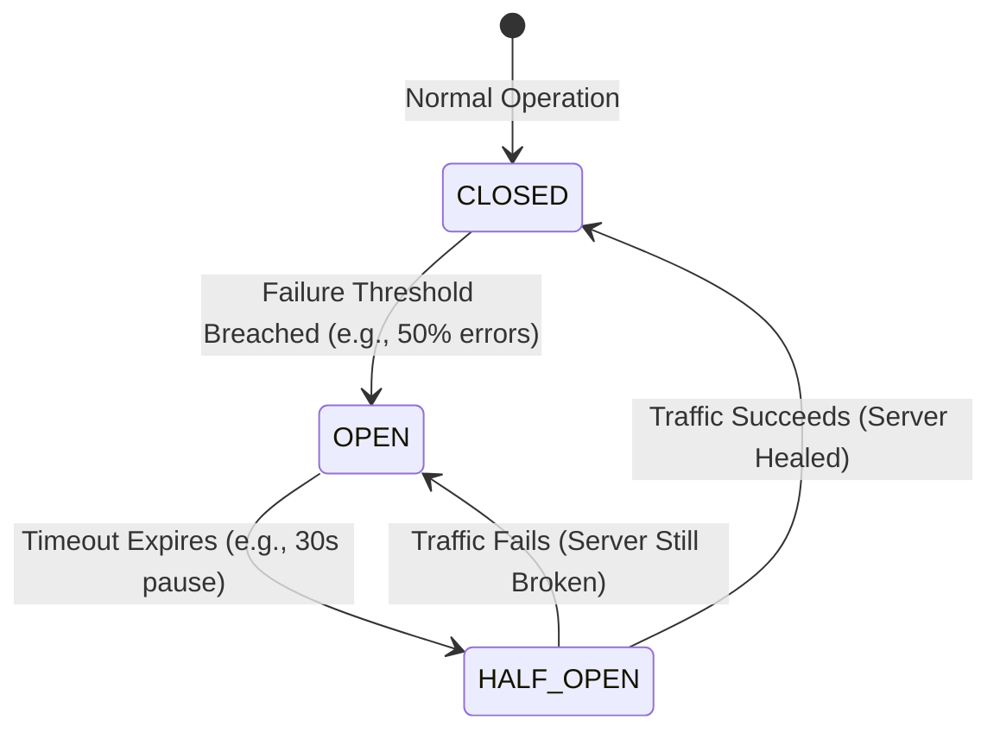

# 17. Load Balancing & Resilience Patterns

In massive distributed systems, components **will** fail. An entire AWS Availability Zone might go offline, or a database might suddenly lock up. A basic Load Balancer just routes traffic; an **intelligent** Load Balancer actively protects the surviving infrastructure using proven **Resilience Patterns**.

Let's dive into exactly how Load Balancers act as the defensive shields of your architecture.

## 17.1 Circuit Breaker

Just like the electrical circuit breaker in your house prevents your wiring from catching fire during a power surge, a software **Circuit Breaker** prevents your system from constantly hammering a dying server.

### The Problem It Solves
If a database query suddenly takes 30 seconds to execute, the internal threads on your backend server get completely gridlocked. If the Load Balancer keeps sending 500 requests per second to that struggling server, the server will inevitably hit `OutOfMemory` (OOM) and crash permanently. Even worse, the Load Balancer will waste precious network connections waiting for timeouts that are guaranteed to happen.

### The Three States of a Circuit Breaker

The Circuit Breaker pattern acts as an intelligent state machine sitting directly inside the Load Balancer (or API Gateway).

1. **Closed (Normal):** Everything is healthy. Traffic flows normally to the backend server. The LB continuously records successes and failures in a short rolling window (e.g., the last 100 requests).
2. **Open (Tripped):** If the failure rate breaches the configured threshold (e.g., 50% of the last 100 requests returned 5xx errors), the LB violently "trips" the breaker. 
    * **The Magic:** While Open, the LB immediately stops routing *any* traffic to that server. Any incoming requests destined for it are instantly rejected with a `503 Service Unavailable` *without ever hitting the backend server*. This is crucial—it cuts off the traffic hose, allowing the backend server a moment of absolute silence to recover, process its backlog, or safely restart.
3. **Half-Open (Testing the Waters):** The breaker cannot stay Open forever. After a configured `Sleep Window` (e.g., 30 seconds), the LB transitions to Half-Open. 
    * It allows exactly *one* (or a very small trickle) test request to pass through to the server.
    * If that test request succeeds, the LB assumes the server has healed. The breaker snaps back to **Closed**, and full traffic resumes.
    * If that test request fails, the server is clearly still struggling. The breaker instantly snaps back to **Open** for another 30 seconds.

### Key Configuration Parameters

To design a production-grade Circuit Breaker, parameters must be tuned mathematically:
* **Failure Rate Threshold:** (e.g., 50%). What percentage of requests must fail before tripping?
* **Minimum Request Limit:** (e.g., 20 requests). The breaker shouldn't trip just because 1 out of 2 requests failed. It needs a statistically significant minimum sample size.
* **Sliding Window Size:** (e.g., 60 seconds). Over what time block are we measuring the failure rate?
* **Recovery / Sleep Window:** (e.g., 10 seconds). How long do we let the server rest before transitioning to Half-Open?

## 17.2 Bulkhead

The **Bulkhead Pattern** is named after the watertight compartments in a submarine. If a torpedo blows a hole in one compartment, you seal the bulkhead doors so the entire submarine doesn't sink.

* _Teacher's Note:_ If your Application handles both complex `PDF Rendering` and lightweight `$5 Payments`, you never want a PDF rendering backlog to crash the payment system.
* **How it's used:** The Load Balancer logically partitions the server resources. It assigns 80% of backend threads to Payments, and strictly limits PDF Rendering to 20%. Even if millions of PDF requests arrive, they only saturate their 20% bulkhead. The Payments API remains perfectly healthy.

## 17.3 Backpressure

If a server is processing requests slower than the Load Balancer is sending them, the server's internal memory buffer will fill up until the server hits `Out of Memory (OOM)` and tragically dies.

**Backpressure** is the server actively screaming to the Load Balancer: *"Stop sending me traffic so fast!"*
* In modern protocols like HTTP/2 and gRPC, this is built-in. If the server is overwhelmed, it limits the size of the TCP Receive Window. The Load Balancer is physically forced to slow down its transmission rate, effectively pushing the "pressure" backwards up the network chain toward the user, rather than letting the server blow up.

## 17.4 Load Shedding

When Backpressure fails and the server is fundamentally out of capacity, it must perform **Load Shedding**.

Instead of trying (and failing) to serve 10,000 users and crashing the entire server, Load Shedding intentionally drops 2,000 of the lowest-priority requests instantly (returning `503 Service Unavailable`). 

* _Teacher's Note:_ It is mathematically better to successfully serve 8,000 users and anger 2,000, than to crash the server and infuriate all 10,000. Load Shedding protects the core integrity of the system by throwing excess luggage overboard.

## 17.5 Admission Control

This is the strict bouncer at the front door of your system. 
While Load Shedding drops requests *inside* the backend server, **Admission Control** happens directly at the Load Balancer itself.

If the Load Balancer realizes that its backend cluster is operating at 99% CPU globally, Admission Control kicks in and physically stops admitting new requests at the edge. The LB returns a `503 Service Unavailable` before the request is even routed to a server, fully protecting the underlying architecture from being violently overwhelmed.

## 17.6 Graceful Degradation

When a backend service completely dies, instead of throwing a massive error screen to the user, you degrade the experience *gracefully*.

* _Teacher's Note:_ Imagine you are browsing Netflix and their backend "Recommendations Database" crashes. Instead of dropping your entire video stream and throwing a catastrophic `500 Server Error`, Netflix simply hides the "Recommended for You" row, and lets you safely keep watching your movie.
* **LB Implementation:** A modern Load Balancer can be natively configured to return a cached default response (like a static fallback JSON payload or a placeholder image) when the backend microservice returns a `5xx` error.

## 17.7 Fail Fast

If a backend server is mathematically broken, you want to know **immediately**. You do not want the Load Balancer to patiently wait 30 seconds for a TCP timeout, hanging the user's browser in limbo.

**Fail Fast** is the architectural philosophy of decisively rejecting requests the exact millisecond you know they cannot be fulfilled. If the Circuit Breaker is securely Tripped Open, or if the connection pool is physically full, the Load Balancer instantly returns a `503`. The user can refresh and try again immediately, rather than staring at a spinning wheel of death for a minute.

## 17.8 Cascading Failure Prevention

A **Cascading Failure** is a fatal architectural domino effect:
1. Server A dies.
2. The Load Balancer organically shifts all of Server A's traffic to Server B.
3. Server B, now handling 200% of its normal capacity, runs out of memory and tragically dies.
4. The Load Balancer shifts all traffic to Server C. Server C instantly dies.

The entire point of intelligent Load Balancing is to physically prevent this. By intentionally combining **Circuit Breakers** (to stop hammering dead nodes), **Backpressure** (to forcefully slow down inbound traffic), **Load Shedding** (to decisively drop excess requests), and **Fail Fast** (to instantly reject doomed traffic), the Load Balancer successfully isolates the failure strictly to Server A, saving the entire rest of the cluster from a catastrophic total shutdown.

---

---

