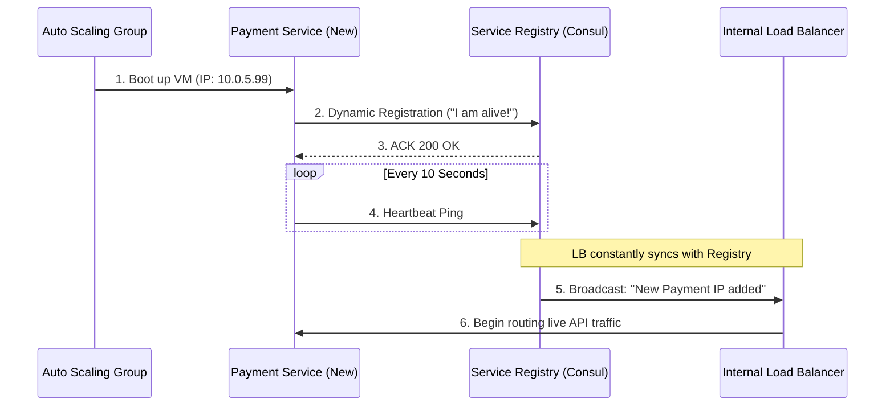

# 18. Service Discovery

In a modern cloud-native architecture, servers are ephemeral. They are spun up, destroyed, and replaced dynamically by Autoscaling groups every single minute. If an internal microservice's IP address is constantly changing, how does a Load Balancer (or another microservice) actually know where to send traffic?

This is the exact problem solved by **Service Discovery**.

## 18.1 Why Service Discovery?

Historically, if `Service A` wanted to talk to `Service B`, you would hardcode `Service B`'s IP address (`192.168.1.50`) into `Service A`'s configuration file.
However, in a dynamic environment like Kubernetes or AWS Auto Scaling, `192.168.1.50` might crash, and the replacement server might boot up with `10.0.5.99`. Without Service Discovery, `Service A` will blindingly keep sending requests to the dead IP, completely breaking the system.

Service Discovery is the architectural GPS. It allows services to find each other dynamically without ever needing to know static IP addresses.

## 18.2 Static Service Discovery

**Static Service Discovery** is the old-school approach. You manually maintain a configuration file (like `/etc/hosts` or an Nginx `upstream` block) containing the hardcoded IPs of your servers.
* **Pros:** Unbelievably fast. No moving parts.
* **Cons:** Absolutely fails in the cloud. Every time an IP changes, a human must manually SSH into the Load Balancer, edit the config, and restart the Nginx process.

## 18.3 DNS-Based Discovery

The most fundamental form of automated discovery is **DNS**. Instead of an IP, clients connect to a domain name (e.g., `payment-service.internal`).
When queried, the internal DNS server (like Route53) returns a list of dynamic IP records.
* _Teacher's Note:_ While incredibly simple, DNS-based discovery has a major flaw: **DNS Caching**. Clients and operating systems aggressively cache DNS results. If `Server B` dies and gets a new IP, the client might keep trying to use the cached, dead IP for 5 minutes (ignoring the Time-To-Live).

## 18.4 Service Registry

To fix DNS caching flaws, modern architectures use a **Service Registry** (e.g., Consul, Etcd, Eureka).
A Service Registry is a heavily optimized, highly available database of currently active services. It acts as the ultimate source of truth. It doesn't just store IPs; it stores metadata, ports, and real-time health statuses.

## 18.5 Client-Side Discovery

In **Client-Side Discovery**, the client (the microservice making the request) handles the load balancing logic natively.
1. `Service A` asks the Service Registry: *"Give me the list of all healthy IPs for Service B."*
2. The Registry returns `[10.0.1.2, 10.0.1.3]`.
3. `Service A` runs its own internal Round Robin algorithm and directly pushes the HTTP request to `10.0.1.2`.
* **Pros:** Highly decentralized. No central Load Balancer bottleneck.
* **Cons:** You must code discovery and load balancing logic into every single microservice (often requiring heavy SDKs).

## 18.6 Server-Side Discovery

In **Server-Side Discovery**, the client is completely dumb. It just sends the request to a centralized Load Balancer (or API Gateway).
1. `Service A` sends a request to the `Internal Load Balancer`.
2. The Load Balancer queries the Service Registry (or has the active list synced locally).
3. The Load Balancer proxies the request to `10.0.1.2`.
* **Pros:** Clients are simple. The load balancing logic is abstracted away tightly. (This is exactly how AWS ELB and Kubernetes Services work natively).
* **Cons:** The central Load Balancer becomes a single point of failure and a potential latency bottleneck.

## 18.7 Dynamic Backend Registration & Deregistration

How does an IP get into the Service Registry in the first place?
When a new server boots up, its very first action (even before accepting HTTP traffic) must be to ping the Service Registry: *"Hello, I am the Payment Service, I am listening on Port 8080 at IP 10.5.2.10."*
This is **Dynamic Registration**.

Conversely, when a server crashes violently (power outage), it cannot deregister itself. Because of this, the Service Registry actively enforces **Heartbeats**. If a server stops sending a heartbeat ping every 10 seconds, the Registry mechanically forcefully evicts it from the dynamic routing list.

## 18.8 Service Discovery + Load Balancing

Service Discovery and Load Balancing are two halves of the exact same puzzle.
* **Service Discovery** answers: *"What backend servers physically exist right now?"*
* **Load Balancing** answers: *"Which specific server from that exact list should process this single HTTP request?"*
Without Discovery, Load Balancers have nowhere to route traffic. Without Load Balancers, Discovery lists are useless because clients wouldn't know how to intelligently distribute load between them.

### Senior Developer Perspective: The Registration Flow
Here is exactly how a modern microservice boots up and receives traffic:

### 18.9 Service Discovery Approaches Comparison

| Discovery Type | Mechanism | Senior Dev Scenario (When to use?) | Critical Drawbacks |
| :--- | :--- | :--- | :--- |
| **Static (`/etc/hosts`)** | Manual config file updates. | Legacy bare-metal applications that never autoscale. | Impossible to maintain in dynamic Cloud/K8s environments. |
| **DNS-Based** | `payment.internal` resolves to list of IPs. | Small to medium architectures. Use when simplicity heavily outweighs strict failover speed. | **Client DNS Caching** causes apps to hit dead IPs for minutes. |
| **Client-Side Proxy** | Client directly queries `Consul/Eureka` and runs Round Robin. | Massive Microservice deployments aiming to kill central LB bottlenecks. | High coupling; requires complex SDKs in every language you use. |
| **Server-Side API Gateway** | Client hits central ALB; ALB queries Registry and routes. | Standard Cloud deployments (AWS ALB/K8s Ingress). Great for polyglot systems. | Introduces an extra network hop and a central point of failure. |

---

⬅️ **[Previous: 17. Load Balancing & Resilience Patterns](17_Load_Balancing_Resilience_Patterns.md)** | 🏠 **[Back to TOC](README.md)** | **[Next: 19. Client-Side vs Server-Side Load Balancing ➡️](19_Client_Side_vs_Server_Side_Load_Balancing.md)**
