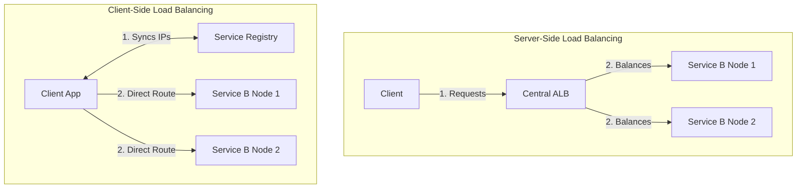

# 19. Client-Side vs Server-Side Load Balancing

When microservices need to communicate with one another, how exactly do they balance the load? Do they send traffic to a central middleman, or do they distribute the traffic themselves? 

This introduces the major architectural debate between **Server-Side** and **Client-Side** Load Balancing.

## 19.1 Server-Side Load Balancing

This is the traditional, classic approach to Load Balancing. 

In **Server-Side Load Balancing**, the client (e.g., a Mobile App, a Frontend Server, or Microservice A) is completely oblivious to the backend architecture. It simply sends its HTTP request directly to a centralized middleman (The Load Balancer). The Load Balancer then executes the routing algorithm, picks a healthy backend server, and proxies the traffic.

* **Architecture:** `Client` ➡️ `Load Balancer (Nginx/ALB)` ➡️ `Backend Service [A, B, C]`
* **Pros:** 
  * **Simplicity:** The client code is incredibly simple. It only needs to know one domain name (e.g., `api.example.com`).
  * **Centralized Management:** Rate limiting, SSL termination, and security are handled perfectly in one central location.
* **Cons:**
  * **Single Point of Failure (SPOF):** If the central Load Balancer crashes, the entire system goes down immediately.
  * **Latency Bottleneck:** The Load Balancer adds an extra network "hop", slightly increasing request latency.

## 19.2 Client-Side Load Balancing

With the rise of massive microservice architectures, developers realized that pumping 100,000 internal requests per second through a single internal Load Balancer created a massive bottleneck. 

In **Client-Side Load Balancing**, the middleman is completely eliminated. The client itself (e.g., Microservice A) runs the Load Balancing algorithm locally in its own code.

* **Architecture:** `Service A` queries the `Service Registry`, receives a list of 50 IPs for `Service B`, picks one securely using Round Robin, and routes traffic directly: `Service A` ➡️ `Service B [Node 4]`.
* **Pros:**
  * **Zero Bottlenecks:** There is no central point of failure. Traffic flows point-to-point via the fastest possible network route.
  * **Massive Scalability:** The system scales infinitely because the load balancing logic is distributed perfectly across all clients.
* **Cons:**
  * **High Complexity:** You must embed complex Load Balancing, Retry, and Circuit Breaker logic directly into the codebase of every single client/microservice.

## 19.3 Service Mesh (The Best of Both Worlds)

To solve the complexity of Client-Side Load Balancing, modern architectures use a **Service Mesh** (like Istio or Linkerd).

Instead of forcing developers to write Load Balancing logic in Java, Go, and Python, a Service Mesh deploys a tiny "sidecar" proxy (like Envoy) running safely right next to every single microservice. The Microservice sends a dumb request to its local proxy (`localhost:8080`), and the local proxy invisibly performs the complex Client-Side Load Balancing and Service Discovery lookups.

### Senior Developer Perspective: Architectural Flow

### 19.4 Direct Comparison Matrix

| Feature | Server-Side Load Balancing | Client-Side Load Balancing |
| :--- | :--- | :--- |
| **Network Hops** | 2 Hops (Client ➡️ LB ➡️ Server) | **1 Hop** (Client ➡️ Server) |
| **Bottleneck Risk** | High (Central LB can choke under load) | **None** (Traffic is strictly point-to-point) |
| **Client Code Complexity** | **Very Low** (Client is dumb) | Very High (Client must run LB algorithms) |
| **Best Scenario to Use** | Exposing Public APIs to the Internet (Mobile Apps, Web Browsers). | Internal Microservice-to-Microservice backend communication. |
| **Real-World Tech** | AWS ALB, NGINX, HAProxy. | gRPC, Netflix Ribbon, Istio/Envoy (Service Mesh). |

---

⬅️ **[Previous: 18. Service Discovery](18_Service_Discovery.md)** | 🏠 **[Back to TOC](README.md)** | **[Next: 20. Consistent Hashing ➡️](20_Consistent_Hashing.md)**
