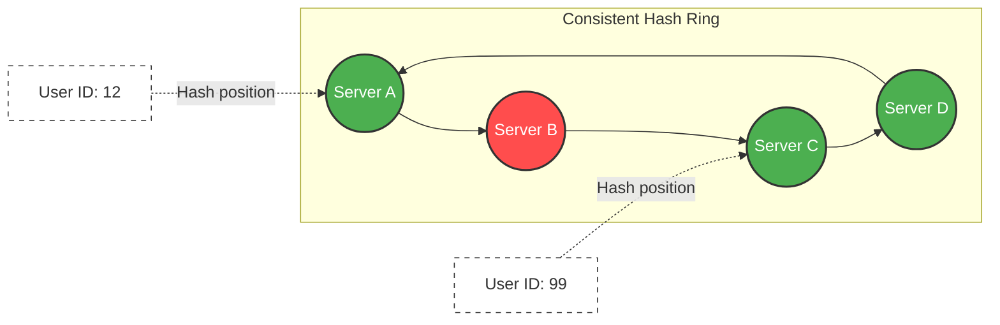

# 20. Consistent Hashing

When you use a Load Balancer to distribute traffic to heavily stateful servers (like Redis Caches or Database Shards), how you mathematically route the traffic becomes infinitely more critical than a simple stateless Round Robin.

If you don't route traffic intelligently, you will permanently destroy the efficiency of your caching layer. **Consistent Hashing** is the mathematical algorithm that solves this.

## 20.1 The Flaw of Traditional Modulo Hashing

Imagine you have 4 Redis Cache servers. When a user requests their profile picture, you want to consistently route the user to the exact same cache server every single time.
Traditionally, Load Balancers used basic **Modulo Hashing**: `ServerIndex = Hash(UserID) % Total_Servers`.

- UserID `89` % `4` Servers = Server `1`.
- It routes beautifully. But what happens if Server `1` violently crashes?

Suddenly, `Total_Servers` drops to `3`. The Load Balancer re-calculates: `UserID 89 % 3 Servers = Server 2`.
The math fundamentally changed. Because the denominator changed, **every single user** gets immediately routed to a completely completely different server! The entire Redis cluster experiences a 100% cache miss rate simultaneously, sending a tsunami of traffic crashing directly down onto your primary database.

## 20.2 The Ring (Consistent Hashing)

**Consistent Hashing** fixes the Modulo flaw by removing the total server count from the math entirely.

Instead of a linear array, we map the hash values onto a circular **Hash Ring** (from 0 to 360 degrees, or `0` to `2^32 - 1`).

1. **Hash the Servers:** You hash the IP addresses of your 4 servers (`Server A, B, C, D`) and place them cleanly onto the mathematical ring.
2. **Hash the Request:** You hash the incoming `UserID`, placing it on the exact same ring.
3. **The Routing Rule:** The Load Balancer simply travels clockwise around the ring from the request's position until it hits the very first Server.

**The Magic:** If Server B cleanly crashes and is removed from the ring, ONLY the requests that were actively routing to Server B will seamlessly fall forward clockwise onto Server C. The routing math for Servers A, C, and D remains mathematically perfectly intact! A massive 100% cache miss catastrophe is securely converted into a manageable 25% cache miss event.

## 20.3 Virtual Nodes (vNodes)

Consistent Hashing has one fatal flaw: **Uneven Distribution**.
When you hash 4 IP addresses, they rarely space out perfectly evenly at 90-degree intervals. Server A and B might land right next to each other on the ring, meaning Server B receives almost zero traffic, while Server C handles 80% of the entire system's load.

_Teacher's Note:_ We solve this cleanly using **Virtual Nodes**.
Instead of placing Server A on the ring exactly 1 time, you hash `Server A_1`, `Server A_2`... up to `Server A_100`. You place 100 virtual copies (vNodes) of every physical server smoothly onto the ring. By peppering the ring with hundreds of randomly distributed vNodes, the traffic mathematically averages out securely and perfectly across all physical servers.

**### Senior Developer Perspective: The Hash Ring Routing**

_Notice: If Server B crashes (Red), only the data actively living between Server A and Server B is affected. It just seamlessly flows forward to Server C._

## 20.4 Real-World Use Cases

Consistent Hashing isn't just theory; it dynamically powers the internet.

- **Sticky Sessions:** Ensuring a user is always safely routed back to the exact same Web Socket server.
- **Distributed Caching:** Memcached and Redis clusters use it internally to safely shard data without complete cache invalidation during scaling.
- **Databases:** Cassandra and DynamoDB strictly use Consistent Hashing rings to securely distribute partitioned data across massive global clusters.

### 20.5 Modulo vs Consistent Hashing Matrix

| Feature                        | `Hash % N` (Modulo)                                               | Consistent Hashing                                                                                        |
| :----------------------------- | :---------------------------------------------------------------- | :-------------------------------------------------------------------------------------------------------- |
| **Routing Math**               | Changes drastically based on total Server Count (`N`).            | Position on ring is permanent, irrespective of `N`.                                                       |
| **Server Crash Impact**        | **Catastrophic (100% Cache Miss).** Every single key is remapped. | **Minimal (1/N Cache Miss).** Only keys belonging to the dead server remap securely to the next neighbor. |
| **Scaling Up (Adding Server)** | Breaks routing for all existing users. Cache gets wiped.          | Highly efficient. Only disrupts the tiny slice of the ring the new server lands on.                       |
| **Load Distribution**          | Perfectly even (Assuming the Hash function is good).              | **Requires Virtual Nodes (vNodes)** to fix inherent uneven clustering on the ring.                        |

---

---

