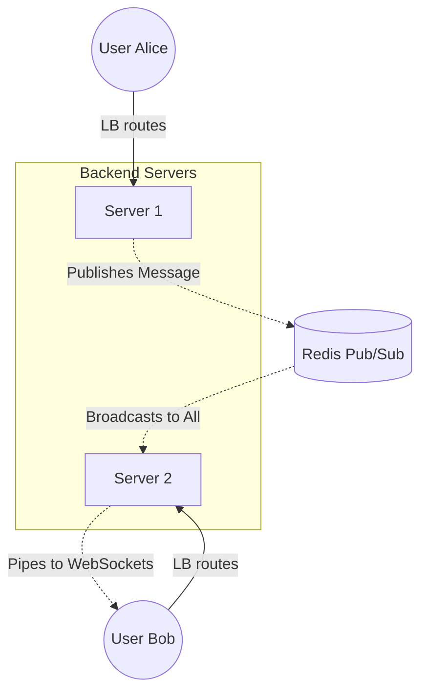

# 22. Load Balancing WebSockets

Load Balancing standard HTTP requests is fundamentally easy because HTTP is **Stateless**. A user asks for a webpage, the server replies, and the connection is immediately terminated. The next request can safely go to any other server.

**WebSockets completely shatter this assumption.** 
WebSockets are heavily stateful, incredibly long-lived, and fully duplex (bi-directional). When you introduce a Load Balancer into a real-time chat application, things get mathematically complicated.

## 22.1 The Persistent Connection Problem

When a user initiates a WebSocket, they start with a standard HTTP GET request, but include an `Upgrade: websocket` header.
If the backend accepts, the TCP connection stays physically bolted open.
*   **The Issue:** Your Load Balancer is no longer routing thousands of fast, tiny requests. It is physically holding thousands of heavy, immortal TCP connections open. If the Load Balancer has an idle timeout set to `60s` (the default for AWS ALB), it will cleanly sever your WebSocket connection after 1 minute of chat silence, forcefully disconnecting your user.
*   **The Fix:** You must explicitly configure extensive Idle Timeouts on the Load Balancer, and implement constant WebSocket `Ping/Pong` heartbeats specifically to keep the LB TCP connection mathematically alive.

## 22.2 L4 vs L7 WebSocket Load Balancing

*   **Layer 4 (TCP) Load Balancing:** The Load Balancer (like AWS NLB) is completely blind. It doesn't know what a WebSocket is. It just opens a raw TCP pipe between the User and Server A, and securely pipes bytes back and forth. It is incredibly fast, but offers zero intelligent routing.
*   **Layer 7 (Application) Load Balancing:** The LB (like Nginx or AWS ALB) actively reads the `Upgrade` header. It mathematically perfectly understands that this is a WebSocket. It can inject headers, terminate SSL securely, and route chat traffic intuitively to a dedicated `/chat` microservice.

## 22.3 Sticky Sessions (Connection Affinity)

Because the connection is immortal, **Round Robin routing is irrelevant** after the initial handshake.

The user is permanently bolted to Server A. If Server A crashes, the WebSocket visually snaps.
Furthermore, if you are building an application where the user makes subsequent HTTP API calls expecting the server to know their local memory state, the Load Balancer *must* use **Sticky Sessions (Session Affinity)** to guarantee that `HTTP POST /purchase` routes to the exact same physical server holding the `WebSocket` connection.

## 22.4 The Split-Brain Chat Problem

If you scale to 5 WebSocket servers, Load Balancing creates a massive architectural flaw known as the **Split-Brain problem**:
1. User Alice connects. The LB routes her safely to **Server 1**.
2. User Bob connects. The LB routes him safely to **Server 2**.
3. Alice sends a chat message: *"Hello Bob!"*
4. Server 1 looks at its local memory. Server 1 doesn't know who Bob is. The message is dropped.

A Load Balancer splits users across servers, meaning users on Server 1 simply mathematically cannot chat with users on Server 2.

### Senior Developer Solution: The Redis Backplane

We solve the Split-Brain by introducing a **Message Broker (Redis Pub/Sub)** working directly alongside the Load Balancer.
1. Alice sends a message to Server 1.
2. Server 1 doesn't know where Bob is, so it publishes the message to the central Redis cluster.
3. Every single WebSocket server in the cluster is permanently subscribed to Redis.
4. Server 2 receives the Redis broadcast, realizes it owns Bob's WebSocket connection, and flawlessly pushes the message to Bob!

## 22.5 Scaling WebSocket Servers

Scaling stateless HTTP servers is as simple as spinning up more CPU. Scaling WebSocket servers is entirely bound by **Memory and File Descriptors (Sockets)**.
You cannot scale down (Scale-In) WebSockets gracefully. If the Auto Scaling Group terminates Server 1 to save money, it violently snips 10,000 active TCP connections. Every single user will simultaneously automatically try to urgently reconnect to the Load Balancer, causing a massive, devastating **Retry Storm**.

### 22.6 Summary Matrix: HTTP vs WebSocket Load Balancing

| Feature | Stateless HTTP API | Stateful WebSocket |
| :--- | :--- | :--- |
| **LB Impact** | Routes natively per-request using Round Robin. | Routes once. Connection stays permanently glued to one server. |
| **Timeouts** | Short (30s). Kills ghost requests quickly. | **Must be massive (Hours).** Requires strict Ping/Pong heartbeats. |
| **Scaling Down** | Easy. Wait for the 2-second HTTP request to finish, then kill it. | Extremely dangerous. Causes violent TCP severing and Retry Storms. |
| **Cross-Server Comms** | Usually completely unnecessary. | **Mandatory.** Requires Redis Pub/Sub to sync chat state globally. |

---

⬅️ **[Previous: 21. Load Balancing & Caching](21_Load_Balancing_Caching.md)** | 🏠 **[Back to TOC](README.md)** | **[Next: 23. Load Balancing & Queues ➡️](23_Load_Balancing_Queues.md)**
