# Load Balancing & Queues

Traditional load balancing distributes **active network traffic** across backend servers.

```text
Client → Load Balancer → Backend Servers
```

This works well when the backend can process a request within a reasonable request/response lifetime.

However, some workloads can take seconds or minutes:

* Video processing
* Large report generation
* Image processing
* AI/ML jobs
* Data processing
* Email generation
* Background jobs

Keeping an HTTP request open for the entire duration is often inefficient.

Instead, the system can use a **message queue** to decouple accepting work from processing work.

```text
Client → API → Queue → Workers
```

The API accepts the job quickly, while workers process it asynchronously.

---

## Queue-Based Work Distribution

With synchronous processing:

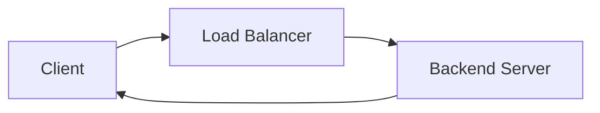

The client waits for the backend to finish.

With asynchronous processing:

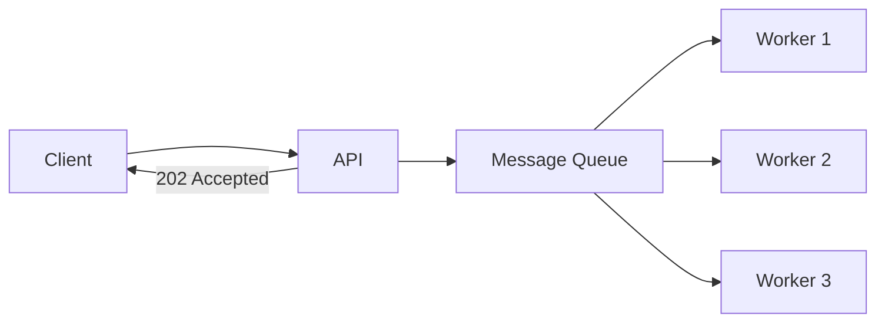

The API performs a much smaller operation:

1. Accept the request.
2. Create a job/message.
3. Put it into the queue.
4. Return `202 Accepted`.

The worker processes the job later.

### Why use a queue?

A queue provides:

* **Buffering** — absorbs traffic spikes.
* **Decoupling** — API and workers do not need to run at the same speed.
* **Work distribution** — multiple workers can consume jobs.
* **Backpressure** — workers can process work at a controlled rate.
* **Failure recovery** — failed jobs can be retried.
* **Scalability** — worker count can be increased independently.

### Important

A queue is not literally an L4/L7 load balancer.

A load balancer distributes network traffic, while a queue **stores work and allows consumers to process that work asynchronously**.

However, from a system-design perspective, a queue can act as a **work-distribution layer**.

---

## Competing Consumers

The **Competing Consumers Pattern** uses multiple workers consuming from the same queue.

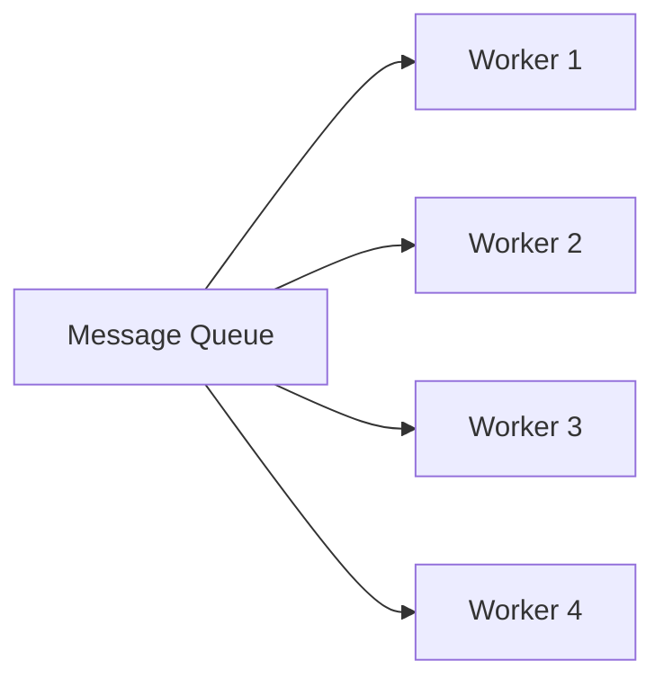

Suppose the queue contains:

```text
Task 1
Task 2
Task 3
Task 4
Task 5
```

Multiple workers consume available tasks:

```text
Worker 1 → Task 1
Worker 2 → Task 2
Worker 3 → Task 3
Worker 4 → Task 4
Worker 1 → Task 5
```

The queue coordinates which consumer receives each message.

This allows the workload to be distributed without the API needing to know which worker should process each task.

### Important

The exact delivery semantics depend on the queue.

You should **not assume that a message can never be delivered twice**.

A worker may process a message successfully but fail before acknowledging it, causing the message to be delivered again.

Therefore, consumers should often be designed to be **idempotent**.

---

## Worker Pools

A **worker pool** is a group of processes or servers that consume and process jobs from a queue.

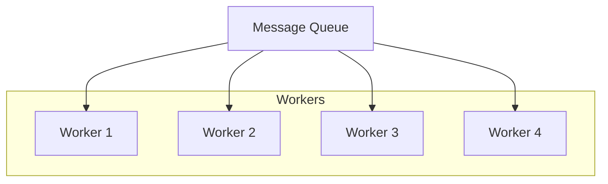

The worker pool can be scaled independently from the API servers.

For example:

```text
Normal traffic:
Queue = 100 jobs
Workers = 5

Traffic spike:
Queue = 50,000 jobs
Workers = 50
```

The exact scaling strategy depends on the workload and infrastructure.

### Queue Depth as a Scaling Signal

**Queue depth** is the number of messages waiting to be processed.

It can be used as an autoscaling signal.

```text
Queue Depth
     │
     ▼
  Increasing
     │
     ▼
Add Workers
     │
     ▼
Process Backlog
     │
     ▼
Queue Depth Decreases
```

Other useful signals include:

* Age of oldest message
* Processing latency
* CPU usage
* Memory usage
* Number of active workers

Queue depth alone is not always enough.

---

## Queue as a Buffer

One of the biggest advantages of a queue is that producers and consumers do not have to operate at the same speed.

Suppose:

```text
Producer → 10,000 jobs/sec
Workers  → 5,000 jobs/sec
```

Without a buffer, the backend may become overloaded.

With a queue:

```text
Producer
   │
   ▼
Queue
██████████████████
   │
   ▼
Workers
```

The queue temporarily stores the excess work.

This is a form of **backpressure**.

The queue does not make the work disappear; it allows the system to process the backlog gradually.

---

## Message Acknowledgement

A worker usually needs to indicate that it has successfully processed a message.

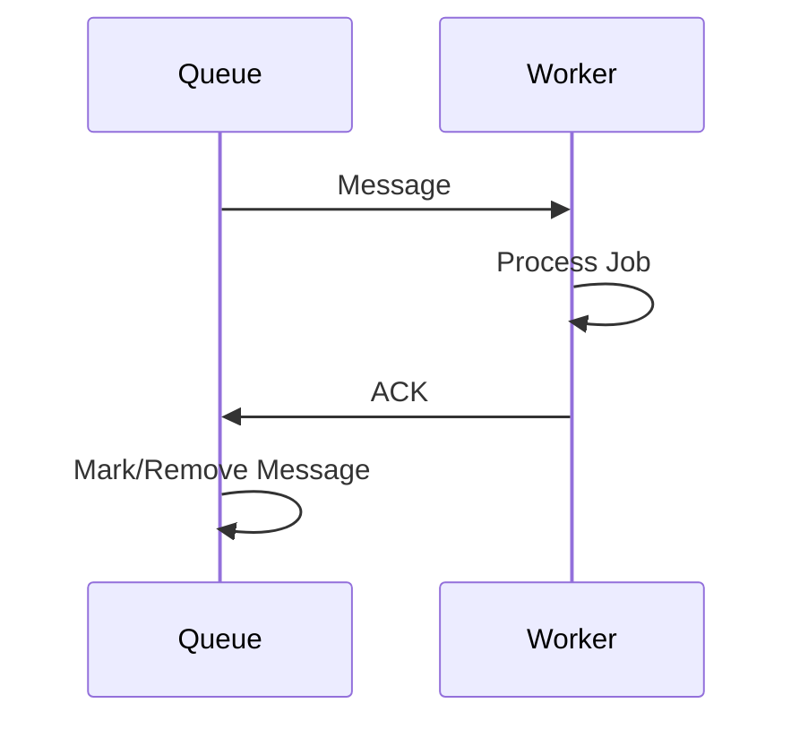

The exact mechanism differs between systems.

For example:

* Some queues explicitly delete/acknowledge messages.
* Some use offsets.
* Some use acknowledgement protocols.

The purpose is the same:

> **Tell the messaging system that the consumer has successfully handled the work.**

### Why not remove immediately?

Suppose:

```text
Queue → Worker
          ↓
       Processing
          ↓
       Worker crashes
```

If the message had already been permanently removed, the job could be lost.

Acknowledgement allows the messaging system to retain the message until successful processing is confirmed.

---

## Visibility Timeout

Some queue systems, especially **Amazon SQS**, use a **visibility timeout**.

When a worker receives a message, the message temporarily becomes invisible to other consumers.

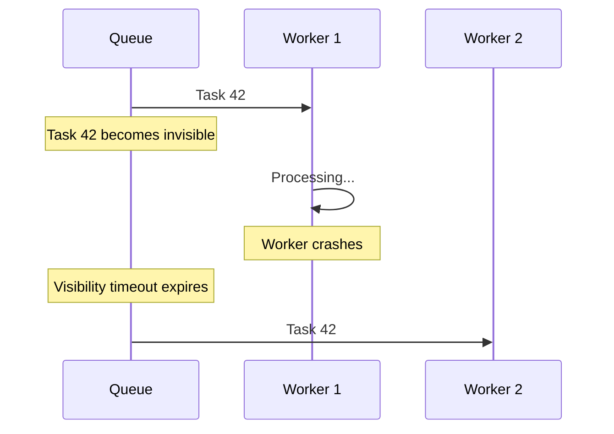

If Worker 1 successfully finishes the job, it acknowledges/deletes the message.

If Worker 1 fails and does not acknowledge it before the visibility timeout expires, the message becomes available again.

### Important

The timeout must be long enough for normal processing.

If a job normally takes 10 minutes but the visibility timeout is only 2 minutes:

```text
Worker A → Processing
     │
     ├── 2 minutes → message visible again
     │
     └── Worker B may process same job
```

This can result in duplicate processing.

For long-running jobs, the consumer may also need to extend the visibility timeout where supported.

---

## Retries

A failed message can often be retried.

```text
Message
   ↓
Worker
   ↓
Failure
   ↓
Retry
   ↓
Worker
```

Retries are useful for **temporary failures**, such as:

* Temporary network failure
* Database timeout
* Downstream service temporarily unavailable

However, retrying a permanently invalid message repeatedly wastes resources.

This creates the **poison message** problem.

---

## Dead-Letter Queue

A **Dead-Letter Queue (DLQ)** stores messages that repeatedly fail processing.

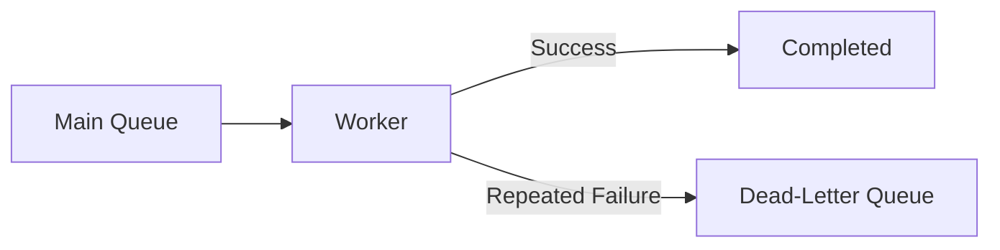

For example:

```text
Attempt 1 → Failure
Attempt 2 → Failure
Attempt 3 → Failure
Attempt 4 → Failure

             ↓

            DLQ
```

The DLQ allows engineers to inspect problematic messages without allowing them to continuously consume worker capacity.

Common reasons for DLQ placement:

* Invalid data
* Unsupported input
* Corrupted files
* Application bugs
* Permanently failing downstream operations

---

## Idempotency

Queue consumers should often be **idempotent**.

Idempotent processing means that processing the same message more than once does not produce an incorrect final result.

For example, imagine:

```text
Message:
Charge User ₹500
```

If the worker processes it twice:

```text
₹500
+
₹500
=
₹1000 ❌
```

That is dangerous.

Instead, the system can use a unique job/event ID:

```text
job_123 → already processed
```

The second attempt can detect that the operation has already completed.

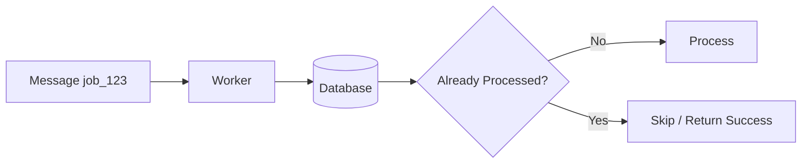

This is especially important because many distributed queue systems provide **at-least-once delivery**, meaning duplicate delivery can occur.

### The Partial Failure Scenario (The Email Resend Disaster)

Let's look at exactly the scenario you need to watch out for: **Partial Failures involving external mutations.**

1.  **Worker pulls task:** `Send Welcome Email to User ALICE`.
2.  **Worker calls external Email API (e.g., SendGrid):** The e-mail physically leaves the server and successfully reaches Alice's inbox.
3.  **Fatal Crash:** Right before the worker can save `"Email_Sent: True"` to the local Database and `ACK` the queue, the worker's motherboard melts.
4.  **The Re-Delivery (Visibility Timeout):** The Queue's timer expires. Worker B grabs the exact same task. It checks the Database, sees `"Email_Sent = False"` (because Worker A crashed before saving), and explicitly sends the email *again*.
5.  **The Disaster:** Alice magically receives 3 duplicate Welcome Emails. 

**The Solution:**
Because you are mutating state in an external system before you can `ACK` the queue, you must rely on **Idempotency Keys**. 
You pass a unique string (e.g., `Job_ID_123`) directly as a header to the SendGrid Email API. If the worker crashes and Worker B attempts to resend the email, SendGrid's servers will recognize `Job_ID_123` as already processed, and cleanly drop the duplicate email on their end.

---

## Consumer Groups

**Consumer groups** are especially important in systems such as **Apache Kafka**.

Suppose an event is published:

```text
UserCreated
```

Multiple independent systems may need the same event.

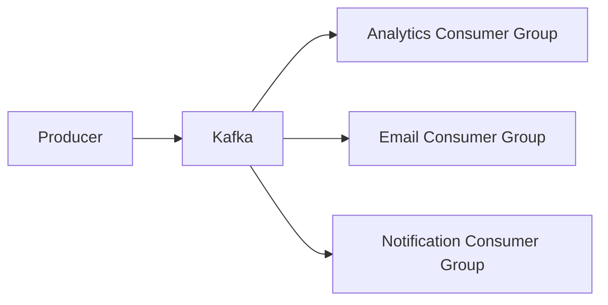

Each consumer group maintains its own consumption position.

Within one consumer group, multiple consumers can divide the partitions between themselves.

```text
Kafka Topic
   │
   ├── Partition 1 → Analytics Worker 1
   ├── Partition 2 → Analytics Worker 2
   └── Partition 3 → Analytics Worker 3
```

Another consumer group can independently consume the same event stream:

```text
UserCreated
    │
    ├── Analytics Group
    ├── Email Group
    └── Notification Group
```

### Important Distinction

Kafka consumer groups are **not simply the same thing as competing consumers in SQS/RabbitMQ**.

The concepts are related because multiple consumers can share processing work, but Kafka's model is based around **topics, partitions, offsets, and consumer groups**.

---

## Queue-Based Scaling

Queues make it possible to scale the API and worker layers independently.

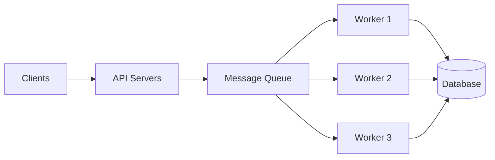

For example:

```text
API Servers:
10 instances

Workers:
20 instances
```

A traffic spike may require:

```text
API → Scale API layer

Queue → Accumulate backlog

Workers → Scale worker layer
```

This separation is one of the biggest benefits of asynchronous architectures.

---

## Queue vs Traditional Load Balancer

| Feature           | HTTP Load Balancer         | Message Queue           |
| ----------------- | -------------------------- | ----------------------- |
| Primary purpose   | Distribute network traffic | Distribute/store work   |
| Communication     | Usually synchronous        | Asynchronous            |
| Client waits      | Usually yes                | Usually no              |
| Buffering         | Limited                    | Core capability         |
| Long-running jobs | Poor fit                   | Good fit                |
| Backpressure      | Limited                    | Stronger                |
| Failure recovery  | Connection/request based   | Message based           |
| Scaling signal    | Requests/connections       | Queue depth/message age |
| Processing model  | Request → server           | Message → worker        |
| Typical response  | `200 OK`                   | Often `202 Accepted`    |

### Synchronous

```text
Client
  ↓
Load Balancer
  ↓
Server
  ↓
Response
  ↓
Client
```

### Asynchronous

```text
Client
  ↓
API
  ↓
Queue
  ↓
202 Accepted

      ...later...

Queue
  ↓
Worker
  ↓
Process Job
```

---

## Asynchronous Job Status

Returning `202 Accepted` does not mean the job is completed.

It means:

> The server accepted the request for processing.

The system may provide a job ID:

```json
{
  "jobId": "job_123",
  "status": "processing"
}
```

The client can then check the status:

```text
GET /jobs/job_123
```

Or the system can notify the client using:

* WebSocket
* SSE
* Webhook
* Push notification

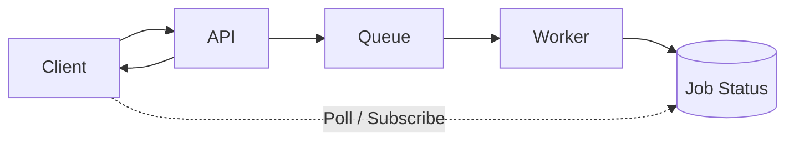

---

## Queue Backlog and Latency

A queue protects the backend from sudden spikes, but it introduces a new metric:

**How long does a job wait before processing?**

For example:

```text
Job submitted
     │
     ▼
Queue
     │
     │ 5 minutes waiting
     ▼
Worker starts
     │
     │ 2 minutes processing
     ▼
Completed
```

Total user-perceived processing time:

```text
Queue Wait Time + Processing Time
```

Therefore, queue systems should monitor:

* Queue depth
* Oldest message age
* Processing time
* Throughput
* Failure rate
* Retry count
* DLQ size

A queue that keeps growing means workers cannot keep up with incoming work.

---

## Queue and Load Balancing Together

Large systems commonly use **both** mechanisms.

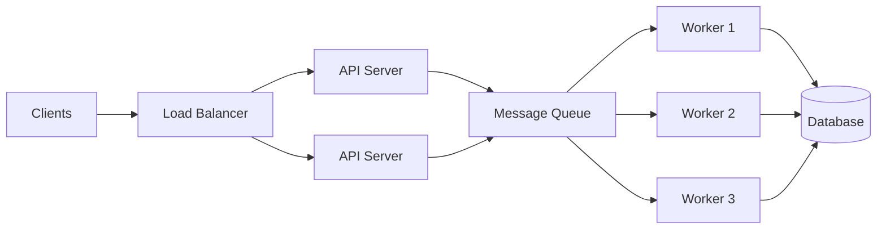

Here:

### Load Balancer

Distributes **HTTP traffic** across API servers.

### Queue

Distributes **background work** across workers.

So they solve different problems:

```text
Load Balancer
    ↓
Network Traffic Distribution

Queue
    ↓
Work Distribution + Buffering
```

## Key Takeaways

* A load balancer distributes **network traffic**.
* A queue distributes and buffers **work**.
* Queues are useful for long-running and asynchronous workloads.
* **Competing consumers** allow multiple workers to process jobs from the same queue.
* **Worker pools** can scale independently from API servers.
* Queue depth and message age can be useful autoscaling signals.
* **ACKs** tell the messaging system that processing succeeded.
* **Visibility timeout** allows failed/unresponsive consumers to have messages redelivered in systems such as SQS.
* **Retries** handle temporary failures.
* **DLQs** isolate repeatedly failing messages.
* **Idempotency** protects against duplicate processing.
* **Kafka consumer groups** allow consumers to divide partitions while independent groups can consume the same event stream.
* A queue provides **buffering and backpressure**, but it does not literally replace an L4/L7 load balancer.
* A common architecture is:

```text
             HTTP Traffic
                  │
                  ▼
             Load Balancer
                  │
                  ▼
              API Servers
                  │
                  ▼
              Message Queue
                  │
                  ▼
              Worker Pool
                  │
                  ▼
              Database
```

> **Load balancer distributes requests. Queue distributes work.**
