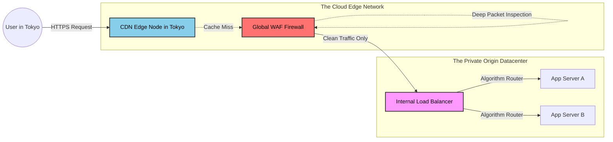

# 25. CDN, WAF, & Load Balancing

Until now, we have treated the Load Balancer as the absolute front door of our application infrastructure. In a massive, globally distributed system (like Netflix, Amazon, or Twitter), exposing your standard application Load Balancer directly to the public internet is incredibly inefficient and highly dangerous.

To fundamentally protect and accelerate the Load Balancer, we inject two massive architectural components in front of it: The **CDN (Content Delivery Network)** and the **WAF (Web Application Firewall)**.

## 25.1 CDN vs Load Balancer

It is extremely common for beginners to confuse a CDN (like Cloudflare or AWS CloudFront) with a regular Load Balancer (like AWS ALB).
*   **The Load Balancer** lives physically inside your precise internal data center (your *Origin*). Its job is to take traffic that has successfully arrived at your building and distribute it across your CPUs.
*   **The CDN** lives completely outside your data center. It is literally thousands of servers physically distributed globally in every major city on Earth (called **Edge Locations**). 

If a user in Tokyo requests a 5MB image from your server in New York, it takes 200ms for the packet to cross the Pacific Ocean.
A CDN intercepts that request exactly in Tokyo, grabs the image from the Tokyo Edge Cache, and responds in 5ms. **The request never mathematically reaches your Load Balancer in New York.** This drastically reduces load on your Load Balancer.

## 25.2 The Web Application Firewall (WAF)

While a Load Balancer distributes logic, it is technically blind to the *intent* of the payload. If an attacker sends an HTTP POST request containing malicious SQL Injection code (e.g., `SELECT * FROM users; DROP TABLE`), the Load Balancer will happily balance that malicious packet to your backend database!

A **Web Application Firewall (WAF)** is deployed physically in front of (or directly attached to) the Load Balancer. 
*   **Request Filtering:** The WAF deeply inspects the raw payload of every single HTTP request. It uses Regex pattern matching to hunt for SQL Injection, Cross-Site Scripting (XSS), and massive botnet signatures.
*   If malicious code is found, the WAF physically terminates the TCP connection and drops the packet. The Load Balancer is kept perfectly secure and fundamentally oblivious to the attack.

## 25.3 DDoS Protection & Edge Rate Limiting

A **Distributed Denial of Service (DDoS)** attack occurs when 100,000 infected computers blindly flood your server with Ping commands or HTTP requests simultaneously. 

If this traffic actually reaches your datacenter's Load Balancer, it is already too late. The massive inbound bandwidth will physically choke your ISP's underground fiber cables. 

*   **Edge Rate Limiting:** We deploy the WAF and Rate Limiting algorithms (from Chapter 24) completely onto the **CDN Edge Nodes** (via Cloudflare or CloudFront). 
*   When a Chinese Botnet launches a massive 500 Gbps attack, the malicious traffic hits the Tokyo, Beijing, and Hong Kong CDN Edge Servers. The Edge Rate Limiters instantly recognize the flood, block the IPs, and violently drop the traffic directly in Asia. **The massive DDoS attack mathematically never even crosses the ocean to reach your physical Load Balancer!**

## 25.4 The Senior Architectural Traffic Flow

When you combine all these components, the definitive production-grade HTTP request flow looks exactly like this:

---

### 25.5 The Ultimate Edge Matrix

| System Component | Physical Location | Primary Architectural Responsibility | What it Drops |
| :--- | :--- | :--- | :--- |
| **CDN (Cloudflare)** | Global Edge Nodes. Nearest to the user. | Offloading Bandwidth by caching static assets globally. | Drops traffic that results in an Edge Cache Hit. |
| **WAF (Firewall)** | Edge Node OR attached to Load Balancer. | Security. Deep packet inspection for SQLi, XSS, and bad payloads. | Malicious Payloads & Botnet signatures. |
| **Load Balancer** | Deep inside your Private Virtual Cloud (VPC). | Availability. Routing clean requests evenly across compute capacity. | Dead Backend Servers (via Health Checks). |

---

⬅️ **[Previous: 24. Rate Limiting Load Balancing](24_Rate_Limiting_Load_Balancing.md)** | 🏠 **[Back to TOC](README.md)** | **[Next: 26. Global Server Load Balancing (GSLB) ➡️](26_Global_Server_Load_Balancing_GSLB_.md)**
