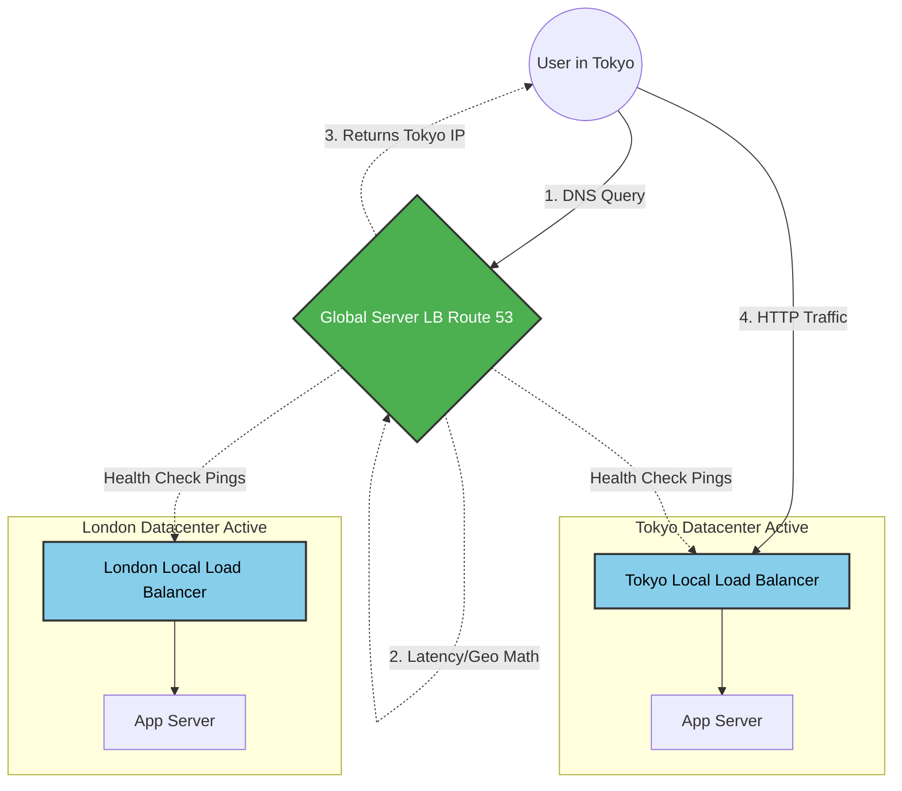

# 26. Global Server Load Balancing (GSLB)

Up until this point, we have primarily discussed **Local Load Balancing (LLB)**. An internal Load Balancer (like NGINX) sits inside a single physical datacenter and routes traffic to local servers in the exact same building. 

But what if you are building an application for millions of users worldwide?
If your only datacenter is in New York, a user in Sydney, Australia will experience terrible latency (200ms+ round trip). Furthermore, if a massive power failure takes New York completely offline, your entire global application crashes instantly.

To fix this, we deploy replicate datacenters across multiple geographical **Regions** (e.g., New York, Tokyo, Sydney, London). To route users mathematically to the *closest* and *healthiest* region, we introduce **Global Server Load Balancing (GSLB)**.

## 26.1 Local vs Global Load Balancing

*   **Local Load Balancer (LLB):** Routes a packet across a single room (Datacenter Ethernet). Typically operates at Layer 4 (TCP) or Layer 7 (HTTP) using algorithms like Round Robin or Least Connections.
*   **Global Server Load Balancer (GSLB):** Routes a packet across the planet (The Public Internet). It almost entirely operates at **Layer 7 (DNS)**. It does not look at CPU usage; it looks at physical geographic maps and global network latency.

## 26.2 DNS-Based GSLB

How does a GSLB actually work? It is simply a highly advanced **DNS (Domain Name System) Server** (e.g., AWS Route 53 or Cloudflare DNS).

When a user in London types `www.example.com` into their browser, the following happens:
1. The browser makes a DNS Query asking: *"What is the IP address of example.com?"*
2. The GSLB (acting as the authoritative DNS server) intercepts this query.
3. The GSLB runs complex routing algorithms (detailed below).
4. The GSLB dynamically replies with `IP: 198.51.100.1` (The IP of the *London* Local Load Balancer).
5. (If the user was in Sydney, the exact same DNS query would instead return the IP of the *Sydney* Local Load Balancer).

## 26.3 Latency & Geo-Based Routing

The GSLB must mathematically decide which Regional IP to return to the user. It primarily uses two algorithms:

*   **Geolocation-Based Routing:** The GSLB maps the user's IP Address to a physical GPS location. If the IP maps to Japan, the GSLB forcefully returns the IP address of the Tokyo internal Load Balancer. It is mathematically deterministic.
*   **Latency-Based Routing:** Sometimes physical distance is deceptive. The physical fiber cable from California to Tokyo might be faster than a congested cable from California to Texas. A Latency-based GSLB actively pings all global regions from various checkpoints to measure the actual milli-second response time. It mathematically routes the user to the region with the lowest physical latency, regardless of geography.

## 26.4 Region-Level Health Checks & Disaster Recovery

A GSLB is not just a DNS map; it is a live health-monitoring engine for your entire planetary footprint.

The GSLB constantly pings exactly the Local Load Balancer in every region. 
*   **The Disaster Scenario:** A massive earthquake takes the entire Tokyo datacenter offline. The Tokyo Local Load Balancer dies entirely and stops responding to GSLB health checks.
*   **Global Failover:** Within exactly 10 to 30 seconds, the GSLB mathematically marks the entire Tokyo Region as `UNHEALTHY`. For the subsequent DNS requests from Japanese users, the GSLB intelligently calculates the *next* closest healthy region (e.g., Sydney or Singapore) and safely re-routes all Japanese traffic to those surviving datacenters securely!

## 26.5 Multi-Region Architectures

When designing Multi-Region systems natively powered by GSLB, Senior Architects must confidently choose between two distinct disaster-recovery models:

### 1. Active-Active Regions
Both regions dynamically serve live user traffic simultaneously.
*   **How it works:** GSLB perfectly routes a user in London to the London Datacenter, and a user in New York securely to the New York Datacenter.
*   **Pros:** 100% capacity mathematically utilized. Incredible latency for all users globally.
*   **Cons:** Extremely complex. The Database in London must instantly synchronously or asynchronously replicate data exactly to New York, otherwise users experience catastrophic Split-Brain State collisions.

### 2. Active-Passive (Failover) Regions
Only the primary region takes traffic. The secondary region sits totally idle, costing money for emergencies only.
*   **How it works:** GSLB mathematically routes 100% of global traffic only to New York. The London infrastructure is powered on but completely ignored. If New York explodes, GSLB flips the switch and sends 100% of traffic precisely to London.
*   **Pros:** Very easy database architecture. No complex bi-directional state replication required. 
*   **Cons:** Paying millions for servers in London that theoretically sit idle 99% of the year.

### Senior Developer Perspective: The Planetary GSLB 

---

### 26.6 Chapter Summary Matrix: Local vs Global

| Feature | Local Load Balancer (LLB) | Global Server Load Balancer (GSLB) |
| :--- | :--- | :--- |
| **Layer of Operation** | Layer 4 (TCP/UDP) or Layer 7 (HTTP/HTTPS) | Layer 7 specifically **(DNS)** |
| **Scope** | One single physical building / VPC | Planetary. Spans Oceans and Continents. |
| **Traffic Target** | Routes traffic perfectly to Compute Servers. | Routes traffic perfectly to Local Load Balancers. |
| **Primary Goal** | Maximize CPU utility and survive server crashes. | Minimize global latency and survive Datacenter/Region crashes. |
| **Algorithms** | Round Robin, Least Connections, IP Hash. | Geolocation, Latency, Weighted Failover. |

---

---

