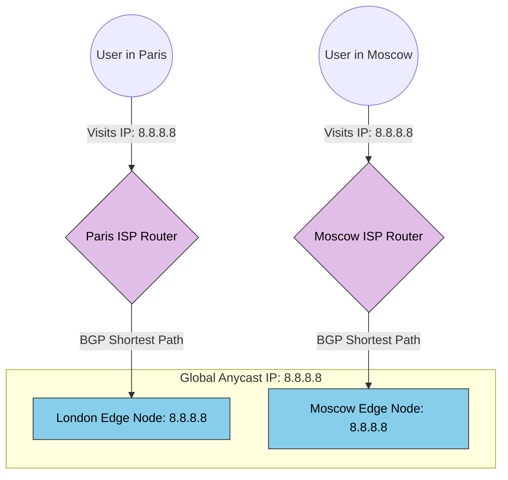

# 27. Anycast & Global Traffic Distribution

In Chapter 26, we solved global routing using **DNS (GSLB)**. The DNS server calculates the user's location and replies with a unique IP address for Tokyo, Sydney, or London. 
But DNS has a massive flaw: **DNS Caching**. ISPs and browsers cache DNS results for hours. If the Tokyo datacenter dies, the GSLB is helpless—millions of browsers have already locally memorized the dead Tokyo IP address and will relentlessly try to connect to it until their local cache expires.

To fundamentally solve this globally, the greatest networking minds invented **Anycast**.

## 27.1 Unicast vs Anycast (The Beginner Explanation) 

To understand Anycast, we must first understand how normal the internet works.

*   **Unicast (Standard Routing):** Imagine a phone number. If you dial `555-0199`, exactly *one* specific phone rings in exactly *one* specific house in New York. Every IP address in the world belongs to exactly one physical server.
*   **Anycast (Magical Routing):** Imagine if dialing `911` (Emergency Services) worked like a Unicast phone number. Every person in America dialing `911` would ring a single phone on a single desk in Washington DC. 
    Instead, `911` mathematically routes your call to the *closest physical police station*. If you are in Ohio, it routes to the Ohio station. If you are in Texas, it routes to the Texas station. 
    **This is Anycast.** Multiple entirely different servers in the world physically share the **exact same IP Address (e.g., `1.1.1.1`)**.

## 27.2 How Anycast Routing Works (The Senior Explanation)

How is it mathematically possible for 500 different servers globally to share the exact same IP address without the internet breaking?

The secret is **BGP (Border Gateway Protocol)**. BGP is the postal system of the internet.
When Cloudflare sets up a CDN node in Tokyo, it broadcasts a BGP message to all ISPs in Asia: *"Hey! If anyone is looking for the IP `1.1.1.1`, I am right here."*
Simultaneously, Cloudflare sets up a node in London and broadcasts: *"Hey ISPs! I am also `1.1.1.1`, and I am right here!"*

When a user in Paris types in `1.1.1.1`, their physical router looks at its BGP Map. It sees two paths to `1.1.1.1` (Tokyo and London). The router executes **Nearest-Point Routing**. 

**How Nearest-Point Routing actually calculates the path:**
BGP uses a metric called `AS_PATH` (Autonomous System Path). An Autonomous System (AS) is a massive network (like AT&T or Comcast). 
*   If the packet goes to Tokyo, the BGP map shows it must pass through 14 different ISP networks (14 hops). 
*   If the packet goes to London, the BGP map shows it only passes through 3 ISP networks (3 hops).
*   The router completely ignores latency and strictly chooses the path with the fewest AS hops. It blindly and instantly shoots the packet toward London!

The Tokyo server and the London server are completely unaware of each other. The physical **Internet Routers** are doing the load balancing!

## 27.3 Anycast as the Ultimate DDoS Shield

Because Anycast relies on the physical routers of the internet rather than a single software server, it is the most powerful DDoS protection mechanism on Earth.

If a massive Russian Botnet decides to launch a DDoS attack targeting the IP `1.1.1.1`:
*   In a **Unicast** system, 100% of the Russian traffic hits the exact single server located in New York, instantly melting it.
*   In an **Anycast** system, the Russian ISP routers see the botnet traffic, look at the BGP map, and say: *"Ah, the closest server for `1.1.1.1` is our local Cloudflare Node in Moscow!"* 
*   **The Sinkhole Effect:** All the malicious Russian traffic is mathematically routed *only* to the Moscow datacenter. The New York, London, and Tokyo datacenters remain literally 100% unaffected and online. Anycast physically forces a global DDoS attack to become localized and partitioned.

## 27.4 Anycast + GSLB (The Hybrid Architecture)

Wait, if Anycast is so perfect, why did we just learn GSLB (DNS routing) in Chapter 26?
Because Anycast lacks **Health Checks**. If the London datacenter crashes but fails to withdraw its BGP route broadcast, the Internet routers will stupidly continue to forward Paris users into a dead datacenter!

**The Production Standard:**
Senior Architects combine both. 
1.  You use **Anycast** for your Global CDN (Edge layer) to aggressively sinkhole DDoS attacks and absorb static traffic globally.
2.  Your Edge nodes then use **GSLB (DNS)** to safely route dynamic database traffic backward into your core Private Datacenters, utilizing GSLB's flawless health-check failover math.

### The Anycast BGP Routing Flow

---

### 27.5 Summary Matrix: Unicast vs GSLB vs Anycast

| Routing Method | How it Identifies the Destination | Primary Strengths | Fatal Flaw |
| :--- | :--- | :--- | :--- |
| **Unicast (Layer 4/7)** | 1 IP Address = 1 specific Server. | Simple, perfect control over routing logic. | A DDoS attack instantly isolates and crushes the single IP target. |
| **GSLB (DNS Layer)** | Resolves Domain name to a Regional IP. | Perfect Health-Checks and intelligent failover logic. | **DNS Caching.** Dead servers remain cached in user browsers for hours. |
| **Anycast (BGP Layer)** | 1 IP Address = 100s of Servers globally. | Instantly partitions DDoS attacks. Zero DNS caching delays. | Extremely difficult to setup. Lacks application-level health checks natively. |

---

---

