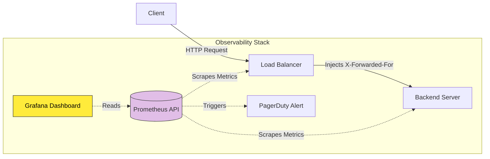

# 28. Observability & Logging

When a Load Balancer is distributing millions of requests per minute across a massive server fleet, you cannot afford to be blind. If the system slows down or crashes, you need to know exactly *where* and *why*. 

**Observability** is the architectural practice of instrumenting your systems so you can ask any question about their internal state. It is primarily built on three pillars: **Metrics, Logs, and Tracing.**

## 28.1 Core Load Balancer Metrics

Metrics are raw, aggregated numbers measured over time. They tell you exactly *what* is happening. We track different categories of metrics to ensure system health.

### Traffic & Connection Metrics
*   **Requests/sec (Throughput):** The absolute total number of HTTP requests hitting the Load Balancer every second. A sudden spike indicates a Thundering Herd or DDoS.
*   **Active Connections:** The number of TCP connections currently physically open between users and the Load Balancer. High active connections with low Request/sec usually indicates immortal WebSocket connections or "Slowloris" attacks.
*   **Connection Rate:** The speed at which *new* TCP connections are being opened per second.

### Latency Metrics: Why "Averages" Are a Lie
Latency is the time it takes to serve a request. Averages (`mean`) are mathematically deceiving. 

Imagine you have 100 users making an HTTP request:
*   99 of them hit the internal Cache and get a wildly fast `10ms` response.
*   1 user uniquely triggers a massive Database Table Lock and gets a `5,200ms` (5.2 second) response.

If you calculate the average: `((99 * 10) + 5200) / 100 = 61.9ms`. 
Looking at your dashboard, an average of `61.9ms` looks incredibly fast and perfectly healthy! But in reality, one user's browser completely froze for over 5 seconds. The mathematical average inherently *lied* to you by hiding the extreme failure.

To fix this dangerous blind spot, Load Balancers structurally record metric data using **Percentiles (p)**.

### The Percentiles: p50, p95, p99
Instead of adding numbers together, the Load Balancer literally sorts all 100 request times chronologically from fastest to slowest in an array.

*   **p50 (The Median):** You look at exactly the 50th request in the sorted array. If your p50 is `10ms`, it mathematically guarantees that **exactly 50% of your users experienced a load time of 10ms or faster.** This defines your "normal" day-to-day user baseline.
*   **p95:** You look at the 95th request in the array. If your p95 reads `120ms`, it guarantees that **95% of users were faster than 120ms.** This indicates that the bottom 5% of your traffic is starting to moderately slow down (the "Long Tail").
*   **p99 (The Worst-Case Scenario):** You look at the 99th request. If your p50 is `10ms`, but your p99 suddenly skyrockets to `4,500ms`, a massive architectural alarm should go off in your head. It strictly indicates that **1 out of every 100 requests to your Load Balancer is catastrophically hanging.** 

**Why do Senior Developers obsess over the p99 if 99% of users are perfectly fine?**
If you have an Amazon-style e-commerce website, a single user loading the homepage rarely triggers just *one* HTTP request. Loading the homepage might trigger **50 different microservice requests** structurally in the background (getting the user profile, fetching shopping cart items, fetching ad trackers, loading image thumbnails).
If your `p99` is failing (meaning 1 out of 100 requests is terrible), and a single user makes 50 requests just to load the homepage... the mathematical probability of that *one user* hitting the `p99` failure is nearly **40%**. 
Because modern web pages rely on dozens of concurrent requests, a failing `p99` means a massive chunk of your total user base will actually vividly experience those slow 5-second hangs!

**Senior Developer Rule:** When you optimize your SQL indexes or tune your Load Balancer caching, you *never* optimize to lower your `p50` (which is likely already fast). You specifically engineer your systems to ruthlessly crush and lower your `p99`.

### Error Rates & Status Codes
*   **4xx Errors (Client Errors):** `400 Bad Request`, `401 Unauthorized`, `404 Not Found`. These indicate the user is doing something wrong (or a malicious bot is scanning your endpoints).
*   **5xx Errors (Server Errors):** `500 Internal Server Error`, `502 Bad Gateway`, `503 Service Unavailable`. If 5xx spikes, your backend servers are actively crashing or timing out.

### Backend Health Metrics
*   **Healthy / Unhealthy Backend Count:** The exact number of servers actively passing the Load Balancer's Health Checks. If the "Healthy Count" drops from 50 to 5, you are experiencing a massive infrastructure failure.
*   **Backend Response Time:** The time the Load Balancer spends waiting for the Backend Server to reply.
*   **Retry Rate:** The percentage of requests the Load Balancer had to internally retry (Chapter 16) due to backend timeouts.

## 28.2 Logs & The X-Forwarded-For Header

If Metrics tell you *what* is failing, **Logs** tell you *why*.
A Load Balancer generates an Access Log for every single request. It contains the timestamp, HTTP method, URL, User-Agent, and Response Code.

**The IP Masking Problem:**
Because the Load Balancer sits between the User and the Backend Server, the Backend Server thinks *every single request is coming from the Load Balancer's IP address*.
To solve this, the Load Balancer injects a standard HTTP header before forwarding the packet:
`X-Forwarded-For: 203.0.113.195` (The original user's true IP Address). 
Your backend infrastructure *must* log the `X-Forwarded-For` header, otherwise you can never geo-locate your users or ban malicious actors!

## 28.3 Distributed Tracing

In a microservice architecture, one single HTTP request might physically travel through 14 different backend servers before returning an answer. If the request takes 5 seconds, how do you know which of the 14 servers was the slow one?

**Distributed Tracing (e.g., Jaeger, OpenTelemetry):**
1. The Load Balancer generates a unique `Trace-ID` (e.g., `X-B3-TraceId: ab12cd34`) and injects it into the HTTP headers.
2. Every subsequent internal microservice logs that exact same `Trace-ID`.
3. In your monitoring dashboard, you can visually trace exactly how the specific request cascaded through the infrastructure, pinpointing exactly the one microservice that caused the 5-second delay.

## 28.4 Alerting Stack (Prometheus & Grafana)

Senior teams use industry-standard tools to automate Observability:
*   **Prometheus (The Engine):** A highly-optimized time-series database that continuously "scrapes" (pulls) metrics from your Load Balancer and Backend servers every 5 seconds.
*   **Grafana (The Dashboard):** Visualizes Prometheus data into beautiful real-time graphs.
*   **Alertmanager:** If the `5xx Error Rate > 5%` for more than 2 minutes, the Alertmanager automatically pages the on-call engineer via PagerDuty/Slack to wake them up.

---

---

