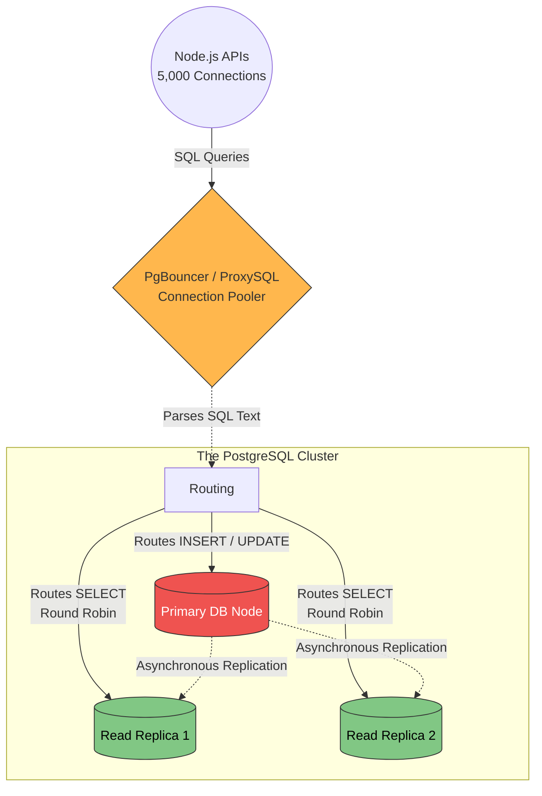

# 30. Load Balancing Databases

Everything we have covered so far has heavily focused on Load Balancing stateless HTTP API servers. 
Load Balancing a **Stateful Database** (like PostgreSQL or MySQL) is an entirely different architectural beast. 

If you just slap a generic Round-Robin Load Balancer in front of 3 Database nodes, you will instantly create catastrophic data corruption (Split-Brain), because a Web Server will write "User: Alice" to Database 1, and then try to read it instantly from Database 2, only to find Alice doesn't mathematically exist yet.

## 30.1 Application LB vs Database LB

*   **Application Load Balancer (HTTP):** Routes traffic across stateless servers. Any query can safely hit any server.
*   **Database Load Balancer (SQL):** Routes raw TCP/SQL traffic. It absolutely *must* understand the literal difference between a SQL `INSERT` statement and a SQL `SELECT` statement in order to route them to the correct servers safely. (Examples: **PgBouncer**, **PgPool-II**, or **ProxySQL**).

## 30.2 The Primary/Replica Architecture

Most scalable databases use a **Primary/Replica (Master-Slave)** configuration:
1.  **Primary Node (Leader):** There is exactly ONE primary node. It handles 100% of the `CREATE`, `UPDATE`, and `DELETE` (Write) traffic.
2.  **Replica Nodes (Followers):** There can be dozens of replica nodes. They synchronize and copy the data from the Primary. They are strictly Read-Only.

## 30.3 Read/Write Splitting

To properly Load Balance this architecture, the Database Load Balancer (like **ProxySQL**) sits physically between your API servers and your databases. 

1.  Your API executes a query: `INSERT INTO users (Alice)`.
2.  The DB Load Balancer dynamically reads the SQL text, recognizes the word `INSERT`, and specifically routes the query **only** to the Primary Node.
3.  Your API executes another query: `SELECT * FROM users`.
4.  The DB Load Balancer reads the SQL text, recognizes `SELECT`, and uses Round-Robin to perfectly load-balance that Read query across your 30 independent Replica Nodes.

**The Benefit:** By mathematically separating Writes from Reads, you can practically scale your database's Read capacity infinitely just by adding more Replicas!

## 30.4 The Replication Lag Disaster

In extremely high-traffic systems, read/write splitting introduces a terrifying bug for Senior Developers: **Replication Lag**.

**The Scenario:**
1.  User clicks "Update Username to Bob".
2.  API fires `UPDATE` to the DB Load Balancer. LB routes it to the **Primary Node**.
3.  The Primary Node successfully saves the username as Bob. 
4.  The API code then immediately fires a `SELECT` statement to refresh the web page.
5.  The DB LB routes the `SELECT` to **Replica Node 3**.
6.  *The Problem:* The network fiber cable between the Primary and Replica 3 takes `20ms` to sync the new data. But the API asked for the data in `5ms`. Replica 3 returns the old username! The user thinks their update failed and aggressively clicks the save button 10 more times!

**The Fix:**
Modern DB Load Balancers use **"Read-Your-Writes" Consistency Routing (Session Pinning)**. If an API modifies a record, the LB explicitly memorizes that API's connection and violently forces all subsequent `SELECT` queries for that specific user to route to the Primary Node for the next 2 seconds (until the Replicas have guaranteed time to sync).

## 30.5 Database Connection Pooling (PgBouncer)

The second massive job of a Database Load Balancer is **Connection Pooling**. 
PostgreSQL, for example, is extremely heavy on RAM. Every single open TCP connection to the database consumes about 10MB of memory. 

If you have 500 Node.js API servers, and each one opens 10 connections to the Database, that is 5,000 connections. PostgreSQL will literally crash and run out of RAM trying to hold 5,000 connections open simultaneously.

*   **The Aggregator:** We place a Load Balancer (like **PgBouncer**) in front. 
*   The 500 Node.js APIs aggressively open 5,000 connections specifically to *PgBouncer*. 
*   PgBouncer holds those 5,000 connections internally using almost zero RAM. It then surgically multiplexes and actively routes those SQL queries into only **200 highly-optimized, permanent physical connections** backward to the real PostgreSQL database! The Database survives flawlessly.

## DB Load Balancing Architectural Flow

---

### 30.6 Summary Matrix: Frontend LB vs Database LB

| Feature | Frontend Load Balancer (HTTP/NGINX) | Database Load Balancer (PgBouncer) |
| :--- | :--- | :--- |
| **Traffic Type** | HTTP/HTTPS (Stateless) | SQL / TCP (Highly Stateful) |
| **Primary Goal** | Scaling horizontally to handle user bandwidth. | Protecting the DB from running out of Physical RAM (Connection Pooling). |
| **Intelligence** | Reads headers & URLs to route to correct Microservice. | Deeply reads raw `SELECT/UPDATE` SQL Syntax to implement Read/Write Splitting. |
| **Danger Scenario** | 502 Bad Gateway (Server crashed). | **Replication Lag** (Users reading stale data after an update). |

---

⬅️ **[Previous: 29. Security](29_Security.md)** | 🏠 **[Back to TOC](README.md)** | **[Next: 31. Zero Downtime Deployments ➡️](31_Zero_Downtime_Deployments.md)**
