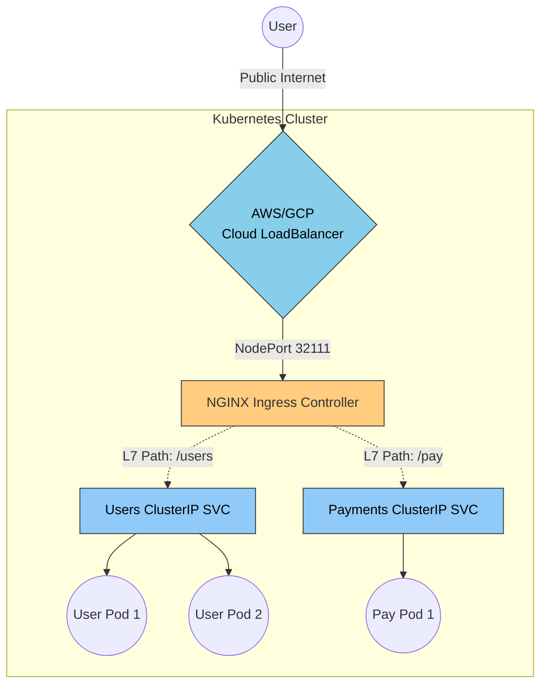

# 31. Kubernetes Load Balancing

Up to this point in the curriculum, we have treated web servers as permanent virtual machines or bare-metal desktop towers. Modern Cloud Native engineering uses **Containers (Docker)** and orchestrates them globally using **Kubernetes (K8s)**.

Kubernetes inherently destroys traditional Load Balancing mental models because internal IP addresses are entirely disposable. A container (called a **Pod**) might easily crash, get deleted by Kubernetes, and respawn on a different server with a mathematically completely different IP address 5 seconds later. 
Traditional fixed-IP Round Robin Load Balancing is completely impossible here.

## 31.1 The Kubernetes Service

To solve the fact that Pod IP addresses constantly morph and vanish, Kubernetes created the **Service** object. 
A Service creates a permanent, immortal, static IP address that securely represents a dynamic cluster of fragile Pods underneath it. When traffic hits the Service IP, the Service actively loads balances the packets down to the surviving Pod IPs instantaneously.

### The 3 Types of Kubernetes Services

1.  **ClusterIP (Internal Only):** This is the default. It assigns a static IP that is strictly only routable *from inside the Kubernetes cluster itself*. It is heavily used natively for Microservice-to-Microservice internal communication (e.g., your generic Node.js pods securely talking to your internal Database pods).
2.  **NodePort (The Quick Hack):** Opens a specific, identical port (between 30000 - 32767) cleanly on every single physical worker server (Node) in your datacenter. If you send traffic to `Any_Server_IP:30005`, exactly, it dynamically routes internally to the Pods. It is rarely used in massive production because exposing raw high-number ports is highly dangerous.
3.  **LoadBalancer (The Cloud Native Standard):** This automatically talks to your cloud provider (AWS/GCP/Azure) and organically provisions a real, external, physical Load Balancer (like an AWS ALB). The AWS ALB securely catches public internet traffic, sends it to the NodePorts, which successfully load balances into the Pods. 

## 31.2 Ingress & Ingress Controllers

If you have 50 different microservices (Users, Payments, Products, Search), using a `Type: LoadBalancer` Service for each one would literally create 50 separate physical AWS ALBs, costing you a fortune.

To structurally solve this, Senior Architects use an **Ingress Controller** (e.g., NGINX Ingress or Traefik).
*   **The Ingress Controller:** Is fundamentally just a standard NGINX Reverse Proxy physically running *inside* your Kubernetes cluster. You point **one single physical Cloud Load Balancer** at it.
*   **The Ingress Object:** A YAML file where you define brilliant L7 routing rules for NGINX: `"If URL is /payments, route to the Payments Service. If URL is /users, route to the Users Service."`

By utilizing an Ingress Controller, 50 microservices can efficiently share exactly 1 highly-optimized Cloud Load Balancer.

## 31.3 Kubernetes Health Checks (Probes)

In Chapter 5, we discussed Load Balancer Health Checks. Kubernetes runs its own hyper-aggressive internal health checks directly against every Pod to decide whether the Service Load Balancer should safely route traffic to it. There are two distinct types:

*   **Readiness Probes (*"Am I ready to receive traffic?"*):** If this fails, K8s stops routing new HTTP traffic to the Pod, but it does *not* kill the Pod. This is used if the Pod is temporarily overwhelmed doing CPU work and just needs a 10-second breather.
*   **Liveness Probes (*"Am I completely dead?"*):** If this fails, K8s mathematically assumes a fatal deadlock has occurred. It explicitly terminates the Pod entirely and forcefully spins up a brand new fresh Container in its place. 

## Kubernetes Load Balancing Architecture

---

### 31.4 Summary Matrix: K8s Networking Components

| K8s Component | Primary Architectural Function | Public or Internal? |
| :--- | :--- | :--- |
| **ClusterIP Service** | Load balances internally between Pods. | Strictly Internal. |
| **LoadBalancer Service** | Tells AWS to spin up a physical Load Balancer. | Public (or VPC Private). |
| **Ingress Controller** | NGINX routing inside the Cluster based on URL paths. | Public (usually). |
| **Readiness Probe** | Briefly pauses traffic to a busy Pod. | N/A |
| **Liveness Probe** | Violently terminates and restarts a dead Pod. | N/A |

---

⬅️ **[Previous: 30. Load Balancing Databases](30_Load_Balancing_Databases.md)** | 🏠 **[Back to TOC](README.md)** | **[Next: 32. Cloud Load Balancing (AWS/GCP) ➡️](32_Cloud_Load_Balancing.md)**
