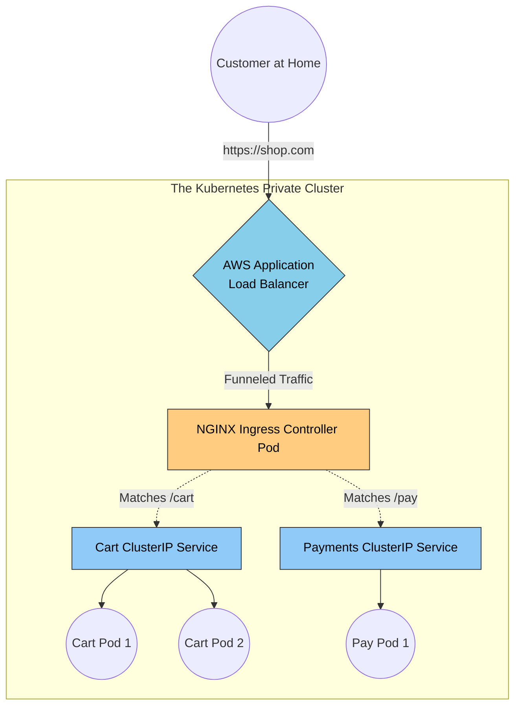

# 31. Kubernetes Load Balancing (The Real-World Architecture)

Up to this point in the curriculum, we have treated web servers as permanent virtual machines or bare-metal desktop towers. Modern Cloud Native engineering uses **Containers (Docker)** orchestrated by **Kubernetes (K8s)**.

Kubernetes inherently destroys our traditional Load Balancing mental models. Why? Because a container (called a **Pod**) is completely disposable. A Pod might crash, get deleted by Kubernetes, and respawn on a different server with a mathematically completely different IP address 5 seconds later. 
Traditional fixed-IP Round Robin Load Balancing is completely impossible here.

## 31.1 The Real-World Scenario: E-Commerce Microservices

Imagine you work for an E-Commerce company. You have two microservices:
1.  **The Payments Service:** 5 Pods processing credit cards.
2.  **The Users Service:** 3 Pods managing user logins.

If the Users Service needs to securely talk to the Payments Service internally, it cannot hardcode the IP addresses of the 5 Payments Pods, because those Pods might die and respawn with new IPs tomorrow.

### The Solution: ClusterIP Services (Internal Load Balancing)
To solve this, Kubernetes creates a **Service** object. A Service provides a permanent, immortal, static IP address that securely represents the 5 fragile Pods underneath it. 

When the Users Service makes an HTTP POST request to the Payments Service, it simply sends the request to the immortal `Payments-ClusterIP: 10.96.0.5`. 
`kube-proxy` (the literal network engine inside Kubernetes) intercepts that packet and seamlessly load balances it down to one of the 5 surviving Payment Pods natively using Round Robin or Iptables logic.

## 31.2 Exposing Traffic to the Public Internet

Services fix *internal* load balancing. But how does a customer sitting at home actually hit your Kubernetes cluster?

### Anti-Pattern: NodePort
`NodePort` opens a specific, identical port (e.g., `31000`) securely on every single physical server (Node) in your datacenter. If a customer visits `Node_IP:31000`, the server dynamically routes the traffic internally to the correct Pods. 
*   **Real-World Flaw:** You cannot tell a user to visit `https://mywebsite.com:31000`. Exposing high-number ports is highly dangerous and unprofessional.

### The Cloud Standard: LoadBalancer Service
If you set a Service to `Type: LoadBalancer`, Kubernetes automatically talks to your cloud provider (AWS/GCP) via an API token. 
*   **How it works seamlessly:** K8s magically provisions a real, physical **AWS Classic Load Balancer** in your AWS Account. AWS gives you a public DNS string (`abc1234.us-east-1.elb.amazonaws.com`). 
*   When a user hits that public AWS Load Balancer, AWS routes the packet into your internal Kubernetes Cluster's `NodePort`, which then routes cleanly to the Pod.

## 31.3 Ingress Controllers: The Ultimate L7 Router

**The Massive Problem with `Type: LoadBalancer`:**
If your e-commerce company has 50 different microservices (Cart, Search, Profile, Checkout, etc.) and you use `Type: LoadBalancer`, Kubernetes will literally spin up 50 independent, physical AWS Load Balancers. Since AWS charges roughly $20/month per Load Balancer, your infrastructure bill will explode to $1,000/month just for idle LBs!

**The Real-World Solution: The Ingress Controller**
Instead of 50 Cloud Load Balancers, Senior Architects use an **Ingress Controller** (most commonly **NGINX Ingress** or **Traefik**).

1.  **The Controller:** You spin up NGINX *inside* your Kubernetes cluster. You point **one single AWS Load Balancer ($20/mo)** exactly at the NGINX Pod.
2.  **The Rule Engine (Ingress YAML):** You write L7 routing rules exactly like this:
    *   `example.com/cart` ➡️ Route traffic to the internal `Cart_ClusterIP_Service`.
    *   `example.com/pay` ➡️ Route traffic to the internal `Payments_ClusterIP_Service`.

The physical Cloud LB handles the raw Internet firewalling. The internal NGINX Ingress Controller intelligently dissects the URL paths and acts as the massive L7 Load Balancer for your entire company!

## 31.4 The Deep Architectural Map

*(Notice that every colored node has `color:#000` applied so it handles beautifully in dark-mode themes!)*

---

### 31.5 Kubernetes Health Protocol (Probes)

In Kubernetes, if a Pod is failing, the internal Load Balancer (Service) needs to know instantly. K8s runs two incredibly strict checks:

| Probe Type | What it asks | What happens if it fails? | Real-World Example |
| :--- | :--- | :--- | :--- |
| **Readiness Probe** | *"Are you ready to receive HTTP traffic right now?"* | The Service **secretly stops sending traffic** to this specific Pod. | Your Node.js app is booting up and taking 15 seconds to connect to the Database. It isn't "Dead", it's just busy. K8s pauses traffic until the DB connection succeeds! |
| **Liveness Probe** | *"Are you mathematically alive, or have you crashed entirely?"* | K8s violently **terminates the container** and spawns a brand new one. | Your Java App reaches an infinite `While` loop (Deadlock). CPU hits 100%. The app is physically frozen. K8s executes a hard restart. |

---

---

