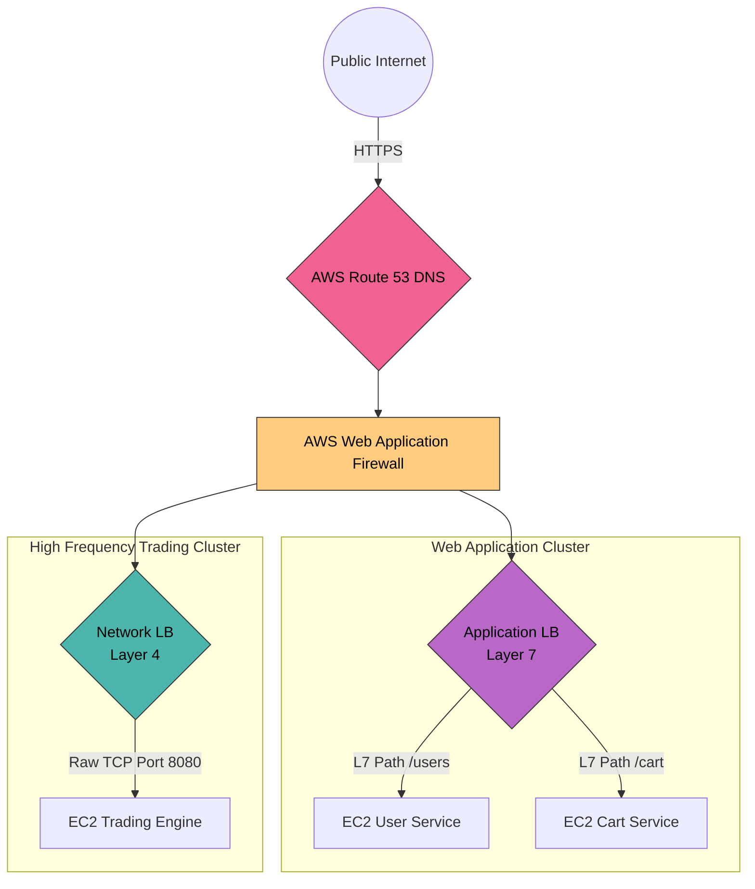

# 32. Cloud Load Balancing (AWS, GCP, Azure)

If you are building a modern production system, you almost never physically install software like HAProxy or NGINX on raw metal servers yourself. You rely on managed Cloud native Load Balancers provided by AWS, Google Cloud, or Azure. 
These cloud-native balancers are inherently designed to survive massive datacenter failures and scale infinitely without any manual intervention from DevOps.

Let's dissect the defining industry standard: **AWS Elastic Load Balancing (ELB)**.

## 32.1 The AWS Big Three

AWS provides three strictly distinct Load Balancer types, each designed for a wildly different layer of the OSI model. Senior Architects must choose the exact right one for the job.

### 1. Application Load Balancer (ALB) - Layer 7 (HTTP/HTTPS)
The ALB is the absolute standard for 95% of all web applications. It understands HTTP natively.
*   **Intelligence:** Because it operates at Layer 7, it physically unpacks the HTTP packet. It can read the URL (`/api/users`), it can read Host Headers (`api.example.com`), and it can read incoming cookies.
*   **Real-World Use Case:** Running an E-Commerce site. A user hits `shop.com/payments`. The ALB reads the `/payments` path and strictly routes that traffic exclusively to your secure 5 Node.js Payment microservices. 

### 2. Network Load Balancer (NLB) - Layer 4 (TCP/UDP/TLS)
The NLB is incredibly "dumb", but because it is dumb, it is mathematically the fastest Load Balancer on earth. It does not understand HTTP. It only understands raw TCP packets.
*   **Performance:** It can natively handle **Millions of requests per second** while maintaining ultra-low latencies (often under 1 millisecond).
*   **Static IP:** Unlike the ALB (whose IPs change constantly as AWS scales it), the NLB provides exactly **One Static IP** per datacenter. This is mandatory if your corporate clients need to whitelist your exact IP address in their corporate firewalls.
*   **Real-World Use Case:** Live Multiplayer Server backend (UDP), or massive Financial High-Frequency Trading systems where raw TCP millisecond speed is literally worth billions of dollars.

### 3. Gateway Load Balancer (GWLB) - Layer 3 (Network Security)
A heavily specialized Load Balancer strictly used for deploying massive corporate firewall appliances (like Palo Alto or Cisco firewalls) natively into the cloud. 
*   **How it works:** It acts as a transparent "bump in the wire". All raw traffic entering your AWS network hits the GWLB, which forcefully sends it to a fleet of 3rd-party Firewall inspection appliances before allowing it into your real Datacenter subnet.

## AWS Cloud Architecture Flow

---

## 32.2 Cloud Auto-Scaling Integration

The massive advantage of Cloud Load Balancers is that they talk directly to your Cloud Compute Engine (AWS ASG or GCP MIG).

**The Healing Loop:**
1. The ALB is actively querying `health/` on your Backend Server every 10 seconds.
2. The Backend Server crashes and stops returning `200 OK`.
3. The ALB marks the server as `Unhealthy` and instantly dumps it from the routing table.
4. The ALB sends a hard API signal to the **AWS Auto-Scaling Group**.
5. The Auto-Scaling Group violently terminates the dead server, spawns a fresh new server, and registers the new server's IP directly back to the ALB smoothly!

---

### 32.3 Cloud Matrix Comparison (AWS vs GCP)

| Feature | AWS Equivalent | GCP Equivalent | Best For |
| :--- | :--- | :--- | :--- |
| **Layer 7 HTTP Routing** | Application Load Balancer (ALB) | Global HTTP(S) Load Balancer | Standard Web APIs, Microservices, SSL Termination. |
| **Layer 4 TCP (Millions Req/sec)** | Network Load Balancer (NLB) | TCP/UDP Proxy Load Balancer | High Frequency Trading, Multiplayer Gaming, Raw Sockets. |
| **DNS Routing (GSLB layer)** | Route 53 | Cloud DNS | Geolocating users across the planet globally. |
| **Edge CDN** | CloudFront | Cloud CDN | Caching static `.jpg` and `.css` globally. |

---

---

