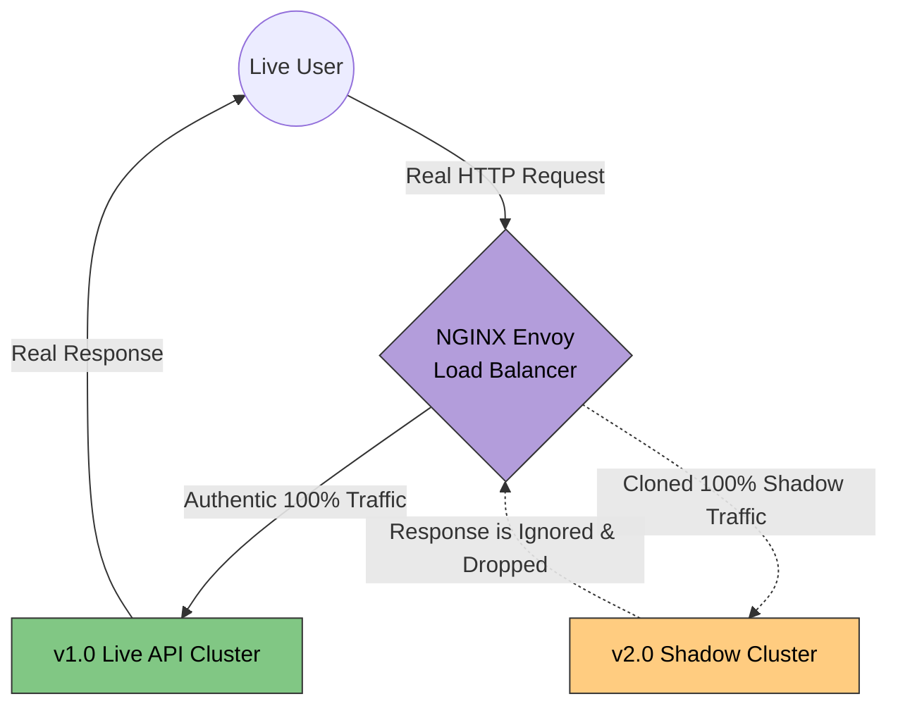

# 33. Advanced Traffic Management (Zero-Downtime Deployments)

When you update the code for your Backend API, how do you actually deploy the new software to your production servers without disconnecting thousands of active users? 

If you just run `sudo systemctl restart nginx` on your server during peak hours, you will instantly sever thousands of active connections and cause a mass 502 Bad Gateway failure. To prevent this, Senior Developers aggressively wield the Load Balancer to perform **Zero-Downtime Traffic Deployments**.

## 33.1 Blue/Green Deployments (The Infrastructure Swap)

Blue/Green deployment requires you to literally duplicate your entire production infrastructure.

1.  **The Blue Fleet (Live):** You have 10 servers running `v1.0` of your code. Your Load Balancer is comfortably routing 100% of user traffic strictly to the Blue Fleet.
2.  **The Green Fleet (Idle):** You physically provision 10 brand new servers and deploy `v2.0` of your code to them. The Green Fleet takes 0% of user traffic. Engineers securely connect privately to the Green fleet and mathematically test that `v2.0` works perfectly.
3.  **The Swap:** You reconfigure the physical Load Balancer (or GSLB DNS) to point at the Green Fleet. The Load Balancer instantly flips 100% of the live internet traffic from Blue ➡️ Green.
4.  **The Safety Net:** If users start crashing on `v2.0`, you just flip the Load Balancer switch back to the Blue Fleet in exactly one second. *Zero downtime, absolute safety.*

## 33.2 Canary Deployments (The Safe Rollout)

Blue/Green deployments are brutally expensive (you have to pay for 20 servers to run 10 servers of capacity). 
**Canary Deployments** are much cheaper and infinitely more intelligent. You slowly leak live traffic to the new code to test the waters.

1.  You have 100 servers running `v1.0`. You update exactly 1 server to run `v2.0` (The Canary).
2.  You explicitly program the Load Balancer (via Weighting) to route exactly **99% of traffic to v1.0, and precisely 1% of traffic to the `v2.0` Canary.**
3.  You aggressively monitor the Observability grafana dashboard (Chapter 28). If the `p99` latency on the Canary is perfect and 5xx errors are zero, you slowly increase the Load Balancer weighting (5%, 25%, 50%, 100%).
4.  If the Canary fails, the Load Balancer automatically isolates the 1% failure and redirects everyone safely back to `v1.0`. 

## 33.3 Shadow Traffic (Dark Launching)

This is a phenomenal concept purely achieved via Advanced Load Balancing (natively supported by NGINX and Envoy proxy).

Imagine you drastically rewrote your Database query engine. You are absolutely terrified that if you launch it, the new queries will crash the entire company. You can't even risk a 1% Canary test affecting actual customers!

**The Shadow Routing Magic:**
1.  The User makes an HTTP request looking for their profile data.
2.  The Load Balancer routes the HTTP packet to the live `v1.0` server exactly as normal.
3.  **The Shadow Fork:** The Load Balancer physically duplicates the HTTP packet in mid-air! It sends the invisible cloned packet silently to the `v2.0` architecture. 
4.  The User receives the fast, safe response from the `v1.0` server immediately. 
5.  Meanwhile, the `v2.0` server processes the cloned request precisely under real-world load. The Load Balancer completely ignores the `v2.0` response (so the user never sees it). You can monitor if `v2.0` crashes under fake "Shadow Traffic" without a single real user ever being affected!

---

### 33.4 Advanced Routing Matrix

| Deployment Strategy | How it routes the traffic | Cost / Resource Usage | Risk Level to End Users |
| :--- | :--- | :--- | :--- |
| **Rolling Update** | Standard update. Turns 1 server off, updates it, turns it on. | Low (Uses exact same capacity). | High. Can easily break live requests mid-flight. |
| **Blue/Green** | 100% instant flip between two identical environments. | Very High (Requires exactly 2x server capacity). | Very Low (Can instantly revert back to old fleet). |
| **Canary** | Mathematically routes 1% of users to new code to test real impacts. | Low (Standard scaling). | Moderate (1% of your real users might experience a crash). |
| **Shadow (Dark Lanch)** | Clones 100% of live traffic natively at the Load Balancer layer. | High (Database processing is fully duplicated). | Zero. The user mathematically never experiences the experimental cluster. |

---

---

