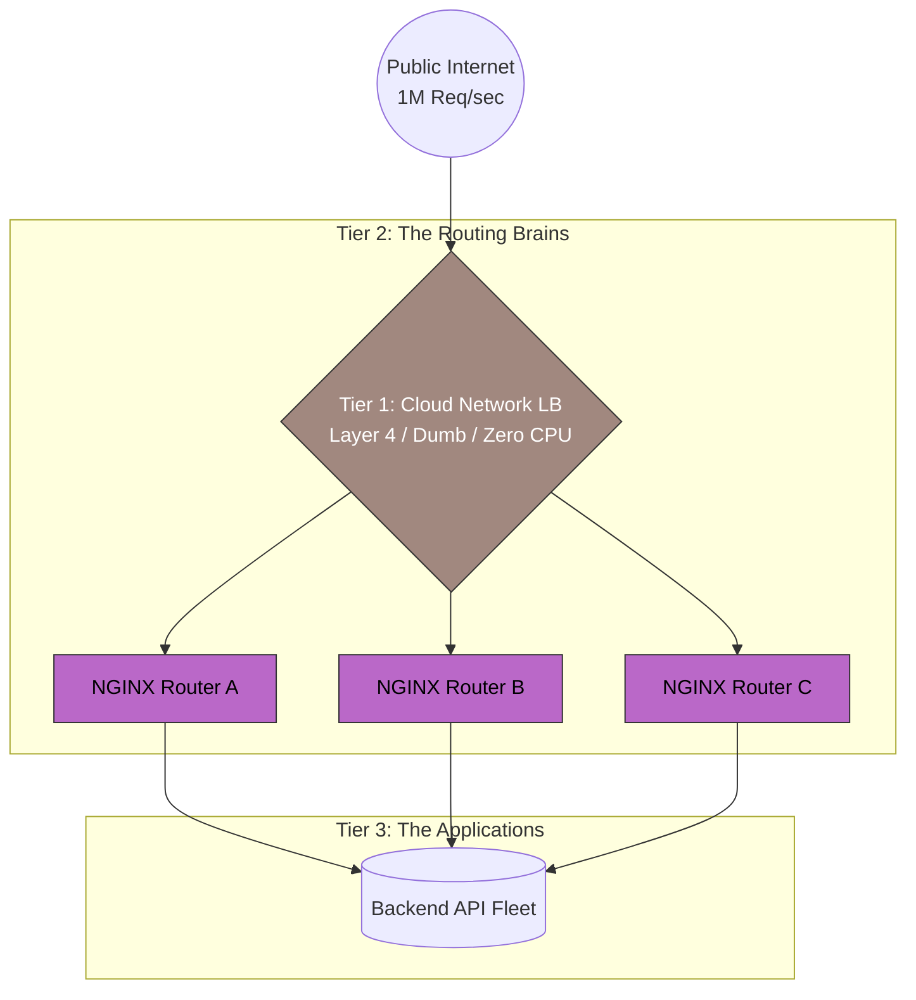

# 34. Load Balancing Bottlenecks

A Load Balancer is designed to scale applications infinitely. But what happens when the Load Balancer itself becomes the mathematical bottleneck? 
If you simply place one NGINX box in front of 50,000 backend servers, that single physical NGINX box will melt under the CPU stress and take the entire company offline.

Here are the primary chokepoints and how Senior Architects eliminate them.

## 34.1 The Physical Connection Limits (Ephemeral Ports)

Every time a Load Balancer opens a TCP connection backward to a server, it must select a random outbound port (called an **Ephemeral Port**). 

The TCP architecture strictly mathematically limits a single IP address to exactly `65,535` ephemeral ports.
*   **The Catastrophe:** If your Load Balancer has 1 internal IP address, it is literally physically impossible for it to load balance more than 65,535 simultaneous active connections to a single backend server IP. If connection 65,536 tries to open, the Linux Kernel violently rejects it.
*   **The Senior Fix (IP Aliasing):** You configure your Load Balancer's network card to broadcast that it owns 10 different internal IP addresses (e.g., `10.0.1.2` through `10.0.1.12`). Since each IP address gets its own 65,000 ports, your Load Balancer can instantly multiplex almost a million permanent backend connections! 

## 34.2 CPU Starvation (TLS Termination vs Pass-Through)

Handling HTTP routing is virtually free on the CPU. Handling **Encryption Handshakes (TLS/SSL)** is incredibly mathematically intensive. 
If your Load Balancer is handling 100,000 requests per second, the cryptographic math required to constantly decrypt the `HTTPS://` traffic will physically max out the Load Balancer's CPU `100%`, causing it to drop massive amounts of packets.

*   **TLS Termination (Standard):** The LB decrypts the traffic and forwards raw HTTP. High CPU cost on the LB.
*   **The Senior Fix (TLS Pass-Through):** To save your LB from melting, you configure it strictly as a Layer 4 (Network) Load Balancer. It stops trying to decrypt the traffic, completely ignores the HTTP headers, and blindly forwards the encrypted 1s and 0s directly to the backend Pods. The backend servers execute the mathematical decryption themselves, effectively distributing the heavy CPU cryptographic load perfectly across your entire fleet!

## 34.3 Memory Exhaustion (The Slowloris Attack)

If you configure your Load Balancer to have "infinite timeouts," you open yourself up to the most famous memory-draining attack on Earth: **The Slowloris**.

*   **The Attack:** An attacker opens 50,000 simultaneous TCP connections to your Load Balancer. Instead of asking for a web page normally, the attacker sends literally *one byte* of data every 5 seconds.
*   Because the attacker hasn't explicitly closed the connection, your Load Balancer is perfectly polite. It patiently holds those 50,000 slow connections open in its RAM indefinitely, waiting for the attacker to finish. Eventually, your LB entirely runs out of RAM and crashes helplessly, preventing real users from connecting.
*   **The Fix:** You strictly configure aggressive **Read Timeouts and Idle Timeouts** (e.g., If the client doesn't finish downloading or uploading within 10 seconds, the Load Balancer explicitly severs the TCP socket).

## 34.4 The Scale-Out Fix: Tiered Load Balancing

When you outgrow a single massive Load Balancer, you build a **Tiered Hierarchy (L4 -> L7)**.

1.  **Tier 1 (The Massive L4 Sledgehammer):** You use a brutal Layer 4 Network Load Balancer (or BGP Anycast) that consumes almost zero CPU.
2.  **Tier 2 (The L7 Brains):** The dumb L4 router uniformly blasts the raw packets to a fleet of exactly **Ten** Layer 7 Application Load Balancers (like NGINX).
3.  **Tier 3 (The App):** The 10 distinct L7 Balancers finally read the URL paths, decrypt the TLS, and intelligently route the packets down to your 10,000 actual Node.js servers.

---

---

