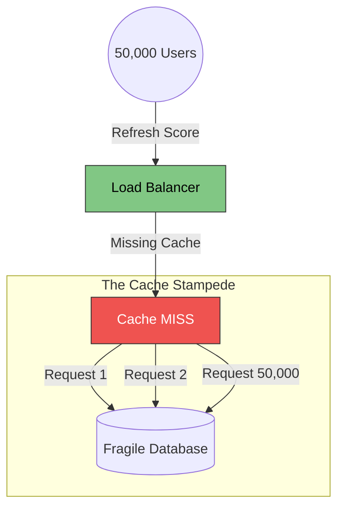

# 35. Distributed Systems Problems 

Load Balancers are the gateway to scaling, but as soon as you spin up multiple backend servers, you instantly introduce massive, fundamental Computer Science engineering problems. You are now running a **Distributed System**.

Here are the top three catastrophic failure modes that a Load Balancer explicitly causes (or can be weaponized to solve).

## 35.1 The Thundering Herd Problem

**The Scenario:** 
You have 10 identical backend API servers. Your system is perfectly healthy, with 10,000 users evenly distributed (1,000 users per server).
Suddenly, Server #1 experiences a fatal hardware crash and cleanly goes offline.

**The Disaster:**
The Load Balancer does exactly what you programmed it to do. It immediately takes the 1,000 active users that were on Server #1 and violently distributes them all simultaneously to Servers #2 through #10. 
Those surviving servers instantly receive a sudden, massive spike of concurrent connections. Server #2 is overwhelmed by the sudden spike and its CPU hits 100%. Server #2 crashes.
Now the Load Balancer takes the 2,000 orphaned users and violently blasts them onto the remaining 8 servers...

*This is a Casading Failure (The Thundering Herd).* Your entire Datacenter mathematically collapses like a row of dominos over a 15-second period exactly because the Load Balancer transferred load too perfectly.

**The Fix:**
Senior Architects use **Circuit Breakers** and aggressive **Rate Limiting** natively at the Load Balancer Edge to explicitly drop excessive failover traffic in order to protect the surviving servers from the domino effect.

## 35.2 The Split-Brain (Network Partition)

**The Scenario:**
You have Server A (in the American Datacenter) and Server B (in the European Datacenter). They technically share the exact same global database. 
Suddenly, a shark bites an underground fiber-optic cable in the Atlantic Ocean. America and Europe can no longer talk to each other (Network Partition).

**The Disaster:**
The Load Balancer sees perfectly healthy users arriving in America, so it routes them securely to Server A. It sees users perfectly arriving in Europe, so it routes them to Server B. 
American users buy the newly released iPhone. European users also buy the exact same newly released iPhone. Because the servers cannot talk securely to each other, they both record the exact same iPhone as "Sold". 

When the underwater cable is repaired an hour later and the network reconnects, you have a massive **State Collision (Split Brain)**. Two different users completely claim the exact same item, causing devastating data corruption!

**The Fix:**
According to the **CAP Theorem**, during a network partition, you must mathematically sacrifice either Availability or Consistency. The Load Balancer must be rigorously configured to either purposefully take the European Datacenter entirely offline (sacrificing Availability) or confidently lock European users into "Read-Only Mode".

## 35.3 The Cache Stampede

**The Scenario:**
You run a viral sports app. 5 million users are all furiously refreshing the app looking for the final score of the World Cup.
Your Load Balancer intercepts all 5 million requests, efficiently fetches the "Score" from Redis, and accurately returns it to everyone. Your backend Database is completely safe.

**The Disaster:**
The Redis Key containing the 'World Cup Score' is configured with a `TTL` (Time To Live) of exactly 60 seconds. 
When the 60-second timer hits zero, the Redis Cache explicitly deletes the score. 
At that literal millisecond, the Load Balancer has absolutely zero concept of pacing. It allows 50,000 concurrent user requests to completely bypass the empty Redis cache and directly hit the fragile SQL Database simultaneously! The Database instantly melts and corrupts.

**The Fix:**
You must implement **Request Coalescing (Cache Locking)** at the Load Balancer / API layer. 
When the cache expires, the first request is legally allowed to hit the database to fetch the new score. The other 49,999 requests are mathematically locked and securely held "in a waiting line" by the Load Balancer for roughly 20ms until the new score is physically populated back into Redis.

---

---

