# Chapter 1 — Real-Time Backend Fundamentals

Real-time backend systems are systems where the server can deliver information to a client **as soon as the information becomes relevant**, instead of waiting for the client to repeatedly ask for updates.

Examples include:

* Chat applications
* Live notifications
* Live sports scores
* Stock-price updates
* Food-order tracking
* Multiplayer games
* Collaborative editors
* Hospital bed availability
* Online presence indicators

The important thing to understand is:

> **Real-time does not necessarily mean zero latency. It means the system is designed to deliver updates with low and predictable enough delay for the application's requirements.**

---

# 1.1 What Does "Real-Time" Mean?

The simplest backend interaction looks like this:


```mermaid
sequenceDiagram
    participant Client
    participant Server
    Client->>Server: Request
    Server-->>Client: Response
```

The client initiates the communication.

For example:

```http
GET /messages
```

The server responds:

```json
{
  "messages": [
    "Hello",
    "How are you?"
  ]
}
```

If another user sends a message after this response, the first client doesn't automatically know about it.

The client has to ask again.

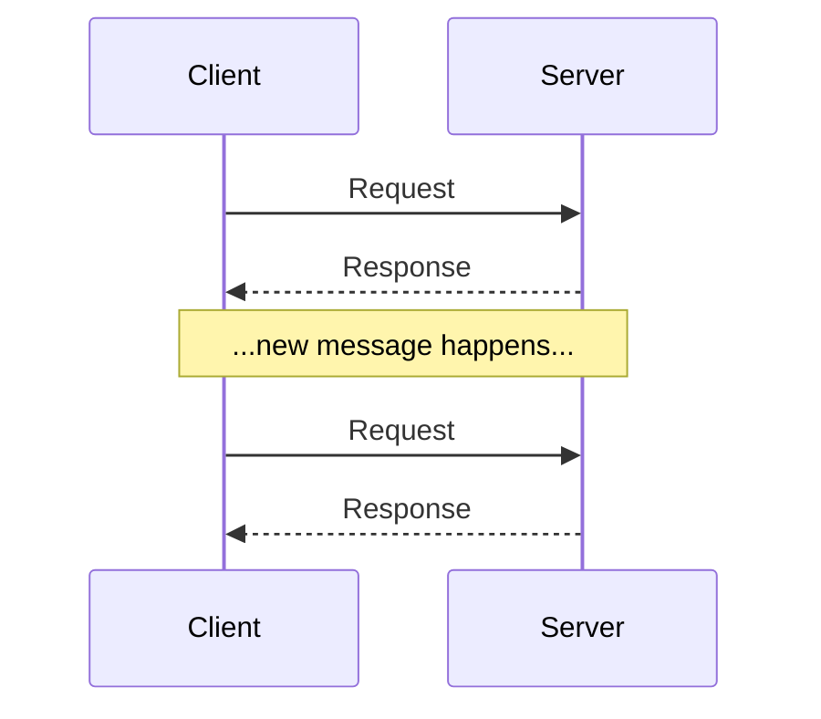
```mermaid
sequenceDiagram
    participant Client
    participant Server
    Client->>Server: Request
    Server-->>Client: Response
    Note over Client,Server: ...new message happens...
    Client->>Server: Request
    Server-->>Client: Response
```

A real-time system changes this relationship.

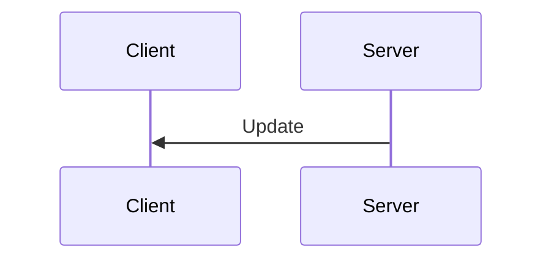
```mermaid
sequenceDiagram
    participant Client
    participant Server
    Server->>Client: Update
```

The server can now notify the client when something happens.

---

# 1.2 Real-Time vs Traditional Request-Response

Consider a chat application.

Suppose User A sends:

```text
"Hey!"
```

to User B.

With a traditional request-response system:

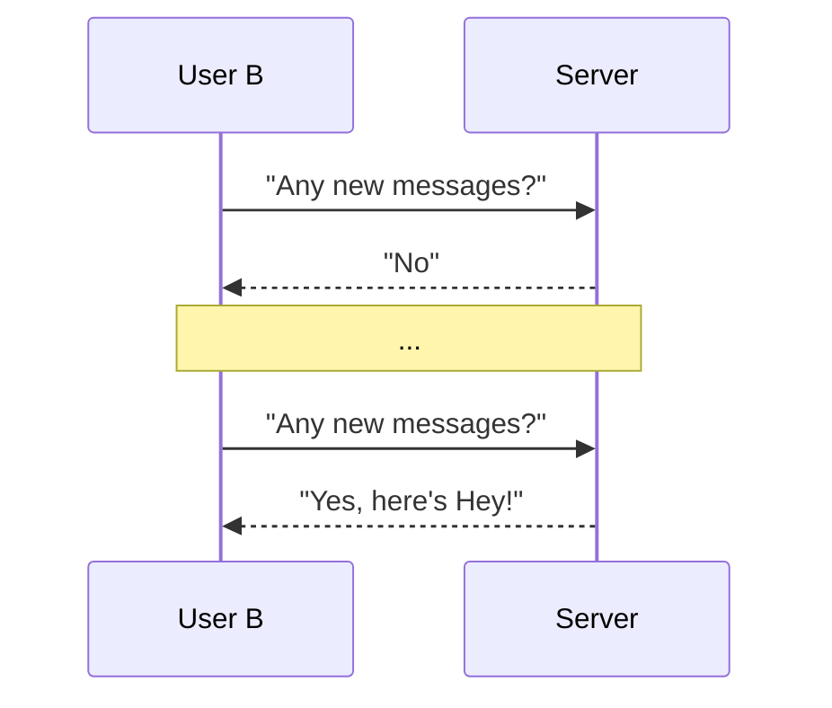
```mermaid
sequenceDiagram
    participant User B
    participant Server
    User B->>Server: "Any new messages?"
    Server-->>User B: "No"
    Note over User B,Server: ...
    User B->>Server: "Any new messages?"
    Server-->>User B: "Yes, here's Hey!"
```

The server cannot spontaneously communicate with the client using the normal request-response pattern.

The client must initiate another request.

A real-time connection allows:

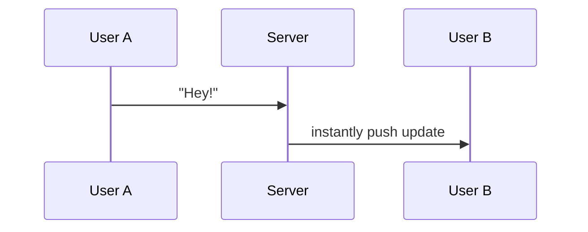
```mermaid
sequenceDiagram
    participant User A
    participant Server
    participant User B
    User A->>Server: "Hey!"
    Server->>User B: instantly push update
```

This is the fundamental problem that real-time communication solves.

---

# 1.3 Why Do We Need Real-Time Systems?

Not every application needs real-time communication.

For example, consider a blog.

A user opens:

```text
GET /articles
```

and receives the articles.

It is perfectly reasonable for the user to refresh the page when they want newer content.

But consider:

### Chat

A message should appear quickly after another user sends it.

### Live sports

A score changing 30 seconds ago shouldn't necessarily require the user to refresh the page.

### Food delivery

If an order changes from:

```text
Preparing
```

to:

```text
Out for Delivery
```

the user expects the UI to update automatically.

### Notifications

If someone comments on your post, the notification should arrive without repeatedly refreshing the page.

This gives us a useful rule:

> **Real-time communication is useful when the server has information that the client needs to know about before the client naturally makes another request.**

---

# 1.4 Real-Time Does Not Mean "Instant"

The term "real-time" can be misleading.

A real-time system still has latency.

For example:

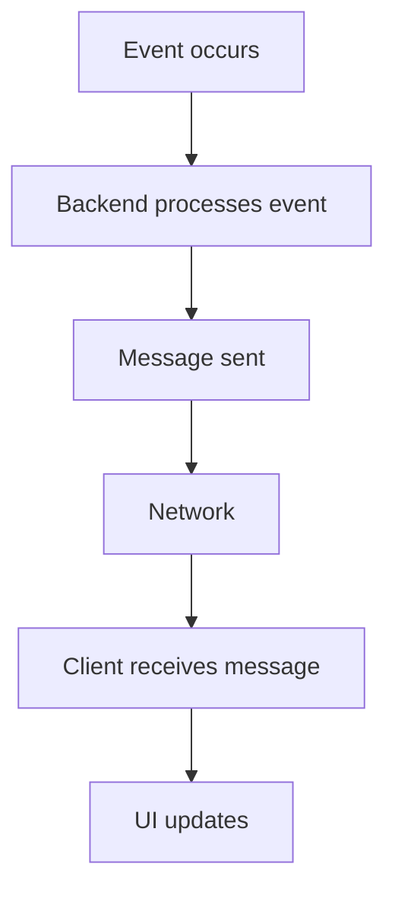
```mermaid
flowchart TD
    E["Event occurs"] --> B["Backend processes event"]
    B --> M["Message sent"]
    M --> N["Network"]
    N --> C["Client receives message"]
    C --> U["UI updates"]
```

There may be milliseconds of delay at every step.

So:

```text
Real-time ≠ 0 ms latency
```

Instead:

```text
Real-time
    =
Low enough latency
+
Appropriate delivery model
+
Timely updates
```

The required latency depends on the application.

For example:

| Application            | Approximate requirement        |
| ---------------------- | ------------------------------ |
| Chat                   | Low latency                    |
| Live collaboration     | Very low latency               |
| Multiplayer game       | Very low latency               |
| Live sports            | Low latency                    |
| Notification           | Usually seconds are acceptable |
| Email                  | Real-time usually unnecessary  |
| Daily analytics report | Real-time unnecessary          |

These are **application requirements, not universal limits**.

---

# 1.5 The Fundamental Problem: Who Starts the Communication?

This is the key concept behind the evolution of real-time systems.

Traditional HTTP works primarily like:

```text
Client ─────► Server
Client ◄───── Server
```

The client starts the conversation.

But real-time applications need:

```text
Server ─────► Client
```

without requiring:

```text
Client ─────► Server
```

every time.

That creates a fundamental challenge:

> **How can a server deliver information to a client when the client isn't currently asking for it?**

Several solutions evolved to address this.

---

# 1.6 Evolution of Real-Time Communication

The common progression is:

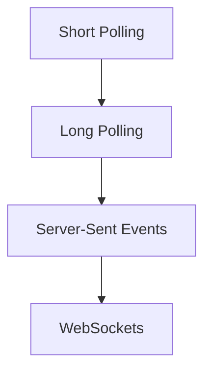
```mermaid
flowchart TD
    SP["Short Polling"] --> LP["Long Polling"]
    LP --> SSE["Server-Sent Events"]
    SSE --> WS["WebSockets"]
```

Each approach attempts to improve upon limitations of the previous approach.

But this is not strictly:

> "Old technology → bad technology → new technology."

Each technique still has legitimate use cases.

---

# 1.7 Short Polling

The simplest solution is:

> **Ask the server repeatedly.**

For example:

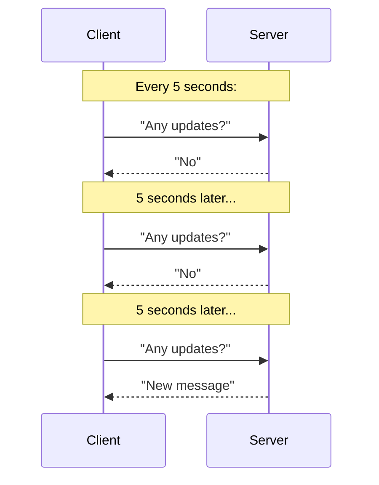
```mermaid
sequenceDiagram
    participant Client
    participant Server
    Note over Client,Server: Every 5 seconds:
    Client->>Server: "Any updates?"
    Server-->>Client: "No"
    Note over Client,Server: 5 seconds later...
    Client->>Server: "Any updates?"
    Server-->>Client: "No"
    Note over Client,Server: 5 seconds later...
    Client->>Server: "Any updates?"
    Server-->>Client: "New message"
```

This is called **short polling**.

The client sends requests at regular intervals.

---

## Example

Imagine:

```javascript
setInterval(async () => {
  const response = await fetch("/api/messages");
  const messages = await response.json();

  updateUI(messages);
}, 5000);
```

The client asks every five seconds.

---

# 1.8 The Problem with Short Polling

Suppose a user receives one message every 10 minutes.

But the client polls every 5 seconds.

During those 10 minutes:

```text
120 requests
```

may have been made.

Most responses contain:

```text
"No new messages."
```

So we're generating a lot of unnecessary traffic.

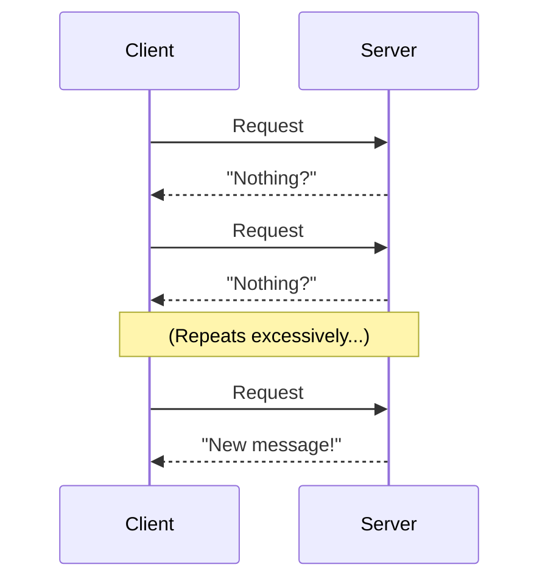
```mermaid
sequenceDiagram
    participant Client
    participant Server
    Client->>Server: Request
    Server-->>Client: "Nothing?"
    Client->>Server: Request
    Server-->>Client: "Nothing?"
    Note over Client,Server: (Repeats excessively...)
    Client->>Server: Request
    Server-->>Client: "New message!"
```

This creates:

* unnecessary requests
* unnecessary server processing
* unnecessary database/cache reads
* network overhead
* delayed updates depending on polling interval

---

# 1.9 Polling Interval Creates a Trade-off

Suppose we poll every:

```text
1 second
```

Updates can be detected relatively quickly.

But we generate many requests.

If we poll every:

```text
30 seconds
```

we reduce requests.

But an update may take almost 30 seconds to be discovered.

Therefore:

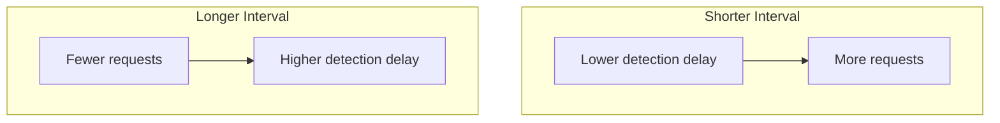
```mermaid
flowchart TD
    subgraph Short [Shorter Interval]
    S1["Lower detection delay"] --> S2["More requests"]
    end
    subgraph Long [Longer Interval]
    L1["Fewer requests"] --> L2["Higher detection delay"]
    end
```

This is one of the first important real-time trade-offs.

---

# 1.10 Long Polling

Long polling tries to improve short polling.

Instead of immediately responding:

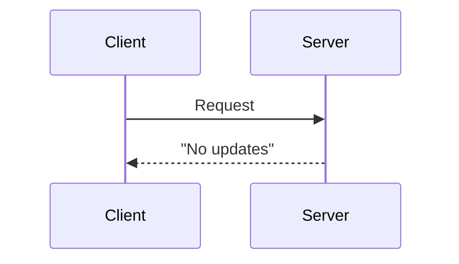
```mermaid
sequenceDiagram
    participant Client
    participant Server
    Client->>Server: Request
    Server-->>Client: "No updates"
```

the server keeps the request open.

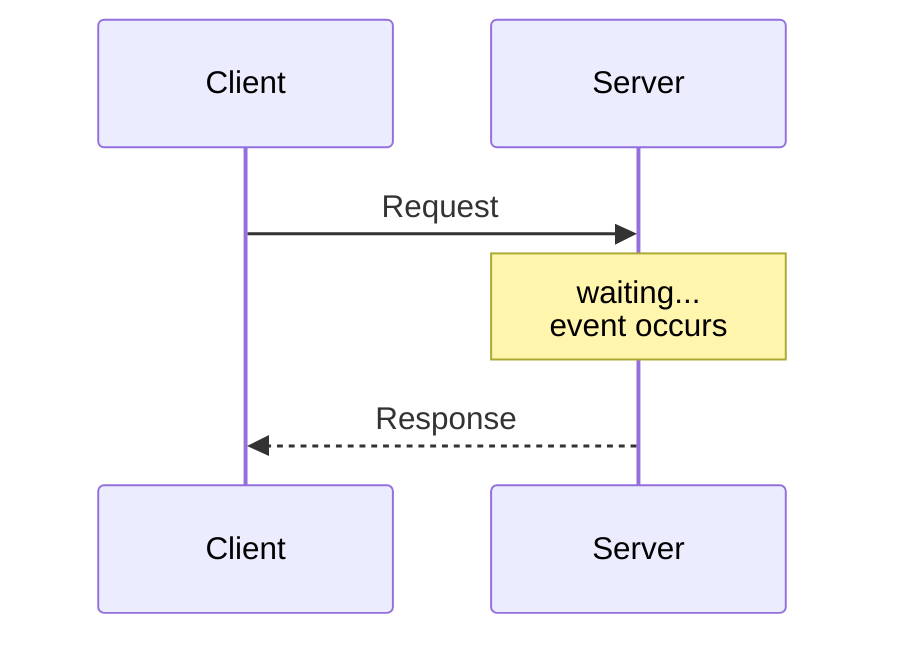
```mermaid
sequenceDiagram
    participant Client
    participant Server
    Client->>Server: Request
    Note over Server: waiting...<br>event occurs
    Server-->>Client: Response
```

The server responds when:

1. new data becomes available, or
2. a timeout occurs.

After receiving the response, the client usually immediately creates another long-polling request.

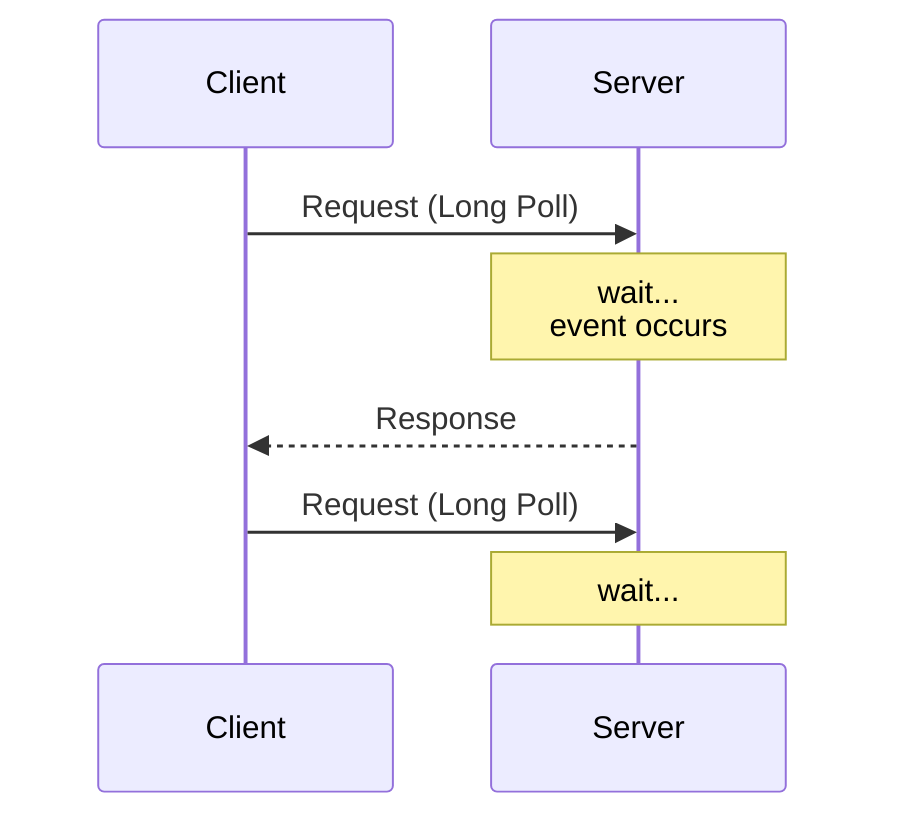
```mermaid
sequenceDiagram
    participant Client
    participant Server
    Client->>Server: Request (Long Poll)
    Note over Server: wait...<br>event occurs
    Server-->>Client: Response
    
    Client->>Server: Request (Long Poll)
    Note over Server: wait...
```

---

# 1.11 Why Long Polling Is Better Than Short Polling

Short polling:

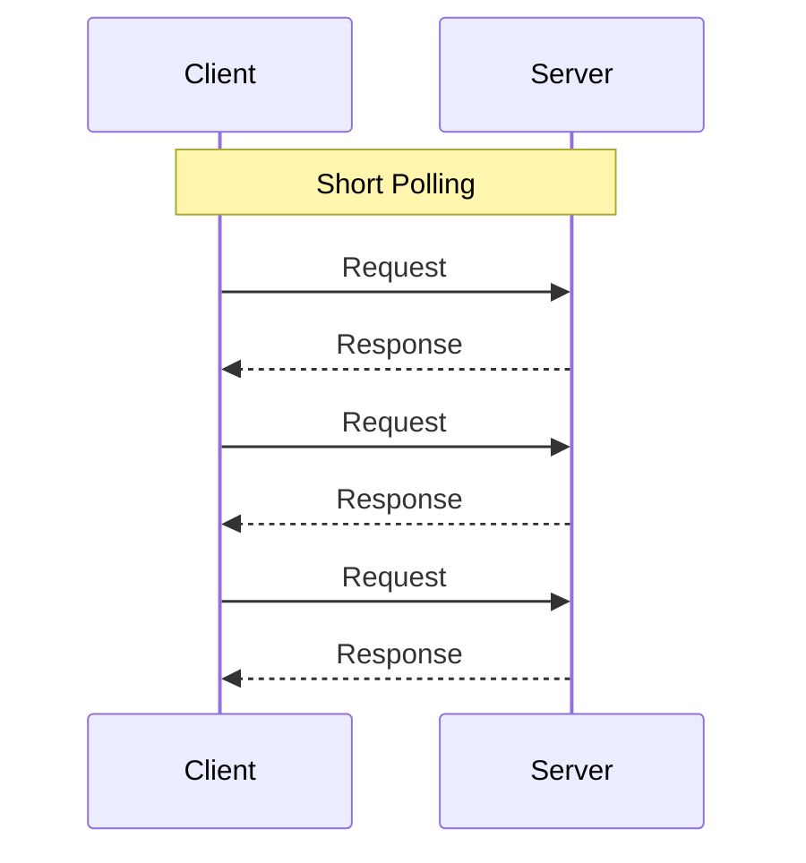
```mermaid
sequenceDiagram
    participant C as Client
    participant S as Server
    Note over C,S: Short Polling
    C->>S: Request
    S-->>C: Response
    C->>S: Request
    S-->>C: Response
    C->>S: Request
    S-->>C: Response
```

Long polling:

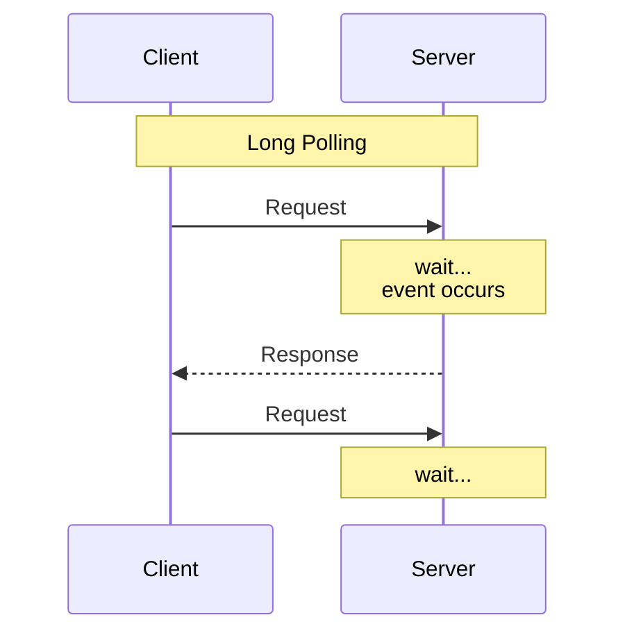
```mermaid
sequenceDiagram
    participant C as Client
    participant S as Server
    Note over C,S: Long Polling
    C->>S: Request
    Note over S: wait...<br>event occurs
    S-->>C: Response
    
    C->>S: Request
    Note over S: wait...
```

The server doesn't immediately respond when nothing has changed.

This reduces unnecessary empty responses.

---

# 1.12 But Long Polling Is Still HTTP

This is important.

Long polling doesn't magically create a persistent bidirectional connection.

It is still based on repeated HTTP requests.

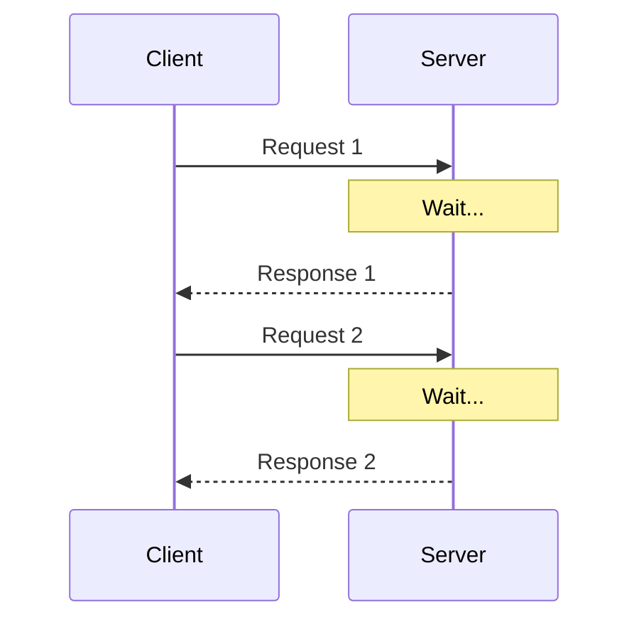
```mermaid
sequenceDiagram
    participant C as Client
    participant S as Server
    C->>S: Request 1
    Note over S: Wait...
    S-->>C: Response 1
    C->>S: Request 2
    Note over S: Wait...
    S-->>C: Response 2
```

Therefore, the client still needs to reconnect/reissue requests.

This introduces connection-management and scaling overhead.

---

# 1.13 Server-Sent Events (SSE)

SSE takes another step.

Instead of repeatedly creating requests, the client establishes a persistent HTTP connection.

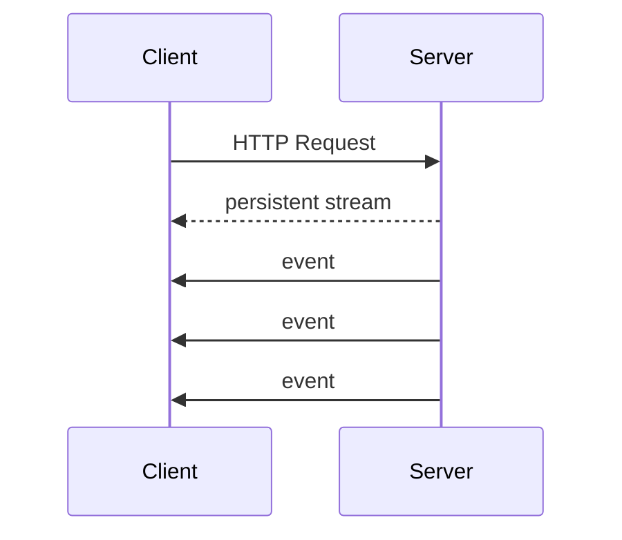
```mermaid
sequenceDiagram
    participant C as Client
    participant S as Server
    C->>S: HTTP Request
    S-->>C: persistent stream
    S->>C: event
    S->>C: event
    S->>C: event
```

The server can continuously send events through that connection.

SSE is primarily:

> **Server → Client**

communication.

---

# 1.14 SSE Mental Model

Think of SSE as:

> "Keep this HTTP connection open, and whenever something happens, send an event through it."

For example:

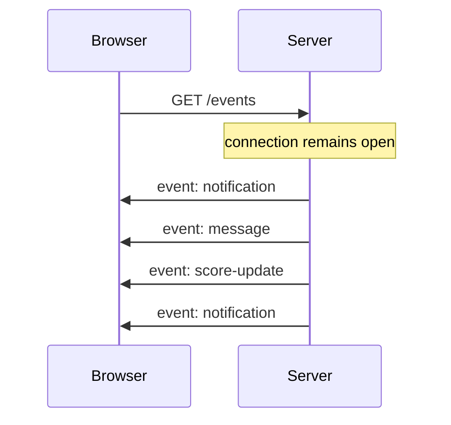
```mermaid
sequenceDiagram
    participant Browser
    participant Server
    Browser->>Server: GET /events
    Note over Server: connection remains open
    Server->>Browser: event: notification
    Server->>Browser: event: message
    Server->>Browser: event: score-update
    Server->>Browser: event: notification
```

The browser can use the `EventSource` API to receive these events.

---

# 1.15 When Is SSE Useful?

SSE is useful when communication is primarily:

```text
Server ─────► Client
```

Examples:

* Notifications
* Live dashboards
* Live scores
* Progress updates
* Activity feeds
* Monitoring dashboards
* AI response streaming
* Job-status updates

For example:

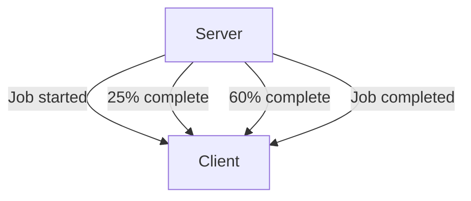
```mermaid
flowchart TD
    S["Server"] -->|"Job started"| C["Client"]
    S -->|"25% complete"| C
    S -->|"60% complete"| C
    S -->|"Job completed"| C
```

The client doesn't need to send messages back over the same connection.

---

# 1.16 WebSockets

WebSockets solve a different problem.

They provide a persistent connection that supports:

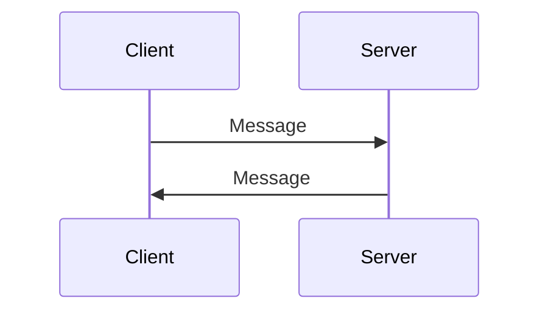
```mermaid
sequenceDiagram
    participant Client
    participant Server
    Client->>Server: Message
    Server->>Client: Message
```

at any time.

This is **bidirectional communication**.

```mermaid
sequenceDiagram
    participant Client
    participant Server
    Note over Client,Server: Persistent Connection<br>(messages can travel both ways)
    Client->>Server: Data
    Server->>Client: Data
```

Once the connection is established:

```mermaid
sequenceDiagram
    participant Client
    participant Server
    Client->>Server: message
    Server->>Client: event
    Client->>Server: typing
    Server->>Client: notification
```

Neither side needs to create a new HTTP request for every message.

---

# 1.17 WebSocket Mental Model

Think of a WebSocket connection as an open communication channel.

```mermaid
sequenceDiagram
    participant Client
    participant Server
    Client->>Server: establish connection
    Note over Server: connection stays open
    Client->>Server: message
    Server->>Client: event
    Client->>Server: typing
    Server->>Client: notification
    Client->>Server: acknowledgement
    Server->>Client: update
```

This makes WebSockets particularly useful for applications requiring frequent two-way interaction.

Examples:

* Chat
* Multiplayer games
* Collaborative editing
* Trading interfaces
* Real-time control systems
* Interactive live applications

---

# 1.18 WebRTC

WebRTC is another real-time technology, but it solves a somewhat different problem.

WebRTC is designed primarily for **peer-to-peer communication** between clients.

For example:

```mermaid
flowchart TD
    SS["Signaling Server"] --> C1["Client A"]
    SS --> C2["Client B"]
    C1 <-.->|WebRTC| C2
```

It is commonly associated with:

* Video calls
* Audio calls
* Peer-to-peer data
* Screen sharing

Unlike WebSockets, the main goal isn't simply:

```mermaid
sequenceDiagram
    participant Browser
    participant Backend
    Browser->>Backend: Data
```

Instead, WebRTC can establish:

```mermaid
sequenceDiagram
    participant Peer A
    participant Peer B
    Peer A->>Peer B: Direct Data
```

with supporting infrastructure such as signaling, STUN, and sometimes TURN.

We will only cover WebRTC conceptually in this learning path.

---

# 1.19 Comparing the Evolution

| Technology    | Communication   | Connection Model       | Main Idea                        |
| ------------- | --------------- | ---------------------- | -------------------------------- |
| Short Polling | Client → Server | Repeated requests      | Ask periodically                 |
| Long Polling  | Client → Server | Request held open      | Wait for an update               |
| SSE           | Server → Client | Persistent HTTP stream | Server continuously sends events |
| WebSocket     | Bidirectional   | Persistent connection  | Both sides communicate           |
| WebRTC        | Peer ↔ Peer     | Peer connection        | Direct real-time communication   |

The key distinction is not simply performance.

It is:

> **Who needs to communicate, in which direction, and how frequently?**

---

# 1.20 Real-Time Is About Communication Requirements

Suppose we have three applications.

### Application A — Notification System

Requirement:

> Server needs to tell the browser when a notification arrives.

Communication:

```text
Server ─────► Client
```

SSE may be sufficient.

---

### Application B — Chat

Requirement:

> Users send messages and receive messages continuously.

Communication:

```text
Client ◄──────► Server
```

WebSockets are a natural option.

---

### Application C — Video Call

Requirement:

> Two users need to exchange audio/video.

Communication:

```text
Client A ◄──────► Client B
```

WebRTC becomes relevant.

---

# 1.21 The First Important Design Question

When designing a real-time system, don't immediately ask:

> "Should I use WebSockets?"

Instead ask:

> **"What communication pattern does the application actually need?"**

Start with:

```text
What needs to happen?
        │
        ▼
Who produces the event?
        │
        ▼
Who needs to receive it?
        │
        ▼
One-way or two-way?
        │
        ▼
How frequently do events occur?
        │
        ▼
How quickly must they arrive?
        │
        ▼
How reliable must delivery be?
```

Only then should you choose the technology.

---

# 1.22 Real-Time vs Near Real-Time

Not every system that updates frequently needs a persistent connection.

Consider an analytics dashboard.

If the dashboard updates every:

```text
60 seconds
```

short polling may be perfectly reasonable.

But if the requirement is:

> "Updates should appear within 100 ms."

then polling every 60 seconds clearly doesn't satisfy the requirement.

Therefore, technology should follow the **freshness requirement**.

---

# 1.23 Freshness vs Resource Usage

There is an important system-design trade-off.

Imagine a system where clients need updated information.

We can increase freshness by checking more frequently:

```text
Poll every 1 sec
```

But this increases infrastructure work.

Alternatively:

```text
Poll every 30 sec
```

reduces load but allows stale information.

Persistent connections can reduce repeated request overhead, but they introduce their own costs:

* Open connections consume resources.
* Servers need connection management.
* Load balancing becomes more complicated.
* Deployments need connection draining.
* Reconnection storms can happen.
* Multiple servers may require a shared backplane.

Therefore:

> **Real-time architecture trades request frequency for connection state and connection-management complexity.**

---

# 1.24 Stateful Nature of Persistent Connections

This becomes especially important when we start scaling WebSockets.

Suppose:

```text
Client A
   │
   ▼
WebSocket Server 1
```

The server maintains the connection to Client A.

Now suppose Client B connects to Server 2:

```text
Client A ───► Server 1

Client B ───► Server 2
```

If Client A sends a message intended for Client B:

```text
Client A
   │
   ▼
Server 1
```

Server 1 needs some way to reach Server 2.

This is where distributed real-time architecture begins.

Eventually we may introduce:

```text
             Load Balancer
              /         \
             ▼           ▼
         Server 1      Server 2
             │           │
             └─────┬─────┘
                   ▼
                Pub/Sub
```

We will study this in later chapters.

---

# 1.25 Why Scaling Real-Time Systems Is Different

A normal HTTP server can often be treated as:

```text
Request
   ↓
Process
   ↓
Response
   ↓
Done
```

The server doesn't necessarily need to remember which server handled the request.

With a persistent WebSocket connection:

```text
Connection established
        ↓
Connection remains open
        ↓
Server maintains connection state
        ↓
Messages arrive
        ↓
Connection eventually closes
```

The server now has long-lived connection state.

This changes the scaling problem.

Instead of only thinking:

> "How many requests per second can my server handle?"

we also need to think:

> "How many concurrent connections can my server maintain?"

These are different capacity dimensions.

---

# 1.26 Concurrent Connections vs Requests Per Second

Imagine a server handling:

```text
100,000 connected users
```

but each user sends only:

```text
1 message every 10 minutes
```

The request/message rate may be relatively low.

Yet the server still needs to maintain:

```text
100,000 connections
```

Now imagine:

```text
10,000 connected users
```

where each sends:

```text
10 messages/sec
```

The connection count is smaller, but message throughput is much higher.

Therefore, real-time systems often need to reason about both:

```text
Concurrent Connections
+
Messages / Events per Second
```

and also memory, CPU, network bandwidth, and downstream capacity.

---

# 1.27 Connection Lifecycle

A persistent connection has a lifecycle.

Conceptually:

```text
          Connect
             │
             ▼
        ┌─────────┐
        │  Open   │
        └────┬────┘
             │
       messages/events
             │
             ▼
        ┌─────────┐
        │  Open   │
        └────┬────┘
             │
        disconnect
             │
             ▼
        ┌─────────┐
        │ Closed  │
        └─────────┘
```

In production, we also need to consider:

* connection timeout
* client disconnect
* server restart
* network failure
* heartbeat failure
* reconnection
* graceful shutdown

These become important later.

---

# 1.28 Reconnection

Real-time connections are not permanent.

A user can:

* lose Wi-Fi
* switch networks
* close their laptop
* enter a tunnel
* put their phone to sleep
* lose mobile signal
* experience a server restart

Therefore:

```text
Connected
    │
    │ network failure
    ▼
Disconnected
    │
    │ reconnect
    ▼
Connecting
    │
    ▼
Connected
```

A production real-time client needs a reconnection strategy.

But blindly reconnecting immediately can create another problem.

---

# 1.29 Thundering Herd

Imagine a server restart disconnects:

```text
100,000 clients
```

All clients notice the disconnection at approximately the same time.

If every client immediately reconnects:

```text
100,000 clients
       │
       │ reconnect NOW
       ▼
   Load Balancer
       │
       ▼
    Servers
```

the servers can suddenly receive a huge burst of connection attempts.

This is called a **thundering herd** or reconnect storm.

A common mitigation is:

```text
Exponential Backoff
+
Random Jitter
```

Instead of:

```text
Reconnect immediately
```

clients retry at varying times.

We will study this properly in the reliability chapter.

---

# 1.30 The Hidden Cost of "Real-Time"

Real-time communication sounds simple:

```text
Server → Client
```

But production systems have to answer:

### Connections

How many concurrent connections can we support?

### Scaling

What happens when one server isn't enough?

### Routing

Which server owns a user's connection?

### Messaging

How does Server A communicate with Server B?

### Reliability

What happens when the connection breaks?

### Ordering

What if messages arrive out of order?

### Delivery

What happens if a message is lost?

### Backpressure

What if the client is too slow?

### Deployment

What happens to connections during a server restart?

### Reconnection

What happens when thousands of clients reconnect simultaneously?

The communication protocol is only the beginning.

---

# 1.31 The Real-Time System Design Stack

A useful mental model is to separate the problem into layers.

```text
┌───────────────────────────────────────┐
│          Application Logic            │
│     Chat / Notifications / Games      │
├───────────────────────────────────────┤
│       Real-Time Communication         │
│        WebSocket / SSE / Polling      │
├───────────────────────────────────────┤
│       Connection Management           │
│   Heartbeats / Reconnect / Timeouts   │
├───────────────────────────────────────┤
│       Distributed Coordination        │
│          Redis / Pub/Sub              │
├───────────────────────────────────────┤
│       Application Infrastructure      │
│      Load Balancer / Servers          │
├───────────────────────────────────────┤
│              Storage                  │
│          Database / Cache              │
└───────────────────────────────────────┘
```

This is the architecture we will gradually build toward.

---

# 1.32 A Simple Real-Time Architecture

At the beginning, we might have:

```text
Client
   │
   │ WebSocket
   ▼
WebSocket Server
   │
   ▼
Database
```

This is perfectly reasonable for a small system.

But as the system grows:

```text
                    Load Balancer
                   /      |      \
                  ▼       ▼       ▼
                WS 1     WS 2     WS 3
                  \       |       /
                   \      |      /
                    ▼     ▼     ▼
                    Pub/Sub
                        │
                        ▼
                    Database
```

Each additional component exists because a particular problem appeared.

This is an important system-design mindset:

> **Don't add infrastructure because "large systems use it." Add infrastructure because a specific requirement or failure mode requires it.**

---

# 1.33 Polling vs SSE vs WebSockets vs WebRTC

A simplified decision table:

| Requirement                                                  | Possible Choice |
| ------------------------------------------------------------ | --------------- |
| Occasional updates                                           | Short Polling   |
| Need better responsiveness without full persistent streaming | Long Polling    |
| Server continuously pushes events                            | SSE             |
| Client and server both communicate frequently                | WebSockets      |
| Peer-to-peer audio/video/data                                | WebRTC          |

This is not a strict rule.

The correct choice depends on:

* latency requirements
* communication direction
* event frequency
* connection count
* reliability requirements
* infrastructure
* client/platform support
* operational complexity

---

# 1.34 The Most Important Mental Model

Remember this progression:

```text
                 Need updates
                      │
                      ▼
              "Can client ask?"
                      │
                      ▼
                Short Polling
                      │
              Too many requests?
                      │
                      ▼
                Long Polling
                      │
             Need continuous stream?
                      │
                      ▼
                     SSE
                      │
            Need two-way communication?
                      │
                      ▼
                  WebSockets
                      │
             Need peer-to-peer media?
                      │
                      ▼
                   WebRTC
```

The technologies are not random.

Each exists because a different communication problem exists.

---

# 1.35 What Changes When We Move to Real-Time?

Traditional backend:

```text
Request
   ↓
Application
   ↓
Database
   ↓
Response
```

Real-time backend:

```text
                 Event
                   │
                   ▼
             Application
                   │
                   ▼
              Real-Time
              Connection
                   │
                   ▼
                Client
```

And at scale:

```text
                    Event
                      │
                      ▼
                 Application
                      │
                      ▼
                  Pub/Sub
                 /   |   \
                ▼    ▼    ▼
              WS1   WS2   WS3
               │     │     │
               ▼     ▼     ▼
             Clients Clients Clients
```

This is the foundation for the later architecture chapters.

---

# 1.36 Key Takeaways

### 1. Real-time is a requirement, not a technology.

You don't start with:

> "Let's use WebSockets."

You start with:

> "What communication does the application require?"

---

### 2. Traditional HTTP is primarily client-initiated.

```text
Client → Server → Client
```

The client normally initiates the request.

Real-time systems need mechanisms that allow information to reach the client without repeatedly asking.

---

### 3. Polling is the simplest solution.

```text
Ask repeatedly.
```

But it can create unnecessary requests and detection delay.

---

### 4. Long polling keeps requests open.

It reduces unnecessary empty responses but still relies on repeated HTTP requests.

---

### 5. SSE provides server-to-client streaming.

```text
Server ─────► Client
```

It is useful when the client mainly needs to receive events.

---

### 6. WebSockets provide bidirectional communication.

```text
Client ◄──────► Server
```

They are useful when both sides need to communicate continuously.

---

### 7. WebRTC solves a different problem.

It is primarily designed for peer-to-peer real-time communication such as audio, video, and data.

---

### 8. Persistent connections introduce new scaling problems.

You must think about:

* concurrent connections
* connection ownership
* load balancing
* reconnection
* heartbeats
* backpressure
* graceful shutdown
* distributed messaging

---

### 9. More real-time does not automatically mean better.

The correct architecture depends on the application's requirements.

---

# 1.37 The Core Mental Model

If you remember only one thing from this chapter, remember this:

```text
                    REAL-TIME SYSTEM
                           │
                           ▼
              "Who needs to talk to whom?"
                           │
                 ┌─────────┴─────────┐
                 │                   │
              One-way             Two-way
                 │                   │
                 ▼                   ▼
                SSE             WebSockets
                 │                   │
                 └─────────┬─────────┘
                           │
                           ▼
                    Need to scale?
                           │
                           ▼
                   Multiple Servers
                           │
                           ▼
                      Backplane
                           │
                           ▼
                    Redis Pub/Sub
                           │
                           ▼
                    Reliability
                           │
             ┌─────────────┼─────────────┐
             ▼             ▼             ▼
         Reconnect      Ordering     Backpressure
```

The goal of this entire Real-Time Backend section is to understand **why each layer appears**, not merely memorize the technologies.

---

⬅️ **[Back to Real-Time Backend](README.md)**

➡️ **[Next: 2. Polling & Long Polling](02_Polling_And_Long_Polling.md)**
