# Chapter 4 — WebSocket Fundamentals

WebSockets provide a **persistent, bidirectional communication channel** between a client and a server.

Unlike SSE:

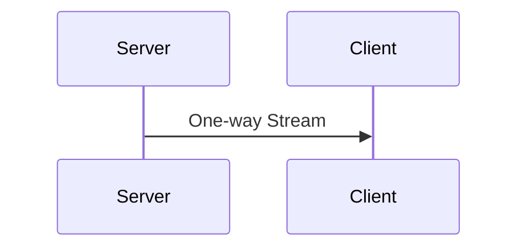

WebSockets allow:

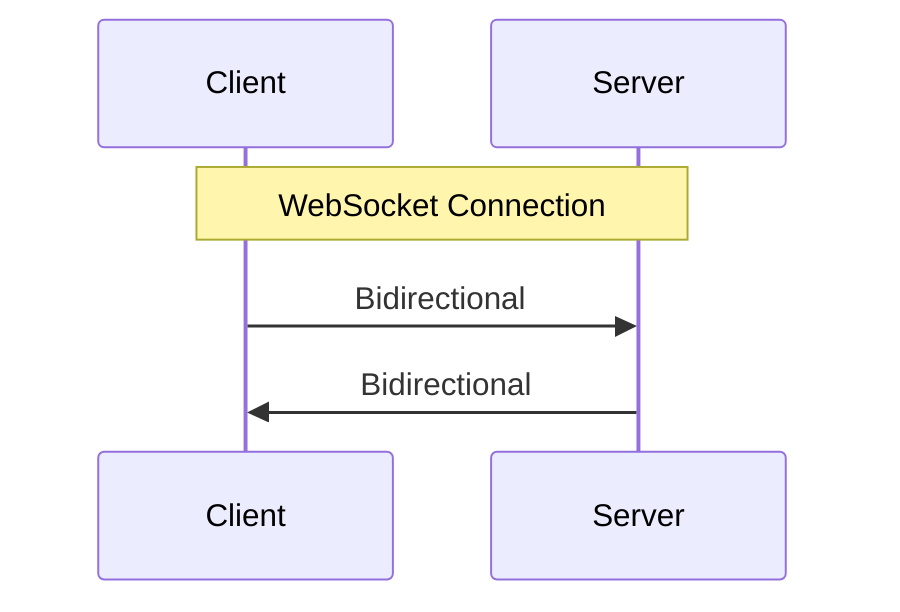

Both sides can send messages whenever they need to.

This makes WebSockets useful for systems where the client and server need to communicate continuously.

Examples:

- Chat applications
- Multiplayer games
- Collaborative editing
- Real-time trading interfaces
- Live customer support
- Real-time dashboards with client commands
- Presence systems
- Real-time notifications where bidirectional communication is useful

---

# 4.1 Why Do We Need WebSockets?

Consider a chat application.

With polling:

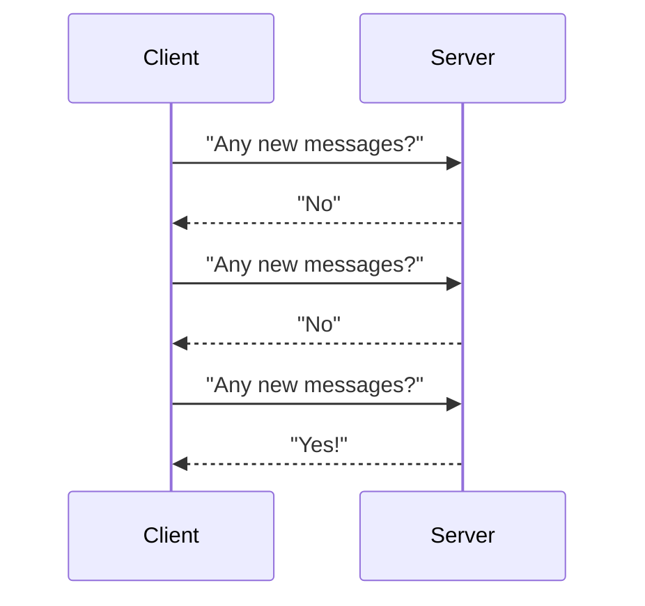

This is inefficient for continuous communication.

With SSE:

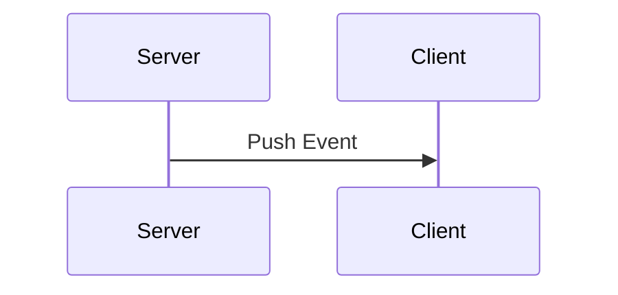

The server can push messages, but the client still needs another mechanism to send messages.

With WebSockets:

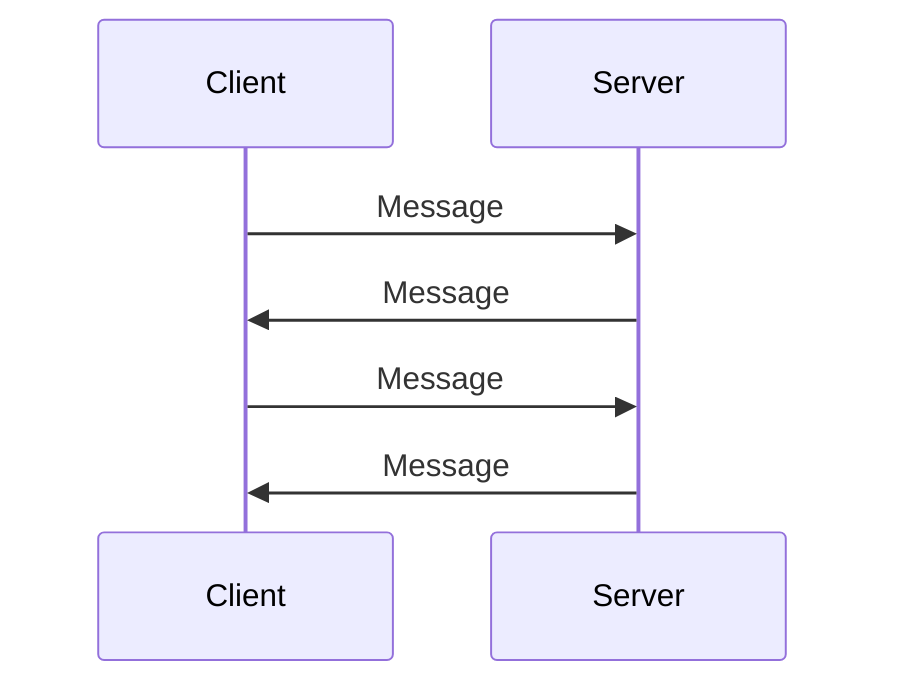

Both sides can communicate over the same persistent connection.

---

# 4.2 The Core Idea

A normal HTTP interaction is generally:

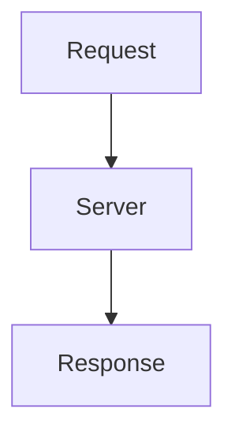

WebSockets change the communication model.

After establishing the connection:

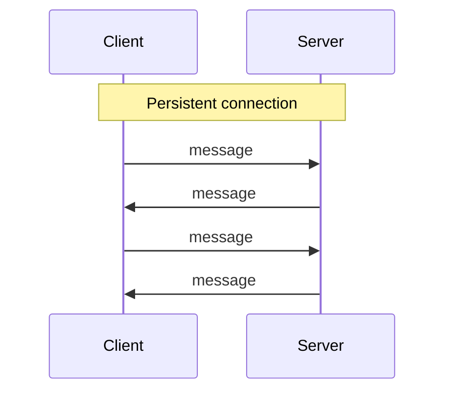

There is no need for a new HTTP request for every WebSocket message.

---

# 4.3 Full-Duplex Communication

The technical term you'll hear frequently is:

> **Full-duplex communication**

It means both sides can send data independently.

For example:

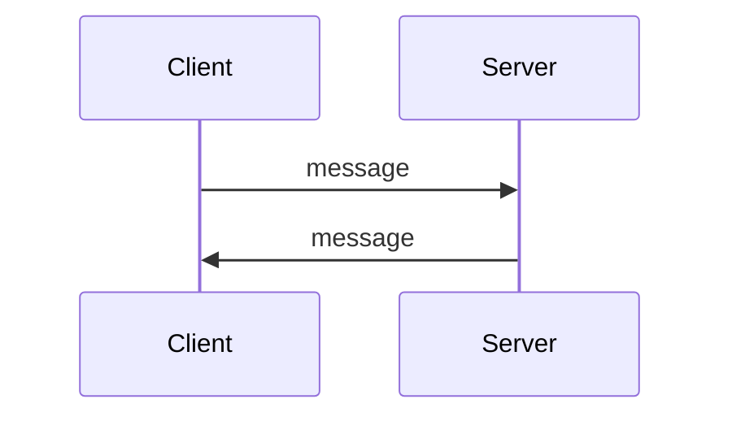

And these can happen independently:

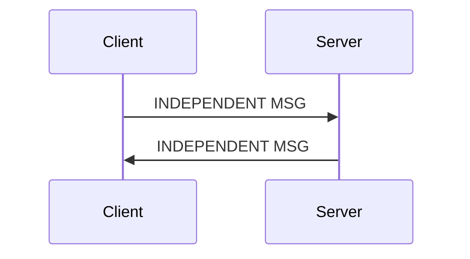

The server does not have to wait for a client request before sending a message.

Likewise, the client doesn't have to wait for the server to send something.

---

# 4.4 WebSockets Still Start With HTTP

This often causes confusion.

A WebSocket connection begins with an HTTP request.

The client essentially asks:

> "Can we upgrade this HTTP connection to WebSocket?"

Conceptually:

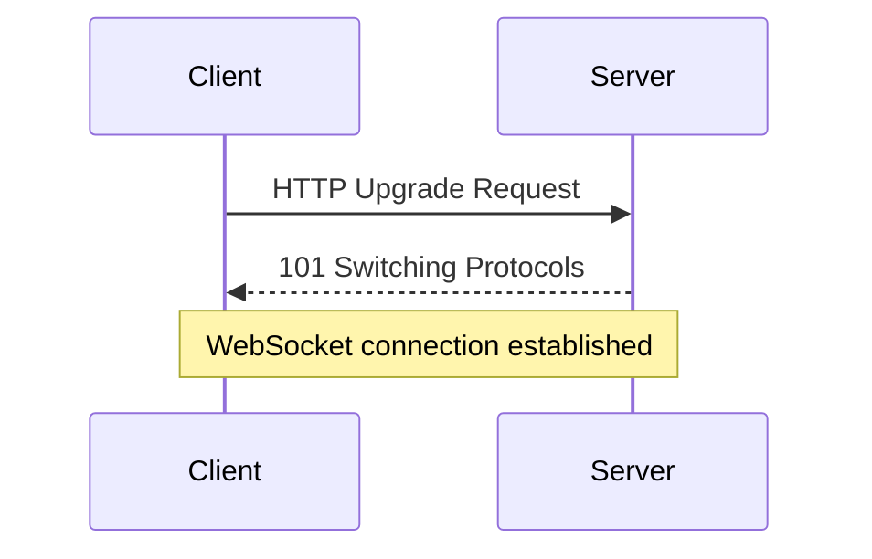

After the upgrade succeeds, communication switches to the WebSocket protocol.

---

# 4.5 The Upgrade Handshake

A simplified request looks like:

```http
GET /chat HTTP/1.1
Host: example.com
Upgrade: websocket
Connection: Upgrade
Sec-WebSocket-Key: <random-value>
Sec-WebSocket-Version: 13
```

The server responds with something like:

```http
HTTP/1.1 101 Switching Protocols
Upgrade: websocket
Connection: Upgrade
Sec-WebSocket-Accept: <value>
```

The important part is:

```http
101 Switching Protocols
```

It means:

> The server accepted the protocol switch.

After this point, the connection is no longer being used as an ordinary HTTP request/response exchange.

---

# 4.6 Why Use HTTP for the Handshake?

HTTP is already understood by:

- browsers
- proxies
- load balancers
- firewalls
- servers
- infrastructure

Using HTTP for connection establishment makes it easier for WebSockets to fit into the existing web ecosystem.

But after the upgrade:

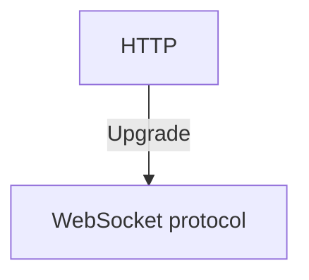

---

# 4.7 The WebSocket Connection Lifecycle

A useful mental model is:

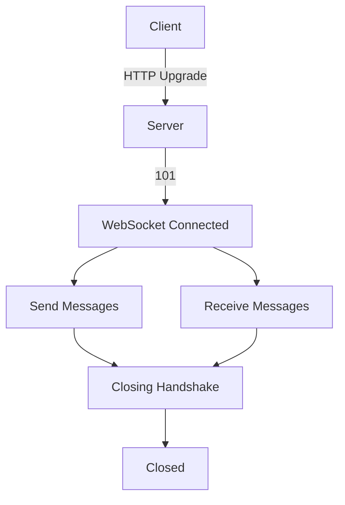

So a WebSocket has a lifecycle:

1. Connecting
2. Handshake
3. Open
4. Message exchange
5. Closing
6. Closed

---

# 4.8 WebSocket Messages

Once connected, the application can send messages.

For example:

```json
{
  "type": "message",
  "text": "Hello"
}
```

The server might respond:

```json
{
  "type": "message",
  "text": "Hello back"
}
```

WebSocket itself doesn't force your application to use JSON.

You can send:

- Text
- Binary data

JSON is simply a common application-level format.

---

# 4.9 WebSocket Is Not Your Application Protocol

This distinction is important.

WebSocket defines how communication happens.

Your application defines what the messages mean.

For example:

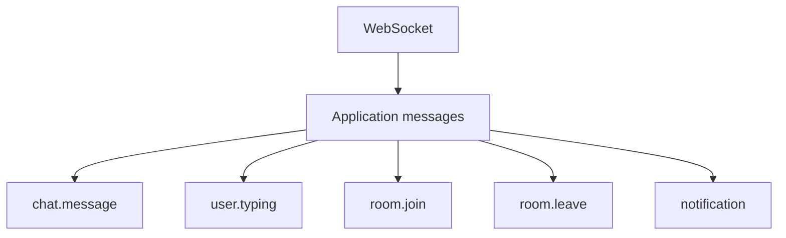

WebSocket doesn't inherently understand:

```text
room.join
```

Your application does.

---

# 4.10 Example: Chat

Suppose Alice opens a chat.

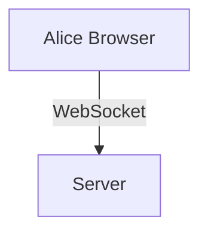

Alice sends:

```json
{
  "type": "message",
  "text": "Hello"
}
```

The server processes it and sends it to Bob:

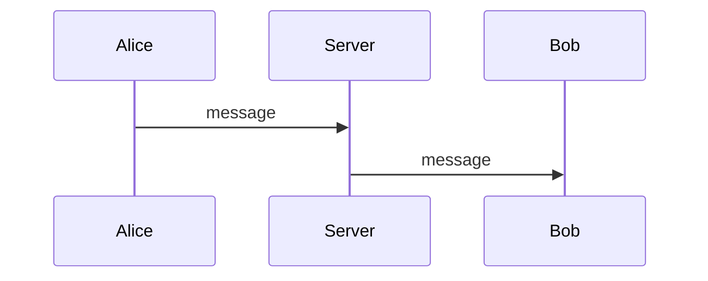

The important part is that the server can send the message to Bob **without Bob having to poll for it**.

---

# 4.11 Example: Typing Indicators

Suppose Alice starts typing.

Her browser sends:

```json
{
  "type": "typing",
  "userId": "alice"
}
```

The server can immediately send:

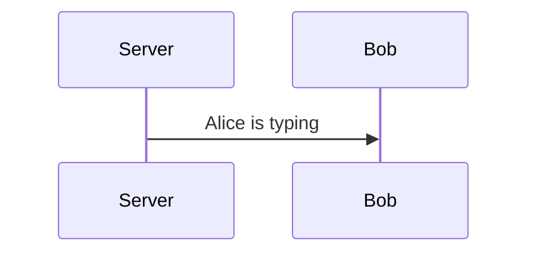

When she stops:

```json
{
  "type": "typing",
  "userId": "alice",
  "typing": false
}
```

This is a good WebSocket use case because updates happen frequently in both directions.

---

# 4.12 WebSocket vs SSE

This is the comparison you should remember.

| Feature               | SSE                    | WebSocket                   |
| --------------------- | ---------------------- | --------------------------- |
| Persistent connection | Yes                    | Yes                         |
| Based around HTTP     | Yes                    | Starts with HTTP upgrade    |
| Server → Client       | Yes                    | Yes                         |
| Client → Server       | Separate HTTP requests | Same connection             |
| Bidirectional         | No                     | Yes                         |
| Browser API           | `EventSource`          | `WebSocket`                 |
| Binary data           | Not its primary model  | Supported                   |
| Automatic reconnect   | Basic browser support  | Usually application/library |
| Complexity            | Lower                  | Higher                      |

The fundamental distinction:

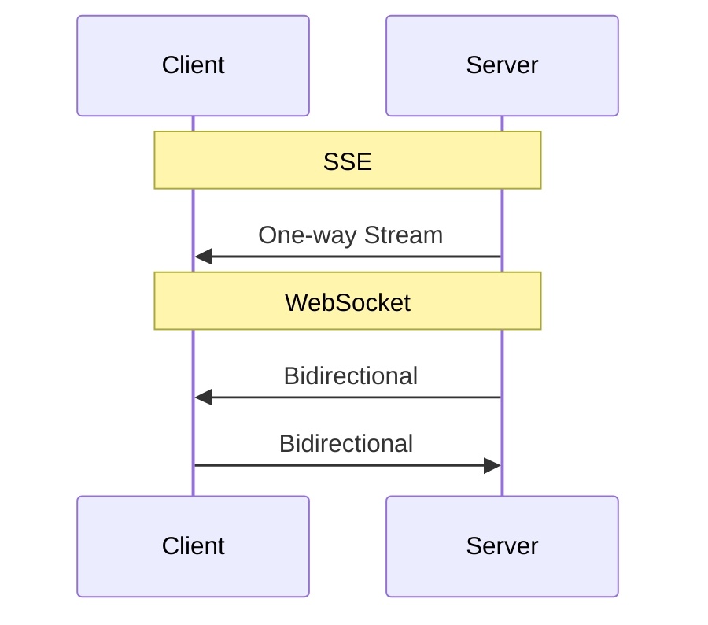

---

# 4.13 When Should You Choose WebSockets?

WebSockets are useful when communication is:

### Frequent

Messages may be exchanged continuously.

### Bidirectional

Both sides need to communicate.

### Low-latency

You don't want to repeatedly create HTTP requests.

### Connection-oriented

The application benefits from maintaining a live connection.

Examples:

```text
Chat
Multiplayer games
Collaborative applications
Real-time control interfaces
Live trading interfaces
Presence
```

---

# 4.14 When You Don't Need WebSockets

Don't automatically choose WebSockets simply because something is called "real-time."

For example:

> "Show me when my background job finishes."

You might only need:

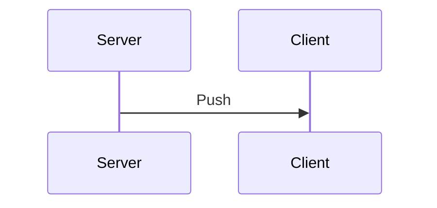

SSE can be enough.

Or perhaps polling is completely acceptable.

The general principle is:

> **Choose the simplest communication mechanism that satisfies the requirements.**

---

# 4.15 WebSockets and HTTP APIs Can Coexist

A real application doesn't have to choose one technology for everything.

For example:

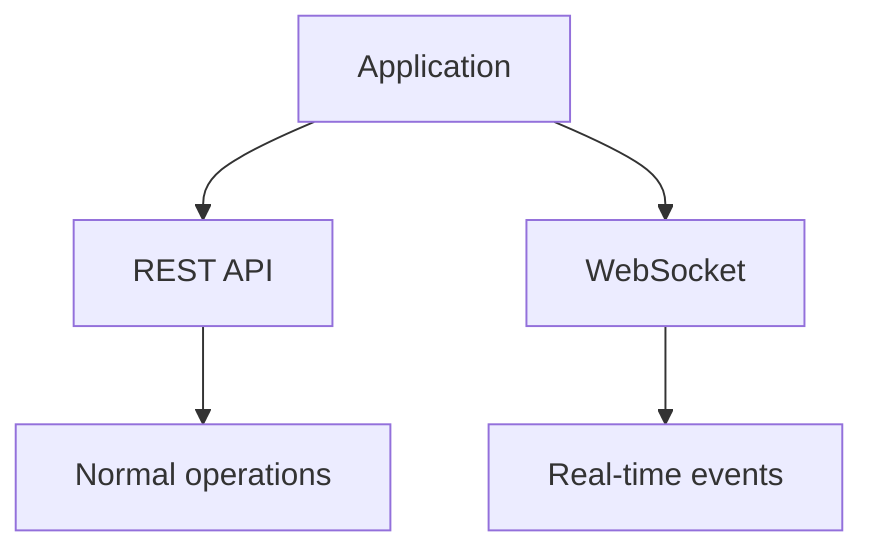

You might use HTTP for:

```text
POST /messages
GET /profile
GET /rooms
```

and WebSockets for:

```text
message received
typing
presence
live updates
```

The two mechanisms can coexist.

---

# 4.16 WebSockets Behind a Load Balancer

A simple architecture might look like:

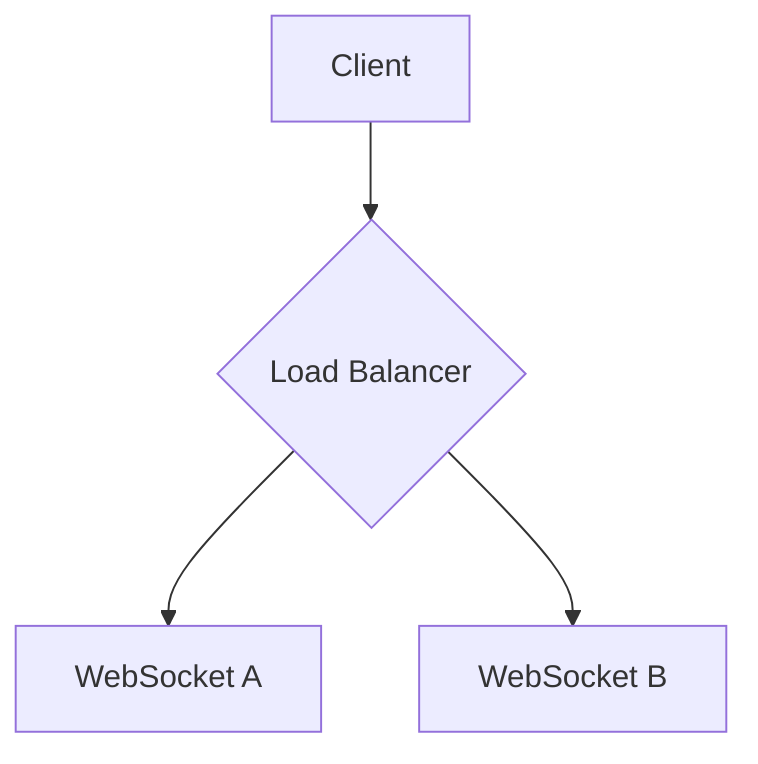

The important difference from normal short-lived HTTP requests is that a WebSocket connection stays attached to a server.

For example:

```mermaid
flowchart TD
    C["Client"] -->|connection| SA["Server A"]
```

That connection remains on Server A.

The load balancer doesn't move the already-established connection to Server B for every message.

---

# 4.17 Why Multiple WebSocket Servers Create a Problem

Imagine:

```mermaid
flowchart TD
    CA["Client A"] --> SA["Server A"]
    CB["Client B"] --> SB["Server B"]
```

Now Client A sends a message:

```mermaid
sequenceDiagram
    participant Client A
    participant Server A
    Client A->>Server A: "Hello"
```

But Client B is connected to:

```text
Server B
```

How does Server A tell Server B?

A simple architecture can use a shared Pub/Sub layer:

```mermaid
flowchart TD
    CA["Client A"] --> SA["Server A"]
    SA --> R[("Redis Pub/Sub")]
    R --> SB["Server B"]
    SB --> CB["Client B"]
```

This is called a **backplane**.

We'll study this architecture in detail later.

---

# 4.18 Sticky Sessions

Another concept you'll encounter is:

> **Sticky sessions / session affinity**

A load balancer can try to keep a client's connections associated with the same backend server.

Conceptually:

```mermaid
sequenceDiagram
    participant Client A
    participant Server A
    Client A->>Server A: Request 1
    Client A->>Server A: Request 2
    Client A->>Server A: Request 3
```

instead of:

```mermaid
sequenceDiagram
    participant Client A
    participant Server A
    participant Server B
    participant Server C
    Client A->>Server A: Request 1
    Client A->>Server B: Request 2
    Client A->>Server C: Request 3
```

For WebSockets, once the connection is established, the connection itself naturally remains on that server.

Sticky sessions can still matter for related connection/session behavior, but they don't solve the broader problem of distributing events between servers.

That's why a Pub/Sub backplane can still be necessary.

---

# 4.19 WebSocket Connection State

A WebSocket server needs to track connected clients.

Conceptually:

```mermaid
flowchart TD
    S["Server"] --> A["Connection A"]
    S --> B["Connection B"]
    S --> C["Connection C"]
    S --> D["Connection D"]
```

Each connection may contain:

- socket information
- authentication information
- room membership
- connection state
- buffers
- subscriptions

This consumes resources.

Therefore, WebSocket scaling is not simply:

> "How many HTTP requests can my server process?"

You also need to ask:

> "How many persistent connections can my server maintain?"

---

# 4.20 Connection Memory

Suppose a server maintains:

```text
100,000 connections
```

Even if each connection uses a relatively small amount of memory, the total can become significant.

For example, conceptually:

```mermaid
flowchart TD
    C["Connections"] --> M["Per-connection memory"]
    M --> T["Total memory"]
```

And memory isn't the only limit.

You also need to consider:

- File descriptors
- CPU
- Network bandwidth
- Kernel socket buffers
- Application buffers
- Message frequency

Therefore, persistent connections need capacity planning.

---

# 4.21 What Happens When a Server Dies?

Suppose:

```mermaid
flowchart TD
    C["Client"] --> SA["Server A"]
```

Server A crashes.

The connection disappears:

```mermaid
flowchart TD
    C["Client"] -.->|Disconnected| S["Server A"]
    style S fill:#f9cfcf,stroke:#ff0000
```

The client must reconnect.

A production WebSocket application therefore needs a reconnection strategy.

A common flow is:

```mermaid
stateDiagram-v2
    Connected --> Disconnected: failure
    Disconnected --> Reconnect
    Reconnect --> Authenticate
    Authenticate --> Restore: Restore subscriptions/state
    Restore --> Connected
```

The exact strategy depends on the application.

---

# 4.22 Reconnection Storms

Imagine:

```mermaid
flowchart TD
    C["WebSocket server crashes"] --> D["50,000 clients disconnect"]
    D --> R["50,000 clients reconnect"]
    style C fill:#f9cfcf,stroke:#ff0000
```

If they all reconnect simultaneously:

```text
           Load
             │
             │       ███████████
             │       ███████████
             │       ███████████
             │_______███████████________
                     Time
```

The reconnect traffic itself can overload the system.

This is called a **thundering herd / reconnect storm** problem.

Later we'll discuss strategies such as:

- exponential backoff
- jitter
- connection limits
- graceful draining

---

# 4.23 Heartbeats

A WebSocket connection may appear alive even when the underlying network path has problems.

WebSockets therefore support control messages such as:

```text
Ping
Pong
```

Conceptually:

```mermaid
sequenceDiagram
    participant Server
    participant Client
    Server->>Client: Ping
    Client->>Server: Pong
```

This helps detect broken or unresponsive connections.

The detailed frame-level mechanics will be covered in the WebSocket protocol deep dive.

For now, remember:

> **Heartbeats help determine whether a long-lived connection is still healthy.**

---

# 4.24 Graceful Shutdown

Suppose a WebSocket server is being deployed.

You don't want to abruptly terminate thousands of connections.

A better approach is:

```mermaid
flowchart TD
    S["Stop accepting new connections"] --> D["Drain existing connections"]
    D --> C["Clients reconnect elsewhere"]
    C --> X["Shutdown"]
```

This becomes particularly important in rolling deployments.

---

# 4.25 WebSocket Does Not Guarantee Reliable Delivery

A very important misconception:

> WebSocket being connection-oriented does not mean your application automatically has durable message delivery.

Suppose:

```mermaid
sequenceDiagram
    participant Server
    participant Client
    Server->>Client: message
```

and immediately afterward the connection breaks.

What happens if the client never processed the message?

WebSocket itself does not provide a durable message history like a message broker.

If your application needs recovery, you may need:

```mermaid
flowchart TD
    W["WebSocket"] --> I["Message IDs"]
    I --> P["Persistent storage"]
```

For example:

```mermaid
sequenceDiagram
    participant Client
    participant Server
    Client->>Server: Reconnects
    Client->>Server: "Last message I received = 104"
    Server->>Client: Send missing messages
```

This is an **application-level reliability mechanism**.

---

# 4.26 Ordering

Messages sent over one WebSocket connection are delivered according to the WebSocket/TCP transport ordering characteristics.

But distributed applications introduce additional complexity.

For example:

```mermaid
flowchart LR
    CA["Client A"] --> SA["Server A"]
    SA --> P[("Pub/Sub")]
    P --> SB["Server B"]
```

Now your application may have:

- multiple producers
- multiple servers
- multiple channels
- reconnects

Therefore, "WebSocket preserves ordering" should not be interpreted as:

> "My entire distributed system automatically has global ordering."

Transport ordering and application-level ordering are different concerns.

---

# 4.27 WebSocket Security

WebSockets should also be secured.

For browser applications, production connections generally use:

```text
wss://
```

instead of:

```text
ws://
```

Conceptually:

```mermaid
flowchart LR
    ws["ws://"] -->|"Without TLS"| insecure["Insecure WebSocket"]
    wss["wss://"] -->|"Over TLS"| secure["Secure WebSocket (Standard)"]
```

You also need to consider:

- Authentication
- Authorization
- Origin validation
- Input validation
- Rate limiting
- Connection limits

A WebSocket connection can stay open for a long time, so authentication and authorization decisions need to be handled carefully.

---

# 4.28 WebSockets and Rooms

Many applications need logical groups.

For example:

```text
Room: cricket-match-123
```

Clients can join:

```mermaid
flowchart LR
    CA["Client A"] --> R["Room 123"]
    CB["Client B"] --> R
    CC["Client C"] --> R
```

When an event occurs:

```mermaid
flowchart TD
    S["Server"] --> R["Room 123"]
    R --> CA["Client A"]
    R --> CB["Client B"]
    R --> CC["Client C"]
```

Rooms are not part of the core WebSocket protocol.

They're an **application/library-level abstraction**.

This distinction becomes important when comparing libraries such as Socket.IO with lower-level WebSocket implementations.

---

# 4.29 Raw WebSocket vs Higher-Level Libraries

At the protocol level, you can work directly with WebSockets.

For example, in Node.js, a common library is:

```text
ws
```

It gives relatively direct access to WebSocket behavior.

Higher-level libraries such as:

```text
Socket.IO
```

provide additional abstractions such as:

- rooms
- namespaces
- reconnection
- event-oriented APIs
- additional connection behavior

The trade-off is that you're no longer working with only the basic WebSocket protocol.

We'll compare these libraries later.

---

# 4.30 WebSocket vs Socket.IO

Do not think:

```text
WebSocket = Socket.IO
```

They are different.

### WebSocket

A protocol/standard communication mechanism.

### Socket.IO

A higher-level real-time framework/library with its own protocol and features.

Conceptually:

```text
Application
     │
     ▼
Socket.IO
     │
     ▼
Transport layer
```

Socket.IO may use WebSocket when available, but it is not simply "WebSocket with a nicer API."

We'll cover the distinction properly in the library chapter.

---

# 4.31 A Basic WebSocket Architecture

A small application:

```mermaid
flowchart TD
    C["Client"] -->|WebSocket| W["WebSocket Server"]
    W --> D[("Database")]
    W --> A["Application Logic"]
```

For example, a chat message:

```mermaid
flowchart TD
    C["Client"] -->|send message| WS["WebSocket Server"]
    WS --> V["validate"]
    WS --> A["authenticate"]
    WS --> P["persist"]
    WS --> B["broadcast"]
```

---

# 4.32 A Scaled WebSocket Architecture

When we have multiple servers:

```mermaid
flowchart TD
    C["Clients"] --> LB{"Load Balancer"}
    LB --> W1["WS Server"]
    LB --> W2["WS Server"]
    LB --> W3["WS Server"]
    W1 --> P[("Pub/Sub")]
    W2 --> P
    W3 --> P
    P --> DB[("Database")]
```

The Pub/Sub layer allows servers to exchange events.

For example:

```mermaid
flowchart TD
    CA["Client A"] --> W1["WS Server 1"]
    W1 --> P[("Pub/Sub")]
    P --> W2["WS Server 2"]
    P --> W3["WS Server 3"]
    W2 --> CB["Client B"]
    W3 --> CC["Client C"]
```

This is a foundational architecture pattern for large real-time systems.

---

# 4.33 The Most Important Scaling Insight

With ordinary HTTP:

```text
Request
   │
   ▼
Server
   │
   ▼
Response
```

The request is short-lived.

With WebSockets:

```mermaid
flowchart TD
    C["Connection"] -->|Continuous Stream| M["message, message, message..."]
```

The server must maintain the connection for potentially a long time.

Therefore:

> **WebSocket scaling is heavily influenced by concurrent connections, not just requests per second.**

You still care about message throughput, but concurrent connection count becomes a major capacity dimension.

---

# 4.34 What WebSocket Solves

WebSockets solve a specific communication problem:

> **How can a client and server maintain a persistent, low-latency, bidirectional communication channel?**

The answer:

```mermaid
flowchart TD
    H["HTTP Upgrade"] --> W["WebSocket connection"]
    W --> B["Bidirectional messages"]
```

---

# 4.35 What WebSocket Does NOT Solve

WebSocket does not automatically solve:

- Distributed fan-out
- Message durability
- Offline clients
- Message replay
- Global ordering
- Authentication
- Authorization
- Scaling across many servers
- Backpressure
- Reconnect storms

These are **system-design problems around the WebSocket connection**.

This distinction is critical.

---

# 4.36 Final Mental Model

Remember WebSockets as:

```mermaid
flowchart TD
    H["HTTP"] -->|Upgrade| WC["WebSocket Connection"]
    WC --> PC["Persistent Channel"]
    C["Client"] <-.->|Bidirectional| S["Server"]
    C -.-> PC
    S -.-> PC
```

Or simply:

```mermaid
sequenceDiagram
    participant Client
    participant Server
    Note over Client,Server: SSE
    Server->>Client: One-way Stream
    Note over Client,Server: WebSocket
    Client->>Server: Bidirectional
    Server->>Client: Bidirectional
```

And at system level:

```mermaid
flowchart TD
    LB{"Load Balancer"} --> W1["WS 1"]
    LB --> W2["WS 2"]
    LB --> W3["WS 3"]
    W1 --> P[("Pub/Sub")]
    W2 --> P
    W3 --> P
    P --> DB[("Database")]
```

The WebSocket itself is only the **communication channel**.

The rest of the architecture exists to make that channel useful, scalable, reliable, and secure.

---

# 4.37 Key Takeaways

1. **WebSocket provides persistent bidirectional communication.**

```mermaid
sequenceDiagram
    participant Client
    participant Server
    Client->>Server: Bidirectional
```

2. A WebSocket connection **starts with an HTTP Upgrade handshake**.

3. `101 Switching Protocols` indicates that the upgrade was accepted.

4. After the handshake, communication uses the **WebSocket protocol**, not ordinary HTTP request/response semantics.

5. WebSockets are useful when both client and server need frequent, low-latency communication.

6. WebSockets are not automatically better than SSE or polling.

7. A WebSocket connection consumes server resources for as long as it remains open.

8. Multiple WebSocket servers often need a **shared Pub/Sub backplane** for cross-server event distribution.

9. Reconnection, heartbeats, graceful shutdown, backpressure, reliability, and message recovery are separate system-design concerns.

10. **WebSocket is the transport/channel—not the complete real-time architecture.**

---

# 4.38 What's Next?

Now that we understand what WebSockets are and why they exist, the next chapter goes **one level deeper into the actual protocol**.

We'll study:

- RFC 6455
- HTTP Upgrade handshake
- `Sec-WebSocket-Key`
- `Sec-WebSocket-Accept`
- WebSocket frames
- Frame structure
- Opcodes
- Text vs binary frames
- Masking
- Ping/Pong
- Close frames
- Fragmentation
- Message boundaries

That chapter is where we stop treating WebSocket as a black box and understand **what is actually travelling over the network**.

---

⬅️ **[Previous: 3. Server-Sent Events](03_Server_Sent_Events.md)** | 🏠 **[Back to TOC](README.md)** | **[Next: 5. WebSocket Protocol ➡️](05_WebSocket_Protocol.md)**
