# Chapter 5 — WebSocket Protocol Deep Dive

WebSockets are not just an API like `socket.send()`.

Underneath, they follow a standardized protocol defined by **RFC 6455**. Understanding the protocol helps explain what actually happens between a browser and a WebSocket server.

---

## 1. WebSocket Starts as HTTP

A WebSocket connection begins as a normal HTTP request.

The client asks the server to upgrade the connection:

```http
GET /chat HTTP/1.1
Host: example.com
Upgrade: websocket
Connection: Upgrade
Sec-WebSocket-Key: x3JJHMbDL1EzLkh9GBhXDw==
Sec-WebSocket-Version: 13
```

The server accepts:

```http
HTTP/1.1 101 Switching Protocols
Upgrade: websocket
Connection: Upgrade
Sec-WebSocket-Accept: ...
```

The important response is:

```text
101 Switching Protocols
```

After this, the connection is no longer normal HTTP request/response communication.

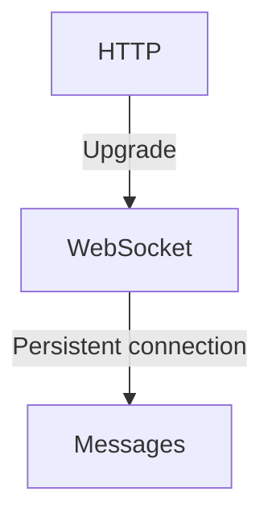

---

# 2. `Sec-WebSocket-Key` and `Sec-WebSocket-Accept`

These headers are part of the WebSocket handshake.

The client sends:

```http
Sec-WebSocket-Key: random-value
```

The server calculates a corresponding value using:

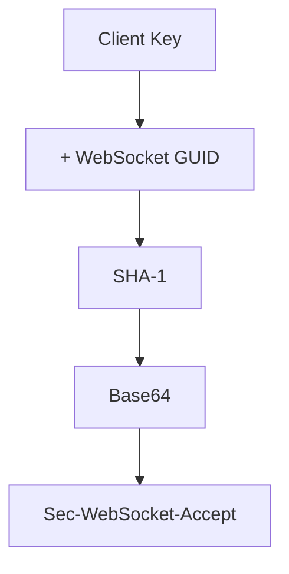

This helps confirm that the server understands the WebSocket protocol.

### Important

This is **not authentication**.

It does not prove who the user is.

Authentication can still use:

* Cookies
* JWT
* Sessions
* OAuth
* Other application-level mechanisms

---

# 3. `ws://` vs `wss://`

Similar to HTTP and HTTPS:

```text
ws://   → WebSocket without TLS
wss://  → WebSocket over TLS
```

In production, you normally use:

```text
wss://example.com/socket
```

`wss` encrypts the connection using TLS.

---

# 4. WebSocket Frames

After the handshake, WebSocket communicates using **frames**.

A frame contains information such as:

```text
┌───────┬────────┬───────┬──────────────┐
│ FIN   │ Opcode │ MASK  │ Payload Len  │
├───────┴────────┴───────┴──────────────┤
│ Masking Key (when present)            │
├────────────────────────────────────────┤
│ Payload                                │
└────────────────────────────────────────┘
```

You don't normally construct these frames yourself. Libraries handle them.

---

# 5. Important Frame Fields

### FIN

Indicates whether this is the final frame of a message.

```text
FIN = 1
```

means the message is complete.

If `FIN = 0`, more frames follow.

---

### Opcode

Tells the receiver what kind of frame it is.

Important opcodes:

| Opcode | Meaning      |
| ------ | ------------ |
| `0x0`  | Continuation |
| `0x1`  | Text         |
| `0x2`  | Binary       |
| `0x8`  | Close        |
| `0x9`  | Ping         |
| `0xA`  | Pong         |

---

# 6. Message vs Frame

These are not necessarily the same thing.

A small message might be:

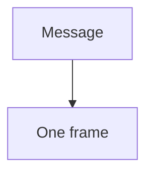

A large message can be fragmented:

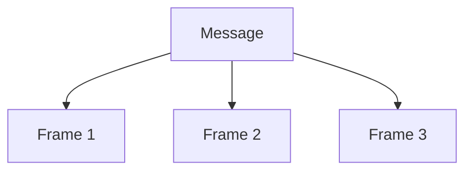

The receiver combines the fragments into the original message.

---

# 7. Text and Binary Messages

WebSocket supports both.

### Text

Usually UTF-8:

```json
{
  "type": "message",
  "text": "Hello"
}
```

### Binary

Useful for things such as:

* Images
* Audio
* Video
* Binary protocols
* Efficient serialized data

WebSocket itself doesn't decide what your application data means.

---

# 8. Masking

Client → Server WebSocket frames are normally **masked**.

Conceptually:

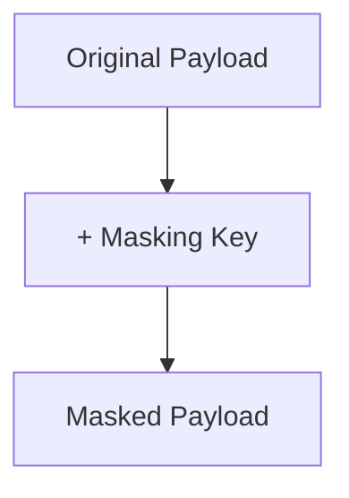

The server removes the mask to recover the original data.

### Important

Masking is **not encryption**.

It exists mainly for protocol/security reasons related to intermediaries.

Encryption comes from:

```text
wss://
```

---

# 9. Ping and Pong

WebSocket has built-in control frames:

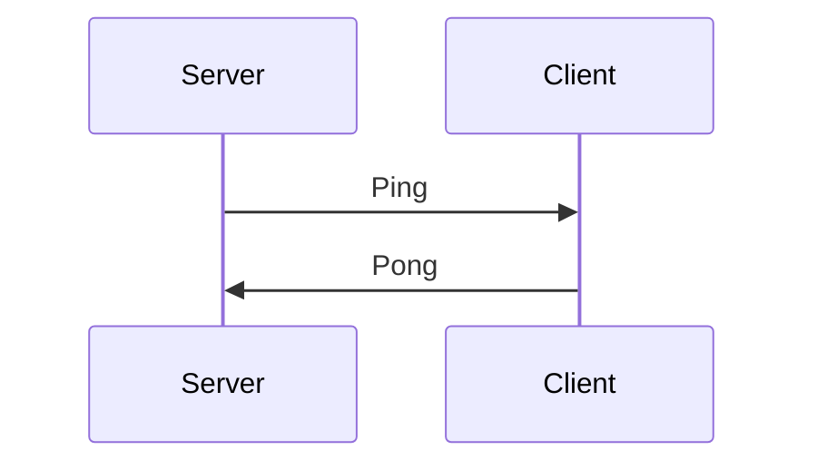

These help detect dead connections.

For example:

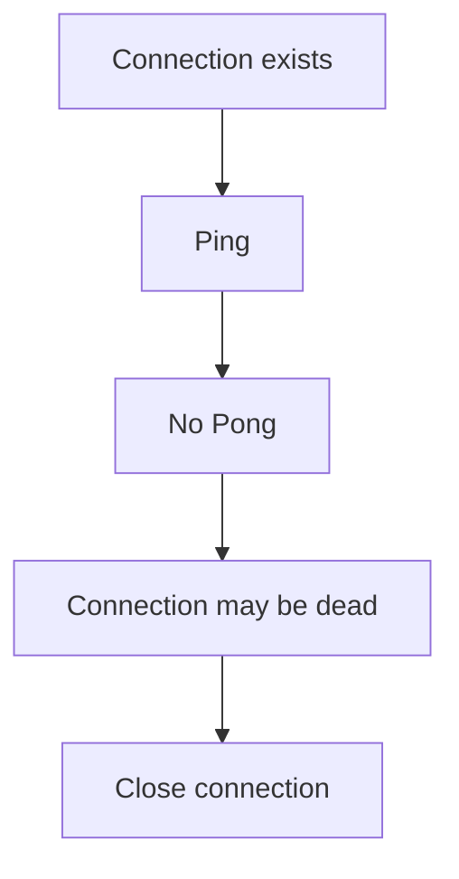

This is especially important because TCP may not immediately tell your application that a disconnected client is gone.

---

# 10. Close Frames

A WebSocket connection can close gracefully.

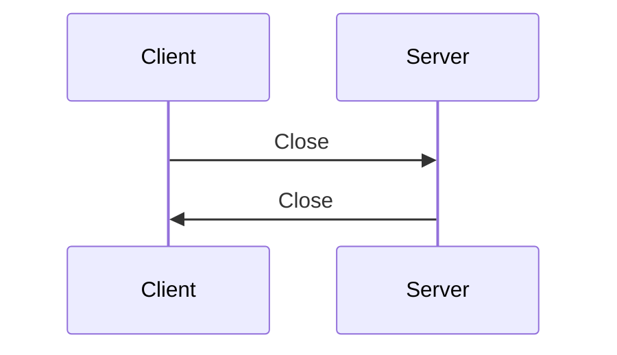

A close frame can contain a status code explaining why the connection is closing.

Examples include:

```text
1000 → Normal closure
1001 → Going away
1008 → Policy violation
1011 → Server error
```

If the connection suddenly disappears without a proper close handshake, the application may treat it as an unexpected disconnect.

---

# 11. WebSocket Does Not Define Your Application Protocol

This is extremely important.

WebSocket defines **how data travels**.

It does not define what your messages mean.

You might create an application protocol like:

```json
{
  "type": "chat.message",
  "messageId": "123",
  "payload": {
    "text": "Hello"
  }
}
```

Or:

```json
{
  "type": "typing.start",
  "userId": "42"
}
```

Your application decides these rules.

So:

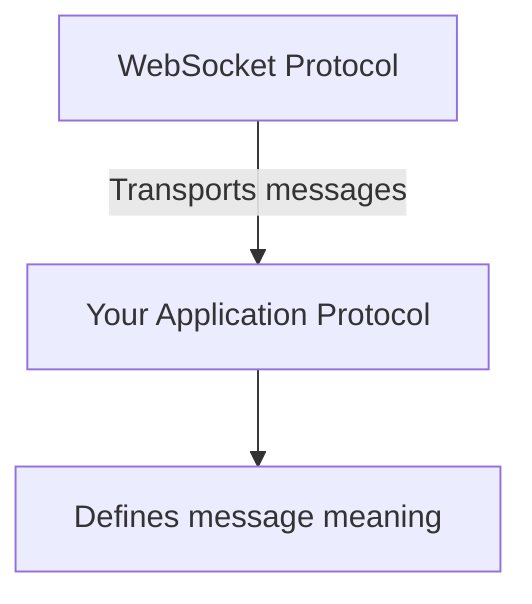

---

# 12. WebSocket + HTTP

WebSockets don't replace HTTP.

A typical application can use both:

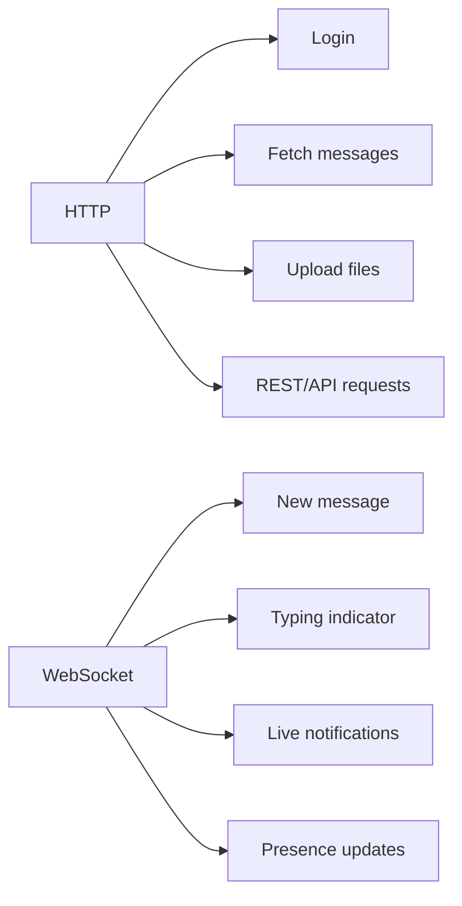

HTTP is still useful for request/response operations.

WebSocket is useful when the server needs to continuously push events.

---

# 13. Protocol vs Library

This distinction matters.

**WebSocket protocol** defines things like:

* Handshake
* Frames
* Opcodes
* Masking
* Ping/Pong
* Closing

Libraries such as `ws`, `gorilla/websocket`, etc. implement these details for you.

You normally write:

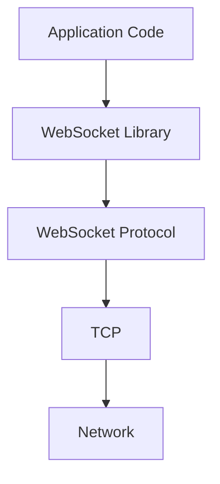

You don't manually construct frames in normal application development.

---

# 14. Complete Mental Model

When a browser connects:

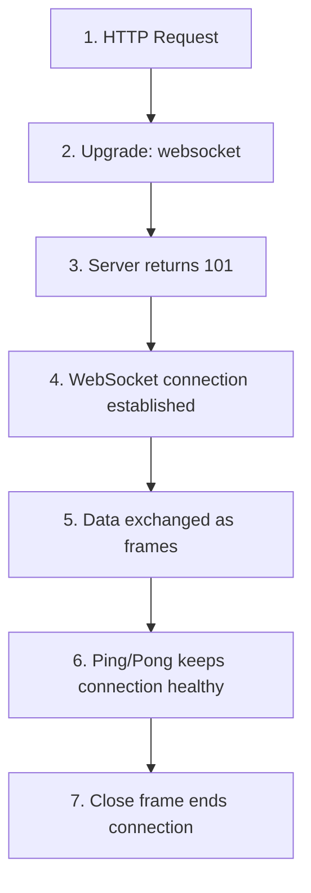

The important layers are:

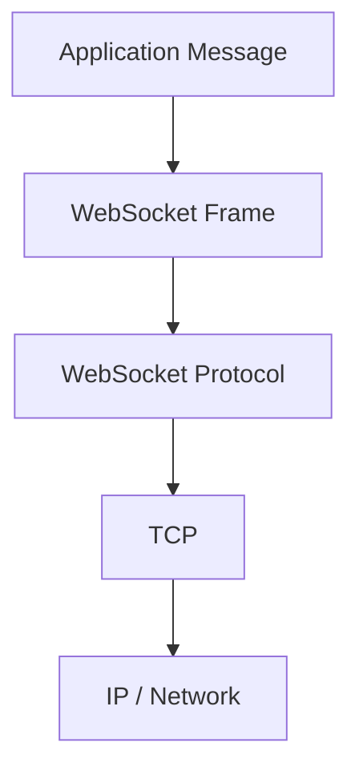

---

# Key Takeaways

* WebSocket begins with an **HTTP Upgrade handshake**.
* `101 Switching Protocols` establishes the WebSocket connection.
* After the handshake, communication uses **WebSocket frames**.
* Frames have fields such as **FIN, opcode, masking and payload length**.
* WebSocket supports **text and binary messages**.
* Client-to-server frames are normally **masked**.
* Ping/Pong helps detect unhealthy connections.
* Close frames provide graceful connection termination.
* `wss://` provides TLS encryption.
* WebSocket defines transport mechanics, **not your application's message format**.
* WebSocket and HTTP commonly coexist in the same application.

### One-line mental model

> **HTTP establishes the connection; WebSocket frames carry messages; your application protocol gives those messages meaning.**

---

⬅️ **[Previous: 4. WebSockets Fundamentals](04_WebSockets_Fundamentals.md)** | 🏠 **[Back to TOC](README.md)** | **[Next: 6. WebSocket Libraries ➡️](06_WebSocket_Libraries.md)**
