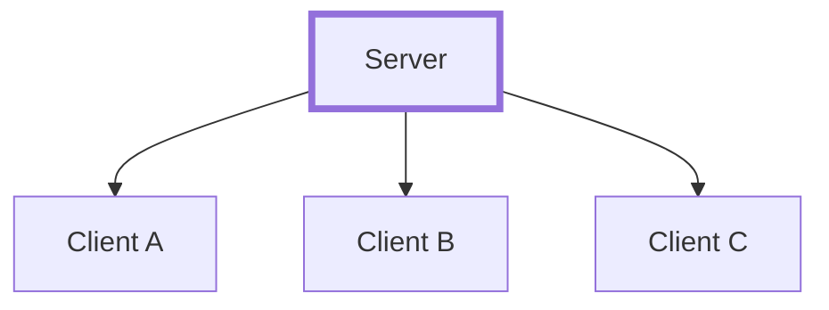
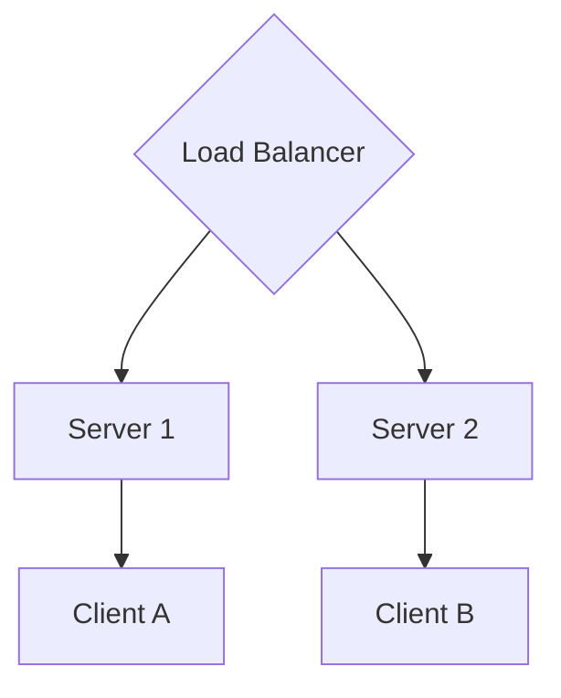
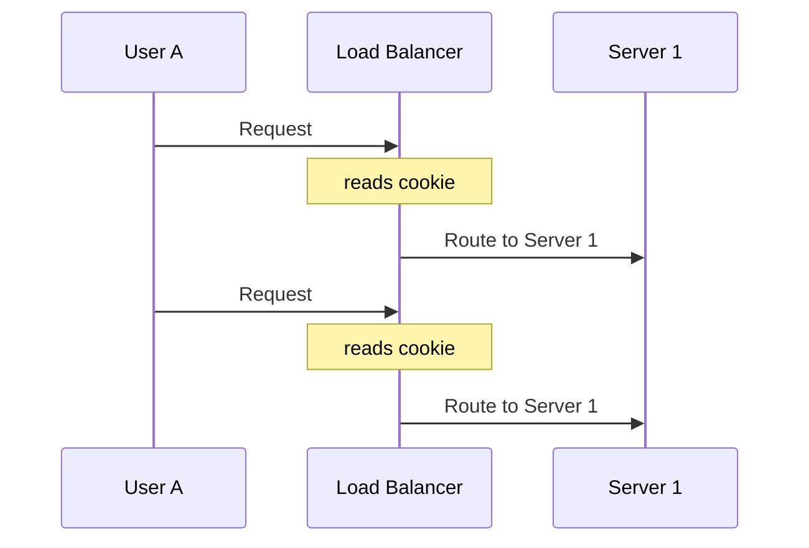
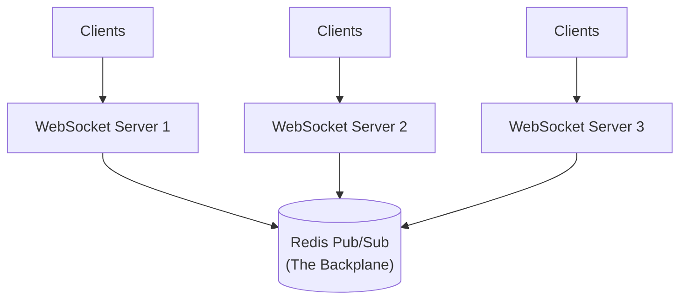
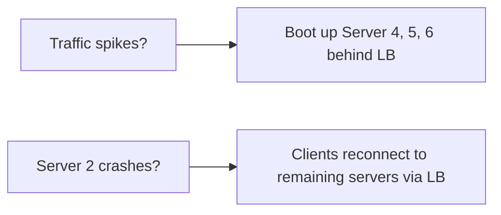

# Chapter 7 — Scaling WebSocket Servers

When you learn WebSockets, you usually build a single server. It holds an array of connected clients, and when a message arrives, it loops through the array and broadcasts it.

But what happens when your application grows beyond a single server?

If Client A sends a message in a chatroom, the Server organically knows about Client B and C because they all sit in the exact same memory space. It's simple. 

But multiple servers introduce a massive system design problem.

---

## 7.1 The Stateful Nature of WebSockets

WebSockets are **stateful persistent connections**.

Unlike stateless HTTP requests (where any server can handle any request), a WebSocket connection is a physical TCP pipe bolted directly to *one specific server*.

If Client A sends a chat message intended for Client B:
1. Client A sends the message to **Server 1**.
2. Server 1 looks at its local memory. "I don't have Client B logged in here."
3. The message is dropped. Client B never gets it.

This is the **Connection Ownership Problem**.

---

## 7.2 Why Sticky Sessions Don't Solve Everything

When engineers first face this, they often discover **Sticky Sessions** (Session Affinity). 

A Load Balancer with Sticky Sessions ensures that a specific user always routes to the exact same backend server.

**Does this solve the cross-communication problem?**
NO.

Sticky sessions only guarantee that Client A keeps talking to Server 1. It does absolutely nothing to help Server 1 communicate with Server 2. If Client A and Client B are in the same multiplayer game, but connected to different servers, sticky sessions won't bridge them.

---

## 7.3 The Solution: A Real-Time Backplane

To allow WebSocket servers to communicate with each other, we must introduce a **Pub/Sub Backplane**.

When you add a backplane, the architecture fundamentally changes:

1. Client A sends a message to **Server 1**.
2. **Server 1** does NOT just send it to its local clients. Instead, it publishes the message down to a Redis Pub/Sub channel (e.g., `chat:room:5`).
3. **Server 2** and **Server 3** are subscribed to `chat:room:5` on Redis.
4. Redis instantly broadcasts the message up to Server 2 and Server 3.
5. Server 2 sees the message, identifies that Client B is locally attached, and pushes it down the TCP pipe to **Client B**.

The servers are no longer isolated silos; they communicate horizontally using the backplane.

---

## 7.4 Horizontal Scaling Mechanics

With a backplane in place, scaling becomes horizontal.

Because the central nervous system is Redis Pub/Sub, you can add 100 new WebSocket servers to the Load Balancer flawlessly. Every server just hooks into the Redis channels, and broadcasting just works.

---

## 7.5 Load Balancing Persistent Connections

Load balancers have to be configured specifically to allow WebSockets.

**1. Connection Timeouts**
Traditional HTTP load balancers will kill connections if they are "idle" for 30-60 seconds. You must configure your Load Balancer (NGINX, HAProxy, AWS ALB) to allow prolonged timeouts for WebSocket connections, otherwise it will continuously sever your users' connections.

**2. Max Connections**
A Load Balancer itself is just a server box. If 1,000,000 users connect, the Load Balancer has to hold open 1,000,000 TCP sockets. This requires OS-level kernel tuning (increasing `ulimit`, `file descriptors`, and ephemeral ports) directly on the Load Balancer tier.

**3. Connection Draining**
When you deploy new backend code, you can't just shut down a WebSocket server. Tens of thousands of users will be abruptly disconnected (creating a reconnection storm). You must configure the Load Balancer to gracefully stop sending *new* connections to the old server, and let the old server slowly drain its active connections before shutting down.

---

## 7.6 The Trade-Offs

Adding a Pub/Sub backplane solves horizontal scaling, but introduces massive complexity:

* **Latency:** Messages now travel: `Client → Server A → Redis → Server B → Client`. 
* **Failure Points:** If Redis crashes, cross-server broadcasting immediately dies.
* **At-Most-Once Delivery:** Redis Pub/Sub is inherently fire-and-forget. If Server B is experiencing a garbage-collection pause during the broadcast, it drops the message forever.

We will explore how to make this resilient and prevent message loss in the upcoming chapters on Reliability.

---

⬅️ **[Previous: 6. WebSocket Libraries](06_WebSocket_Libraries.md)** | 🏠 **[Back to TOC](README.md)** | **[Next: 8. Redis Pub/Sub Backplane ➡️](08_Redis_PubSub_Backplane.md)**
